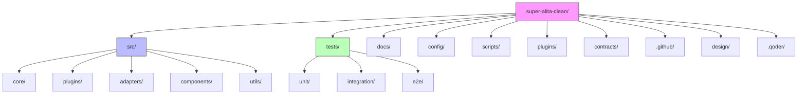
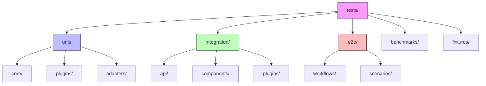

# Code Base Organization

## Overview

This document outlines the strategy for organizing the Super Alita codebase to ensure purposeful directory structure, proper test management, and prevention of files being placed without clear organizational reasons. The approach focuses on creating a maintainable, scalable structure that aligns with the framework's modular architecture and constitutional principles.

## Architecture

The Super Alita framework follows a modular monorepo structure with clearly defined component boundaries. The organization supports both independent development and seamless integration of various subsystems while maintaining clear separation of concerns.

### Core Principles

1. **Purpose-Driven Structure**: Every directory and file must have a clearly defined purpose aligned with the system architecture
2. **Separation of Concerns**: Distinct boundaries between core framework, plugins, tests, and documentation
3. **Modular Design**: Components are organized to promote reusability and minimize coupling
4. **Test Organization**: Tests are colocated with the components they test but in a separate hierarchy
5. **Constitutional Compliance**: All organization decisions align with the constitutional principles of Library-First Development, Test-First Development, and Simplicity Gate

### Directory Structure

### Directory Purposes

| Directory | Purpose | Contents |
|-----------|---------|----------|
| `src/` | Source code for the core framework | All primary implementation code organized by functional areas |
| `tests/` | All test code | Unit, integration, and end-to-end tests organized parallel to src structure |
| `docs/` | Documentation | User guides, API documentation, architectural overviews |
| `config/` | Configuration files | Environment configs, service definitions, deployment configurations |
| `scripts/` | Utility scripts | Build scripts, deployment helpers, development tools |
| `plugins/` | Plugin implementations | Third-party and custom plugin code with clear interfaces |
| `contracts/` | API and event contracts | Schema definitions, interface specifications |
| `design/` | Design documents | Architecture decisions, feature specifications, diagrams |
| `.qoder/` | Qoder-specific files | Quests, IDE configurations, tooling metadata |

## Test Organization and Management

### Current State Analysis

The current codebase contains tests in multiple locations:

- A dedicated `tests/` directory with extensive test coverage
- Various test files scattered throughout the `src/` directory
- Demo and example files that may contain test-like functionality

### Test Organization Strategy

1. **Centralized Test Directory**: All tests will be moved to the `tests/` directory with a structure that mirrors the `src/` directory
2. **Clear Test Categorization**: Tests will be organized into unit, integration, and end-to-end categories
3. **Removal of Redundant Tests**: Outdated or duplicate tests will be identified and removed
4. **Purpose Documentation**: Each test file will have clear documentation of its purpose and scope

### Test Directory Structure

## Business Logic Layer

### Component Organization

The core framework is organized around several key architectural components:

1. **Event System**: Central nervous system for inter-component communication
2. **Planning System**: Task decomposition and execution planning
3. **Decision Engine**: Policy-driven decision making
4. **Plugin Architecture**: Extensibility mechanism for adding functionality
5. **MCP Integration**: Model Context Protocol support

Each component follows the constitutional principles:

- **Library-First**: Components are designed as reusable libraries
- **Test-First**: Comprehensive test coverage before implementation
- **Simplicity Gate**: Minimal complexity with explicit justification for additions

### Plugin Architecture

Plugins are organized in a dedicated directory with clear interfaces:

- Each plugin implements the `PluginInterface`
- Plugins are loaded dynamically through configuration
- Plugin capabilities are registered with the system

### Event System

The event-driven architecture enables loose coupling between components:

- In-memory event bus for development and testing
- Redis-backed event bus for distributed deployments
- Reliable event bus with additional guarantees for production

## Middleware & Interceptors

The framework implements several middleware and interceptor patterns:

1. **Event Middleware**: Processing and filtering events before delivery
2. **Security Interceptors**: Authentication and authorization checks
3. **Telemetry Interceptors**: Monitoring and observability data collection
4. **Reliability Layers**: Circuit breaking and error handling

These components are organized to ensure they can be composed and configured as needed for different deployment scenarios.

## Future Organization Constraints

To prevent files from being placed without purposeful directory paths, the following constraints will be enforced:

### Directory Creation Rules

1. **Justification Required**: Any new directory must have documented purpose aligned with system architecture
2. **Constitutional Compliance**: New directories must comply with constitutional principles
3. **Peer Review**: Directory structure changes require approval from architecture team
4. **Documentation Mandate**: All directories must have README.md explaining purpose and contents

### File Placement Rules

1. **Purpose Alignment**: Files must align with their containing directory's purpose
2. **Interface Contracts**: Public APIs must be defined in contracts directory
3. **Test Proximity**: Tests must be colocated in the tests directory with clear mapping to source
4. **Configuration Separation**: Configuration files must be in config directory with environment-specific variants

### Enforcement Mechanisms

1. **Pre-commit Hooks**: Git hooks will validate directory structure compliance
2. **CI/CD Validation**: Automated checks will enforce organizational rules
3. **Code Review Guidelines**: Review templates will include organizational compliance checks
4. **Documentation Requirements**: Changes to structure require corresponding documentation updates

## Implementation Plan

### Phase 1: Test Organization

1. Audit existing test files and identify duplicates or outdated tests
2. Move all tests to the centralized `tests/` directory
3. Organize tests according to the defined structure
4. Remove redundant or obsolete test files

### Phase 2: Directory Structure Refinement

1. Create missing directories according to the defined structure
2. Move files to appropriate locations based on their purpose
3. Remove empty or purposeless directories
4. Update documentation to reflect new structure

### Phase 3: Enforcement Implementation

1. Implement pre-commit hooks for directory structure validation
2. Configure CI/CD pipeline checks for organizational compliance
3. Create documentation templates for new directories
4. Establish review process for structural changes

## Conclusion

This organization strategy ensures that the Super Alita codebase maintains a clear, purposeful structure that aligns with its architectural principles and constitutional governance. By enforcing strict rules on file placement and directory creation, we prevent the accumulation of disorganized code while maintaining the flexibility needed for future growth and evolution.
