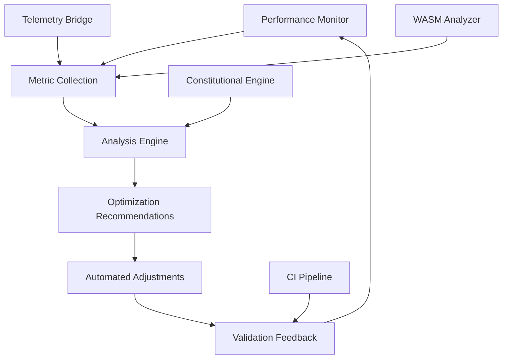
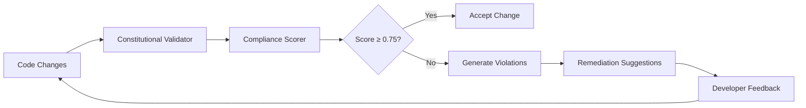
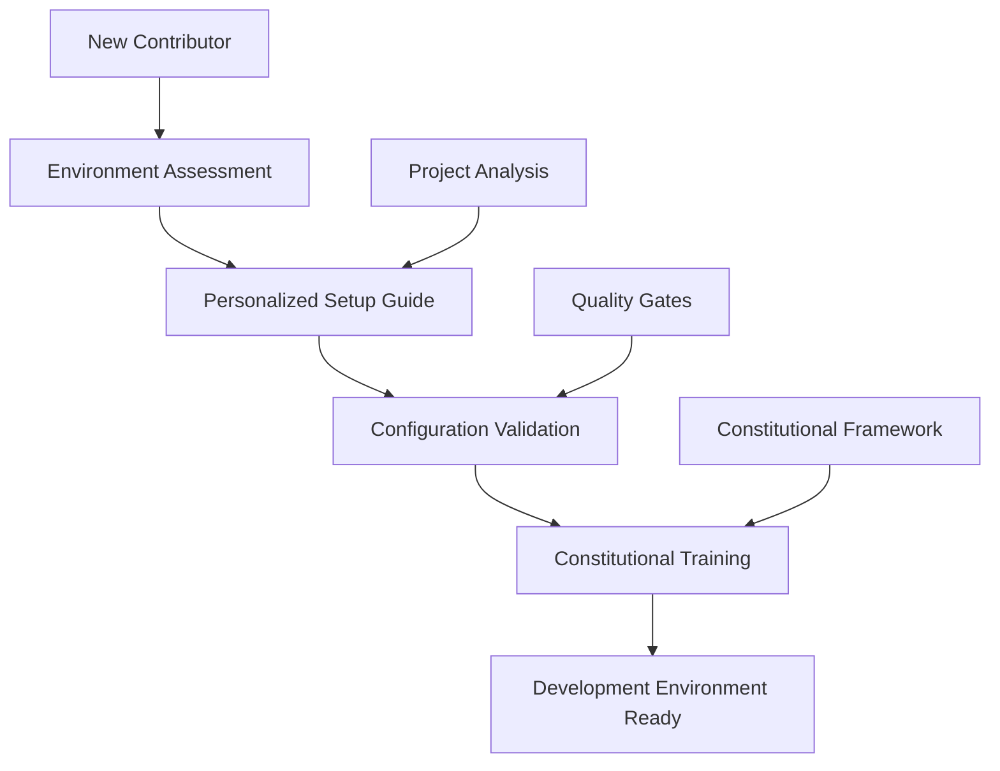
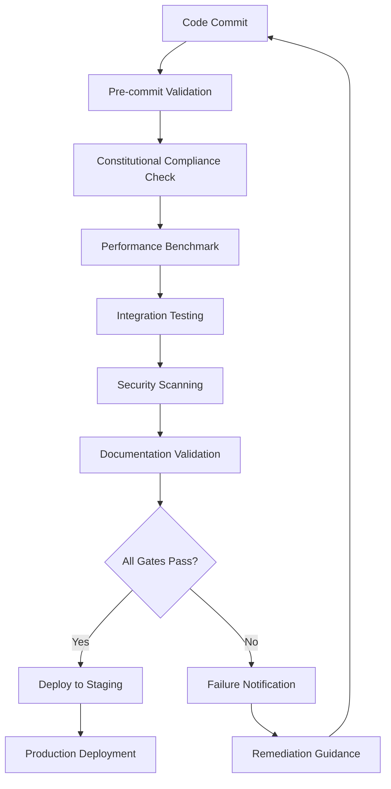
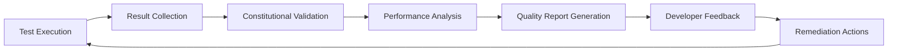
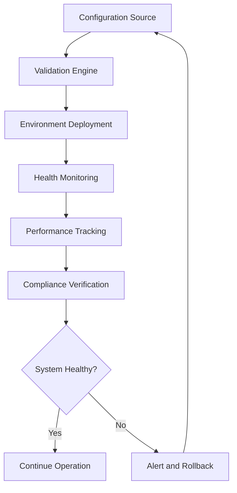
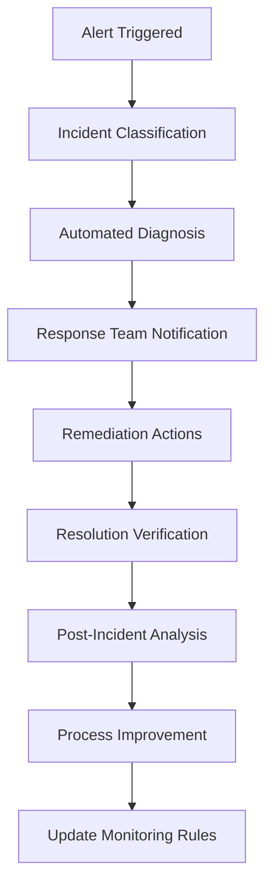
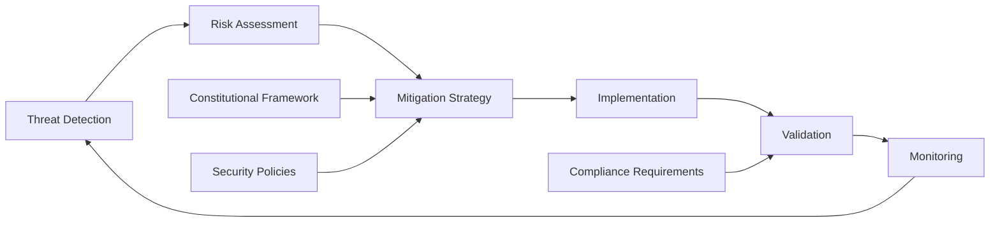
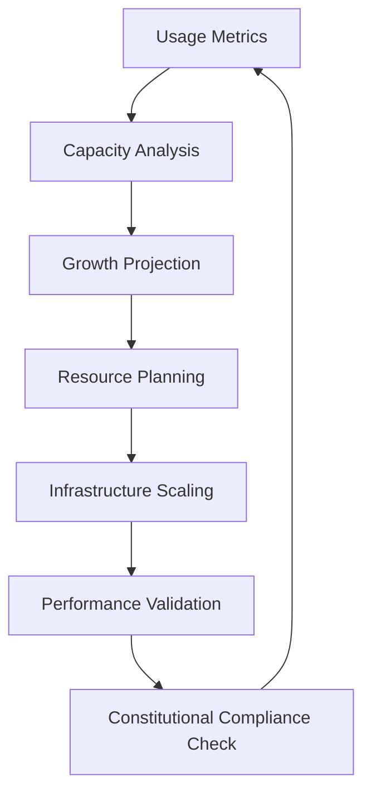
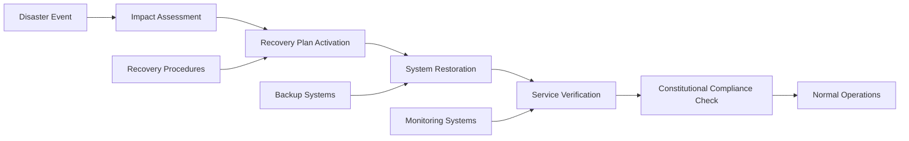

# Performance Monitoring and Rule Automation System Design

## Overview

This design outlines a comprehensive system for tracking extension interaction performance, implementing automated constitutional compliance checking, creating setup guides for new contributors, and adding unification validation to the CI pipeline. The system integrates with the existing constitutional framework to provide real-time monitoring, automated rule enforcement, and continuous validation of system compliance.

## Architecture

The performance monitoring and rule automation system follows a distributed architecture with multiple interconnected components that work together to ensure constitutional compliance and optimal system performance.

### Core Components

| Component | Purpose | Dependencies |
|-----------|---------|--------------|
| Performance Monitor | Track extension interactions and system metrics | Telemetry Bridge, WASM Analyzer |
| Constitutional Engine | Validate compliance against six-article framework | Rule Engine, Compliance Scorer |
| Rule Automation Engine | Automate constitutional validation workflows | Constitutional Engine, CI Integration |
| Documentation Generator | Create setup guides and contributor documentation | Template Engine, Configuration Manager |
| CI Validation Pipeline | Continuous integration compliance checking | GitHub Actions, Quality Gates |

### System Integration Points

The system integrates with existing components through well-defined interfaces:

- **Extension Host**: Performance telemetry collection and host-call monitoring
- **WASM Components**: Real-time code analysis and predictive metrics
- **Constitutional Framework**: Compliance scoring and violation detection
- **CI/CD Pipeline**: Automated validation gates and quality enforcement
- **VS Code Extension APIs**: User interface and status indicators

## Performance Monitoring

### Extension Interaction Tracking

The performance monitoring system captures detailed metrics about extension interactions to identify performance bottlenecks and optimize user experience.

#### Telemetry Data Collection

| Metric Category | Data Points | Collection Method |
|----------------|-------------|-------------------|
| Host API Calls | Function name, duration, success rate, error types | Host Telemetry Bridge |
| WASM Operations | Component execution time, memory usage, prediction accuracy | WASM Analyzer |
| LSP Communications | Request/response latency, message throughput, diagnostic counts | Language Client Middleware |
| UI Interactions | Command execution time, webview render performance, status updates | Extension Host Events |

#### Real-time Performance Dashboard

The system provides a comprehensive dashboard displaying:

- **Extension Performance Overview**: Response times, throughput metrics, and error rates
- **Constitutional Compliance Status**: Real-time scoring with visual indicators (Green ≥0.75, Yellow 0.50-0.74, Red <0.50)
- **WASM Component Health**: Memory usage, execution performance, and predictive analysis results
- **CI Pipeline Status**: Build times, validation results, and quality gate outcomes

### Performance Optimization Framework

The optimization framework continuously monitors performance metrics and automatically adjusts system parameters to maintain optimal performance while ensuring constitutional compliance.

## Constitutional Compliance Automation

### Automated Rule Validation

The rule automation engine implements comprehensive constitutional compliance checking across all system components.

#### Six-Article Constitutional Framework Integration

| Article | Validation Rules | Automation Level |
|---------|------------------|------------------|
| Article I: Library-First | Dependency validation, package compliance | Fully Automated |
| Article II: Test-First | Test coverage gates, TDD workflow enforcement | Partially Automated |
| Article III: Simplicity | Code complexity analysis, maintainability scoring | Automated Analysis |
| Article IV: Integration-First | End-to-end testing, system integration validation | Automated Testing |
| Article V: Clarity | Documentation coverage, API specification compliance | Automated Checks |
| Article VI: Versioning | Change impact analysis, breaking change detection | Automated Detection |

#### Compliance Scoring Algorithm

The system employs a weighted scoring mechanism to calculate overall constitutional compliance:

- **Overall Score Calculation**: Weighted average of article-specific scores
- **Violation Detection**: Pattern matching against constitutional principles
- **Threshold Enforcement**: Automatic rejection of changes below 0.75 compliance threshold
- **Remediation Guidance**: Automated suggestions for achieving compliance

### Real-time Compliance Monitoring

The monitoring system provides continuous feedback to developers, ensuring constitutional compliance is maintained throughout the development lifecycle.

## User Documentation System

### Automated Setup Guide Generation

The documentation system automatically generates comprehensive setup guides for new contributors based on project configuration and constitutional requirements.

#### Documentation Components

| Component | Content Type | Generation Method |
|-----------|--------------|-------------------|
| Environment Setup | Installation instructions, dependency management | Template-based generation |
| Constitutional Guide | Framework explanation, compliance procedures | Rule-driven content |
| Development Workflow | SDD process, quality gates, testing procedures | Process documentation |
| Troubleshooting Guide | Common issues, solution patterns, escalation paths | Issue pattern analysis |

#### Interactive Documentation Features

The system provides enhanced documentation capabilities:

- **Progressive Disclosure**: Step-by-step guidance based on user experience level
- **Context-Aware Help**: Documentation sections relevant to current development task
- **Validation Checkpoints**: Interactive verification of setup completion
- **Feedback Integration**: Continuous improvement based on user interactions

### Contributor Onboarding Workflow

The onboarding workflow ensures new contributors are properly equipped with the knowledge and tools necessary for constitutional compliance.

## Continuous Integration Pipeline

### Unification Validation Framework

The CI pipeline implements comprehensive validation to ensure system unification and constitutional compliance across all project components.

#### Validation Stages

| Stage | Validation Type | Success Criteria |
|-------|----------------|------------------|
| Constitutional Gate | Six-article compliance checking | Score ≥ 0.75 across all articles |
| Performance Gate | Extension performance benchmarks | No regression beyond threshold |
| Integration Gate | End-to-end system validation | All integration tests pass |
| Security Gate | Dependency and code security scanning | No critical vulnerabilities |
| Documentation Gate | Coverage and accuracy validation | Complete documentation for changes |

#### Automated Quality Enforcement

The pipeline enforces quality standards through automated gates:

- **Pre-commit Hooks**: Constitutional validation before code submission
- **Pull Request Validation**: Comprehensive compliance checking on proposed changes
- **Deployment Gates**: Final validation before production deployment
- **Continuous Monitoring**: Ongoing validation of deployed systems

### CI Pipeline Architecture

The pipeline ensures that only constitutionally compliant, high-quality code reaches production environments.

## Testing Strategy

### Comprehensive Testing Framework

The system implements multi-layered testing to ensure reliability and constitutional compliance.

#### Test Categories

| Test Type | Coverage | Automation Level |
|-----------|----------|------------------|
| Unit Tests | Individual component functionality | Fully Automated |
| Integration Tests | Component interaction validation | Fully Automated |
| Constitutional Tests | Compliance rule validation | Fully Automated |
| Performance Tests | System performance benchmarks | Automated with Manual Review |
| End-to-End Tests | Complete workflow validation | Partially Automated |

#### Test Execution Strategy

- **Continuous Testing**: Tests run on every code change
- **Progressive Testing**: Additional test layers triggered by change significance
- **Constitutional Validation**: Compliance testing integrated into all test phases
- **Performance Regression**: Automated detection of performance degradation

### Quality Assurance Workflow

The quality assurance workflow ensures comprehensive validation while providing actionable feedback to development teams.

## Configuration Management

### System Configuration Framework

The configuration management system provides centralized control over performance monitoring, rule automation, and validation parameters.

#### Configuration Categories

| Category | Parameters | Management Method |
|----------|------------|-------------------|
| Performance Monitoring | Metrics collection intervals, alert thresholds | Environment variables |
| Constitutional Rules | Compliance thresholds, violation patterns | Configuration files |
| CI Pipeline | Validation stages, quality gates | YAML configuration |
| Documentation | Template paths, generation rules | JSON configuration |

#### Configuration Validation

All configuration changes undergo constitutional validation to ensure system integrity:

- **Schema Validation**: Configuration structure compliance
- **Value Range Checking**: Parameter bounds enforcement
- **Dependency Validation**: Cross-component compatibility
- **Impact Assessment**: Change effect analysis

### Environment Management

The environment management system ensures consistent configuration across development, staging, and production environments.

## Monitoring and Alerting

### Real-time System Monitoring

The monitoring system provides comprehensive visibility into system health, performance, and constitutional compliance.

#### Monitoring Dashboards

| Dashboard | Purpose | Key Metrics |
|-----------|---------|-------------|
| System Health | Overall system status | Uptime, error rates, response times |
| Constitutional Compliance | Compliance monitoring | Article scores, violation trends, remediation status |
| Performance Metrics | System performance tracking | Throughput, latency, resource utilization |
| Developer Productivity | Development workflow efficiency | Commit frequency, review times, deployment success |

#### Alerting Framework

The alerting system provides proactive notification of system issues:

- **Performance Degradation**: Automatic alerts when metrics exceed thresholds
- **Constitutional Violations**: Immediate notification of compliance failures
- **System Failures**: Real-time alerts for critical system issues
- **Trend Analysis**: Predictive alerts based on performance trends

### Incident Response Workflow

The incident response workflow ensures rapid resolution of system issues while maintaining constitutional compliance.

## Security Considerations

### Security Architecture

The system implements comprehensive security measures to protect against vulnerabilities while maintaining performance and compliance.

#### Security Layers

| Layer | Protection Measures | Implementation |
|-------|-------------------|----------------|
| Authentication | Multi-factor authentication, token validation | OAuth 2.0, JWT tokens |
| Authorization | Role-based access control, permission validation | RBAC system |
| Data Protection | Encryption at rest and in transit, data anonymization | AES-256, TLS 1.3 |
| Audit Logging | Comprehensive activity logging, tamper detection | Structured logging |

#### Constitutional Security Compliance

Security measures align with constitutional principles:

- **Article I Compliance**: Security library standardization
- **Article II Compliance**: Security test-first development
- **Article III Compliance**: Simple, understandable security model
- **Article IV Compliance**: Integrated security validation
- **Article V Compliance**: Clear security documentation
- **Article VI Compliance**: Versioned security policies

### Threat Mitigation

The threat mitigation framework ensures security measures maintain constitutional compliance while providing effective protection.

## Scalability and Performance

### Scalability Framework

The system design accommodates growth in user base, data volume, and system complexity while maintaining performance and constitutional compliance.

#### Scalability Dimensions

| Dimension | Scaling Strategy | Implementation Approach |
|-----------|-----------------|------------------------|
| User Growth | Horizontal scaling, load balancing | Microservices architecture |
| Data Volume | Distributed storage, data partitioning | Cloud-native storage solutions |
| Complexity | Modular architecture, service decomposition | Domain-driven design |
| Geographic Distribution | Content delivery networks, edge computing | Multi-region deployment |

#### Performance Optimization

The system employs multiple optimization strategies:

- **Caching Strategies**: Multi-level caching for frequently accessed data
- **Database Optimization**: Query optimization, indexing strategies
- **Resource Management**: Efficient memory and CPU utilization
- **Load Balancing**: Traffic distribution across multiple instances

### Capacity Planning

The capacity planning process ensures system scalability while maintaining constitutional compliance and performance standards.

## Risk Management

### Risk Assessment Framework

The system implements comprehensive risk management to identify, assess, and mitigate potential threats to system operation and constitutional compliance.

#### Risk Categories

| Category | Risk Types | Mitigation Strategies |
|----------|------------|----------------------|
| Technical | System failures, performance degradation | Redundancy, monitoring, automated recovery |
| Compliance | Constitutional violations, regulatory issues | Automated validation, continuous monitoring |
| Security | Data breaches, unauthorized access | Multi-layer security, regular audits |
| Operational | Process failures, human error | Process automation, training, documentation |

#### Risk Monitoring

Continuous risk monitoring ensures proactive identification and resolution:

- **Automated Risk Detection**: Real-time monitoring of risk indicators
- **Trend Analysis**: Predictive risk assessment based on historical data
- **Constitutional Impact Assessment**: Risk evaluation against constitutional principles
- **Mitigation Effectiveness**: Continuous assessment of risk mitigation measures

### Disaster Recovery

The disaster recovery framework ensures rapid system restoration while maintaining constitutional compliance throughout the recovery process.

## Implementation Roadmap

### Phased Implementation Strategy

The system implementation follows a phased approach to minimize risk and ensure successful deployment.

#### Phase 1: Foundation (Weeks 1-4)

- Performance monitoring infrastructure setup
- Basic constitutional compliance validation
- Core telemetry collection implementation
- Initial CI pipeline integration

#### Phase 2: Automation (Weeks 5-8)

- Rule automation engine development
- Automated compliance checking implementation
- Enhanced performance monitoring dashboard
- Documentation generation system

#### Phase 3: Advanced Features (Weeks 9-12)

- Predictive performance analysis
- Advanced constitutional validation
- Comprehensive CI/CD integration
- Complete documentation system

#### Phase 4: Optimization (Weeks 13-16)

- Performance optimization
- Scalability enhancements
- Security hardening
- User experience improvements

### Success Metrics

| Metric | Target | Measurement Method |
|--------|--------|-------------------|
| Constitutional Compliance | ≥95% of commits score ≥0.75 | Automated compliance tracking |
| Performance Improvement | ≤10% performance regression | Automated benchmarking |
| Developer Productivity | 20% reduction in setup time | Time tracking and surveys |
| System Reliability | 99.9% uptime | System monitoring |

The implementation roadmap ensures systematic delivery of capabilities while maintaining system stability and constitutional compliance.
