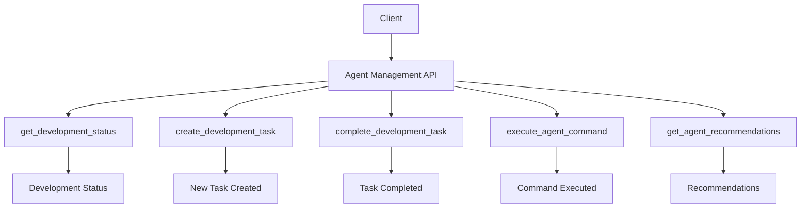
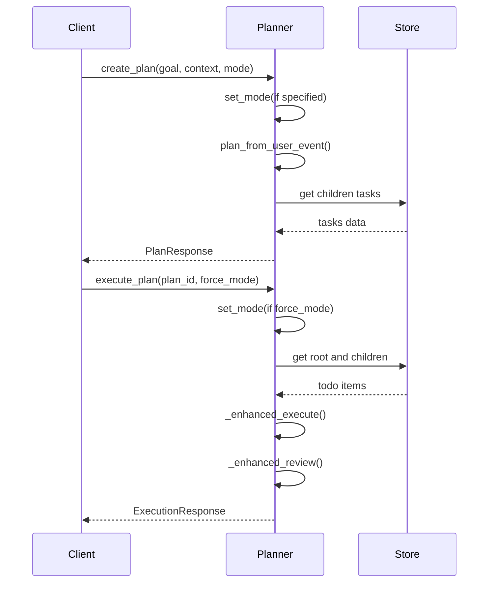
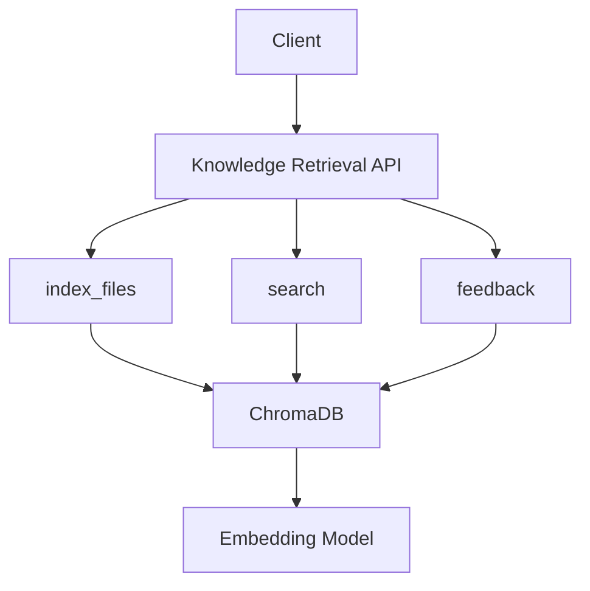

# API Reference

<cite>
**Referenced Files in This Document**   
- [mcp_server.py](file://backend/mcp_server.py)
- [context_server.py](file://backend/context_server.py)
- [agent_orchestrator.py](file://backend/agent_orchestrator.py)
- [ladder.py](file://cortex/api/endpoints/ladder.py)
- [automation.py](file://cortex/api/endpoints/automation.py)
- [server.py](file://mcp_server/src/mcp_server/server.py)
- [agent_mcp_server.py](file://src/vscode_integration/agent_mcp_server.py)
</cite>

## Table of Contents
1. [Introduction](#introduction)
2. [Agent Management API](#agent-management-api)
3. [Task Orchestration API](#task-orchestration-api)
4. [Knowledge Retrieval API](#knowledge-retrieval-api)
5. [Telemetry Collection API](#telemetry-collection-api)
6. [WebSocket APIs](#websocket-apis)
7. [Authentication and Security](#authentication-and-security)
8. [Rate Limiting and Versioning](#rate-limiting-and-versioning)
9. [Error Handling](#error-handling)
10. [Client Implementation Guidelines](#client-implementation-guidelines)
11. [Performance Optimization](#performance-optimization)
12. [Debugging and Troubleshooting](#debugging-and-troubleshooting)
13. [Migration Guide](#migration-guide)

## Introduction
The Super Alita framework provides a comprehensive API for intelligent agent systems, enabling advanced capabilities in agent management, task orchestration, knowledge retrieval, and telemetry collection. This documentation details the public RESTful and WebSocket APIs that form the core interaction layer of the framework.

The API ecosystem is built on a modular architecture with specialized endpoints for different functional domains. The framework supports both synchronous HTTP requests and real-time WebSocket interactions, providing flexibility for various client implementations. All APIs follow RESTful principles with predictable URL patterns, standard HTTP methods, and JSON request/response payloads.

**Section sources**
- [mcp_server.py](file://backend/mcp_server.py#L1-L59)
- [agent_orchestrator.py](file://backend/agent_orchestrator.py#L1-L135)

## Agent Management API

The Agent Management API provides endpoints for creating, configuring, and interacting with intelligent agents within the Super Alita framework. This API enables clients to manage agent lifecycles, execute agent commands, and retrieve agent status and recommendations.



**Diagram sources**
- [agent_mcp_server.py](file://src/vscode_integration/agent_mcp_server.py#L229-L613)

### Agent Status and Recommendations
The API provides comprehensive endpoints for retrieving agent status and intelligent recommendations.

#### Get Development Status
Retrieve comprehensive development status including tasks, completion rate, and recommendations.

**Endpoint**: `GET /tool/get_development_status`  
**Authentication**: Required  
**Response Schema**:
```json
{
  "current_tasks": [
    {
      "id": "string",
      "title": "string",
      "description": "string",
      "priority": "low|medium|high|critical",
      "status": "pending|in_progress|done",
      "created_at": "datetime"
    }
  ],
  "completion_rate": "number",
  "recommendations": ["string"],
  "overall_status": "string"
}
```

#### Get Agent Recommendations
Obtain intelligent recommendations for the developer based on current state.

**Endpoint**: `GET /tool/get_agent_recommendations`  
**Authentication**: Required  
**Response Schema**:
```json
{
  "recommendations": [
    {
      "title": "string",
      "description": "string",
      "priority": "low|medium|high|critical",
      "category": "refactoring|testing|architecture|documentation"
    }
  ],
  "confidence_score": "number"
}
```

**Section sources**
- [agent_mcp_server.py](file://src/vscode_integration/agent_mcp_server.py#L229-L613)

### Task Management
Manage development tasks through the agent system with creation, completion, and execution capabilities.

#### Create Development Task
Create a new development task with title, description, and priority.

**Endpoint**: `POST /tool/create_development_task`  
**Authentication**: Required  
**Request Schema**:
```json
{
  "title": "string",
  "description": "string",
  "priority": "low|medium|high|critical"
}
```
**Response Schema**:
```json
{
  "task_id": "string",
  "status": "created",
  "created_at": "datetime"
}
```

#### Complete Development Task
Mark a development task as complete with optional completion notes.

**Endpoint**: `POST /tool/complete_development_task`  
**Authentication**: Required  
**Request Schema**:
```json
{
  "task_id": "string",
  "notes": "string"
}
```
**Response Schema**:
```json
{
  "task_id": "string",
  "status": "completed",
  "completed_at": "datetime",
  "success": "boolean"
}
```

#### Execute Agent Command
Execute arbitrary agent commands for development automation.

**Endpoint**: `POST /tool/execute_agent_command`  
**Authentication**: Required  
**Request Schema**:
```json
{
  "command": "string",
  "kwargs": {
    "key": "value"
  }
}
```
**Response Schema**:
```json
{
  "command": "string",
  "result": "any",
  "status": "success|error",
  "execution_time": "number"
}
```

**Section sources**
- [agent_mcp_server.py](file://src/vscode_integration/agent_mcp_server.py#L229-L613)

## Task Orchestration API

The Task Orchestration API provides advanced planning and execution capabilities through the LADDER planner system. This API enables goal-oriented planning, task execution, and comprehensive monitoring of planning activities.



**Diagram sources**
- [ladder.py](file://cortex/api/endpoints/ladder.py#L74-L332)

### Plan Creation and Execution
The LADDER planner provides sophisticated planning capabilities with support for different operational modes and comprehensive execution tracking.

#### Create Plan
Create a LADDER plan for a given development goal.

**Endpoint**: `POST /api/planner/create-plan`  
**Authentication**: Required  
**Request Schema**:
```json
{
  "goal": "string",
  "context": "string",
  "mode": "shadow|active"
}
```
**Response Schema**:
```json
{
  "plan_id": "string",
  "title": "string",
  "tasks": [
    {
      "id": "string",
      "title": "string",
      "description": "string",
      "energy": "number",
      "priority": "number",
      "status": "pending|in_progress|done",
      "tool_hint": "string"
    }
  ],
  "total_energy": "number",
  "mode": "shadow|active",
  "created_at": "datetime"
}
```

#### Execute Plan
Execute a previously created LADDER plan.

**Endpoint**: `POST /api/planner/execute-plan`  
**Authentication**: Required  
**Request Schema**:
```json
{
  "plan_id": "string",
  "force_mode": "shadow|active"
}
```
**Response Schema**:
```json
{
  "success": "boolean",
  "plan_id": "string",
  "results": {
    "executed_tasks": "number",
    "successful_tasks": "number"
  },
  "final_state": {
    "task_id": "pending|in_progress|done"
  },
  "completion_rate": "number",
  "total_reward": "number",
  "execution_time": "number"
}
```

#### Plan and Execute (Convenience Endpoint)
Create and immediately execute a plan in a single operation.

**Endpoint**: `POST /api/planner/plan-and-execute`  
**Authentication**: Required  
**Request Schema**: Same as `create-plan`  
**Response Schema**:
```json
{
  "plan": "PlanResponse",
  "execution": "ExecutionResponse"
}
```

**Section sources**
- [ladder.py](file://cortex/api/endpoints/ladder.py#L74-L332)

### Planner Configuration and Monitoring
Monitor and configure the LADDER planner's behavior and learning parameters.

#### Get Planner Statistics
Retrieve comprehensive statistics about the planner's operation and learning.

**Endpoint**: `GET /api/planner/stats`  
**Authentication**: Required  
**Response Schema**:
```json
{
  "bandit_stats": {
    "tool_name": {
      "success_rate": "number",
      "usage_count": "number",
      "average_reward": "number"
    }
  },
  "knowledge_base_summary": {
    "total_entries": "number",
    "domains": ["string"],
    "last_updated": "datetime"
  },
  "configuration": {
    "exploration_rate": "number",
    "temperature": "number",
    "max_iterations": "number"
  },
  "current_mode": "shadow|active"
}
```

#### Set Planner Mode
Change the planner's operational mode between shadow and active.

**Endpoint**: `POST /api/planner/set-mode`  
**Authentication**: Required  
**Request Schema**:
```json
{
  "mode": "shadow|active"
}
```
**Response Schema**:
```json
{
  "message": "string",
  "mode": "shadow|active"
}
```

#### Update Configuration
Modify the planner's configuration parameters.

**Endpoint**: `POST /api/planner/config`  
**Authentication**: Required  
**Request Schema**:
```json
{
  "config": {
    "key": "value"
  }
}
```
**Response Schema**:
```json
{
  "message": "Configuration updated successfully",
  "config": "object"
}
```

#### Get Configuration
Retrieve the current planner configuration.

**Endpoint**: `GET /api/planner/config`  
**Authentication**: Required  
**Response Schema**:
```json
{
  "config": "object",
  "current_mode": "shadow|active",
  "exploration_rate": "number"
}
```

**Section sources**
- [ladder.py](file://cortex/api/endpoints/ladder.py#L74-L332)

### Automation Endpoints
The automation API provides endpoints for common development automation tasks.

#### Run Python Tests
Execute Python tests with coverage reporting.

**Endpoint**: `POST /api/automation/run-python-tests`  
**Authentication**: Required  
**Response Schema**:
```json
{
  "success": "boolean",
  "coverage": "number",
  "test_count": "number",
  "pass_count": "number",
  "fail_count": "number",
  "duration": "number"
}
```

#### Format and Lint
Apply code formatting and linting to the codebase.

**Endpoint**: `POST /api/automation/format-and-lint`  
**Authentication**: Required  
**Response Schema**:
```json
{
  "success": "boolean",
  "formatted_files": "number",
  "lint_errors_fixed": "number",
  "duration": "number"
}
```

#### Create Feature Branch
Create a new Git feature branch.

**Endpoint**: `POST /api/automation/create-feature-branch/{feature_name}`  
**Authentication**: Required  
**Response Schema**:
```json
{
  "success": "boolean",
  "branch_name": "string",
  "created_at": "datetime"
}
```

**Section sources**
- [automation.py](file://cortex/api/endpoints/automation.py#L1-L52)

## Knowledge Retrieval API

The Knowledge Retrieval API provides indexing and search capabilities for code and development artifacts. This API enables semantic search across the codebase and feedback collection for continuous improvement.



**Diagram sources**
- [context_server.py](file://backend/context_server.py#L1-L127)

### Indexing and Search
Manage code indexing and perform semantic searches across the codebase.

#### Index Files
Index code files for semantic search.

**Endpoint**: `POST /index`  
**Authentication**: Required  
**Request Schema**:
```json
{
  "files": {
    "file_path": "file_content"
  }
}
```
**Response Schema**:
```json
{
  "status": "ok|disabled|no-files",
  "count": "number"
}
```

#### Search
Perform semantic search across indexed code.

**Endpoint**: `POST /search`  
**Authentication**: Required  
**Request Schema**:
```json
{
  "query": "string",
  "k": "number"
}
```
**Response Schema**:
```json
{
  "results": ["string"]
}
```

#### Submit Feedback
Provide feedback on code suggestions for model improvement.

**Endpoint**: `POST /feedback`  
**Authentication**: Required  
**Request Schema**:
```json
{
  "prompt": "string",
  "original_code": "string",
  "final_code": "string",
  "outcome": "accepted|modified|rejected"
}
```
**Response Schema**:
```json
{
  "status": "ok|disabled|error"
}
```

**Section sources**
- [context_server.py](file://backend/context_server.py#L1-L127)

## Telemetry Collection API

The Telemetry Collection API provides health monitoring and status endpoints for various components of the Super Alita framework.

### Health Endpoints
Monitor the health status of different system components.

#### Context Server Health
Check the health status of the context indexing service.

**Endpoint**: `GET /healthz`  
**Authentication**: Not Required  
**Response Schema**:
```json
{
  "status": "ok",
  "enabled": "boolean"
}
```

#### Agent Orchestrator Health
Check the health status of the agent orchestrator.

**Endpoint**: `GET /health`  
**Authentication**: Not Required  
**Response Schema**:
```json
{
  "status": "ok",
  "model": "string",
  "endpoint": "string",
  "roles": ["string"]
}
```

#### LADDER Planner Health
Check the health status of the LADDER planner.

**Endpoint**: `GET /api/planner/health`  
**Authentication**: Not Required  
**Response Schema**:
```json
{
  "status": "healthy",
  "planner_mode": "shadow|active",
  "timestamp": "datetime",
  "bandit_tools": "number",
  "knowledge_base_size": "number"
}
```

**Section sources**
- [context_server.py](file://backend/context_server.py#L59-L60)
- [agent_orchestrator.py](file://backend/agent_orchestrator.py#L129-L134)
- [ladder.py](file://cortex/api/endpoints/ladder.py#L315-L322)

## WebSocket APIs

The Super Alita framework provides WebSocket APIs for real-time interaction with agent systems. These APIs enable streaming responses, real-time updates, and interactive sessions.

### Real-time Agent Interaction
Establish WebSocket connections for real-time agent communication.

**Endpoint**: `ws://<host>:<port>/ws/agent`  
**Authentication**: Required via query parameter or header  
**Message Format**:
```json
{
  "type": "request|response|event",
  "id": "string",
  "payload": "any"
}
```

### Supported Message Types
The WebSocket API supports various message types for different interaction patterns.

#### Request Messages
Client-initiated requests to the agent system.

```json
{
  "type": "request",
  "id": "msg_123",
  "payload": {
    "action": "plan",
    "parameters": {
      "goal": "Implement user authentication"
    }
  }
}
```

#### Response Messages
Server responses to client requests.

```json
{
  "type": "response",
  "id": "msg_123",
  "payload": {
    "status": "success",
    "result": "any"
  }
}
```

#### Event Messages
Server-initiated events for real-time updates.

```json
{
  "type": "event",
  "id": "evt_456",
  "payload": {
    "event_type": "task_update",
    "data": {
      "task_id": "task_789",
      "status": "in_progress"
    }
  }
}
```

**Section sources**
- [agent_mcp_server.py](file://src/vscode_integration/agent_mcp_server.py#L229-L613)

## Authentication and Security

The Super Alita API implements robust authentication and security measures to protect agent systems and sensitive data.

### Authentication Methods
The API supports multiple authentication methods for different deployment scenarios.

#### API Key Authentication
Use API keys for simple, token-based authentication.

**Header**: `Authorization: Bearer <api_key>`  
**Key Management**: API keys are managed through the agent configuration system and can be rotated as needed.

#### Token-based Authentication
Use JWT tokens for stateless authentication with expiration and claims.

**Header**: `Authorization: Bearer <jwt_token>`  
**Token Generation**: Tokens are generated by the authentication service and include claims for user roles and permissions.

### Security Considerations
The API implements several security measures to protect against common threats.

- **Rate Limiting**: All endpoints are subject to rate limiting to prevent abuse
- **Input Validation**: All inputs are validated against defined schemas
- **HTTPS Enforcement**: Production deployments require HTTPS
- **CORS Policy**: Strict CORS policy limits origins to authorized domains
- **Content Security**: Input content is sanitized to prevent injection attacks

**Section sources**
- [agent_mcp_server.py](file://src/vscode_integration/agent_mcp_server.py#L229-L613)
- [server.py](file://mcp_server/src/mcp_server/server.py#L1-L74)

## Rate Limiting and Versioning

The API implements comprehensive rate limiting and versioning strategies to ensure stability and backward compatibility.

### Rate Limiting
The API enforces rate limits at multiple levels to prevent abuse and ensure fair usage.

#### Limit Types
- **Per-User Limits**: Each authenticated user has individual rate limits
- **Per-IP Limits**: Additional limits based on client IP address
- **Endpoint-Specific Limits**: Different limits for resource-intensive endpoints

#### Rate Limit Headers
Rate-limited responses include the following headers:
- `X-RateLimit-Limit`: The maximum number of requests allowed
- `X-RateLimit-Remaining`: The number of requests remaining
- `X-RateLimit-Reset`: When the rate limit resets (Unix timestamp)

### Versioning
The API uses a versioning strategy to ensure backward compatibility and smooth transitions.

#### Versioning Scheme
- **URL Path Versioning**: `/api/v1/endpoint` for version 1
- **Semantic Versioning**: Follows MAJOR.MINOR.PATCH format
- **Deprecation Policy**: Deprecated endpoints remain available for 6 months

#### Version Support
- **Current Version**: v1 (stable)
- **Deprecated Versions**: None
- **Future Versions**: v2 in development

**Section sources**
- [ladder.py](file://cortex/api/endpoints/ladder.py#L74-L332)
- [context_server.py](file://backend/context_server.py#L1-L127)

## Error Handling

The API implements consistent error handling patterns across all endpoints.

### Error Response Format
All error responses follow a standardized format:

```json
{
  "error": "error_code",
  "message": "Human-readable error message",
  "details": "Additional error details",
  "timestamp": "ISO 8601 timestamp"
}
```

### Common Error Codes
The API uses standardized error codes for common error conditions.

| Code | HTTP Status | Description |
|------|-----------|-------------|
| `invalid_request` | 400 | Invalid request parameters |
| `authentication_failed` | 401 | Authentication credentials invalid |
| `forbidden` | 403 | Insufficient permissions |
| `not_found` | 404 | Resource not found |
| `rate_limit_exceeded` | 429 | Rate limit exceeded |
| `internal_error` | 500 | Internal server error |
| `service_unavailable` | 503 | Service temporarily unavailable |

### Error Recovery Strategies
Clients should implement the following error