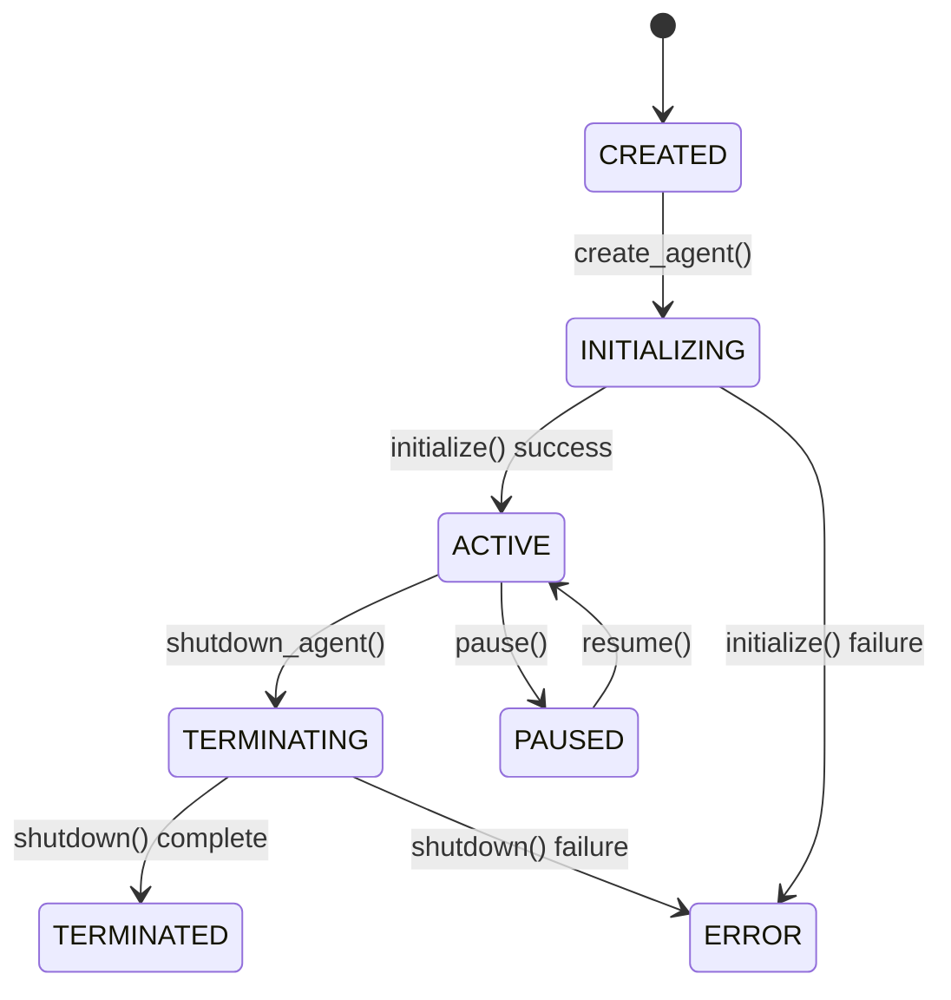
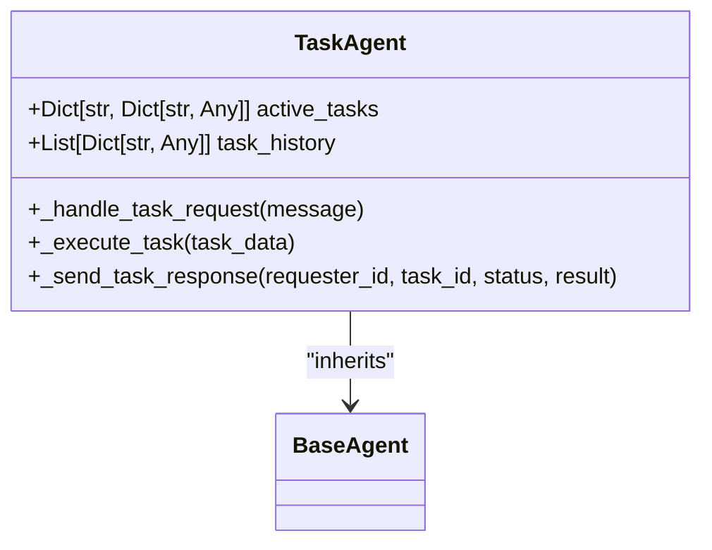
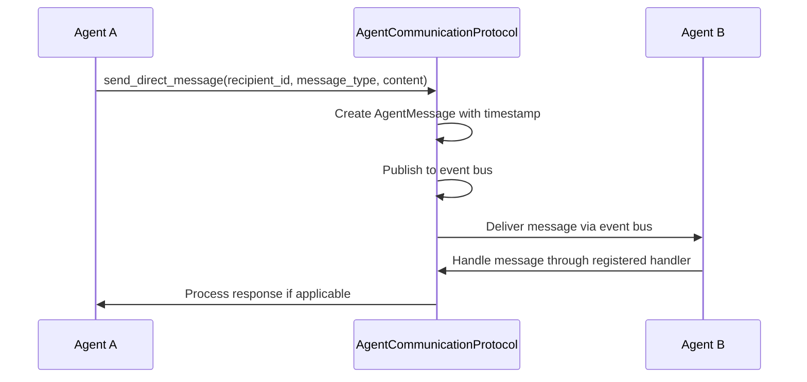

# Agent Management API

<cite>
**Referenced Files in This Document**   
- [AGENTS.md](file://src/agents/AGENTS.md)
- [agent_orchestrator.py](file://backend/agent_orchestrator.py)
- [mcp_server.py](file://backend/mcp_server.py)
</cite>

## Table of Contents
1. [Introduction](#introduction)
2. [Agent Lifecycle Management](#agent-lifecycle-management)
3. [Agent Types and Profiles](#agent-types-and-profiles)
4. [Agent Communication and Coordination](#agent-communication-and-coordination)
5. [Error Handling and Security](#error-handling-and-security)
6. [Performance and Optimization](#performance-and-optimization)
7. [Client Integration Guidelines](#client-integration-guidelines)
8. [API Reference](#api-reference)
9. [Troubleshooting Guide](#troubleshooting-guide)
10. [Conclusion](#conclusion)

## Introduction
The Agent Management API provides a comprehensive interface for managing autonomous agents within the Super Alita system. This API enables the creation, monitoring, coordination, and termination of specialized agents that perform various tasks within the system. The API supports different agent types including TaskAgent, CoordinatorAgent, and LearningAgent, each with specific capabilities and responsibilities.

The agent management system is built around a robust lifecycle management framework that ensures proper initialization, operation, and shutdown of agents. The system uses an event-driven architecture with an event bus for inter-agent communication and coordination. Agents are managed by an AgentManager that handles their creation, registration, and lifecycle events.

**Section sources**
- [AGENTS.md](file://src/agents/AGENTS.md#L0-L1165)

## Agent Lifecycle Management
The Agent Management API provides comprehensive lifecycle management for agents through the AgentManager class. The lifecycle consists of several states: CREATED, INITIALIZING, ACTIVE, PAUSED, TERMINATING, TERMINATED, and ERROR. Each agent transitions through these states during its lifetime.

Agent creation is handled by the `create_agent` method of the AgentManager, which takes an agent class and profile as parameters. The method first creates an agent instance, then initializes it by calling its `initialize` method. Upon successful initialization, the agent is registered with the AgentDiscoveryService and added to the manager's agent collection.

**Diagram sources**
- [AGENTS.md](file://src/agents/AGENTS.md#L613-L722)

The shutdown process is initiated by calling the `shutdown_agent` method with the agent's ID. This triggers the agent's `shutdown` method, which performs cleanup operations and processes any remaining messages in the queue. After shutdown, the agent is unregistered from the discovery service and removed from the manager's collection.

The AgentManager also provides methods for bulk operations such as `shutdown_all_agents`, which shuts down all managed agents concurrently using asyncio.gather. This ensures efficient cleanup of multiple agents during system shutdown or maintenance.

**Section sources**
- [AGENTS.md](file://src/agents/AGENTS.md#L613-L722)

## Agent Types and Profiles
The system supports several specialized agent types, each designed for specific roles and responsibilities. The base class for all agents is BaseAgent, which defines the common interface and lifecycle methods. Specialized agent types inherit from this base class and implement specific behaviors.

### TaskAgent
The TaskAgent is specialized for executing specific tasks. It maintains a dictionary of active tasks and a history of completed tasks. When a task request is received, the agent validates the task against its capabilities, starts execution, and manages the task lifecycle. The agent can handle various task types including computation and data processing tasks.

**Diagram sources**
- [AGENTS.md](file://src/agents/AGENTS.md#L258-L493)

### CoordinatorAgent
The CoordinatorAgent specializes in coordinating other agents to accomplish complex tasks. It discovers available agents, decomposes tasks into subtasks, assigns subtasks to appropriate agents, and coordinates the overall workflow. This agent type is essential for multi-agent collaboration and complex problem solving.

### LearningAgent
The LearningAgent has built-in learning capabilities and maintains a knowledge base. It collects learning data from various sources, processes this data to extract patterns, and updates its knowledge base accordingly. The agent triggers learning cycles when sufficient data has been accumulated, enabling continuous improvement and adaptation.

Agent profiles are defined using the AgentProfile dataclass, which includes properties such as agent_id, agent_type, name, description, capabilities, configuration, and tags. Capabilities are represented by the AgentCapability class, which includes a name, description, parameters, enabled status, and version.

**Section sources**
- [AGENTS.md](file://src/agents/AGENTS.md#L258-L493)

## Agent Communication and Coordination
Agents communicate with each other through a message-based system using the AgentMessage class. Each message includes an ID, sender and recipient IDs, message type, content, timestamp, priority, and optional reply-to reference. The communication system supports both direct messages between specific agents and broadcast messages to all agents.

The AgentCommunicationProtocol class manages message routing and handling. It maintains a registry of message handlers for different message types and processes incoming messages by invoking the appropriate handlers. The protocol supports both direct messaging and broadcasting through the `send_direct_message` and `broadcast_message` methods.

**Diagram sources**
- [AGENTS.md](file://src/agents/AGENTS.md#L496-L612)

The AgentDiscoveryService enables agents to discover and locate each other based on capabilities or types. Agents register themselves with the discovery service upon initialization, making them available for coordination and collaboration. The service provides methods to find agents by capability, type, or to retrieve all registered agents.

The coordination workflow involves the CoordinatorAgent receiving a coordination request, decomposing the task into subtasks, selecting appropriate agents for each subtask, and assigning the subtasks. The coordinator monitors the progress of subtasks and synthesizes the results into a cohesive outcome.

**Section sources**
- [AGENTS.md](file://src/agents/AGENTS.md#L496-L612)

## Error Handling and Security
The agent management system implements comprehensive error handling at multiple levels. During agent initialization, any exceptions are caught and logged, with the agent's state set to ERROR. The system tracks error metrics in the agent's metrics dictionary, incrementing the errors counter for each failure.

For task execution, the TaskAgent wraps task processing in try-catch blocks to handle exceptions gracefully. If a task fails, the agent records the error details and sends a failure response to the requester. This prevents unhandled exceptions from terminating the agent while still providing feedback about task failures.

The system includes security considerations through the AgentSecurityManager and SecureAgent classes. The security manager validates message permissions, ensuring that agents can only send and receive messages for which they have appropriate permissions. It also sanitizes message content to prevent injection attacks by removing potentially dangerous fields and limiting string lengths.

Rate limiting for agent creation requests is implemented through configuration parameters and monitoring of system resources. The system can be configured to limit the number of agents created within a specific time window, preventing resource exhaustion from excessive agent creation.

Agent profiles support versioning through the version field in the AgentCapability class. This allows for backward compatibility when updating agent capabilities and enables clients to request specific versions of agent profiles.

**Section sources**
- [AGENTS.md](file://src/agents/AGENTS.md#L496-L612)

## Performance and Optimization
The agent management system includes