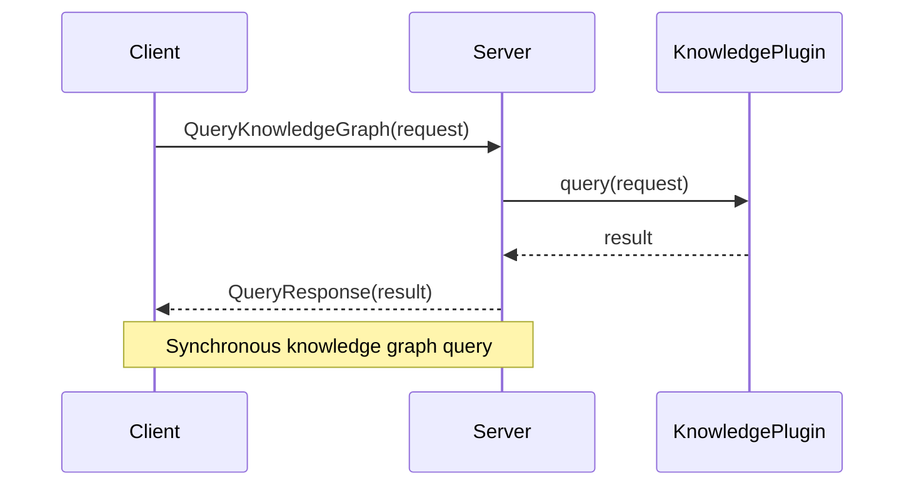
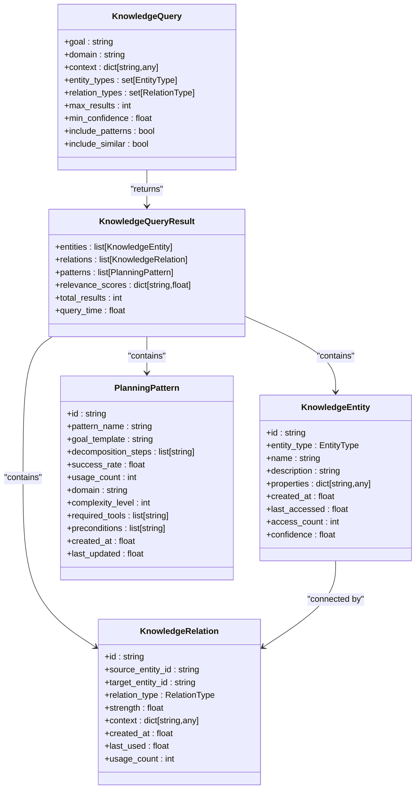
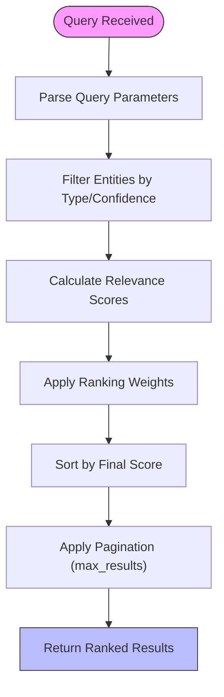
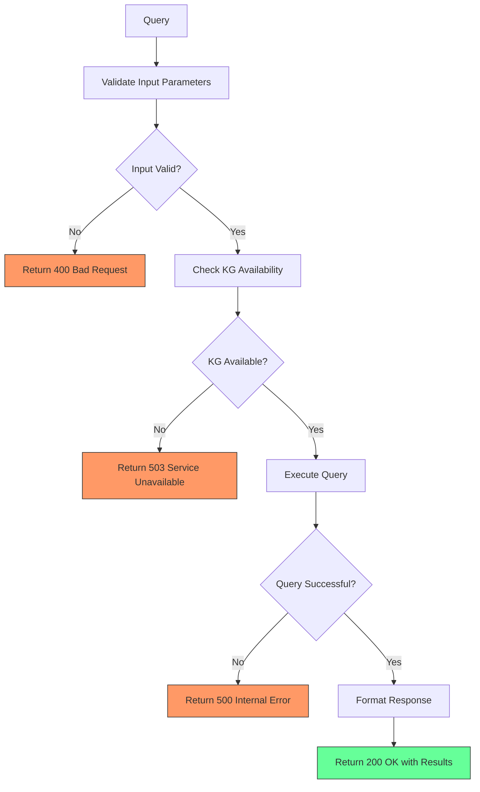

# Knowledge Retrieval API

<cite>
**Referenced Files in This Document**   
- [server.py](file://src/mcp_server/server.py)
- [kg_interface.py](file://src/knowledge_graph/kg_interface.py)
- [models/__init__.py](file://src/knowledge_graph/models/__init__.py)
- [grpc_server.py](file://src/core/mangle/grpc_server.py)
- [super_alita_pb2_grpc.py](file://src/core/mangle/super_alita_pb2_grpc.py)
</cite>

## Table of Contents
1. [Introduction](#introduction)
2. [RESTful API Endpoints](#restful-api-endpoints)
3. [gRPC API Endpoints](#grpc-api-endpoints)
4. [Request/Response Schemas](#requestresponse-schemas)
5. [Query Parameters and Examples](#query-parameters-and-examples)
6. [Pagination and Result Ranking](#pagination-and-result-ranking)
7. [Caching Strategies](#caching-strategies)
8. [Error Handling](#error-handling)
9. [Security Considerations](#security-considerations)
10. [Client Implementation Guidelines](#client-implementation-guidelines)

## Introduction
The Knowledge Retrieval API provides access to the cognitive knowledge graph system, enabling retrieval of cognitive atoms, bonds, and semantic relationships. The API supports both RESTful and gRPC interfaces for querying the knowledge base, with comprehensive capabilities for semantic search, relationship traversal, and pattern recognition. This documentation details the available endpoints, request/response formats, authentication methods, and best practices for efficient knowledge retrieval.

**Section sources**
- [server.py](file://src/mcp_server/server.py#L86-L132)
- [kg_interface.py](file://src/knowledge_graph/kg_interface.py#L1-L378)

## RESTful API Endpoints
The RESTful API provides HTTP-based access to the knowledge graph through the MCP server. The primary endpoint enables querying the knowledge base with different search strategies.

### /query_knowledge_graph
**HTTP Method**: POST  
**Description**: Query the lightweight in-memory knowledge graph for planning patterns and relevant entities.  
**Authentication**: Bearer token required (configured in server allowlist)  

The endpoint supports three query types:
- **semantic**: Full semantic search including patterns and contextual relationships
- **structural**: Structural search focused on domain and task entities
- **temporal**: Temporal search without pattern inclusion

**Section sources**
- [server.py](file://src/mcp_server/server.py#L86-L132)

## gRPC API Endpoints
The gRPC API provides high-performance access to the knowledge graph with strongly-typed protocol buffers.

### CreateConcept
**Method**: CreateConcept  
**Request**: CreateConceptRequest  
**Response**: CreateConceptResponse  
**Description**: Creates a new concept (atom) in the knowledge graph with specified metadata.

### CreateRelationship
**Method**: CreateRelationship  
**Request**: CreateRelationshipRequest  
**Response**: CreateRelationshipResponse  
**Description**: Establishes a relationship (bond) between two concepts in the knowledge graph.

### QueryKnowledgeGraph
**Method**: QueryKnowledgeGraph  
**Request**: QueryRequest  
**Response**: QueryResponse  
**Description**: Performs a comprehensive query against the knowledge graph with filtering capabilities.

### GetKnowledgeGraphStats
**Method**: GetKnowledgeGraphStats  
**Request**: Empty  
**Response**: KnowledgeGraphStatsResponse  
**Description**: Retrieves comprehensive statistics about the knowledge graph including atom and bond counts.



**Diagram sources**
- [grpc_server.py](file://src/core/mangle/grpc_server.py#L286-L356)
- [super_alita_pb2_grpc.py](file://src/core/mangle/super_alita_pb2_grpc.py#L165-L274)

**Section sources**
- [grpc_server.py](file://src/core/mangle/grpc_server.py#L286-L356)
- [super_alita_pb2_grpc.py](file://src/core/mangle/super_alita_pb2_grpc.py#L165-L274)

## Request/Response Schemas
The API uses well-defined data structures for requests and responses, ensuring consistency across both RESTful and gRPC interfaces.

### KnowledgeQuery
Represents a query for retrieving relevant knowledge from the graph.

**Fields**:
- `goal`: Primary search goal or query string
- `domain`: Domain context for the query (default: "general")
- `context`: Additional context dictionary
- `entity_types`: Set of entity types to filter by
- `relation_types`: Set of relation types to filter by
- `max_results`: Maximum number of results to return (default: 10)
- `min_confidence`: Minimum confidence threshold (default: 0.5)
- `include_patterns`: Whether to include planning patterns (default: True)
- `include_similar`: Whether to include similar entities (default: True)

### KnowledgeQueryResult
Represents the result of a knowledge graph query.

**Fields**:
- `entities`: List of matching knowledge entities
- `relations`: List of relevant relationships
- `patterns`: List of relevant planning patterns
- `relevance_scores`: Dictionary of relevance scores by entity/pattern ID
- `total_results`: Total number of results found
- `query_time`: Time taken to execute the query in seconds

### KnowledgeEntity
Represents an entity in the knowledge graph.

**Fields**:
- `id`: Unique identifier
- `entity_type`: Type of entity (TASK, GOAL, DOMAIN, etc.)
- `name`: Entity name
- `description`: Entity description
- `properties`: Additional properties dictionary
- `created_at`: Creation timestamp
- `last_accessed`: Last access timestamp
- `access_count`: Number of times accessed
- `confidence`: Confidence in entity accuracy (0.0-1.0)



**Diagram sources**
- [models/__init__.py](file://src/knowledge_graph/models/__init__.py#L1-L125)

**Section sources**
- [models/__init__.py](file://src/knowledge_graph/models/__init__.py#L1-L125)

## Query Parameters and Examples
The API supports various query types for different search scenarios, with comprehensive filtering and context options.

### Semantic Search
Semantic search analyzes the meaning and context of the query to find relevant knowledge.

**Example Request**:
```json
{
  "query_type": "semantic",
  "query": "Implement a Python class for data processing",
  "max_results": 10
}
```

### Structural Search
Structural search focuses on specific entity types and their relationships.

**Example Request**:
```json
{
  "query_type": "structural",
  "query": "software development patterns",
  "max_results": 5
}
```

### Relationship-Based Search
Search for entities connected through specific relationships.

**Example Request**:
```json
{
  "query_type": "semantic",
  "query": "dependencies",
  "context": {
    "source_entity": "app_module",
    "relation_type": "depends_on"
  }
}
```

### Keyword Search
Simple keyword-based search for specific terms.

**Example Request**:
```json
{
  "query_type": "semantic",
  "query": "machine learning algorithms",
  "max_results": 20
}
```

**Section sources**
- [server.py](file://src/mcp_server/server.py#L86-L132)
- [kg_interface.py](file://src/knowledge_graph/kg_interface.py#L1-L378)

## Pagination and Result Ranking
The API implements sophisticated pagination and ranking mechanisms to ensure optimal performance and relevance.

### Pagination
Results are automatically paginated based on the `max_results` parameter in the query. The default limit is 10 results, with a maximum of 100 results per request to prevent performance degradation.

### Result Ranking
Results are ranked using a multi-factor scoring algorithm that considers:
- **Relevance**: Based on name, description, and context similarity
- **Confidence**: Entity confidence level (0.0-1.0)
- **Success Rate**: For patterns, based on historical success
- **Access Frequency**: Boost for frequently accessed entities
- **Recency**: Recently updated patterns receive higher ranking

The ranking formula combines these factors with weighted coefficients:
```
score = (name_similarity * 0.4) + 
        (description_similarity * 0.3) + 
        (context_similarity * 0.2) + 
        (confidence * 0.1) + 
        (access_frequency_boost * 0.1)
```



**Diagram sources**
- [kg_interface.py](file://src/knowledge_graph/kg_interface.py#L1-L378)

**Section sources**
- [kg_interface.py](file://src/knowledge_graph/kg_interface.py#L1-L378)

## Caching Strategies
The knowledge retrieval system implements multiple caching layers to optimize performance.

### In-Memory Caching
The primary knowledge graph is maintained in memory for low-latency access. Entity access statistics are updated on each retrieval, enabling usage-based optimization.

### Access Pattern Caching
Frequently accessed entities receive a small relevance boost based on their access count, encouraging the retrieval of proven knowledge elements.

### Query Result Caching
While not explicitly implemented in the current code, the architecture supports query result caching through:
- **Temporal caching**: Results could be cached based on query patterns
- **Contextual caching**: Similar queries with overlapping context could share cached results
- **Pattern-based caching**: Successful planning patterns are inherently cached through their success rate persistence

**Section sources**
- [kg_interface.py](file://src/knowledge_graph/kg_interface.py#L1-L378)

## Error Handling
The API implements comprehensive error handling for various failure scenarios.

### Malformed Queries
Invalid query parameters or unsupported query types result in clear error messages.

**Example Response**:
```json
{
  "error": "query_type must be semantic, structural, or temporal",
  "status": "error",
  "code": 400
}
```

### Timeout Scenarios
Long-running queries are subject to server-side timeouts. The system returns partial results when possible, with a timeout indicator.

### Knowledge Graph Connectivity Issues
When the knowledge graph backend is unavailable, the API returns appropriate service errors.

**gRPC Error Handling**:
- `UNAVAILABLE`: Knowledge graph not available
- `INTERNAL`: Knowledge graph operation failed
- `INVALID_ARGUMENT`: Invalid query parameters

### Error Response Structure
All error responses follow a consistent format:
```json
{
  "success": false,
  "error_message": "Descriptive error message",
  "error_code": "ENUM_CODE"
}
```



**Diagram sources**
- [server.py](file://src/mcp_server/server.py#L86-L132)
- [grpc_server.py](file://src/core/mangle/grpc_server.py#L286-L356)

**Section sources**
- [server.py](file://src/mcp_server/server.py#L86-L132)
- [grpc_server.py](file://src/core/mangle/grpc_server.py#L286-L356)

## Security Considerations
The API implements multiple security layers to protect knowledge integrity and control data access.

### Data Access Controls
- **Authentication**: Bearer token authentication with allowlist validation
- **Authorization**: Role-based access control (implied by token allowlist)
- **Sensitive Data Protection**: No explicit sensitive data filtering in current implementation

### Rate Limiting
While not explicitly implemented in the provided code, the architecture supports rate limiting through:
- **Token-based throttling**: Different tokens could have different rate limits
- **Query complexity limits**: Complex queries could be rate-limited more aggressively
- **Client-based quotas**: Individual clients could have usage quotas

### Protection of Sensitive Knowledge
The system should implement additional safeguards for sensitive knowledge elements:
- **Classification**: Marking sensitive atoms/bonds with security labels
- **Access Logging**: Comprehensive logging of knowledge access patterns
- **Encryption**: Encrypting sensitive knowledge elements at rest

**Section sources**
- [server.py](file://src/mcp_server/server.py#L86-L132)
- [fastmcp_server.py](file://mcp/fastmcp_server.py#L37-L70)

## Client Implementation Guidelines
Best practices for implementing efficient knowledge retrieval clients.

### Efficient Retrieval Patterns
- **Batch Queries**: Combine multiple related queries when possible
- **Progressive Disclosure**: Retrieve summary information first, then detailed data
- **Contextual Caching**: Cache results locally based on query context
- **Connection Pooling**: Maintain persistent connections for gRPC clients

### Performance Optimization
For complex graph traversals:
- **Limit Depth**: Restrict traversal depth to prevent performance degradation
- **Filter Early**: Apply filters as early as possible in the query process
- **Use Indexes**: Leverage entity type and relation type indexes
- **Parallel Queries**: Execute independent queries in parallel

### Error Recovery
Implement robust error handling:
- **Retry Logic**: Implement exponential backoff for transient errors
- **Fallback Strategies**: Use alternative query approaches when primary fails
- **Graceful Degradation**: Provide partial results when complete results are unavailable

**Section sources**
- [server.py](file://src/mcp_server/server.py#L86-L132)
- [kg_interface.py](file://src/knowledge_graph/kg_interface.py#L1-L378)
- [grpc_server.py](file://src/core/mangle/grpc_server.py#L286-L356)