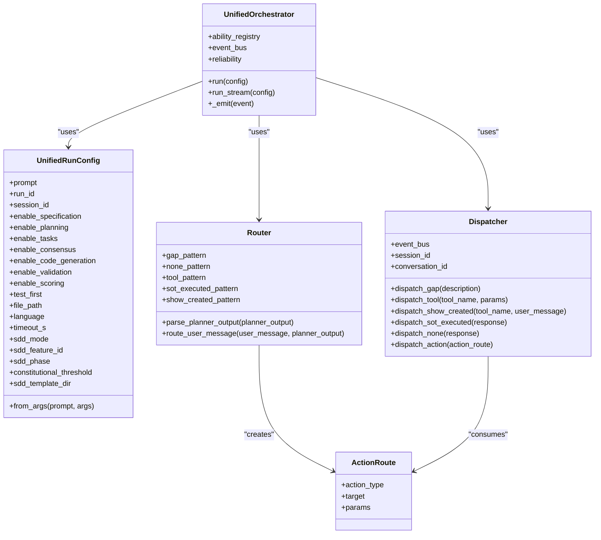
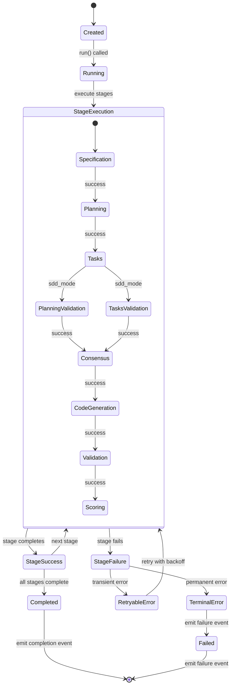

# Task Orchestration API

<cite>
**Referenced Files in This Document**   
- [unified_orchestrator.py](file://src/orchestration/unified_orchestrator.py)
- [dispatcher.py](file://src/orchestration/dispatcher.py)
- [router.py](file://src/orchestration/router.py)
- [event_schemas.py](file://src/orchestration/event_schemas.py)
- [reliability_manager.py](file://src/orchestration/reliability_manager.py)
- [observability.py](file://src/orchestration/observability.py)
- [error_taxonomy.py](file://src/orchestration/error_taxonomy.py)
- [constitutional_gate_stub.py](file://src/orchestration/constitutional_gate_stub.py)
</cite>

## Table of Contents
1. [Introduction](#introduction)
2. [Core Components](#core-components)
3. [Task State Lifecycle](#task-state-lifecycle)
4. [Event Emission System](#event-emission-system)
5. [Error Handling and Reliability](#error-handling-and-reliability)
6. [Security and Validation](#security-and-validation)
7. [Client Implementation Guidelines](#client-implementation-guidelines)
8. [Performance Optimization](#performance-optimization)
9. [Conclusion](#conclusion)

## Introduction

The Task Orchestration API provides a comprehensive framework for managing complex task workflows within the Super Alita system. This API enables the creation, execution, monitoring, and completion of tasks through a sophisticated orchestration pipeline that coordinates multiple capabilities and ensures reliable execution. The system is designed to handle various task types including computation, data processing, and capability planning through a unified interface.

The orchestration system operates on a stage-based pipeline model, where each task progresses through a series of configurable stages including specification, planning, consensus, code generation, and validation. This modular approach allows for flexible workflow configuration while maintaining consistency across different task types. The API exposes both synchronous and streaming interfaces to accommodate different client requirements, from simple task execution to real-time monitoring of complex workflows.

**Section sources**
- [unified_orchestrator.py](file://src/orchestration/unified_orchestrator.py#L1-L50)

## Core Components

The Task Orchestration API consists of several core components that work together to manage task execution. The UnifiedOrchestrator serves as the central coordinator, managing the execution pipeline and coordinating between different stages. It accepts a UnifiedRunConfig that specifies the task parameters and enabled stages, then executes the configured workflow while handling errors and emitting observability events.

The Router component parses planner output and determines the appropriate action type, routing requests to the correct handler. It supports multiple action types including GAP (capability gap identification), TOOL (tool invocation), NONE (direct response), and SOT_EXECUTED (Script-of-Thought execution). The Dispatcher executes actions based on the routing decision, publishing appropriate events to the event bus for further processing.



**Diagram sources **
- [unified_orchestrator.py](file://src/orchestration/unified_orchestrator.py#L114-L153)
- [router.py](file://src/orchestration/router.py#L32-L118)
- [dispatcher.py](file://src/orchestration/dispatcher.py#L16-L144)

**Section sources**
- [unified_orchestrator.py](file://src/orchestration/unified_orchestrator.py#L114-L153)
- [router.py](file://src/orchestration/router.py#L32-L118)
- [dispatcher.py](file://src/orchestration/dispatcher.py#L16-L144)

## Task State Lifecycle

The Task Orchestration API implements a comprehensive state lifecycle that tracks tasks from creation through completion or failure. Each task progresses through a series of stages, with the UnifiedOrchestrator managing the transition between states. The lifecycle begins with task creation, where a UnifiedRunConfig is instantiated with the task parameters and configuration.

As the task executes, it progresses through the enabled stages in sequence: specification, planning, tasks, consensus, code generation, validation, and scoring. Each stage transition is accompanied by event emission, providing real-time monitoring capabilities. The orchestrator maintains the current state of the task, including stage-specific output, duration metrics, and reliability information.

The lifecycle concludes with either successful completion or failure. In the success case, the orchestrator computes a constitutional gate score based on stage outcomes and emits a run termination event with comprehensive summary data. In the failure case, detailed error information is captured and propagated through the event system, allowing for appropriate error handling and recovery strategies.



**Diagram sources **
- [unified_orchestrator.py](file://src/orchestration/unified_orchestrator.py#L156-L639)

**Section sources**
- [unified_orchestrator.py](file://src/orchestration/unified_orchestrator.py#L156-L639)

## Event Emission System

The Task Orchestration API features a robust event emission system that provides comprehensive observability into task execution. The system emits structured events at key points in the task lifecycle, enabling real-time monitoring, analytics, and debugging. Events are published through the event bus and can be consumed by various observers and collectors.

The event system includes several categories of events: run-level events (started, completed, failed), stage-level events (started, succeeded, failed), validation events (SDD validation), and constitutional gate events. Each event contains detailed metadata including timestamps, correlation IDs, run and session identifiers, and contextual data specific to the event type.

The OrchestatorObserver component aggregates these events and provides structured logging, metrics collection, and reporting capabilities. It maintains a record of recent runs and their outcomes, enabling post-execution analysis and troubleshooting. The observer also integrates with external telemetry collectors when available, providing a unified monitoring experience across the system.

```mermaid
sequenceDiagram
    participant Orchestrator as UnifiedOrchestrator
    participant Observer as OrchestatorObserver
    participant EventBus as EventBus
    participant Collector as TelemetryCollector
    
    Orchestrator->>EventBus: emit(RunStartedEvent)
    EventBus->>Observer: notify(RunStartedEvent)
    Observer->>Observer: log_run_started()
    Observer->>Observer: _emit_log()
    Observer->>Collector: record_canonical_event()
    
    Orchestrator->>EventBus: emit(StageStartedEvent)
    EventBus->>Observer: notify(StageStartedEvent)
    Observer->>Observer: log_stage_started()
    Observer->>Observer: _emit_log()
    
    Orchestrator->>EventBus: emit(StageCompletedEvent)
    EventBus->>Observer: notify(StageCompletedEvent)
    Observer->>Observer: log_stage_succeeded()
    Observer->>Observer: _emit_metric()
    Observer->>Observer: _emit_log()
    
    Orchestrator->>EventBus: emit(RunTerminatedEvent)
    EventBus->>Observer: notify(RunTerminatedEvent)
    Observer->>Observer: log_run_completed()
    Observer