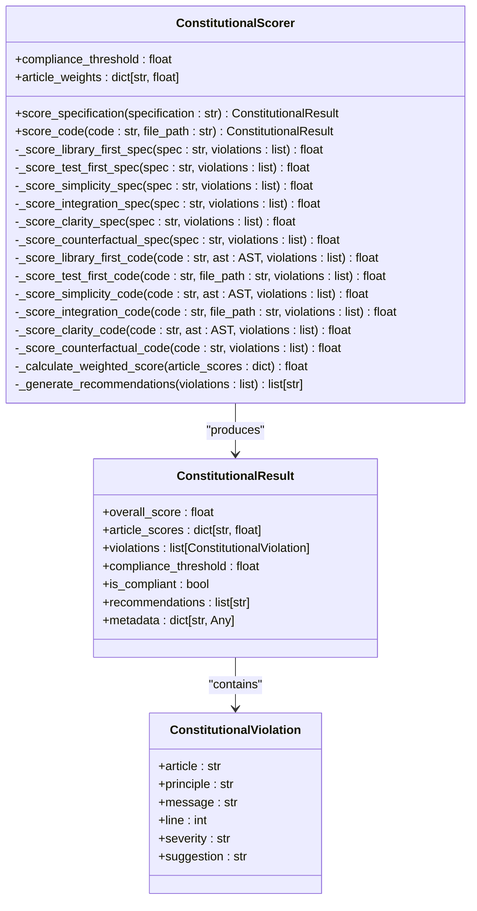
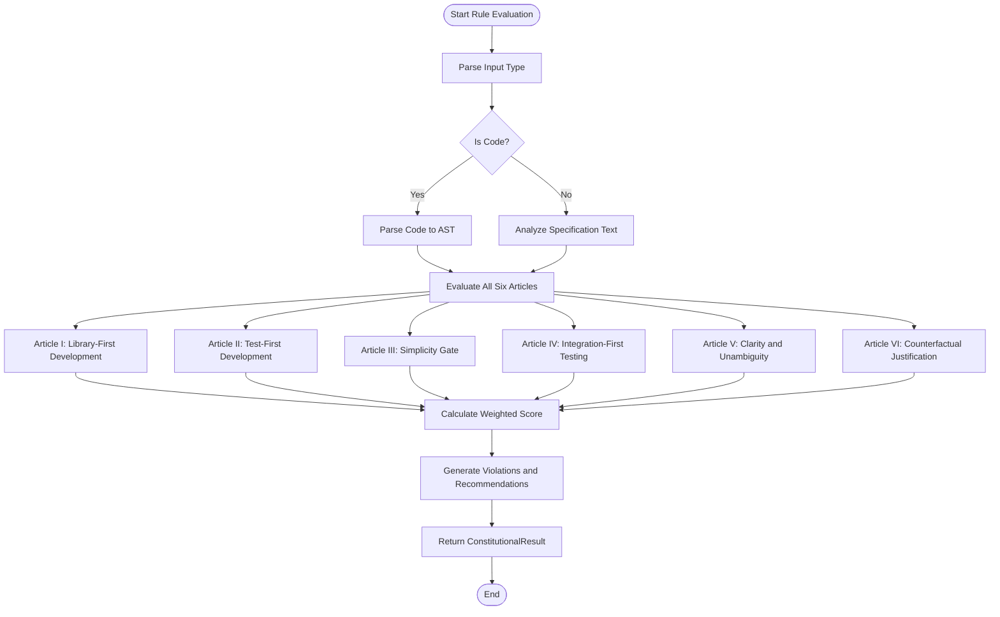
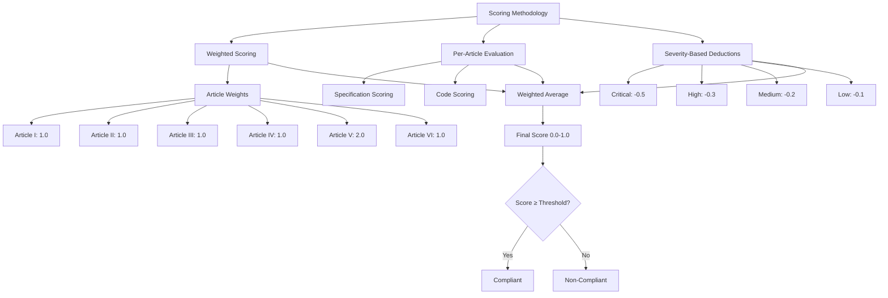
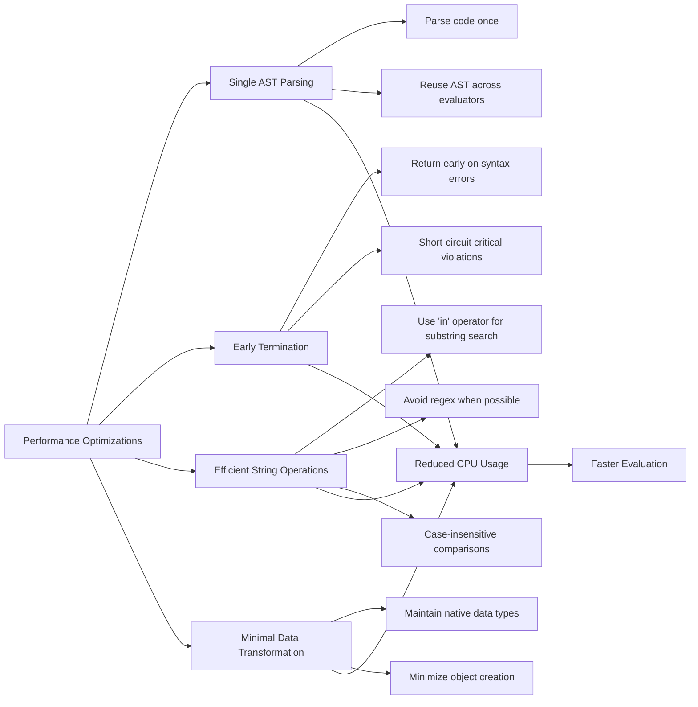
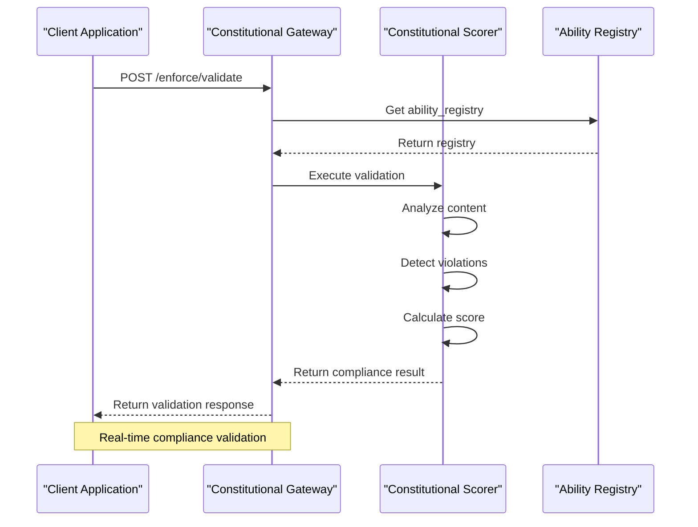
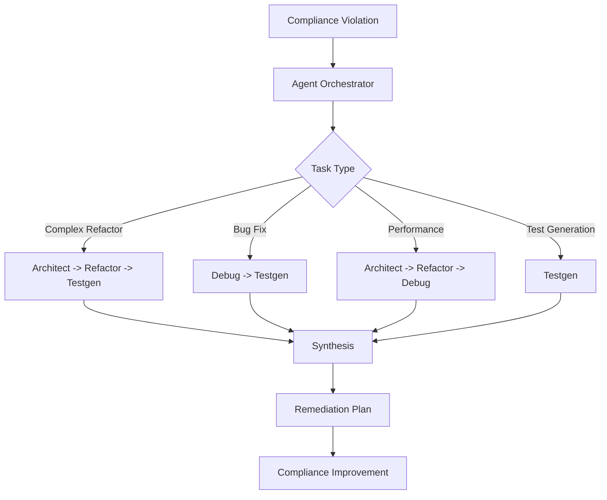

# Compliance Scoring

<cite>
**Referenced Files in This Document**   
- [scorer.py](file://src/constitutional/scorer.py)
- [constitutional_gateway.py](file://src/constitutional_gateway.py)
- [agent_orchestrator.py](file://backend/agent_orchestrator.py)
- [telemetry.py](file://cortex/telemetry.py)
- [violations.py](file://src/constitutional/violations.py)
</cite>

## Table of Contents
1. [Introduction](#introduction)
2. [Scoring Engine Architecture](#scoring-engine-architecture)
3. [Rule Evaluation Algorithms](#rule-evaluation-algorithms)
4. [Scoring Methodologies](#scoring-methodologies)
5. [Performance Optimization Techniques](#performance-optimization-techniques)
6. [Integration with Constitutional Gateway](#integration-with-constitutional-gateway)
7. [Agent Orchestrator Integration](#agent-orchestrator-integration)
8. [Telemetry System Integration](#telemetry-system-integration)
9. [Domain Model of Scoring Metrics](#domain-model-of-scoring-metrics)
10. [Common Issues and Edge Cases](#common-issues-and-edge-cases)
11. [Configuration and Interpretation](#configuration-and-interpretation)
12. [Conclusion](#conclusion)

## Introduction

The compliance scoring sub-feature implements a comprehensive constitutional compliance framework that evaluates artifacts against six core constitutional articles. This system provides a structured approach to ensure code and specifications adhere to established principles of library-first development, test-first practices, simplicity, integration testing, clarity, and counterfactual justification. The scoring engine analyzes both specifications and code, generating detailed violation reports, actionable recommendations, and compliance scores that determine whether artifacts meet organizational standards.

The implementation follows a modular design with clear separation between scoring logic, violation detection, and integration points. The system is designed to be accessible to beginners through intuitive scoring metrics while providing sufficient technical depth for experienced developers through detailed rule evaluation algorithms and extensible architecture patterns.

**Section sources**
- [scorer.py](file://src/constitutional/scorer.py#L1-L50)

## Scoring Engine Architecture

The compliance scoring system is built around the ConstitutionalScorer class, which serves as the central engine for evaluating artifacts against constitutional principles. The architecture follows a layered approach with distinct components for rule evaluation, score calculation, and result generation. The engine supports two primary evaluation modes: specification scoring and code scoring, each with specialized analysis techniques tailored to the nature of the input.

The system processes artifacts through a series of article-specific evaluators, each responsible for assessing compliance with one of the six constitutional articles. These evaluators work in concert to produce a comprehensive assessment that considers multiple dimensions of code quality and development methodology. The results are aggregated into a structured ConstitutionalResult object that contains overall scores, per-article scores, detected violations, and actionable recommendations.

**Diagram sources**
- [scorer.py](file://src/constitutional/scorer.py#L54-L801)

**Section sources**
- [scorer.py](file://src/constitutional/scorer.py#L54-L801)

## Rule Evaluation Algorithms

The compliance scoring engine employs specialized rule evaluation algorithms for each constitutional article, with distinct approaches for specifications and code. For specification analysis, the system uses text pattern matching to identify key indicators related to each article's principles. The algorithms scan for specific keywords and phrases that signal compliance or violation of constitutional requirements.

For code analysis, the system leverages Python's Abstract Syntax Tree (AST) to perform structural analysis of the source code. This allows for deeper inspection of code patterns, function complexity, and architectural decisions. The AST-based analysis enables the detection of issues such as excessive function length, deep nesting levels, and missing documentation that would be difficult to identify through simple text analysis.

The rule evaluation process follows a consistent pattern across all articles: initialize a base score, apply deductions based on detected violations, and return the final score. Each article-specific evaluator maintains its own set of indicators and thresholds, allowing for tailored assessment criteria that reflect the unique requirements of each constitutional principle.

**Diagram sources**
- [scorer.py](file://src/constitutional/scorer.py#L90-L148)
- [scorer.py](file://src/constitutional/scorer.py#L150-L231)

**Section sources**
- [scorer.py](file://src/constitutional/scorer.py#L90-L801)

## Scoring Methodologies

The compliance scoring system employs a weighted scoring methodology that assigns different importance levels to each constitutional article. Article V (Clarity and Unambiguity) carries twice the weight of other articles, reflecting its critical importance in maintaining code quality and understandability. The overall score is calculated as a weighted average of individual article scores, normalized to produce a final score between 0.0 and 1.0.

Each article is scored on a scale from 0.0 to 1.0, with deductions applied for detected violations. The scoring methodology varies by article and input type (specification vs. code). For example, Article I evaluation for code examines import statements and custom implementations of common functionality, while the same article's evaluation for specifications looks for mentions of existing libraries and justification for custom implementations.

The system uses different thresholds and deduction amounts based on violation severity. Critical violations result in larger score deductions than low-severity issues, creating a graduated response that reflects the relative importance of different compliance aspects. The final compliance determination is based on whether the overall score meets or exceeds the configurable compliance threshold, which defaults to 0.75.

**Diagram sources**
- [scorer.py](file://src/constitutional/scorer.py#L81-L88)
- [scorer.py](file://src/constitutional/scorer.py#L758-L765)

**Section sources**
- [scorer.py](file://src/constitutional/scorer.py#L758-L765)

## Performance Optimization Techniques

The compliance scoring engine incorporates several performance optimization techniques to ensure efficient evaluation of artifacts. For code analysis, the system parses the source code into an Abstract Syntax Tree (AST) once and reuses this structure across multiple article evaluations, avoiding redundant parsing operations. This approach significantly reduces computational overhead, especially for larger code files.

The rule evaluation algorithms are designed with early termination conditions where appropriate. For example, when evaluating code for syntax errors, the system returns immediately upon detecting a syntax issue, as this constitutes a critical violation that renders further analysis unnecessary. This short-circuit evaluation prevents wasted computation on artifacts that already fail basic compliance requirements.

The text analysis components use efficient string operations and pre-compiled patterns where possible. The system minimizes expensive operations like regular expressions in favor of simple substring searches and case-insensitive comparisons. Additionally, the scoring engine avoids unnecessary data transformations and maintains data in its native format throughout the evaluation process.

**Diagram sources**
- [scorer.py](file://src/constitutional/scorer.py#L150-L231)
- [scorer.py](file://src/constitutional/scorer.py#L744-L756)

**Section sources**
- [scorer.py](file://src/constitutional/scorer.py#L150-L231)

## Integration with Constitutional Gateway

The compliance scoring engine integrates with the constitutional gateway through a well-defined interface that exposes scoring capabilities via HTTP endpoints. The constitutional_gateway.py file contains the FastAPI router that provides endpoints for validating content against constitutional principles. This integration allows external systems, such as IDE extensions and Copilot augmentation tools, to access compliance scoring functionality directly.

The gateway's validation endpoint accepts content as input and returns a comprehensive compliance report including status, score, violations, and recommendations. This endpoint orchestrates the interaction between the ability registry and the scoring engine, ensuring that all necessary context and dependencies are properly managed. The integration follows a microservices architecture pattern, with clear separation between the API interface and the underlying scoring logic.

The constitutional gateway also provides health and capabilities endpoints that allow clients to discover available features and verify service availability. This service discovery mechanism enables dynamic integration and fault tolerance, as clients can detect when the scoring service is unavailable and adapt their behavior accordingly.

**Diagram sources**
- [constitutional_gateway.py](file://src/constitutional_gateway.py#L480-L560)
- [scorer.py](file://src/constitutional/scorer.py#L54-L801)

**Section sources**
- [constitutional_gateway.py](file://src/constitutional_gateway.py#L480-L560)

## Agent Orchestrator Integration

The compliance scoring system integrates with the agent orchestrator to enable multi-agent collaboration in addressing compliance issues. The agent_orchestrator.py file defines a lightweight orchestrator that coordinates specialized agents (architect, refactor, testgen, debug) to handle different types of tasks. When compliance violations are detected, the system can trigger appropriate agent workflows to generate remediation suggestions.

The integration follows a classification-based routing pattern, where the orchestrator analyzes the nature of compliance issues and routes them to the most appropriate agent or agent chain. For example, complex refactoring needs might trigger the architect-refactor-testgen chain, while bug fixes would engage the debug-testgen chain. This intelligent routing ensures that compliance issues are addressed by agents with the most relevant expertise.

The orchestrator communicates with agents through a simple message-passing interface, allowing for flexible composition of agent workflows. Each agent processes the request and returns its contribution, which is then synthesized into a comprehensive response. This distributed approach enables parallel processing of compliance remediation tasks and leverages specialized knowledge from different agent types.

**Diagram sources**
- [agent_orchestrator.py](file://backend/agent_orchestrator.py#L1-L135)
- [scorer.py](file://src/constitutional/scorer.py#L54-L801)

**Section sources**
- [agent_orchestrator.py](file://backend/agent_orchestrator.py#L1-L135)

## Telemetry System Integration

The compliance scoring engine integrates with the telemetry system to provide monitoring and analytics capabilities. The telemetry.py module in the cortex package implements a lightweight telemetry emit hook that supports both HTTP POST and file-based JSONL output. This integration allows compliance scores, violation data, and performance metrics to be collected and analyzed over time.

The telemetry system follows a best-effort delivery model, ensuring that telemetry collection does not impact the