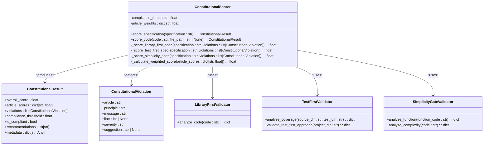

# Constitutional Articles

<cite>
**Referenced Files in This Document**   
- [constitution.md](file://memory/constitution.md)
- [articles.py](file://src/constitutional/articles.py)
- [scorer.py](file://src/constitutional/scorer.py)
- [violations.py](file://src/constitutional/violations.py)
- [constitutional_sdd_framework.md](file://memory/sdd/constitutional_sdd_framework.md)
- [constitution_manager.py](file://scripts/constitution_manager.py)
</cite>

## Table of Contents
1. [Introduction](#introduction)
2. [Constitutional Articles Structure](#constitutional-articles-structure)
3. [Domain Model of Constitutional Articles](#domain-model-of-constitutional-articles)
4. [Implementation Details](#implementation-details)
5. [Relationship with Other Components](#relationship-with-other-components)
6. [Rule Definition and Parsing](#rule-definition-and-parsing)
7. [Common Issues and Considerations](#common-issues-and-considerations)
8. [Conclusion](#conclusion)

## Introduction

The Constitutional Articles system forms the foundational governance framework for the Super-Alita ecosystem, establishing immutable architectural principles that guide all development activities. This comprehensive system enforces quality, consistency, and maintainability across the entire development lifecycle through a structured set of six constitutional articles. The framework operates as a quality gate mechanism that evaluates all artifacts—specifications, code, and implementation plans—against these core principles before they can progress through the development pipeline.

The constitutional framework is deeply integrated with the Specification-Driven Development (SDD) methodology, creating a robust system where specifications serve as the single source of truth and code becomes a generated expression of these specifications. This approach ensures that all development activities align with the established architectural principles from the earliest stages of the development process. The system employs automated scoring mechanisms to evaluate compliance, providing immediate feedback and recommendations for improvement when violations are detected.

This documentation provides a comprehensive analysis of the constitutional articles system, detailing its structure, implementation, and integration with other components of the Super-Alita ecosystem. It explains how rules are defined, structured, and stored, and demonstrates the practical application of these principles through concrete examples from the codebase. The document also addresses common challenges such as rule conflicts, versioning, and performance considerations when handling large rule sets.

**Section sources**
- [constitution.md](file://memory/constitution.md#L1-L212)
- [constitutional_sdd_framework.md](file://memory/sdd/constitutional_sdd_framework.md#L1-L309)

## Constitutional Articles Structure

The constitutional framework consists of six core articles that establish fundamental development principles for the Super-Alita ecosystem. Each article addresses a specific aspect of software development quality and maintainability, creating a comprehensive governance system that ensures consistency across all projects. The articles are hierarchically organized with clear rationales, implementation requirements, and compliance checks that provide actionable guidance for developers.

Article I: Library-First Principle establishes that every feature must be designed as a standalone, reusable library. This principle promotes modularity, reduces coupling between components, and enables independent testing and deployment. The implementation requires each feature to expose a clean, well-defined API and be importable as a standalone module without dependencies on application-specific concerns.

Article II: CLI Interface Mandate requires that every library must be observable and testable via a text-in, text-out command-line interface. This ensures that all features are independently executable and provides clear interface boundaries that facilitate automated testing, debugging, and development. The CLI must accept text input and produce text output, with all library functions accessible through command-line operations.

Article III: Test-First Imperative mandates that tests must be defined before implementation code, following the Red Phase of Test-Driven Development (TDD). This principle ensures that code meets specified requirements, prevents scope creep, and provides clear success criteria for feature completion. The implementation requires comprehensive test coverage (≥80%) and verification that tests initially fail before implementation begins.

Article IV: Documentation-First Development requires that all features begin with comprehensive documentation serving as the single source of truth. This includes complete feature specifications, API documentation, user documentation, and automatically tested documentation to ensure accuracy throughout the development lifecycle.

Article V: Integration-First Testing stipulates that tests must be defined against realistic environments using real databases and actual services rather than mocks. This validates real-world behavior, catches integration issues early, and provides confidence in deployment by covering end-to-end scenarios with actual system components.

Article VI: Continuous Validation requires that all artifacts (code, documentation, tests) be continuously validated for consistency and correctness. This includes automated checks for specification compliance, continuous integration validation of all changes, and explicit documentation of breaking changes to maintain system integrity over time.

**Section sources**
- [constitution.md](file://memory/constitution.md#L1-L212)

## Domain Model of Constitutional Articles

The domain model of the constitutional articles system is implemented through a comprehensive set of Python classes that represent the core entities and their relationships. The model centers around three primary components: ConstitutionalViolation, ConstitutionalResult, and ConstitutionalScorer, which work together to evaluate compliance with the six constitutional articles.

The ConstitutionalViolation class represents individual violations of constitutional principles and contains attributes such as article (identifying which constitutional article was violated), principle (a brief description of the violated principle), message (detailed violation description), line (line number if applicable), severity (categorized as "low", "medium", "high", or "critical"), and suggestion (recommended fix). This class serves as the fundamental unit of non-compliance detection, providing structured information about each violation that can be used for reporting and remediation.

The ConstitutionalResult class encapsulates the outcome of a constitutional compliance evaluation, containing the overall_score (a normalized score from 0.0 to 1.0), article_scores (a dictionary of scores for each individual article), violations (a list of ConstitutionalViolation objects), compliance_threshold (the minimum score required for compliance, defaulting to 0.75), is_compliant (a boolean indicating whether the overall score meets the threshold), recommendations (a list of suggested improvements), and metadata (additional contextual information about the evaluation). This class provides a comprehensive summary of the compliance assessment, enabling both automated decision-making and human review.

The ConstitutionalScorer class serves as the main scoring engine, implementing methods to evaluate both specifications and code against all six constitutional articles. It maintains article_weights that determine the relative importance of each article in the overall score calculation, with Article V (Clarity and Unambiguity) assigned twice the weight of other articles, reflecting its critical importance in the framework. The scorer employs specialized methods for each article, such as _score_library_first_spec for evaluating library-first compliance in specifications and _score_simplicity_code for assessing code simplicity.

The domain model also includes validator classes for each constitutional article, such as LibraryFirstValidator, TestFirstValidator, and SimplicityGateValidator, which implement focused logic for evaluating compliance with individual principles. These validators work in conjunction with the ConstitutionalScorer to provide granular analysis of compliance across different aspects of the development process.

**Diagram sources **
- [scorer.py](file://src/constitutional/scorer.py#L21-L54)
- [articles.py](file://src/constitutional/articles.py#L8-L87)

**Section sources**
- [scorer.py](file://src/constitutional/scorer.py#L21-L54)
- [articles.py](file://src/constitutional/articles.py#L8-L87)

## Implementation Details

The implementation of the constitutional articles system is centered around the ConstitutionalScorer class, which serves as the primary engine for evaluating compliance across all artifacts in the development pipeline. The scorer employs a weighted scoring system where each of the six constitutional articles contributes to an overall compliance score, with Article V (Clarity and Unambiguity) assigned twice the weight of other articles, reflecting its critical importance in ensuring maintainable and understandable code.

The scoring process begins with the score_specification method, which analyzes text-based specifications against all six constitutional articles. For Article I (Library-First Development), the system checks for mentions of existing libraries, frameworks, and packages, penalizing specifications that lack references to existing solutions or propose custom implementations without justification. The _score_library_first_spec method uses a list of library indicators such as "existing", "library", "framework", and "import" to detect evidence of library research, deducting points when these indicators are absent.

For Article II (Test-First Development), the system evaluates specifications for test-related content using indicators like "test", "testing", "coverage", "pytest", and "unittest". The _score_test_first_spec method penalizes specifications that lack testing requirements or fail to specify minimum coverage targets (80% is the standard requirement). This ensures that testing considerations are addressed from the earliest stages of development.

Article III (Simplicity Gate) is evaluated by checking for complexity indicators such as "complex", "complicated", "advanced", and "enterprise", while also looking for simplicity indicators like "simple", "clear", and "straightforward". The _score_simplicity_spec method penalizes specifications that suggest overly complex implementations or fail to emphasize simplicity in the approach.

The implementation also includes code-level analysis through the score_code method, which parses source code using Python's Abstract Syntax Tree (AST) module to perform structural analysis. For Article I compliance in code, the system counts imports and checks for custom implementations of common functionality (such as JSON parsing or HTTP requests) that should instead use established libraries. The _score_library_first_code method specifically looks for function names containing patterns like "json_parse", "http_request", "hash_", and "encrypt" as indicators of potentially unnecessary custom implementations.

For Article III (Simplicity Gate) in code, the system checks function length (with a maximum of 50 lines recommended) and nesting depth (with a maximum of 4 levels recommended). The _calculate_max_nesting method recursively traverses the AST to determine the maximum nesting depth of control structures, penalizing code that exceeds the recommended complexity thresholds.

Article V (Clarity and Unambiguity) is evaluated by checking for docstrings on functions and the presence of placeholder comments like "TODO" or "FIXME". The _score_clarity_code method penalizes code that lacks documentation or contains numerous placeholder comments, encouraging developers to provide clear explanations and complete implementations.

The system also implements a _generate_recommendations method that transforms detected violations into actionable recommendations, grouping them by article and prioritizing the most critical issues. This provides developers with clear guidance on how to improve constitutional compliance, making the feedback loop more effective and actionable.

**Section sources**
- [scorer.py](file://src/constitutional/scorer.py#L54-L801)
- [articles.py](file://src/constitutional/articles.py#L8-L87)

## Relationship with Other Components

The constitutional articles system is deeply integrated with several key components of the Super-Alita ecosystem, creating a cohesive governance framework that spans the entire development lifecycle. The most significant integration is with the SDD (Specification-Driven Development) framework, where constitutional principles are applied at each phase of the development process—specification, planning, and task breakdown. This integration ensures that constitutional compliance is evaluated continuously, with quality gates at each phase transition preventing non-compliant artifacts from progressing.

The scoring engine is also tightly coupled with the agent decision policies, where constitutional compliance scores influence the prioritization and approval of development tasks. High-scoring specifications and plans are given priority in the agent's decision-making process, while low-scoring artifacts trigger remediation workflows and may be blocked from implementation until compliance issues are addressed. This creates a feedback loop where agents are incentivized to produce constitutionally compliant work to advance their objectives.

The system integrates with the Mangle reasoning engine, which uses deductive reasoning to validate specifications and plans against constitutional principles. Mangle performs fact-based validation of artifacts, automatically detecting constitutional violations and providing evidence-based recommendations for improvement. This integration enhances the accuracy and consistency of constitutional evaluations by applying formal reasoning to the assessment process.

The constitutional framework also connects with the REUG (Recursive Evaluation and Understanding Generator) operational cycle, where constitutional validation occurs at each decision point. This ensures that constitutional compliance is continuously monitored and enforced throughout the development process, with real-time scoring and recommendation updates integrated into the development workflow and CI/CD pipelines.

The violation response system is integrated with the enhanced consensus algorithms, which evaluate multiple perspectives on specification quality and constitutional compliance. When violations are detected, the system can initiate consensus processes to validate the findings and approve remediation strategies, ensuring that constitutional enforcement is transparent and collaborative.

Additionally, the constitutional scoring system is integrated with development tools and IDE extensions, providing real-time feedback to developers as they write code and specifications. This immediate feedback loop helps developers correct issues early in the development process, reducing the cost and effort required for remediation.

**Section sources**
- [constitutional_sdd_framework.md](file://memory/sdd/constitutional_sdd_framework.md#L1-L309)
- [scorer.py](file://src/constitutional/scorer.py#L54-L801)

## Rule Definition and Parsing

Constitutional rules are defined in the constitution.md file, which serves as the authoritative source of truth for all development principles in the Super-Alita ecosystem. The file is structured as a Markdown document with a hierarchical organization that includes a preamble, six main articles, an amendment process, and enforcement mechanisms. Each article contains a rationale section explaining the principle, implementation requirements detailing how the principle should be applied, and compliance checks that provide specific criteria for evaluating adherence.

The parsing and loading of constitutional rules is handled by the ConstitutionalScorer class, which extracts the principles from the constitution.md file and converts them into executable validation logic. When a specification or code artifact needs to be evaluated, the system reads the constitution.md file and uses the defined principles to guide the analysis. For example, the requirement in Article I to "design every feature as a standalone, reusable library" is translated into validation logic that checks for proper API design, modularity, and independence from application-specific concerns.

The constitution_manager.py script provides functionality for creating and validating project constitutions, using AI-powered generation to create comprehensive constitutions based on provided principles. The create_constitution method uses a Jinja2 template to render the constitution content, incorporating AI-generated content that expands on the core principles with specific, actionable guidance for the project context.

The system also supports constitutional validation through the validate_constitution method, which analyzes feature context against the project constitution using AI-powered analysis. This method generates a ConstitutionResult object containing detailed feedback on compliance issues, risk areas, required changes, and quality concerns, providing specific, actionable recommendations for improvement.

The parsing process is designed to be flexible and extensible, allowing for the addition of new constitutional articles or modifications to existing ones through the formal amendment process. This process requires consensus among all active contributors, full documentation with rationale, backward compatibility with existing compliant features, and impact assessment across all features, ensuring that changes to the constitutional framework are carefully considered and thoroughly validated.

**Section sources**
- [constitution.md](file://memory/constitution.md#L1-L212)
- [constitution_manager.py](file://scripts/constitution_manager.py#L1-L147)

## Common Issues and Considerations

Several common issues arise when implementing and maintaining the constitutional articles system, particularly around rule conflicts, versioning, and performance considerations. Rule conflicts can occur when different constitutional articles appear to contradict each other or when specific project requirements seem to violate constitutional principles. The system addresses this through the violation response protocol, which prioritizes violations by severity and provides a structured approach to resolution. Critical violations (such as syntax errors or complete lack of testing) take precedence over medium or low-severity issues, ensuring that the most critical quality concerns are addressed first.

Versioning of