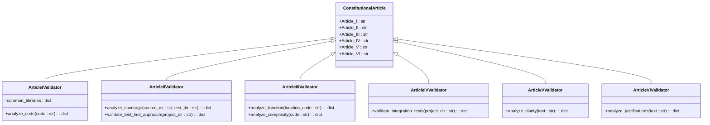
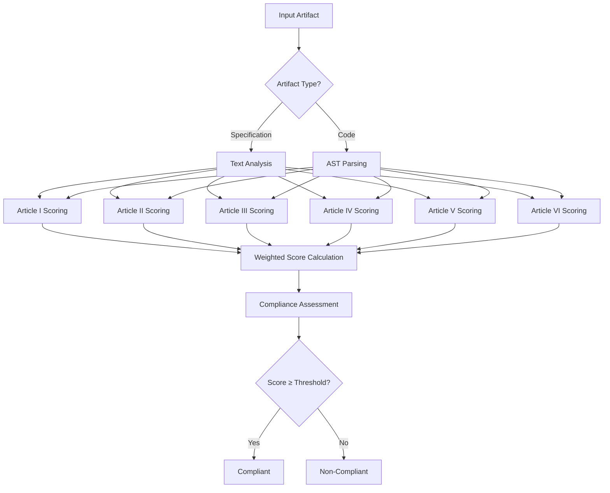
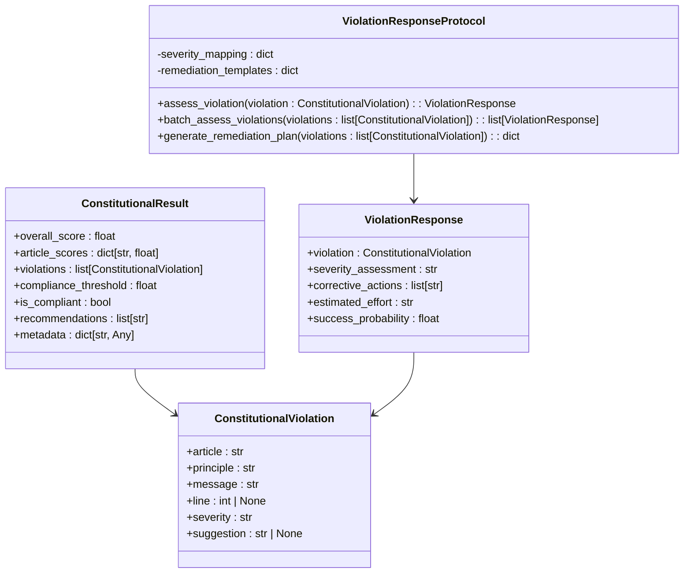

# Constitutional Governance

<cite>
**Referenced Files in This Document**   
- [scorer.py](file://src/constitutional/scorer.py)
- [articles.py](file://src/constitutional/articles.py)
- [scorecard.py](file://src/constitutional/scorecard.py)
- [violations.py](file://src/constitutional/violations.py)
- [constitution.md](file://memory/constitution.md)
- [constitutional_sdd_framework.md](file://memory/sdd/constitutional_sdd_framework.md)
- [test_constitutional_scorer.py](file://tests/test_constitutional_scorer.py)
</cite>

## Table of Contents
1. [Introduction](#introduction)
2. [Constitutional Articles](#constitutional-articles)
3. [Scoring System Architecture](#scoring-system-architecture)
4. [Rule Evaluation and Violation Detection](#rule-evaluation-and-violation-detection)
5. [Compliance Reporting](#compliance-reporting)
6. [Integration with Other Components](#integration-with-other-components)
7. [Creating Effective Constitutional Rules](#creating-effective-constitutional-rules)
8. [Common Issues and Solutions](#common-issues-and-solutions)
9. [Conclusion](#conclusion)

## Introduction

Constitutional governance establishes a rule-based validation system that ensures AI behavior aligns with predefined principles and architectural standards. This framework serves as the foundation for Specification-Driven Development (SDD), providing a structured approach to evaluate and enforce compliance across all development artifacts. The constitutional system operates through a scoring engine that evaluates specifications, code, and other artifacts against six core articles, each representing a fundamental principle of software development excellence.

The primary purpose of constitutional governance is to maintain consistency, quality, and reliability throughout the development lifecycle. By establishing clear, measurable standards, the system enables automated validation of artifacts before they progress to subsequent stages. This proactive approach prevents the propagation of non-compliant implementations and ensures that all components adhere to the established architectural vision.

**Section sources**
- [constitution.md](file://memory/constitution.md#L1-L212)

## Constitutional Articles

The constitutional framework is built upon six core articles that define the fundamental principles governing development practices:

**Article I: Library-First Development** mandates that solutions leverage existing libraries and frameworks before considering custom implementations. This principle promotes reusability, reduces technical debt, and ensures that development efforts focus on business value rather than reinventing established solutions.

**Article II: Test-First Development** requires that comprehensive test suites be defined before implementation begins. This approach ensures that requirements are clearly specified, provides immediate feedback on implementation correctness, and establishes a safety net for future modifications.

**Article III: Simplicity Gate** enforces minimal complexity in both specifications and implementations. This article prohibits over-engineering and future-proofing, requiring justification for any complexity beyond a minimal project structure.

**Article IV: Integration-First Testing** prioritizes testing against realistic environments with actual services and databases over isolated unit tests with mocks. This ensures that components behave correctly in production-like conditions and validates end-to-end workflows.

**Article V: Clarity and Unambiguity** demands precise, unambiguous language in specifications and code. This article prohibits vague terms and requires clear structure, acceptance criteria, and comprehensive documentation to eliminate interpretation errors.

**Article VI: Counterfactual Justification** requires documentation of decision rationale, including analysis of alternative approaches and justification for chosen solutions. This creates an audit trail of architectural decisions and prevents arbitrary technology choices.

These articles form an interdependent system where each principle reinforces the others, creating a comprehensive framework for high-quality software development.

**Diagram sources**
- [articles.py](file://src/constitutional/articles.py#L1-L143)
- [constitution.md](file://memory/constitution.md#L1-L212)

## Scoring System Architecture

The constitutional scoring system implements a comprehensive evaluation engine that assesses artifacts against all six constitutional articles. The architecture consists of a central `ConstitutionalScorer` class that coordinates the evaluation process and aggregates results from specialized scoring methods for each article.

The scoring engine accepts two primary input types: specifications (textual requirements) and code (source code). For specifications, the system analyzes the text content for compliance indicators, while for code, it performs static analysis using Abstract Syntax Tree (AST) parsing to evaluate structural properties.

Each article is evaluated independently, producing a score between 0.0 and 1.0 based on the presence or absence of compliance indicators and the severity of any violations detected. The scores are then combined using a weighted averaging system, with Article V (Clarity and Unambiguity) assigned twice the weight of other articles due to its foundational importance in preventing misinterpretation.

The system maintains a configurable compliance threshold, defaulting to 0.75, which determines whether an artifact is considered constitutionally compliant. Artifacts scoring below this threshold are rejected or require remediation before proceeding to subsequent development stages.

**Diagram sources**
- [scorer.py](file://src/constitutional/scorer.py#L54-L801)
- [scorecard.py](file://src/constitutional/scorecard.py#L1-L283)

## Rule Evaluation and Violation Detection

The rule evaluation process systematically analyzes artifacts against each constitutional article, detecting violations and quantifying their impact on overall compliance. For each article, the system employs specialized detection logic that identifies specific patterns indicative of non-compliance.

When evaluating specifications, the system scans for keywords and phrases associated with each article. For example, Article I compliance is assessed by checking for mentions of existing libraries, frameworks, or integration patterns, while violations are detected when specifications suggest building from scratch without justification.

For code evaluation, the system uses AST parsing to analyze structural properties. Article III violations are detected by measuring function length and nesting depth, with functions exceeding 50 lines or nesting deeper than four levels triggering violations. Article I violations are identified when code contains custom implementations of functionality available in standard libraries, such as JSON parsing or HTTP requests.

Each violation is documented with detailed metadata including the affected article, severity level (low, medium, high, critical), specific location (line number for code), and suggested remediation. The severity is determined by the potential impact on system quality, with critical violations including syntax errors or complete absence of testing.

The evaluation process is designed to be deterministic and repeatable, ensuring consistent results across multiple assessments of the same artifact. This consistency enables reliable tracking of compliance trends over time and provides a stable foundation for automated quality gates.

**Section sources**
- [scorer.py](file://src/constitutional/scorer.py#L54-L801)
- [test_constitutional_scorer.py](file://tests/test_constitutional_scorer.py#L0-L33)

## Compliance Reporting

The constitutional scoring system generates comprehensive compliance reports that provide detailed insights into an artifact's adherence to constitutional principles. The primary output is a `ConstitutionalResult` object containing the overall compliance score, individual article scores, detected violations, and actionable recommendations.

The overall score is a weighted average of the six article scores, with Article V (Clarity) carrying double weight in the calculation. This reflects the foundational importance of clear, unambiguous specifications in preventing downstream issues. The report includes a boolean `is_compliant` flag that indicates whether the overall score meets or exceeds the configured threshold (default: 0.75).

For each detected violation, the report provides detailed information including:
- The specific constitutional article violated
- A brief description of the violated principle
- A detailed message explaining the issue
- The line number (for code violations)
- Severity level (low, medium, high, critical)
- Suggested remediation steps

The system also generates actionable recommendations by grouping violations by article and prioritizing remediation efforts. Critical and high-severity violations are addressed first, with specific suggestions for resolution. The recommendations are designed to be practical and implementable, guiding developers toward constitutional compliance.

Metadata included in the report provides context about the evaluation, including the scorer version, evaluation type (specification or code), file path (for code), line count, and total violations detected. This information supports auditability and enables trend analysis across multiple evaluations.

**Diagram sources**
- [scorer.py](file://src/constitutional/scorer.py#L21-L51)
- [violations.py](file://src/constitutional/violations.py#L1-L195)

## Integration with Other Components

The constitutional governance system integrates seamlessly with other components of the development ecosystem, particularly the decision engine, agent orchestrator, and SDD framework. This integration ensures that constitutional compliance is enforced throughout the entire development lifecycle.

Within the SDD framework, constitutional validation serves as a quality gate at each phase of the workflow (specification, planning, task breakdown). The orchestrator invokes the constitutional scorer to validate outputs from each phase, preventing non-compliant artifacts from progressing to subsequent stages. This creates a pipeline of validated artifacts that maintain constitutional integrity from requirements to implementation.

The agent orchestrator leverages constitutional scoring to guide agent behavior and decision-making. When agents generate specifications, code, or other artifacts, these outputs are automatically evaluated against the constitutional framework. Agents receive feedback on violations and can iteratively improve their outputs until they meet the compliance threshold.

The decision engine incorporates constitutional compliance as a key factor in its evaluation criteria. When multiple implementation approaches are possible, the decision engine prioritizes options that demonstrate higher constitutional compliance, particularly in areas like library usage, test coverage, and simplicity.

Integration with the Mangle reasoner enables advanced validation capabilities, combining constitutional scoring with formal logic analysis to detect subtle violations that might be missed by pattern-based detection alone. This multi-layered validation approach provides comprehensive coverage of both explicit and implicit constitutional requirements.

**Section sources**
- [constitutional_sdd_framework.md](file://memory/sdd/constitutional_sdd_framework.md#L1-L100)
- [scorer.py](file://src/constitutional/scorer.py#L54-L801)

## Creating Effective Constitutional Rules

Creating effective constitutional rules requires balancing specificity with flexibility to ensure they are both enforceable and adaptable to different contexts. The most effective rules are those that can be objectively measured and consistently applied across diverse artifacts.

When defining rules for Article I (Library-First Development), focus on detectable patterns such as the presence of import statements, references to established frameworks, or justification for custom implementations.