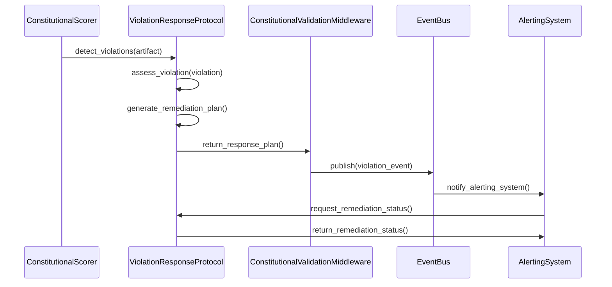
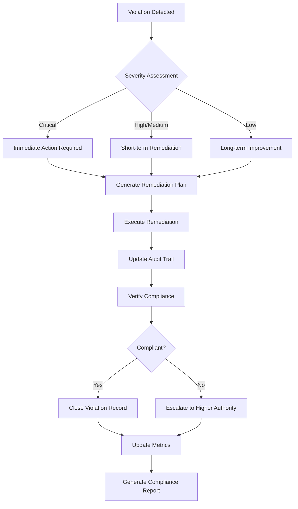
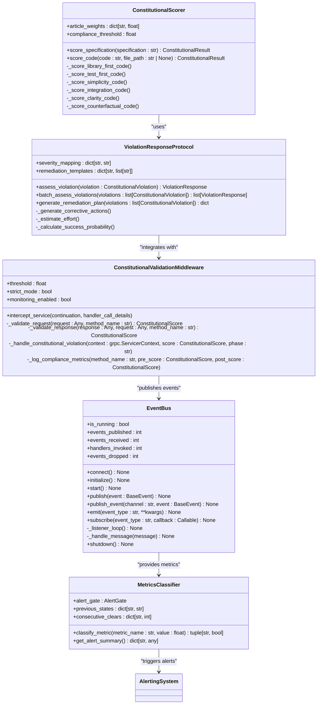

# Violation Handling

<cite>
**Referenced Files in This Document**   
- [violations.py](file://src/constitutional/violations.py)
- [scorer.py](file://src/constitutional/scorer.py)
- [constitutional_middleware.py](file://tmp_generated_service/constitutional_middleware.py)
- [decision_engine.py](file://src/core/decision_engine.py)
- [event_bus.py](file://src/core/event_bus.py)
</cite>

## Table of Contents
1. [Introduction](#introduction)
2. [Violation Detection and Scoring](#violation-detection-and-scoring)
3. [Violation Response System](#violation-response-system)
4. [Domain Model of Violation Records](#domain-model-of-violation-records)
5. [Remediation Workflows and Audit Trails](#remediation-workflows-and-audit-trails)
6. [Integration with Decision Engine and Event Bus](#integration-with-decision-engine-and-event-bus)
7. [Handling Different Violation Levels](#handling-different-violation-levels)
8. [Common Issues and Performance Considerations](#common-issues-and-performance-considerations)
9. [Configuration and External Integration](#configuration-and-external-integration)
10. [Conclusion](#conclusion)

## Introduction
The violation handling system in Super Alita is a comprehensive framework designed to ensure constitutional compliance across all system operations. This system detects, assesses, and responds to violations of constitutional principles through automated analysis and suggested remediation. The framework is built around six core constitutional articles: Library-First Development, Test-First Development, Simplicity Gate, Integration-First Testing, Clarity and Unambiguity, and Counterfactual Justification. The system integrates with the decision engine, event bus, and alerting systems to provide a robust compliance framework that prevents alert storms through anti-thrash protection mechanisms.

## Violation Detection and Scoring
The violation detection system is implemented through the ConstitutionalScorer class, which evaluates artifacts against all six constitutional articles with weighted scoring. The scoring engine analyzes both specification documents and source code, identifying violations based on predefined criteria for each constitutional article. For code analysis, the system uses Abstract Syntax Tree (AST) parsing to examine structural elements such as function length, nesting depth, import statements, and docstring presence. The scorer assigns severity levels (low, medium, high, critical) to violations based on their impact on constitutional compliance. The system calculates a weighted overall score with Article V (Clarity and Unambiguity) receiving double weight, reflecting its importance in the constitutional framework. Violations are logged with detailed descriptions, line numbers when applicable, and suggested fixes to guide remediation efforts.

**Section sources**
- [scorer.py](file://src/constitutional/scorer.py#L21-L803)

## Violation Response System
The violation response system is managed by the ViolationResponseProtocol class, which assesses detected violations and generates appropriate response protocols. When a violation is detected, the system evaluates its severity and generates corrective actions based on predefined remediation templates for each constitutional article. The response protocol includes severity assessment, corrective actions, estimated effort, and success probability calculations. For example, violations of Article I (Library-First) trigger actions like researching existing libraries and adding import statements, while Article II (Test-First) violations prompt the creation of comprehensive test suites. The system prioritizes responses by sorting violations based on severity and success probability, ensuring critical issues are addressed first. The response system also implements anti-thrash protection through hysteresis and debouncing mechanisms to prevent alert storms and ensure stable system operation.

**Diagram sources**
- [violations.py](file://src/constitutional/violations.py#L22-L193)
- [scorer.py](file://src/constitutional/scorer.py#L21-L803)
- [constitutional_middleware.py](file://tmp_generated_service/constitutional_middleware.py#L74-L491)
- [event_bus.py](file://src/core/event_bus.py#L0-L614)

## Domain Model of Violation Records
The domain model for violation records is centered around the ConstitutionalViolation class, which represents a violation of constitutional principles. Each violation record contains the following attributes: article (specifying which constitutional article was violated), principle (brief description of the violated principle), message (detailed violation description), line (line number if applicable), severity (categorized as low, medium, high, or critical), and suggestion (recommended fix). The ViolationResponse class extends this model by adding severity assessment, corrective actions, estimated effort, and success probability. The system maintains a comprehensive record of all violations, including metadata such as file path, line count, and evaluation type. This domain model enables detailed tracking and analysis of constitutional compliance issues across the codebase, supporting both immediate remediation and long-term quality improvement initiatives.

**Section sources**
- [violations.py](file://src/constitutional/violations.py#L12-L19)
- [scorer.py](file://src/constitutional/scorer.py#L21-L29)

## Remediation Workflows and Audit Trails
The remediation workflow is orchestrated through the generate_remediation_plan method, which creates comprehensive action plans for addressing constitutional violations. The system categorizes actions into immediate, short-term, and long-term priorities based on severity assessment. Immediate actions address critical violations that block system functionality, while short-term actions handle high and medium severity issues. Long-term actions focus on continuous improvement of code quality. The audit trail system maintains a complete history of violation detection, assessment, and resolution through the event bus, which records all violation-related events with timestamps, correlation IDs, and traceability information. This enables comprehensive auditing of compliance efforts and provides valuable insights for process improvement. The system also generates success indicators such as constitutional compliance score > 0.85, all critical violations resolved, and test coverage > 80% to measure the effectiveness of remediation efforts.

**Diagram sources**
- [violations.py](file://src/constitutional/violations.py#L22-L193)
- [event_bus.py](file://src/core/event_bus.py#L0-L614)

## Integration with Decision Engine and Event Bus
The violation handling system integrates seamlessly with the decision engine and event bus to provide a cohesive compliance framework. The decision engine implements anti-thrash protection through hysteresis, debouncing, and deduplication mechanisms to prevent alert storms. It uses predefined thresholds for metrics like mailbox pressure, stale rate, and concurrency load to classify violations and determine appropriate responses. The event bus serves as the communication backbone, enabling distributed components to exchange violation-related events. When a violation is detected, the system publishes a violation event to the appropriate channel, which is then processed by registered handlers. The event bus ensures reliable message delivery through Redis-backed persistence and provides throughput optimization with orjson for faster JSON parsing. This integration enables real-time monitoring and response to constitutional violations across the distributed system architecture.

**Diagram sources**
- [scorer.py](file://src/constitutional/scorer.py#L21-L803)
- [violations.py](file://src/constitutional/violations.py#L22-L193)
- [constitutional_middleware.py](file://tmp_generated_service/constitutional_middleware.py#L74-L491)
- [event_bus.py](file://src/core/event_bus.py#L0-L614)
- [decision_engine.py](file://src/core/decision_engine.py#L0-L214)

## Handling Different Violation Levels
The system handles different violation levels through a tiered response approach that aligns with the severity of constitutional breaches. Critical violations, which indicate fundamental non-compliance with constitutional principles, trigger immediate blocking actions that prevent further processing. High-severity violations generate warnings and require prompt remediation, while medium-severity issues are addressed in short-term action plans. Low-severity violations are incorporated into long-term improvement initiatives. The ConstitutionalValidationMiddleware implements this tiered approach by rejecting non-compliant requests/responses when operating in strict mode. The system uses a compliance threshold of 0.75 by default, with scores below this threshold considered non-compliant. For critical violations, the middleware aborts the gRPC context with a FAILED_PRECONDITION status, effectively blocking the operation. The system also provides detailed violation summaries and score details in logs to support debugging and remediation efforts.

**Section sources**
- [constitutional_middleware.py](file://tmp_generated_service/constitutional_middleware.py#L452-L487)
- [scorer.py](file://src/constitutional/scorer.py#L21-L803)

## Common Issues and Performance Considerations
Common issues in the violation handling system include false violation reports, handling of transient violations, and performance impact of violation processing. False reports can occur due to overly aggressive scoring rules or incomplete context analysis, which the system addresses through hysteresis mechanisms that prevent flapping between violation and compliance states. Transient violations, such as temporary resource constraints, are managed through debouncing and minimum interval enforcement to prevent alert spam. The system's performance is optimized through several mechanisms: using orjson for 2-5x faster JSON parsing, implementing bounded queues for concurrent handler dispatch, and employing backpressure management to prevent memory growth. The event bus provides real-time throughput metrics, including events per second (EPS), to monitor system performance. The decision engine further enhances performance by requiring consecutive CLEAR readings before closing alerts, reducing noise in the monitoring system.

**Section sources**
- [decision_engine.py](file://src/core/decision_engine.py#L0-L214)
- [event_bus.py](file://src/core/event_bus.py#L0-L614)

## Configuration and External Integration
The violation handling system supports flexible configuration through parameters such as compliance threshold, strict mode, and monitoring enablement. These settings can be adjusted based on deployment environment (development, staging, production) and specific use case requirements. The ConstitutionalValidationMiddleware can be configured with custom thresholds and weights for different constitutional articles, allowing organizations to prioritize specific compliance aspects. External integration is facilitated through the event bus, which exposes violation events to monitoring systems like Prometheus and alerting platforms like PagerDuty. The system can be integrated with CI/CD pipelines to enforce constitutional compliance as part of the build process. Configuration options are available through YAML files and environment variables, enabling seamless integration with infrastructure-as-code practices. The system also supports webhook integration for custom alerting and remediation workflows, providing extensibility for specialized use cases.

**Section sources**
- [constitutional_middleware.py](file://tmp_generated_service/constitutional_middleware.py#L74-L491)
- [event_bus.py](file://src/core/event_bus.py#L0-L614)

## Conclusion
The violation handling system in Super Alita provides a comprehensive framework for ensuring constitutional compliance across all system operations. By integrating violation detection, assessment, and response mechanisms with the decision engine and event bus, the system creates a robust compliance ecosystem that prevents alert storms while maintaining high standards of code quality. The domain model of violation records, remediation workflows, and audit trails enables detailed tracking and analysis of compliance efforts. The system's tiered approach to handling different violation levels ensures appropriate responses to issues of varying severity, while performance optimizations maintain system efficiency. Through flexible configuration and external integration capabilities, the system can be adapted to meet the specific needs of different organizations and deployment scenarios, making it a powerful tool for maintaining software quality and compliance.