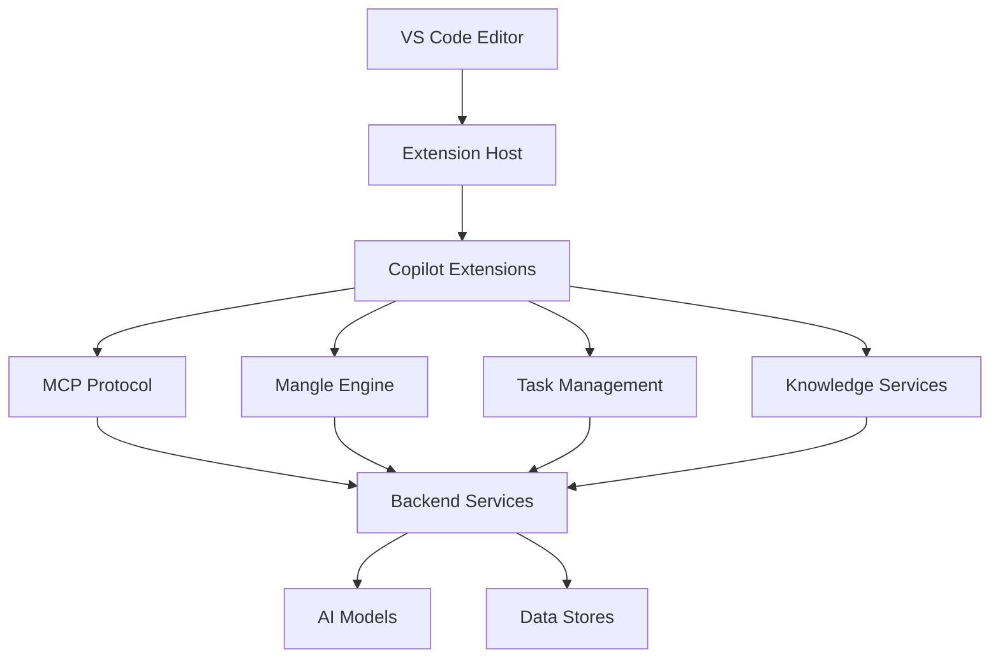
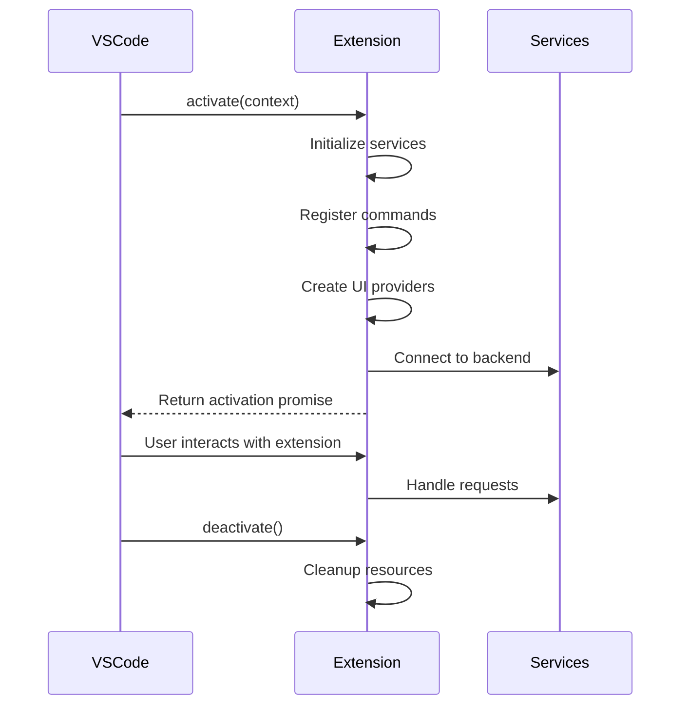
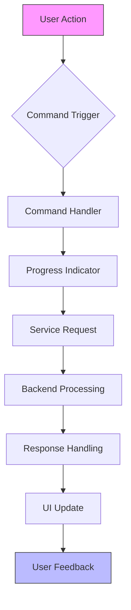
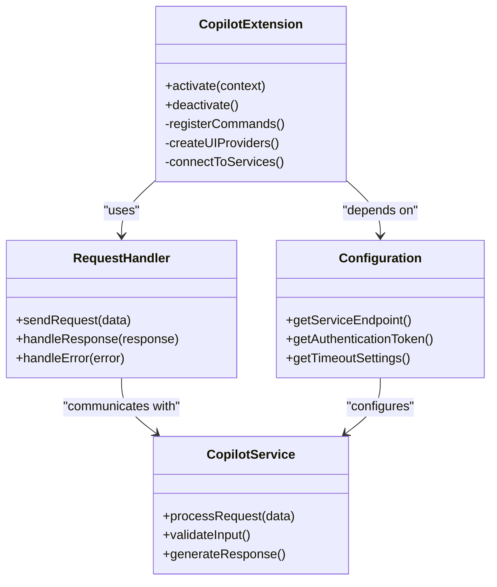
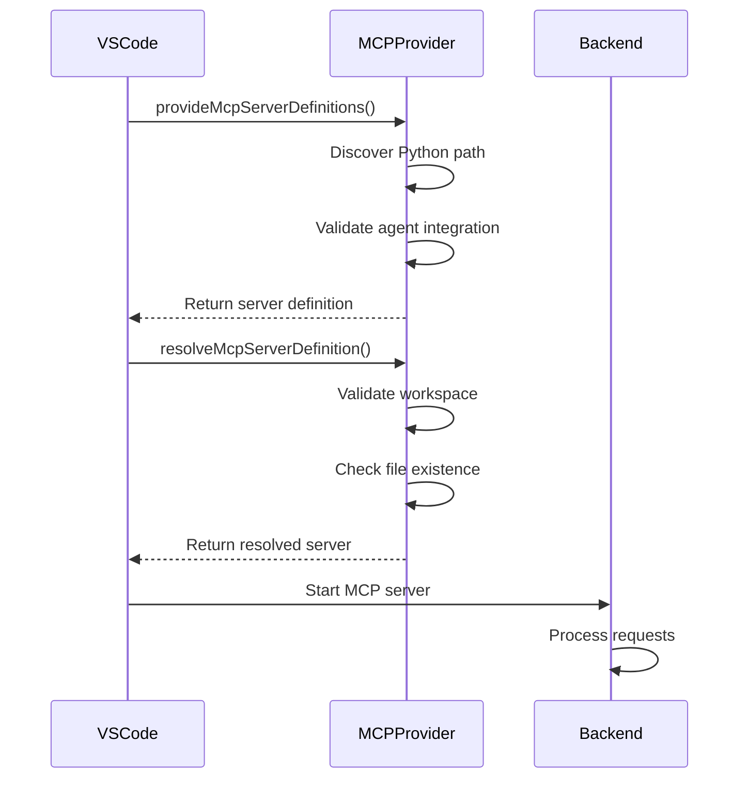

# Copilot Extension Development

<cite>
**Referenced Files in This Document**   
- [extension.ts](file://extensions\copilot-mangle\src\extension.ts)
- [builtin_mcp_provider.ts](file://src\vscode_integration\builtin_mcp_provider.ts)
- [agentic-tools-mcp-companion\src\extension.ts](file://agentic-tools-mcp-companion\src\extension.ts)
- [deep-research\src\extension.ts](file://extensions\deep-research\src\extension.ts)
- [alita-lang-ext\src\extension.ts](file://extensions\alita-lang-ext\src\extension.ts)
- [alita-refactor\src\extension.ts](file://extensions\alita-refactor\src\extension.ts)
- [prompt-pipeline-extension\extension.js](file://prompt-pipeline-extension\extension.js)
- [src\vscode_integration\extension.ts](file://src\vscode_integration\extension.ts)
</cite>

## Table of Contents
1. [Introduction](#introduction)
2. [Extension Architecture Overview](#extension-architecture-overview)
3. [Core Extension Components](#core-extension-components)
4. [Activation Events and Lifecycle Management](#activation-events-and-lifecycle-management)
5. [Command Registration and UI Integration](#command-registration-and-ui-integration)
6. [Integration with Copilot Services](#integration-with-copilot-services)
7. [MCP Protocol Integration](#mcp-protocol-integration)
8. [Mangle Engine Integration](#mangle-engine-integration)
9. [Task Management System Integration](#task-management-system-integration)
10. [Performance Considerations and Best Practices](#performance-considerations-and-best-practices)
11. [Troubleshooting Common Issues](#troubleshooting-common-issues)
12. [Conclusion](#conclusion)

## Introduction
This document provides comprehensive guidance on developing extensions for the Copilot ecosystem, focusing on the integration of advanced AI capabilities into VS Code. The documentation covers the implementation details of VS Code extensions, including activation events, command registration, and UI integration. It explains how extensions access agent capabilities and knowledge through various integration points such as the MCP protocol, Mangle engine, and task management systems. The content is designed to be accessible to beginners while providing sufficient technical depth for experienced developers to create advanced extensions. Examples from various extension.ts files illustrate development patterns and best practices for extension design.

## Extension Architecture Overview
The Copilot extension ecosystem follows a modular architecture that enables seamless integration between VS Code and various AI services. Extensions act as bridges between the editor interface and backend services, providing enhanced capabilities for code analysis, generation, and optimization. The architecture consists of several key components: extension entry points, command handlers, UI providers, and service integrations. Extensions leverage VS Code's extension API to register commands, create tree views, and provide chat participants. They communicate with backend services through various protocols including HTTP, stdio, and event buses. The architecture supports both standalone extensions and integrated solutions that work with the MCP (Model Context Protocol) framework.

**Diagram sources**
- [extension.ts](file://extensions\copilot-mangle\src\extension.ts)
- [builtin_mcp_provider.ts](file://src\vscode_integration\builtin_mcp_provider.ts)

## Core Extension Components
Copilot extensions consist of several core components that work together to provide enhanced functionality. These components include activation handlers, command registrars, UI providers, and service integrators. The activation handler initializes the extension and sets up necessary resources. Command registrars define the extension's functionality through VS Code commands that can be invoked by users. UI providers create tree views, webviews, and other interface elements that allow users to interact with the extension. Service integrators connect the extension to backend services such as the MCP server, Mangle engine, and task management systems.

The extensions follow a consistent pattern of initialization and resource management. They use the ExtensionContext to manage subscriptions and ensure proper cleanup during deactivation. Many extensions implement error handling and telemetry to monitor performance and diagnose issues. The components are designed to be modular, allowing for easy extension and customization.

**Section sources**
- [extension.ts](file://extensions\copilot-mangle\src\extension.ts)
- [agentic-tools-mcp-companion\src\extension.ts](file://agentic-tools-mcp-companion\src\extension.ts)

## Activation Events and Lifecycle Management
Extension activation is triggered by specific events defined in the package.json file or programmatically through the activation API. The primary activation event is the `activate` function, which serves as the entry point for the extension. This function is called when the extension is first loaded and is responsible for initializing all extension components.

**Diagram sources**
- [extension.ts](file://extensions\copilot-mangle\src\extension.ts)
- [src\vscode_integration\extension.ts](file://src\vscode_integration\extension.ts)

The activation process follows a specific sequence:
1. Initialize core services and providers
2. Register commands and UI elements
3. Establish connections to backend services
4. Set up event listeners and subscriptions
5. Return a promise indicating successful activation

Extensions must also implement proper lifecycle management through the `deactivate` function, which is called when the extension is being unloaded. This function should clean up all resources, dispose of subscriptions, and ensure that no background processes continue to run.

## Command Registration and UI Integration
Command registration is a fundamental aspect of Copilot extension development, enabling users to interact with extension functionality through the VS Code interface. Commands are registered using the `vscode.commands.registerCommand` API and are typically associated with specific actions such as code analysis, generation, or optimization.

**Diagram sources**
- [extension.ts](file://extensions\copilot-mangle\src\extension.ts)
- [alita-lang-ext\src\extension.ts](file://extensions\alita-lang-ext\src\extension.ts)

UI integration involves creating various interface elements that allow users to interact with the extension. This includes:
- Tree views for displaying hierarchical data such as tasks and memories
- Webviews for rich, interactive content
- Status bar items for quick access and status information
- Input boxes and quick picks for user input
- Progress indicators for long-running operations

Commands are typically organized into logical groups based on their functionality. For example, the Copilot Mangle extension includes commands for asking questions about the codebase, analyzing constitutional compliance, checking code quality, and tracing code to specifications.

## Integration with Copilot Services
Copilot extensions integrate with core Copilot services through various mechanisms, enabling access to agent capabilities and knowledge. The integration process involves establishing connections to backend services, authenticating requests, and handling responses. Extensions use configuration settings to determine service endpoints and authentication parameters.

The integration with Copilot services follows a client-server pattern, where the extension acts as a client that sends requests to backend services and processes the responses. This allows extensions to leverage the computational power and knowledge of remote AI models while providing a seamless user experience within VS Code.

**Diagram sources**
- [extension.ts](file://extensions\copilot-mangle\src\extension.ts)
- [deep-research\src\extension.ts](file://extensions\deep-research\src\extension.ts)

## MCP Protocol Integration
The MCP (Model Context Protocol) integration is a critical component of Copilot extensions, enabling communication between VS Code and backend AI services. The integration is implemented through a built-in MCP provider that registers the extension as an MCP server definition provider.

**Diagram sources**
- [builtin_mcp_provider.ts](file://src\vscode_integration\builtin_mcp_provider.ts)
- [extension.ts](file://extensions\copilot-mangle\src\extension.ts)

The MCP provider implementation includes several key components:
- Server definition provider that implements the `McpServerDefinitionProvider` interface
- Python path discovery to locate the appropriate interpreter
- Workspace validation to ensure the required files and folders exist
- Environment variable configuration for the MCP server
- Error handling and logging for troubleshooting

The MCP server definition includes the command to start the server, arguments, environment variables, and version information. This allows VS Code to properly configure and launch the MCP server as needed.

## Mangle Engine Integration
The Mangle engine integration enables Copilot extensions to perform advanced code analysis and reasoning. The integration is implemented through API calls to the Mangle service, which provides capabilities for code quality analysis, constitutional compliance checking, and specification tracing.

**Diagram sources**
- [extension.ts](file://extensions\copilot-mangle\src\extension.ts)

The Mangle engine integration includes several key functions:
- `executeMangleQuery`: Handles user queries and displays analysis results
- `callMangleAPI`: Makes HTTP requests to the Mangle service
- `showMangleResults`: Displays results in a webview with formatted HTML
- `hookIntoCopilot`: Monitors file changes for automatic analysis

The integration uses axios for HTTP requests and includes error handling to manage connection issues and timeouts. Results are displayed in webviews with custom HTML that provides a rich, interactive user experience.

## Task Management System Integration
The