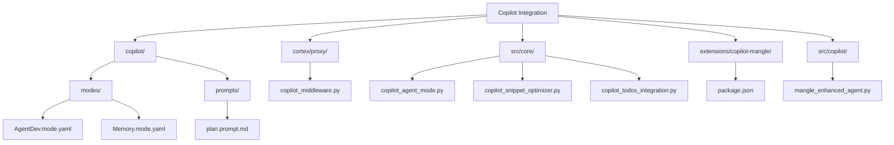
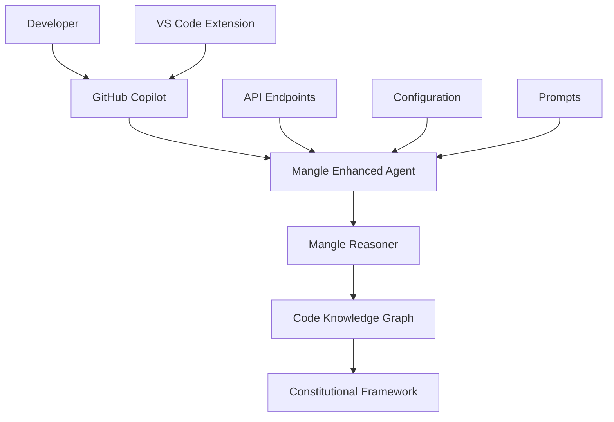
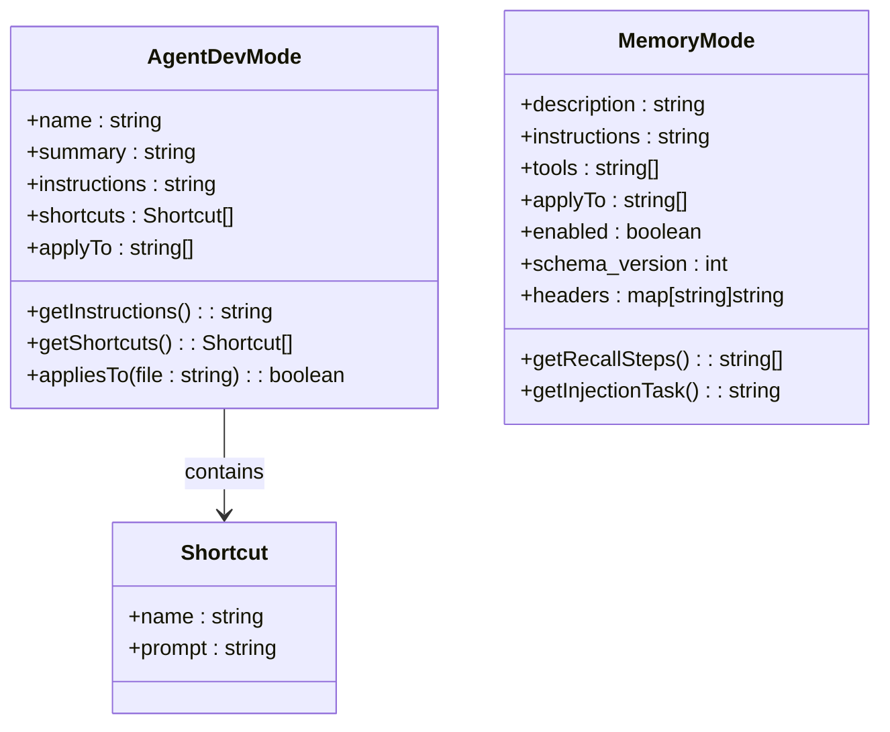
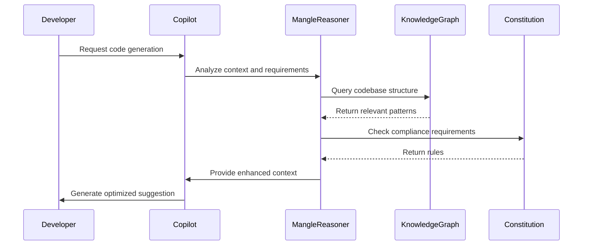
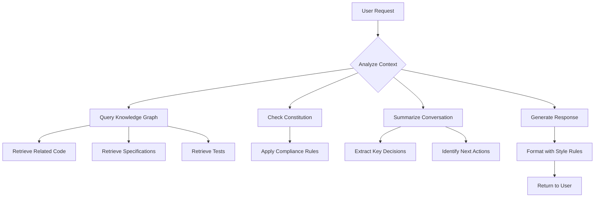
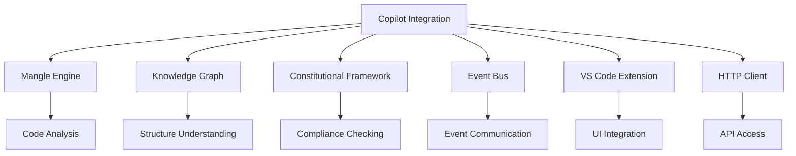

# Copilot Integration

<cite>
**Referenced Files in This Document**   
- [copilot\modes\AgentDev.mode.yaml](file://copilot/modes/AgentDev.mode.yaml)
- [copilot\modes\Memory.mode.yaml](file://copilot/modes/Memory.mode.yaml)
- [copilot\prompts\plan.prompt.md](file://copilot/prompts/plan.prompt.md)
- [cortex\proxy\copilot_middleware.py](file://cortex/proxy/copilot_middleware.py)
- [src\core\copilot_agent_mode.py](file://src/core/copilot_agent_mode.py)
- [mangle\src\core\copilot_agent_mode.py](file://mangle/src/core/copilot_agent_mode.py)
- [src\core\copilot_snippet_optimizer.py](file://src/core/copilot_snippet_optimizer.py)
- [src\core\copilot_todos_integration.py](file://src/core/copilot_todos_integration.py)
- [src\unified_intelligence\copilot_enhancer.py](file://src/unified_intelligence/copilot_enhancer.py)
- [src\copilot\mangle_enhanced_agent.py](file://src/copilot/mangle_enhanced_agent.py)
- [extensions\copilot-mangle\package.json](file://extensions/copilot-mangle/package.json)
</cite>

## Table of Contents
1. [Introduction](#introduction)
2. [Project Structure](#project-structure)
3. [Core Components](#core-components)
4. [Architecture Overview](#architecture-overview)
5. [Detailed Component Analysis](#detailed-component-analysis)
6. [Dependency Analysis](#dependency-analysis)
7. [Performance Considerations](#performance-considerations)
8. [Troubleshooting Guide](#troubleshooting-guide)
9. [Conclusion](#conclusion)

## Introduction
The Copilot Integration system enhances developer productivity through AI-powered suggestions and automation, combining GitHub Copilot with the Mangle reasoning engine and constitutional framework. This integration provides intelligent development assistance with automatic code knowledge graph analysis, constitutional compliance checking, and specification traceability. The system operates through multiple layers of enhancement, from mode definitions and prompt composition to suggestion generation and integration with other components like the knowledge graph and agent system.

## Project Structure
The Copilot integration system is organized into several key directories and components that work together to provide enhanced developer assistance. The core configuration and prompt templates are located in the copilot directory, while integration with the Mangle engine and other system components is handled through various middleware and plugin implementations.

**Diagram sources**
- [copilot\modes\AgentDev.mode.yaml](file://copilot/modes/AgentDev.mode.yaml)
- [copilot\modes\Memory.mode.yaml](file://copilot/modes/Memory.mode.yaml)
- [copilot\prompts\plan.prompt.md](file://copilot/prompts/plan.prompt.md)
- [cortex\proxy\copilot_middleware.py](file://cortex/proxy/copilot_middleware.py)
- [src\core\copilot_agent_mode.py](file://src/core/copilot_agent_mode.py)

## Core Components
The Copilot integration system consists of several core components that work together to provide enhanced developer assistance. These include mode definitions that configure Copilot behavior for specific development scenarios, prompt composition systems that structure AI interactions, and suggestion generation mechanisms that produce code, refactoring, and documentation assistance. The integration with the Mangle engine enables deductive reasoning over the codebase, while the constitutional framework ensures compliance with development standards.

**Section sources**
- [copilot\modes\AgentDev.mode.yaml](file://copilot/modes/AgentDev.mode.yaml)
- [copilot\modes\Memory.mode.yaml](file://copilot/modes/Memory.mode.yaml)
- [copilot\prompts\plan.prompt.md](file://copilot/prompts/plan.prompt.md)

## Architecture Overview
The Copilot integration architecture consists of multiple layers that enhance the standard GitHub Copilot experience with additional intelligence and compliance checking. At the foundation is the Code Knowledge Graph, which provides structural understanding of the codebase. Above this layer sits the Mangle Reasoner, which performs deductive analysis and validation. The Copilot integration layer enhances standard Copilot interactions with Mangle reasoning, and the top layer consists of the Constitutional Framework that ensures all suggestions comply with development standards.

**Diagram sources**
- [GITHUB_COPILOT_MANGLE.md](file://GITHUB_COPILOT_MANGLE.md)
- [cortex\proxy\copilot_middleware.py](file://cortex/proxy/copilot_middleware.py)
- [src\copilot\mangle_enhanced_agent.py](file://src/copilot/mangle_enhanced_agent.py)

## Detailed Component Analysis

### Mode Definitions and Configuration
The Copilot integration system uses YAML configuration files to define different operational modes that tailor the AI assistant's behavior to specific development scenarios. These modes include Agent Development Mode, which implements a PLAN → IMPLEMENT → REVIEW workflow with secure defaults, and Memory Mode, which enables GPU-accelerated background recall of relevant code patterns and documentation. Each mode specifies instructions, shortcuts, and file patterns to which it applies, allowing developers to switch between different assistance styles based on their current task.

**Diagram sources**
- [copilot\modes\AgentDev.mode.yaml](file://copilot/modes/AgentDev.mode.yaml)
- [copilot\modes\Memory.mode.yaml](file://copilot/modes/Memory.mode.yaml)

### Prompt Composition System
The prompt composition system in the Copilot integration framework structures AI interactions by combining user input with contextual information from the codebase, specifications, and constitutional guidelines. The system uses prompt templates like plan.prompt.md to guide the AI in expanding specifications and generating implementation plans. These prompts are designed to ensure that the AI follows a structured development process, considering security implications, testing requirements, and architectural consistency before generating code.

**Section sources**
- [copilot\prompts\plan.prompt.md](file://copilot/prompts/plan.prompt.md)

### Suggestion Generation and Optimization
The suggestion generation system in the Copilot integration framework produces code, refactoring, and documentation assistance by combining standard Copilot capabilities with enhanced reasoning from the Mangle engine. The system includes a snippet optimizer that analyzes potential code suggestions for token efficiency and recommends reusable patterns to reduce context length. This optimization process considers both the immediate code generation task and the broader context of the codebase to provide suggestions that are both effective and maintainable.

**Diagram sources**
- [src\core\copilot_snippet_optimizer.py](file://src/core/copilot_snippet_optimizer.py)
- [src\copilot\mangle_enhanced_agent.py](file://src/copilot/mangle_enhanced_agent.py)

### Integration with Knowledge Graph and Agent System
The Copilot integration system connects with the knowledge graph and agent system to provide contextual awareness and long-term memory capabilities. The knowledge graph integration allows Copilot to understand relationships between code elements, specifications, and tests, enabling bidirectional traceability. The agent system integration provides conversation summarization and context awareness, allowing Copilot to maintain continuity across multiple interactions and remember key decisions and next actions from previous conversations.

**Diagram sources**
- [src\core\copilot_agent_mode.py](file://src/core/copilot_agent_mode.py)
- [src\core\copilot_todos_integration.py](file://src/core/copilot_todos_integration.py)

## Dependency Analysis
The Copilot integration system has dependencies on several core components of the development environment, including the Mangle engine for code analysis, the knowledge graph for structural understanding, and the constitutional framework for compliance checking. The system also depends on the VS Code extension framework for user interface integration and the event bus for communication between components. These dependencies are managed through a plugin architecture that allows for modular enhancement of Copilot capabilities without modifying the core system.

**Diagram sources**
- [extensions\copilot-mangle\package.json](file://extensions/copilot-mangle/package.json)
- [cortex\proxy\copilot_middleware.py](file://cortex/proxy/copilot_middleware.py)

## Performance Considerations
The Copilot integration system is designed to balance enhanced intelligence with performance considerations. The system uses caching and summarization to minimize the impact of additional analysis layers on response time. Conversation history is summarized periodically to maintain context awareness without excessive memory usage. The snippet optimization system reduces token usage in AI interactions, which can improve both performance and cost efficiency. Configuration options allow users to enable or disable specific enhancement features based on their performance requirements and development needs.

## Troubleshooting Guide
Common issues with the Copilot integration system include suggestion relevance, performance impact, and configuration conflicts. For suggestion relevance issues, verify that the correct mode is active and that the knowledge graph is up to date. Performance issues can often be addressed by disabling specific enhancement features or adjusting the frequency of background analysis tasks. Configuration conflicts may occur when multiple extensions attempt to modify Copilot behavior; these can be resolved by reviewing extension settings and ensuring compatibility between different enhancement systems.

**Section sources**
- [COPILOT_MANGLE_READY.md](file://COPILOT_MANGLE_READY.md)
- [MANGLE_COPILOT_COMPLETE.md](file://MANGLE_COPILOT_COMPLETE.md)

## Conclusion
The Copilot integration system provides a comprehensive enhancement to developer productivity by combining AI-powered suggestions with advanced code analysis and compliance checking. Through its modular architecture, the system can be customized to meet specific development needs while maintaining compatibility with standard Copilot functionality. The integration with the Mangle engine, knowledge graph, and constitutional framework enables intelligent assistance that understands both the technical and organizational context of development work.