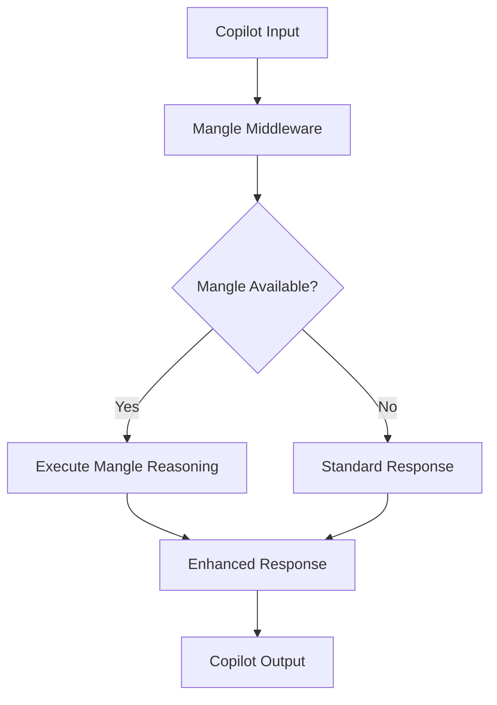
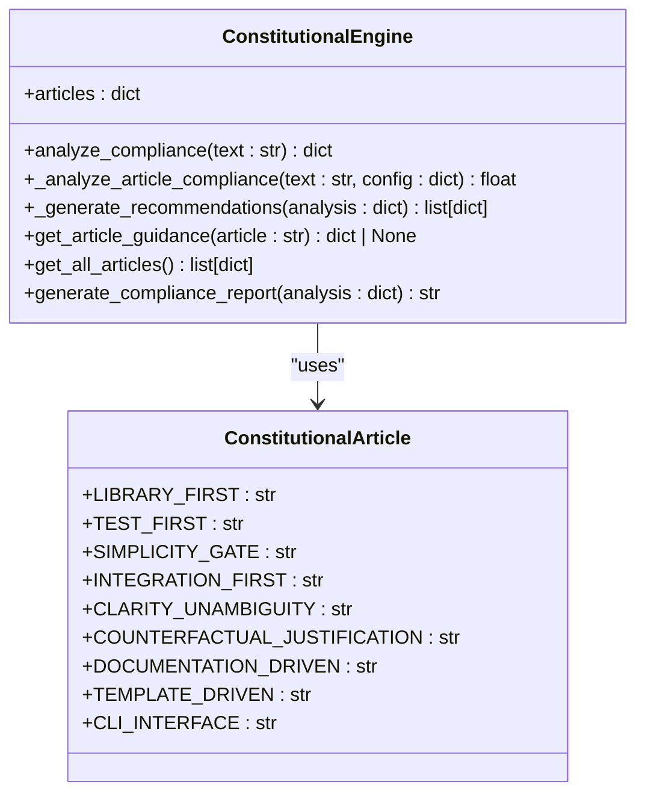

# Copilot Modes Configuration

<cite>
**Referenced Files in This Document**   
- [AgentDev.mode.yaml](file://copilot/modes/AgentDev.mode.yaml)
- [Memory.mode.yaml](file://copilot/modes/Memory.mode.yaml)
- [README.md](file://copilot/modes/README.md)
- [mangle_middleware.py](file://src/copilot/mangle_middleware.py)
- [mangle_reasoning_ability.py](file://src/abilities/mangle_reasoning_ability.py)
- [constitutional_engine.py](file://src/unified_intelligence/constitutional_engine.py)
- [validate_modes.py](file://scripts/validate_modes.py)
</cite>

## Table of Contents
1. [Introduction](#introduction)
2. [Mode Configuration Structure](#mode-configuration-structure)
3. [Core Mode Examples](#core-mode-examples)
4. [Mode Integration with Mangle Reasoning](#mode-integration-with-mangle-reasoning)
5. [Constitutional Governance System](#constitutional-governance-system)
6. [Common Issues and Best Practices](#common-issues-and-best-practices)
7. [Conclusion](#conclusion)

## Introduction
Copilot modes provide a structured way to configure agent behavior through YAML configuration files. These modes define specific capabilities, constraints, and workflows that guide the agent's interactions and decision-making processes. The configuration system enables developers to create specialized environments for different development scenarios, ensuring consistent application of best practices and organizational standards. This document explains the implementation details of mode definitions, their relationship to agent behavior, and integration with the Mangle reasoning engine and constitutional governance system.

## Mode Configuration Structure
The Copilot mode configuration system uses YAML files to define mode-specific parameters that control agent behavior. Each mode file contains essential fields that determine how the agent operates within that mode. The structure includes required fields such as name and instructions, along with optional fields that provide additional configuration options.

The configuration files support several key fields:
- **name**: A unique identifier for the mode
- **summary**: Brief description of the mode's purpose
- **instructions**: Detailed guidance for agent behavior
- **shortcuts**: Predefined commands that simplify common tasks
- **applyTo**: File patterns that determine when the mode applies
- **tools**: Specific tools available in the mode
- **enabled**: Boolean flag to activate or deactivate the mode
- **schema_version**: Version identifier for the configuration format
- **headers**: Metadata for mode categorization and ownership

The system validates mode configurations using a dedicated validation script that checks for proper syntax and required fields. This ensures that all mode definitions adhere to the expected schema and prevents configuration errors that could affect agent behavior.

**Section sources**
- [AgentDev.mode.yaml](file://copilot/modes/AgentDev.mode.yaml#L1-L13)
- [Memory.mode.yaml](file://copilot/modes/Memory.mode.yaml#L1-L13)
- [validate_modes.py](file://scripts/validate_modes.py#L43-L92)

## Core Mode Examples
The repository includes two primary mode configurations that demonstrate different approaches to agent behavior: Agent Development Mode and Memory Mode. These examples illustrate how mode configurations can be tailored to specific development needs while maintaining consistency with organizational standards.

### Agent Development Mode
The Agent Development Mode (AgentDev.mode.yaml) establishes a structured development workflow based on the specification-to-code methodology. This mode emphasizes secure coding practices and review gates to ensure code quality and compliance. It implements a PLAN → IMPLEMENT → REVIEW loop that guides developers through a systematic development process.

Key features of this mode include:
- Preference for specification templates in the .specify directory
- Parameterization of inputs to avoid hardcoded secrets
- Integration with specification-driven development workflows
- Predefined shortcuts for common development tasks

The mode provides three primary shortcuts that streamline the development process:
- **/specify**: Uses specification templates to generate feature descriptions
- **/plan**: Expands specifications using constitutional principles
- **/tasks**: Generates test-first development tasks

This configuration ensures that all development work follows a consistent pattern, making it easier to maintain code quality and compliance across the codebase.

### Memory Mode
The Memory Mode (Memory.mode.yaml) enables GPU-accelerated background recall capabilities that enhance the agent's contextual awareness. This mode implements a multi-step memory retrieval process that allows the agent to access relevant information from previous interactions and code contexts.

The memory workflow consists of three key steps:
1. Ensuring the memory daemon is running through a VS Code task
2. Generating memory hints for the current context
3. Using injected memory beacons as recall triggers

This mode specifically enables the terminal and workspace tools, allowing the agent to interact with the development environment while maintaining memory context. The configuration includes metadata headers that identify the mode's ownership and purpose, facilitating governance and tracking.

**Section sources**
- [AgentDev.mode.yaml](file://copilot/modes/AgentDev.mode.yaml#L1-L13)
- [Memory.mode.yaml](file://copilot/modes/Memory.mode.yaml#L1-L13)
- [README.md](file://copilot/modes/README.md#L1-L6)

## Mode Integration with Mangle Reasoning
Copilot modes integrate with the Mangle reasoning engine to provide enhanced deductive capabilities and code knowledge graph analysis. This integration enables agents to perform sophisticated code analysis and provide contextually relevant suggestions based on the current mode configuration.

The Mangle reasoning system enhances Copilot interactions through several mechanisms:
- Automatic code knowledge graph analysis for all interactions
- Constitutional compliance monitoring during code generation
- Natural language code querying capabilities
- Specification-to-code traceability

The integration is implemented through a middleware layer that processes Copilot input and enhances it with Mangle reasoning results. This middleware automatically activates when the COPILOT_MANGLE_MODE environment variable is set, enabling seamless integration without requiring manual intervention.

**Diagram sources**
- [mangle_middleware.py](file://src/copilot/mangle_middleware.py#L0-L81)
- [mangle_reasoning_ability.py](file://src/abilities/mangle_reasoning_ability.py#L56-L437)

**Section sources**
- [mangle_middleware.py](file://src/copilot/mangle_middleware.py#L0-L81)
- [mangle_reasoning_ability.py](file://src/abilities/mangle_reasoning_ability.py#L56-L437)

## Constitutional Governance System
The constitutional governance system provides a framework for ensuring that agent behavior adheres to organizational principles and best practices. This system implements nine constitutional articles that guide development decisions and maintain code quality standards.

The nine constitutional articles are:
1. **Library-First Development**: Prioritize existing libraries over custom implementations
2. **Test-First Development**: Write tests before implementation with high coverage
3. **Simplicity Gate**: Prefer simple solutions and avoid over-engineering
4. **Integration-First Testing**: Validate system integration before unit details
5. **Clarity and Unambiguity**: Ensure clear specifications and unambiguous requirements
6. **Counterfactual Justification**: Justify decisions by explaining alternatives not chosen
7. **Documentation-Driven Development**: Comprehensive documentation drives implementation
8. **Template-Driven Development**: Use templates and structured approaches for consistency
9. **CLI Interface Design**: Command-line interfaces should be intuitive and well-designed

The constitutional engine analyzes text for compliance with these principles by checking for positive indicators and violations. It assigns weights to each article based on importance and calculates an overall compliance score. The system provides advisory guidance rather than blocking operations, allowing developers to make informed decisions while maintaining productivity.

**Diagram sources**
- [constitutional_engine.py](file://src/unified_intelligence/constitutional_engine.py#L27-L462)

**Section sources**
- [constitutional_engine.py](file://src/unified_intelligence/constitutional_engine.py#L27-L462)

## Common Issues and Best Practices
When configuring Copilot modes, several common issues can arise that affect agent behavior and system performance. Understanding these issues and following best practices helps ensure reliable and effective mode configurations.

### Mode Conflicts
Mode conflicts occur when multiple modes with conflicting instructions are active simultaneously. To prevent conflicts:
- Use clear naming conventions for modes
- Define specific applyTo patterns to limit mode scope
- Test mode interactions thoroughly in development environments
- Document mode dependencies and incompatibilities

### Inheritance Problems
Inheritance issues can arise when modes inherit conflicting configurations from parent modes. To address these problems:
- Use explicit configuration overrides rather than relying on inheritance
- Validate mode configurations after making changes
- Document the inheritance hierarchy for complex mode structures
- Test mode behavior with different configuration combinations

### Validation Errors
Validation errors typically occur due to syntax issues or missing required fields. To prevent validation errors:
- Use the validate_modes.py script to check configurations
- Follow the established schema for mode definitions
- Test configurations in isolated environments before deployment
- Use version control to track configuration changes

### Best Practices for Mode Design
When creating custom modes, follow these best practices:
- Start with existing mode templates and modify as needed
- Use descriptive names and clear documentation
- Implement incremental complexity rather than complex configurations from the start
- Test modes thoroughly with realistic development scenarios
- Document mode purpose, usage, and limitations
- Regularly review and update modes to reflect evolving requirements

**Section sources**
- [validate_modes.py](file://scripts/validate_modes.py#L43-L92)
- [AgentDev.mode.yaml](file://copilot/modes/AgentDev.mode.yaml#L1-L13)
- [Memory.mode.yaml](file://copilot/modes/Memory.mode.yaml#L1-L13)

## Conclusion
Copilot modes provide a powerful mechanism for configuring agent behavior through structured YAML configurations. By defining specific capabilities, constraints, and workflows, modes ensure consistent application of development standards and best practices. The integration with the Mangle reasoning engine and constitutional governance system enhances agent capabilities while maintaining compliance with organizational principles. Understanding the configuration structure, core examples, and integration points enables developers to create effective custom modes that improve development efficiency and code quality. Following best practices for mode design and addressing common issues helps ensure reliable and maintainable mode configurations.