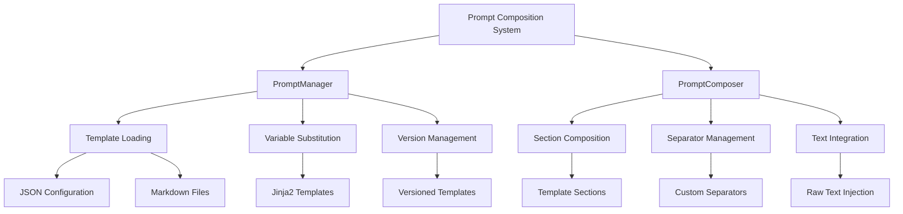
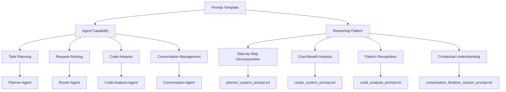

# Prompt Composition System

<cite>
**Referenced Files in This Document**   
- [plan.prompt.md](file://copilot/prompts/plan.prompt.md)
- [prompt_composer.py](file://src/copilot/prompt_composer.py)
- [AGENTS.md](file://src/prompts/AGENTS.md)
- [prompt_manager.py](file://src/core/prompt_manager.py)
</cite>

## Table of Contents
1. [Introduction](#introduction)
2. [Prompt Composition Architecture](#prompt-composition-architecture)
3. [Template Structure and Variable Injection](#template-structure-and-variable-injection)
4. [Context Enrichment Mechanisms](#context-enrichment-mechanisms)
5. [Prompt-Template and Agent Capability Relationship](#prompt-template-and-agent-capability-relationship)
6. [Integration with Copilot Agent System](#integration-with-copilot-agent-system)
7. [Integration with Knowledge Graph](#integration-with-knowledge-graph)
8. [Common Issues and Best Practices](#common-issues-and-best-practices)
9. [Conclusion](#conclusion)

## Introduction
The Prompt Composition System in Super Alita is a sophisticated framework designed to generate dynamic, context-aware prompts for AI agents. This system enables the creation of complex prompts through template composition, variable injection, and context enrichment, facilitating advanced reasoning patterns and agent capabilities. The documentation provides comprehensive insights into the implementation details, integration points, and best practices for prompt engineering within the Super Alita ecosystem.

## Prompt Composition Architecture

The Prompt Composition System is built on a modular architecture that combines template management, dynamic composition, and context integration. At its core, the system utilizes the `PromptManager` class to handle hierarchical prompt loading and template substitution, while the `PromptComposer` class enables the construction of complex prompts from multiple components.

The architecture follows a layered approach where system prompts, conversation prompts, and specialized agent prompts are managed through a unified interface. This design allows for consistent prompt generation across different agent types and use cases, from planning and routing to code analysis and conversation management.



**Diagram sources**
- [prompt_manager.py](file://src/core/prompt_manager.py#L38-L449)
- [AGENTS.md](file://src/prompts/AGENTS.md#L815-L864)

**Section sources**
- [prompt_manager.py](file://src/core/prompt_manager.py#L38-L449)
- [AGENTS.md](file://src/prompts/AGENTS.md#L815-L864)

## Template Structure and Variable Injection

The template system in Super Alita employs a hierarchical JSON structure combined with markdown files to define prompt templates. Templates are organized by category and function, allowing for systematic management of different prompt types such as planner prompts, router prompts, and conversation finalizer prompts.

Variable injection is implemented through a robust template substitution mechanism that supports both simple placeholder replacement and complex data formatting. The system uses Python's string formatting capabilities with additional processing for structured data like tool descriptions and examples.

```python
class PromptManager:
    def _format_template(self, template_str: str, path: str, **kwargs) -> str:
        """Format template string with provided values."""
        try:
            formatted_kwargs = {}
            for key, value in kwargs.items():
                if key == "tool_descriptions" and isinstance(value, dict):
                    descriptions = []
                    for tool_name, description in value.items():
                        descriptions.append(f"- {tool_name}: {description}")
                    formatted_kwargs[key] = "\n".join(descriptions)
                elif key == "examples" and isinstance(value, list):
                    formatted_kwargs[key] = "\n".join(
                        f"{i + 1}. {example}" for i, example in enumerate(value)
                    )
                else:
                    formatted_kwargs[key] = str(value)
            result = template_str.format(**formatted_kwargs)
            return result
        except KeyError as e:
            # Handle missing keys with partial substitution
            result = template_str
            for key, value in formatted_kwargs.items():
                result = result.replace(f"{{{key}}}", str(value))
            return result
```

The template system also supports advanced features like conditional sections and loops through Jinja2 templating, enabling dynamic content generation based on input variables. This allows for sophisticated prompt structures that can adapt to different contexts and requirements.

**Section sources**
- [prompt_manager.py](file://src/core/prompt_manager.py#L38-L449)
- [AGENTS.md](file://src/prompts/AGENTS.md#L815-L864)

## Context Enrichment Mechanisms

Context enrichment in the Prompt Composition System is achieved through multiple mechanisms that enhance prompts with relevant information from various sources. The system integrates file summaries, chat history, and domain-specific knowledge to create contextually rich prompts that enable more effective agent reasoning.

The `compose_chat_prompt` function demonstrates the core context enrichment process, which combines a system banner, user message, file summaries, and chat signals into a comprehensive prompt structure. The function implements token budgeting to ensure prompts remain within length constraints while maximizing information density.

```python
def compose_chat_prompt(
    banner: str,
    user_message: str,
    file_summaries: Sequence[str] | None = None,
    chat_signals: Sequence[str] | None = None,
    token_budget: int = 4000,
) -> PromptPayload:
    """Compose a chat prompt for Copilot."""
    files = sorted(file_summaries or [])
    signals = sorted(chat_signals or [])
    hints_parts = []
    if files:
        hints_parts.append("Files:\n" + "\n".join(files))
    if signals:
        hints_parts.append("Chat:\n" + "\n".join(signals))
    hints_text = _truncate_text("\n\n".join(hints_parts), token_budget)
    content_hash = _stable_hash([banner, user_message, hints_text])
    hints = {
        "text": hints_text,
        "files": files,
        "chat": signals,
        "content_hash": content_hash,
    }
    return PromptPayload(system=banner, user=user_message, hints=hints)
```

The system also implements deterministic hashing to ensure prompt consistency across multiple invocations with the same inputs, which is crucial for reproducible agent behavior and debugging. This approach allows the system to generate identical prompts for identical contexts, facilitating reliable testing and validation.

**Section sources**
- [prompt_composer.py](file://src/copilot/prompt_composer.py#L31-L68)
- [prompt_manager.py](file://src/core/prompt_manager.py#L38-L449)

## Prompt-Template and Agent Capability Relationship

The relationship between prompt templates and agent capabilities in Super Alita is fundamental to the system's operation. Different prompt templates activate specific reasoning patterns and capabilities by providing tailored instructions, constraints, and contextual information to the AI agents.

For example, the planner system prompt activates task decomposition and execution planning capabilities by providing a structured format for step-by-step planning with tool selection and parameter specification. The router system prompt enables intelligent request routing by presenting available routes and historical performance data, allowing the agent to make informed routing decisions.



The system also supports specialized agent prompts through the `get_plugin_prompt` method, which provides tailored system prompts for specific plugins like self-reflection and web agents. These specialized prompts include operation-specific context and response format guidelines, enabling agents to perform their designated functions effectively.

**Diagram sources**
- [prompt_manager.py](file://src/core/prompt_manager.py#L38-L449)
- [AGENTS.md](file://src/prompts/AGENTS.md#L815-L864)

**Section sources**
- [prompt_manager.py](file://src/core/prompt_manager.py#L38-L449)
- [AGENTS.md](file://src/prompts/AGENTS.md#L815-L864)

## Integration with Copilot Agent System

The Prompt Composition System integrates seamlessly with the Copilot agent system through a well-defined interface that enables dynamic prompt generation and context-aware suggestions. The integration is facilitated by the `PromptComposer` class, which provides methods for adding template sections, raw text, and separators to construct complex prompts.

The system supports both chat prompts and inline completion prompts through the `compose_chat_prompt` and `compose_inline_prompt` functions, respectively. These functions serve as the primary interface between the Copilot system and the prompt composition engine, ensuring consistent prompt generation across different interaction modes.

```python
def compose_inline_prompt(
    banner: str,
    code_snippet: str,
    file_summaries: Sequence[str] | None = None,
    token_budget: int = 4000,
) -> PromptPayload:
    """Compose an inline completion prompt."""
    return compose_chat_prompt(
        banner=banner,
        user_message=code_snippet,
        file_summaries=file_summaries,
        chat_signals=None,
        token_budget=token_budget,
    )
```

The integration also includes support for deterministic prompt generation, ensuring that identical inputs produce identical prompts. This feature is critical for maintaining consistency in agent behavior and enabling reliable testing and debugging of the Copilot system.

**Section sources**
- [prompt_composer.py](file://src/copilot/prompt_composer.py#L71-L87)
- [prompt_manager.py](file://src/core/prompt_manager.py#L38-L449)

## Integration with Knowledge Graph

The Prompt Composition System integrates with the knowledge graph to provide contextual suggestions and enhance prompt relevance. This integration enables the system to enrich prompts with domain-specific knowledge, historical context, and semantic relationships extracted from the knowledge graph.

The integration is implemented through the `PromptManager` class, which can load prompts from both JSON configuration files and markdown files stored in the knowledge graph. This dual-source approach allows for flexible prompt management while maintaining consistency across different storage formats.

```mermaid
flowchart TD
    A[Knowledge Graph] --> B[Prompt Composition System]
    B --> C[Copilot Agent]
    C --> D[User Interface]
    D --> E[User Input]
    E --> F[Context Extraction]
    F