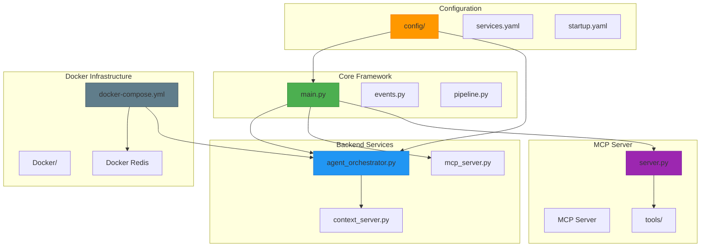
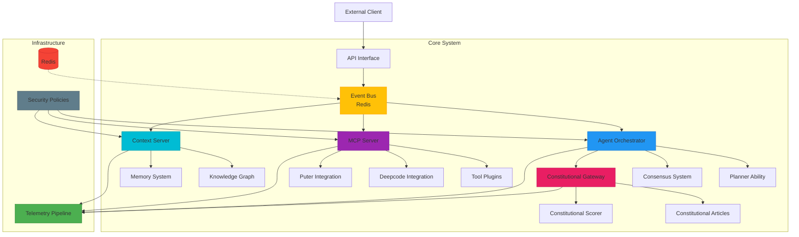
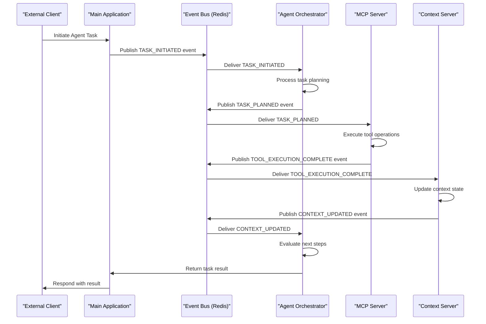
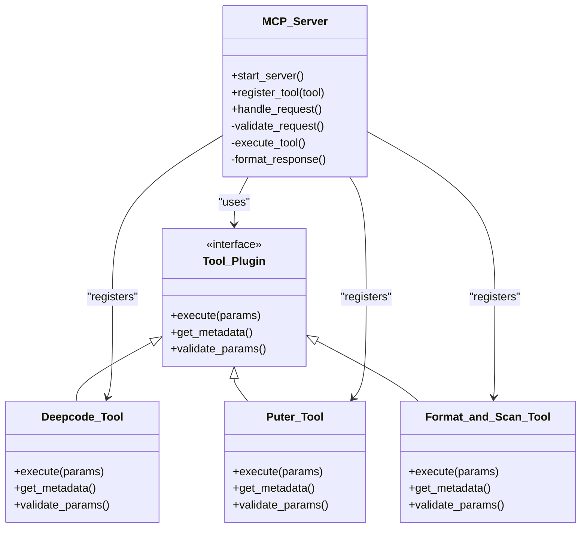
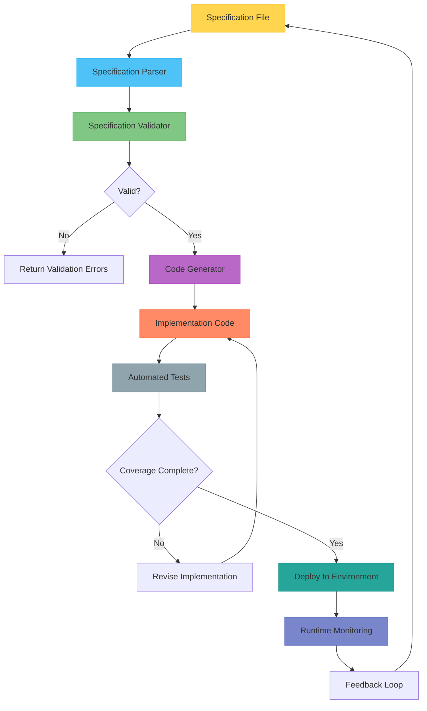
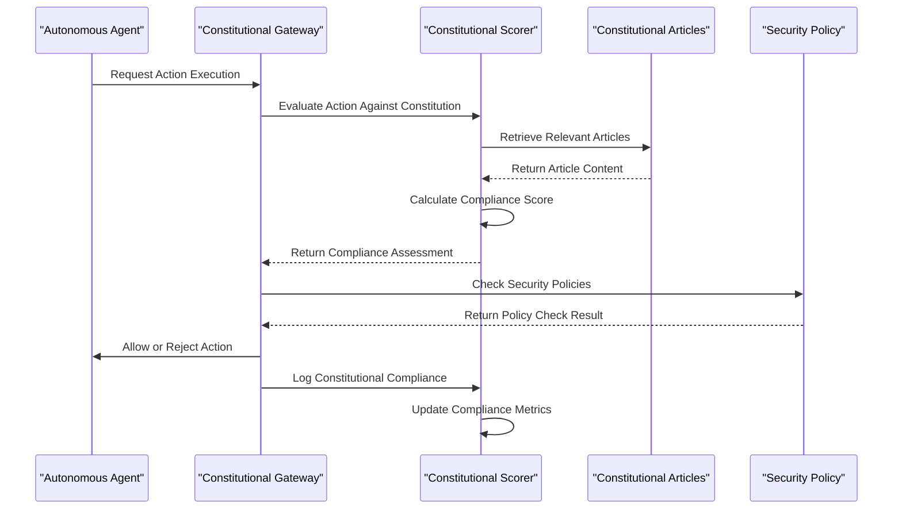

# Core Architecture

<cite>
**Referenced Files in This Document**   
- [main.py](file://src/main.py)
- [events.py](file://src/events.py)
- [agent_orchestrator.py](file://backend/agent_orchestrator.py)
- [mcp_server.py](file://backend/mcp_server.py)
- [constitutional_gateway.py](file://src/constitutional_gateway.py)
- [services.yaml](file://config/services.yaml)
- [docker-compose.yml](file://docker/docker-compose.yml)
- [server.py](file://mcp_server/src/mcp_server/server.py)
- [planner_ability.py](file://src/abilities/planner_ability.py)
- [redis_event_bus.py](file://src/adapters/redis_event_bus.py)
- [telemetry_pipeline.yaml](file://config/telemetry_pipeline.yaml)
- [security_policies.yaml](file://config/security_policies.yaml)
</cite>

## Table of Contents
1. [Introduction](#introduction)
2. [Project Structure](#project-structure)
3. [Core Components](#core-components)
4. [Architecture Overview](#architecture-overview)
5. [Detailed Component Analysis](#detailed-component-analysis)
6. [Dependency Analysis](#dependency-analysis)
7. [Performance Considerations](#performance-considerations)
8. [Troubleshooting Guide](#troubleshooting-guide)
9. [Conclusion](#conclusion)

## Introduction
The Super Alita framework is a sophisticated AI orchestration system designed for autonomous agent development and execution. This document details the core architectural principles, component interactions, and system design of the framework. The architecture emphasizes modularity, event-driven communication, and specification-driven development to enable robust, extensible, and reliable multi-agent systems.

## Project Structure

The Super Alita framework follows a modular monorepo structure with clearly defined component boundaries and responsibilities. The organization supports both independent development and seamless integration of various subsystems.

**Diagram sources**
- [main.py](file://src/main.py)
- [agent_orchestrator.py](file://backend/agent_orchestrator.py)
- [mcp_server.py](file://backend/mcp_server.py)
- [services.yaml](file://config/services.yaml)
- [docker-compose.yml](file://docker/docker-compose.yml)

**Section sources**
- [main.py](file://src/main.py)
- [backend](file://backend)
- [config](file://config)
- [docker](file://docker)
- [mcp_server](file://mcp_server)

## Core Components

The Super Alita framework consists of several core components that work together to enable autonomous agent functionality. The system is built around a modular architecture that supports plugin-based extensibility and event-driven communication.

The main entry point is controlled by `main.py`, which initializes the core system components and orchestrates the startup sequence. The event system, defined in `events.py`, provides the foundation for asynchronous communication between components. The backend services, including the agent orchestrator and MCP server, handle specialized functionality for agent management and tool execution.

The configuration system, centered around YAML files in the config directory, enables declarative setup of services, security policies, and telemetry pipelines. The Docker infrastructure provides containerized deployment options with Redis for message brokering.

**Section sources**
- [main.py](file://src/main.py#L1-L50)
- [events.py](file://src/events.py#L1-L30)
- [services.yaml](file://config/services.yaml#L1-L20)
- [docker-compose.yml](file://docker/docker-compose.yml#L1-L15)

## Architecture Overview

The Super Alita framework employs an event-driven, microservices-inspired architecture with a plugin-based extensibility model. The system is designed to support specification-driven development, constitutional governance, and multi-agent orchestration patterns.

**Diagram sources**
- [agent_orchestrator.py](file://backend/agent_orchestrator.py)
- [mcp_server.py](file://backend/mcp_server.py)
- [context_server.py](file://backend/context_server.py)
- [constitutional_gateway.py](file://src/constitutional_gateway.py)
- [services.yaml](file://config/services.yaml)
- [telemetry_pipeline.yaml](file://config/telemetry_pipeline.yaml)
- [security_policies.yaml](file://config/security_policies.yaml)

## Detailed Component Analysis

### Event-Driven Architecture

The Super Alita framework is built on an event-driven architecture that enables loose coupling between components and supports asynchronous processing patterns. The event bus serves as the central nervous system of the framework, facilitating communication between agents, services, and external systems.

**Diagram sources**
- [events.py](file://src/events.py)
- [agent_orchestrator.py](file://backend/agent_orchestrator.py)
- [mcp_server.py](file://backend/mcp_server.py)
- [context_server.py](file://backend/context_server.py)

### Plugin-Based Extensibility

The framework supports plugin-based extensibility through the MCP (Model Context Protocol) server architecture. This design allows for dynamic addition of capabilities without modifying the core system.

**Diagram sources**
- [server.py](file://mcp_server/src/mcp_server/server.py)
- [deepcode_tool.py](file://mcp_server/src/mcp_server/tools/deepcode_tool.py)
- [puter_tool.py](file://mcp_server/src/mcp_server/tools/puter_tool.py)
- [format_and_scan.py](file://mcp_server/src/mcp_server/tools/format_and_scan.py)

### Specification-Driven Development

The framework implements specification-driven development patterns, where system behavior is defined through declarative specifications rather than imperative code. This approach enables greater consistency, testability, and maintainability.

**Diagram sources**
- [planner_ability.py](file://src/abilities/planner_ability.py)
- [pipeline.py](file://src/pipeline.py)
- [test_sdd_integration.py](file://tests/test_sdd_integration.py)

### Constitutional Governance

The constitutional governance system provides a framework for ensuring that agent behavior adheres to predefined principles and constraints. This system acts as a governance layer that monitors and validates agent actions against constitutional articles.

**Diagram sources**
- [constitutional_gateway.py](file://src/constitutional_gateway.py)
- [scorer.py](file://src/constitutional/scorer.py)
- [articles.py](file://src/constitutional/articles.py)
- [security_policies.yaml](file://config/security_policies.yaml)

## Dependency Analysis

The Super Alita framework has a well-defined dependency structure that supports modularity while maintaining necessary integration points between components.

```mermaid
graph TD
main[main.py] --> agent_orchestrator[agent_orchestrator.py]
main --> mcp_server[mcp_server.py]
main --> events[events.py]
main --> pipeline[pipeline.py]
agent_orchestrator --> planner[planner_ability.py]
agent_orchestrator --> consensus[consensus_grpc/server.py]
agent_orchestrator --> constitutional[constitutional_gateway.py]
agent_orchestrator --> context[context_server.py]
mcp_server --> tools[tools/]
mcp_server --> deepcode[deepcode/]
mcp_server --> puter[puter/]
events --> redis[redis_event_bus.py]
events --> adapter[event_bus_adapter.py]
pipeline --> sdd[sdd/]
pipeline --> telemetry[telemetry/]
config --> services[services.yaml]
config --> security[security_policies.yaml]
config --> telemetry_config[telemetry_pipeline.yaml]
docker --> compose[docker-compose.yml]
docker --> redis_config[docker-compose.redis.yml]
style main fill:#4CAF50,stroke:#388E3C
style agent_orchestrator fill:#2196F3,stroke:#1976D2
style mcp_server fill:#9C27B0,stroke:#7B1FA2
style events fill:#FF9800,stroke:#F57C00
style pipeline fill:#607D8B,stroke:#455A64
style config fill:#795548,stroke:#5D4037
style docker fill:#9E9E9E,stroke:#616161
```

**Diagram sources**
- [main.py](file://src/main.py)
- [agent_orchestrator.py](file://backend/agent_orchestrator.py)
- [mcp_server.py](file://backend/mcp_server.py)
- [events.py](file://src/events.py)
- [pipeline.py](file://src/pipeline.py)
- [services.yaml](file://config/services.yaml)
- [docker-compose.yml](file://docker/docker-compose.yml)

**Section sources**
- [main.py](file://src/main.py)
- [backend](file://backend)
- [src](file://src)
- [config](file://config)
- [docker](file://docker)
- [mcp_server](file://mcp_server)

## Performance Considerations

The Super Alita framework incorporates several performance optimization strategies to ensure efficient operation at scale. The event-driven architecture enables asynchronous processing, reducing blocking operations and improving throughput. Redis serves as a high-performance message broker for the