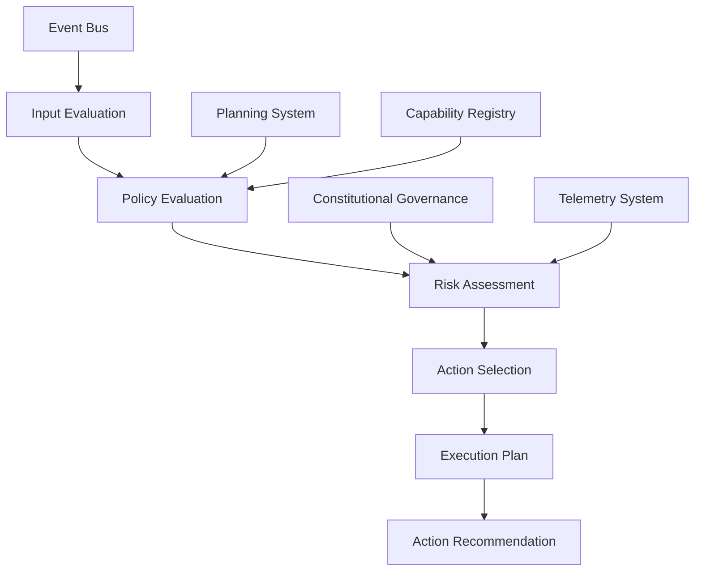
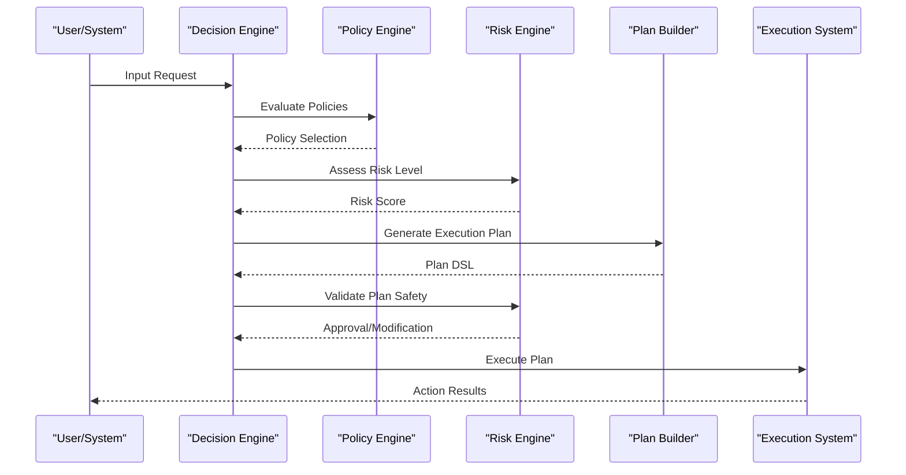
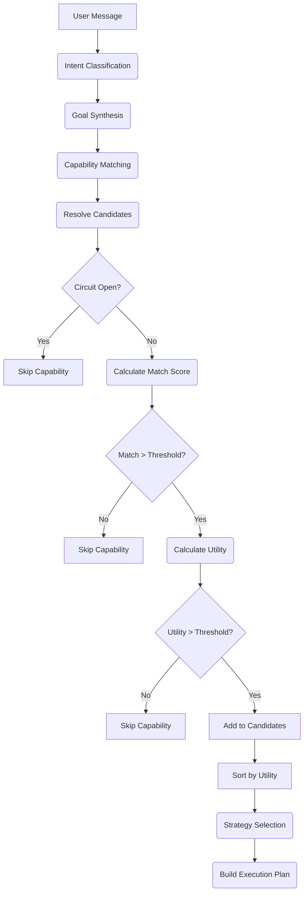
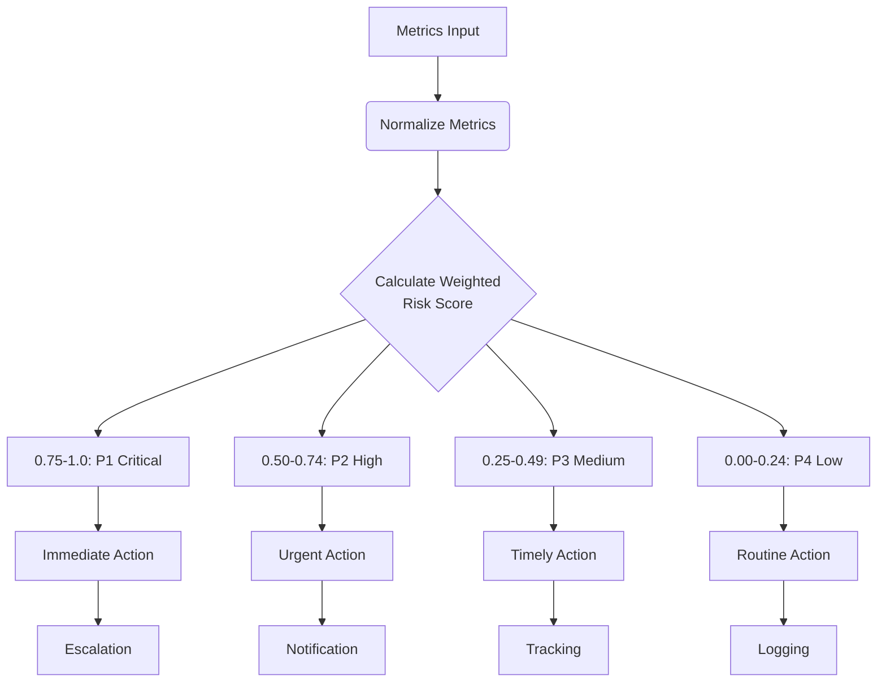
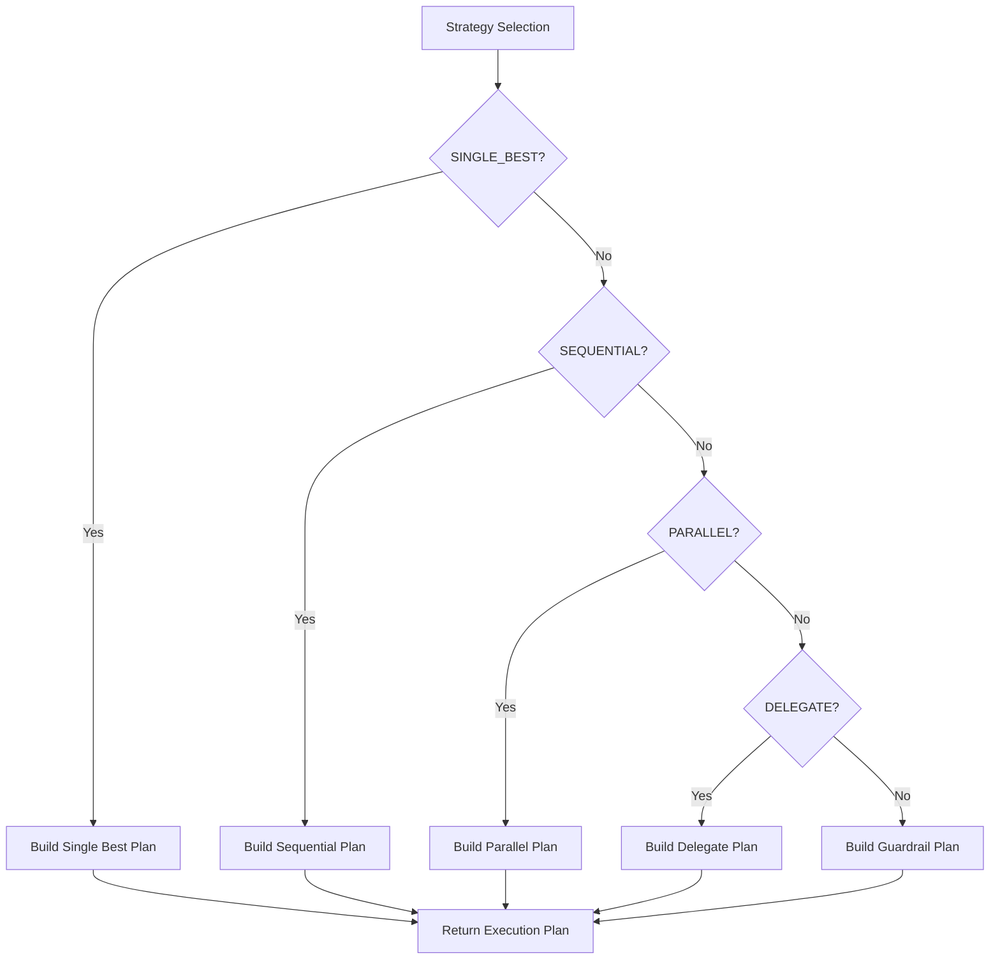
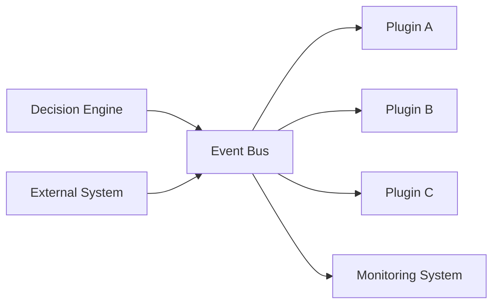
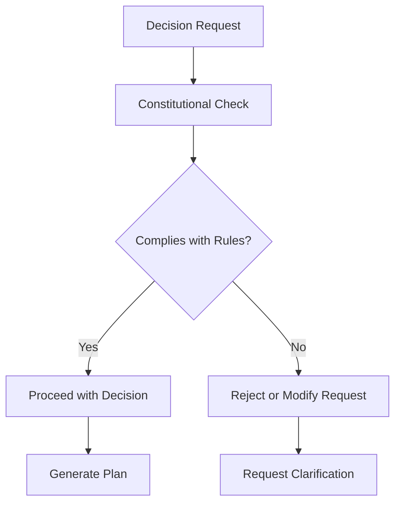
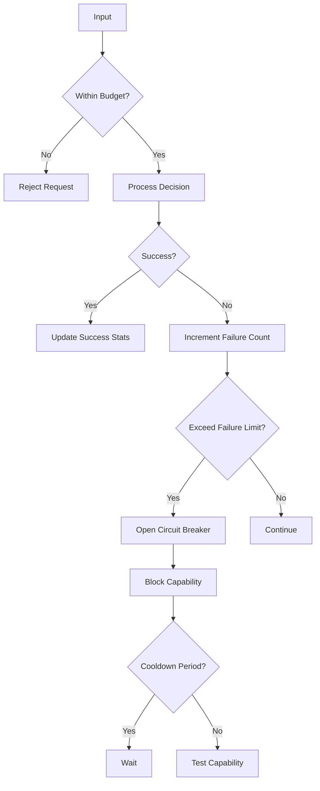

# Decision Engine

<cite>
**Referenced Files in This Document**   
- [decision_engine.py](file://src/core/decision_engine.py)
- [decision_policy.py](file://src/core/decision_policy.py)
- [decision_policy_v1.py](file://src/core/decision_policy_v1.py)
- [risk_engine.py](file://src/core/risk_engine.py)
- [event_bus.py](file://src/core/event_bus.py)
- [pilot_decision.yaml](file://prompts/contracts/pilot_decision.yaml)
- [self_heal_decision.yaml](file://prompts/contracts/self_heal_decision.yaml)
</cite>

## Table of Contents
1. [Introduction](#introduction)
2. [Architecture Overview](#architecture-overview)
3. [Decision Lifecycle](#decision-lifecycle)
4. [Policy Evaluation](#policy-evaluation)
5. [Risk Assessment](#risk-assessment)
6. [Action Selection](#action-selection)
7. [Integration Points](#integration-points)
8. [Performance Considerations](#performance-considerations)
9. [Decision Patterns](#decision-patterns)
10. [Configuration Options](#configuration-options)

## Introduction

The Decision Engine in the Super Alita framework serves as the central intelligence unit responsible for making autonomous decisions based on environmental inputs, system state, and predefined policies. It implements a sophisticated decision-making architecture that combines policy evaluation, risk assessment, and action selection to enable intelligent agent behavior. The engine operates within a distributed system architecture, integrating with various components including the event bus, planning system, and constitutional governance framework to ensure safe and reliable operation.

The Decision Engine follows a structured decision lifecycle from input evaluation to action recommendation, incorporating multiple safeguards and optimization techniques. It supports various decision policy implementations that can be configured based on specific use cases and operational requirements. The system is designed for real-time decision making with built-in reliability features to handle edge cases and maintain system stability.

**Section sources**
- [decision_engine.py](file://src/core/decision_engine.py#L1-L215)
- [decision_policy.py](file://src/core/decision_policy.py#L1-L937)

## Architecture Overview

The Decision Engine architecture consists of several interconnected components that work together to process inputs and generate appropriate actions. At its core, the engine uses a policy-driven approach to decision making, where different policy implementations can be selected based on the context and requirements.

**Diagram sources**
- [decision_engine.py](file://src/core/decision_engine.py#L1-L215)
- [decision_policy.py](file://src/core/decision_policy.py#L1-L937)
- [event_bus.py](file://src/core/event_bus.py#L1-L615)

## Decision Lifecycle

The decision lifecycle in the Super Alita framework follows a systematic process from input evaluation to action recommendation. This lifecycle ensures that decisions are made in a consistent and reliable manner while incorporating necessary safeguards and optimizations.

**Diagram sources**
- [decision_engine.py](file://src/core/decision_engine.py#L1-L215)
- [decision_policy.py](file://src/core/decision_policy.py#L1-L937)
- [risk_engine.py](file://src/core/risk_engine.py#L1-L340)

**Section sources**
- [decision_engine.py](file://src/core/decision_engine.py#L1-L215)
- [decision_policy.py](file://src/core/decision_policy.py#L1-L937)

## Policy Evaluation

The policy evaluation component of the Decision Engine is responsible for selecting the appropriate decision policy based on the input context and system state. The engine supports multiple policy implementations, each designed for specific types of decisions and operational scenarios.

The primary policy implementation, `DecisionPolicyEngine`, follows a structured approach to decision making:

1. **Intent Classification**: The engine first classifies the user's intent using keyword matching and semantic analysis.
2. **Goal Synthesis**: Based on the classified intent, the engine synthesizes a structured goal with defined success criteria and constraints.
3. **Capability Matching**: The engine identifies candidate capabilities from various registries (normal, MCP, neural_atom) that could fulfill the goal.
4. **Utility Calculation**: Each candidate capability is scored based on multiple factors including schema fitness, text similarity, precondition satisfaction, historical success, and risk penalty.
5. **Strategy Selection**: The engine selects an appropriate execution strategy (SINGLE_BEST, SEQUENTIAL, PARALLEL, DELEGATE, GUARDRAIL) based on the candidate utilities and goal requirements.

The policy evaluation process incorporates machine learning techniques through multi-armed bandit algorithms, which learn from past decisions to improve future recommendations. The engine maintains statistics on capability performance, including win rates, latency, and cost, which are used to inform decision making.

**Diagram sources**
- [decision_policy.py](file://src/core/decision_policy.py#L1-L937)
- [decision_policy_v1.py](file://src/core/decision_policy_v1.py#L1-L982)

**Section sources**
- [decision_policy.py](file://src/core/decision_policy.py#L1-L937)
- [decision_policy_v1.py](file://src/core/decision_policy_v1.py#L1-L982)

## Risk Assessment

The risk assessment component of the Decision Engine evaluates the potential risks associated with proposed actions and decisions. This assessment is critical for ensuring system safety and preventing undesirable outcomes.

The risk engine calculates a comprehensive risk score based on multiple metrics, each weighted according to its importance:

- **Mailbox Pressure** (40%): Measures system responsiveness and queue utilization
- **Stale Rate** (30%): Indicates concurrency issues and processing delays
- **Concurrency Load** (20%): Reflects system utilization and resource contention
- **Ignored Triggers Rate** (10%): May indicate design issues or configuration problems

The risk assessment process converts these normalized metrics into a single risk score between 0 and 1, which is then mapped to a priority level (P1-P4). The system implements cooldown protection to prevent rapid priority changes and alert thrashing, ensuring stable prioritization.

The risk engine also identifies specific risk factors based on the goal's risk level and the side effects of candidate capabilities. For high-risk goals, the engine may require human confirmation or implement additional safeguards.

**Diagram sources**
- [risk_engine.py](file://src/core/risk_engine.py#L1-L340)

**Section sources**
- [risk_engine.py](file://src/core/risk_engine.py#L1-L340)
- [decision_policy.py](file://src/core/decision_policy.py#L1-L937)

## Action Selection

The action selection process in the Decision Engine determines the specific actions to take based on the evaluated policies and assessed risks. This process results in the generation of an execution plan in Plan DSL format, which specifies the sequence of operations to be performed.

The engine supports multiple execution strategies:

- **SINGLE_BEST**: Selects the single capability with the highest utility score
- **SEQUENTIAL**: Executes multiple capabilities in a defined order when dependencies exist
- **PARALLEL**: Executes independent subtasks simultaneously
- **DELEGATE**: Hands off the task to a specialized sub-agent
- **GUARDRAIL**: Requires safety checks or human confirmation before proceeding

The action selection process incorporates budget constraints, including maximum steps, tool calls, timeout, and cost cap, to ensure efficient resource utilization. The engine also implements circuit breaker patterns to prevent repeated failures with problematic capabilities.

**Diagram sources**
- [decision_policy.py](file://src/core/decision_policy.py#L1-L937)

**Section sources**
- [decision_policy.py](file://src/core/decision_policy.py#L1-L937)

## Integration Points

The Decision Engine integrates with several key components of the Super Alita framework to enable comprehensive decision making and system coordination.

### Event System Integration

The engine uses the Redis-backed event bus for distributed communication, allowing it to receive inputs and publish decisions across the system. The event bus provides high-performance message passing with throughput optimization features like orjson for fast JSON parsing.

**Diagram sources**
- [event_bus.py](file://src/core/event_bus.py#L1-L615)

### Planning System Integration

The Decision Engine works closely with the planning system to generate execution plans in Plan DSL format. These plans specify the sequence of operations, tool calls, and conditional logic needed to accomplish the desired goal.

### Constitutional Governance Integration

The engine incorporates constitutional governance through contract-based decision making, where specific rules and constraints are enforced during the decision process. This ensures that all actions comply with predefined ethical and operational guidelines.

**Diagram sources**
- [pilot_decision.yaml](file://prompts/contracts/pilot_decision.yaml)
- [self_heal_decision.yaml](file://prompts/contracts/self_heal_decision.yaml)

**Section sources**
- [event_bus.py](file://src/core/event_bus.py#L1-L615)
- [pilot_decision.yaml](file://prompts/contracts/pilot_decision.yaml)
- [self_heal_decision.yaml](file://prompts/contracts/self_heal_decision.yaml)

## Performance Considerations

The Decision Engine is designed for real-time decision making with several performance optimizations and reliability features.

### Real-time Decision Making

The engine implements anti-thrash protection mechanisms to prevent alert storms and system overload:

- **Hysteresis**: Prevents flapping by requiring metrics to clear a lower threshold before returning to normal state
- **Debouncing**: Enforces minimum intervals between alerts to prevent spam
- **Deduplication**: Prevents duplicate alerts for the same issue

These mechanisms are implemented through the `AlertGate` class, which tracks the last firing time of each alert and enforces minimum intervals.

### Reliability Features

The engine incorporates several reliability features to ensure stable operation:

- **Circuit Breaker Pattern**: Prevents repeated failures by temporarily disabling problematic capabilities
- **Cooldown Protection**: Prevents rapid priority changes in the risk engine
- **Fallback Plans**: Provides safe alternatives when no suitable capabilities are found
- **State Tracking**: Maintains context across multiple interactions

The system also includes comprehensive logging and monitoring capabilities, with metrics tracking for events published, received, and processed, as well as handler invocation statistics.

**Section sources**
- [decision_engine.py](file://src/core/decision_engine.py#L1-L215)
- [risk_engine.py](file://src/core/risk_engine.py#L1-L340)

## Decision Patterns

The Decision Engine implements several common decision patterns that incorporate risk assessment and policy compliance.

### Bootstrap Pattern

The bootstrap pattern handles system initialization and setup tasks. It follows a sequential execution strategy to ensure proper setup order:

1. Clone or pull repository
2. Ensure environment configuration
3. Install dependencies
4. Start runtime service
5. Perform health check

This pattern includes risk assessment to verify that all preconditions are met before proceeding and implements fallback mechanisms if any step fails.

### Query Pattern

The query pattern handles information retrieval tasks with a focus on read-only operations and low risk. It typically uses the SINGLE_BEST strategy to select the most appropriate capability for retrieving the requested information.

### Modify Pattern

The modify pattern handles update operations and includes enhanced risk assessment due to the potential for destructive changes. It evaluates side effects such as "delete", "remove", "destroy", and "overwrite" and applies appropriate risk penalties.

### Collaborate Pattern

The collaborate pattern handles multi-step coordination tasks and may use the DELEGATE strategy to hand off specialized tasks to sub-agents. This pattern incorporates constitutional checks to ensure compliance with collaboration protocols.

**Section sources**
- [decision_policy.py](file://src/core/decision_policy.py#L1-L937)
- [decision_policy_v1.py](file://src/core/decision_policy_v1.py#L1-L982)

## Configuration Options

The Decision Engine provides extensive configuration options to customize its behavior for different use cases.

### Policy Configuration

The `PolicyConfig` class defines various parameters that control decision making:

- **Matching Weights**: Controls the importance of different matching factors (schema fit, text similarity, preconditions, history, risk)
- **Utility Parameters**: Alpha (latency), beta (cost), and gamma (risk) coefficients for utility calculation
- **Thresholds**: Minimum match score, minimum utility, and parallel execution delta
- **Circuit Breaker**: Number of failures, window duration, and cooldown period
- **Safety Settings**: Whether high-risk operations require human confirmation

### Risk Configuration

The `RiskWeights` class allows customization of the risk scoring algorithm by adjusting the relative importance of different metrics:

- Mailbox pressure
- Stale rate
- Concurrency load
- Ignored triggers rate

These weights must sum to 1.0 and can be tuned based on the specific operational environment and priorities.

### Execution Budget

The `Budget` class defines constraints for execution plans:

- Maximum number of steps
- Maximum number of tool calls
- Timeout duration in milliseconds
- Cost cap

These constraints help prevent resource exhaustion and ensure efficient operation.

**Section sources**
- [decision_policy.py](file://src/core/decision_policy.py#L1-L937)
