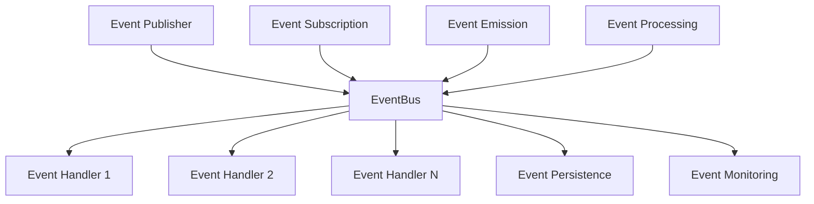
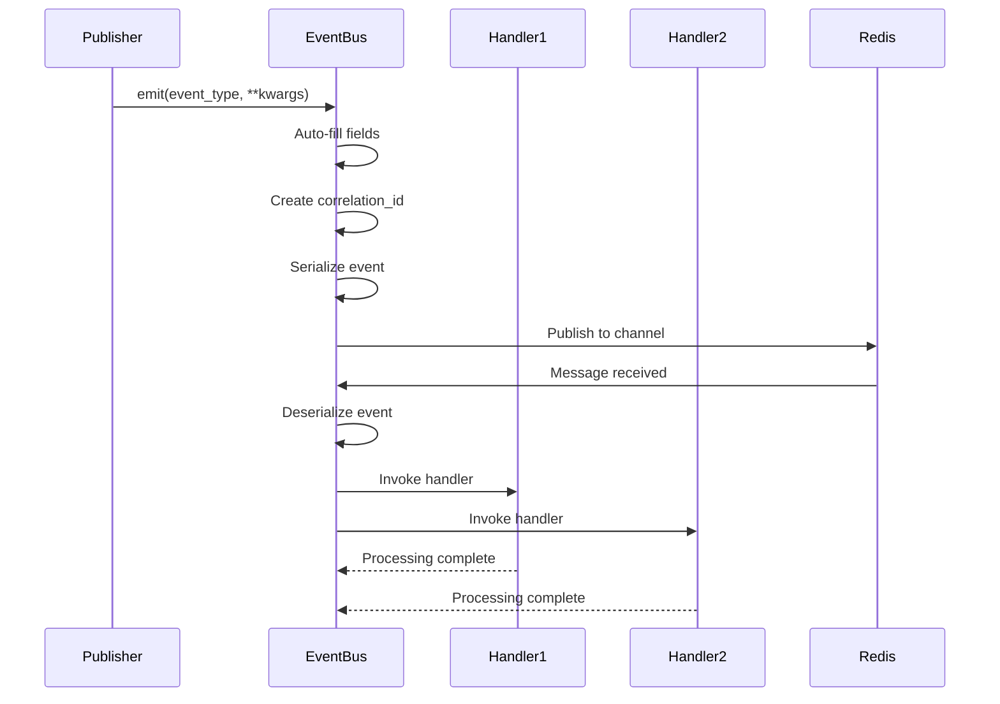
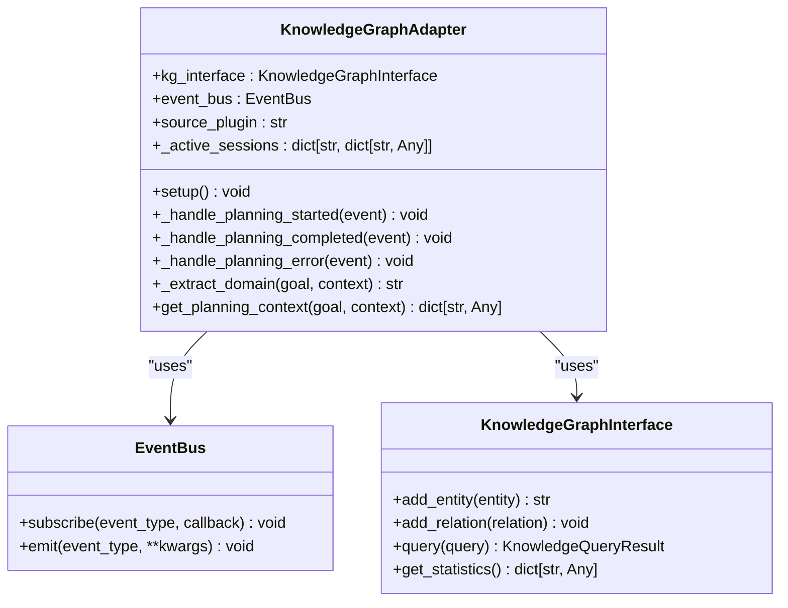
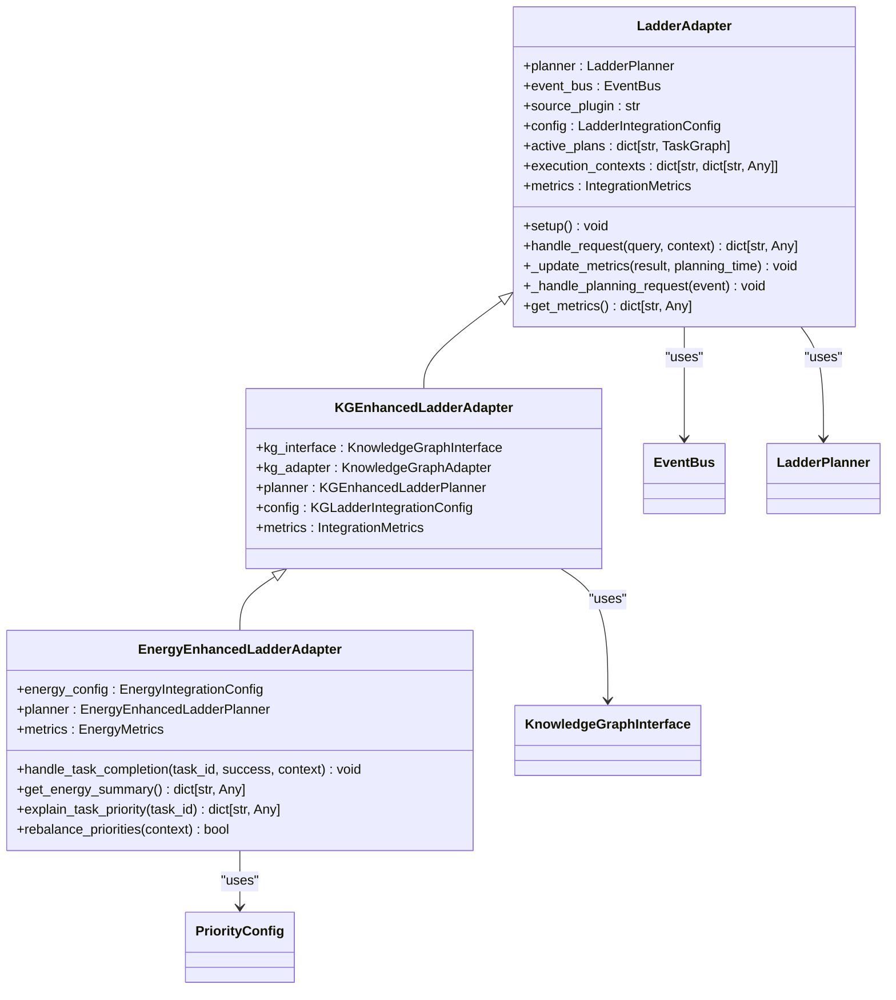
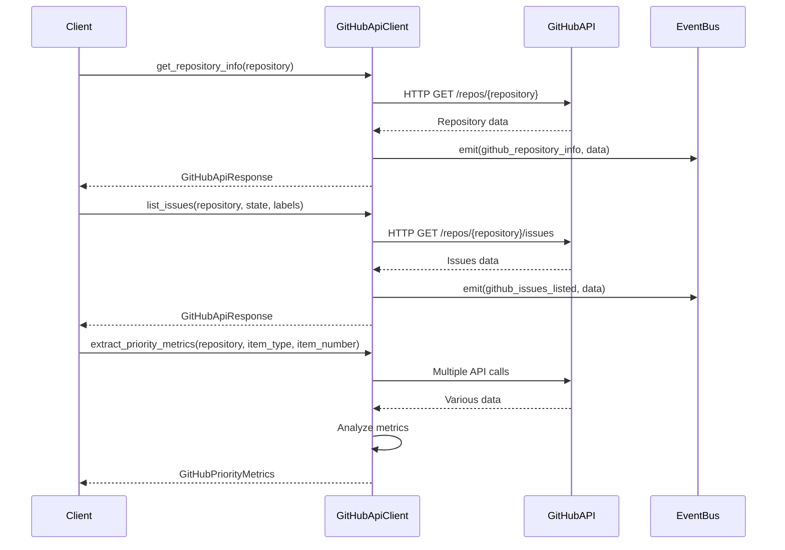

# Policy Integration

<cite>
**Referenced Files in This Document**   
- [need_detector.py](file://src/policies/need_detector.py)
- [events.py](file://mangle/src/core/events.py)
- [cortex_integration.py](file://src/integration/cortex_integration.py)
- [github_api.py](file://src/integration/github_api.py)
- [event_bus.py](file://src/core/event_bus.py)
- [events.py](file://src/core/events.py)
- [kg_adapter.py](file://src/knowledge_graph/kg_adapter.py)
- [cortex_adapter.py](file://src/ladder/integration/cortex_adapter.py)
- [energy_enhanced_adapter.py](file://src/ladder/prioritization/energy_enhanced_adapter.py)
- [kg_enhanced_adapter.py](file://src/ladder/integration/kg_enhanced_adapter.py)
</cite>

## Table of Contents
1. [Introduction](#introduction)
2. [Core Policy Integration Mechanisms](#core-policy-integration-mechanisms)
3. [Event Handling and State Management](#event-handling-and-state-management)
4. [Cross-Component Communication Patterns](#cross-component-communication-patterns)
5. [Integration with External Systems](#integration-with-external-systems)
6. [System Reliability and Error Handling](#system-reliability-and-error-handling)
7. [Performance Considerations and Latency Solutions](#performance-considerations-and-latency-solutions)
8. [Conclusion](#conclusion)

## Introduction
The Policy Integration component in the Super Alita framework serves as the central nervous system for decision-making and cross-component coordination. This document provides a comprehensive analysis of how decision policies integrate with the broader system architecture, focusing on event handling, state management, and communication patterns. The integration framework enables seamless interaction between various system components through a robust event-driven architecture, allowing for dynamic policy enforcement and adaptive behavior. By leveraging the event bus and knowledge graph, the system achieves high levels of reliability and extensibility, making it suitable for both beginners and experienced developers who wish to extend the framework with custom integrations.

## Core Policy Integration Mechanisms

The Super Alita framework implements policy integration through a sophisticated event-driven architecture centered around the EventBus system. The NeedDetector class in the policies module exemplifies the core policy mechanism by analyzing natural language task descriptions to identify required capabilities. This detector uses regular expression patterns to classify tasks into categories such as web scraping, ETL processes, API clients, and research assistance. When a task description is processed, the detector returns a list of capability kinds that the system should activate, effectively serving as a policy decision engine that determines which tools and services should be engaged for a given task.

The integration of decision policies with external systems is facilitated through specialized adapters that bridge the gap between the core framework and external services. These adapters implement consistent interfaces while providing domain-specific functionality, ensuring that policy decisions can be executed across different system boundaries. The framework's modular design allows for the creation of new adapters without modifying the core policy engine, promoting extensibility and maintainability.

**Section sources**
- [need_detector.py](file://src/policies/need_detector.py#L6-L70)

## Event Handling and State Management

### EventBus Architecture
The EventBus system serves as the backbone of event handling in the Super Alita framework, providing a robust mechanism for asynchronous communication between components. The EventBus class implements a Redis-backed event bus that supports high-performance message passing with comprehensive error handling and throughput optimization. Key features include automatic field population, correlation ID support, and idempotent handler registration to prevent duplicate processing. The system uses orjson for faster JSON serialization when available, falling back to the standard library's json module when necessary.



**Diagram sources**
- [event_bus.py](file://src/core/event_bus.py#L48-L610)

### Event Lifecycle Management
The event handling process follows a well-defined lifecycle from emission to processing. When an event is emitted through the `emit` method, the system automatically populates mandatory fields such as source_plugin, event_id, and timestamp if they are not provided. The correlation_id is automatically generated to enable traceability across distributed components. Events are serialized using a custom JSON serializer that handles datetime objects and other non-serializable types, ensuring consistent data representation across the system.

State management is implemented through a combination of in-memory state tracking and persistent storage. The EventBus maintains metrics such as events_published, events_received, and handlers_invoked to monitor system performance. These metrics are updated in real-time and can be accessed through the get_metrics method, providing valuable insights into system throughput and reliability. The system also implements a listener loop that continuously monitors Redis channels for incoming messages, ensuring timely event processing.



**Diagram sources**
- [event_bus.py](file://src/core/event_bus.py#L337-L379)
- [events.py](file://src/core/events.py#L0-L767)

**Section sources**
- [event_bus.py](file://src/core/event_bus.py#L48-L610)
- [events.py](file://src/core/events.py#L0-L767)

## Cross-Component Communication Patterns

### Adapter Pattern Implementation
The framework employs the adapter pattern extensively to facilitate communication between different system components. The KnowledgeGraphAdapter class demonstrates this pattern by bridging the gap between the event-driven architecture and the knowledge graph persistence layer. This adapter subscribes to planning events and extracts knowledge from planning outcomes, updating the knowledge graph with new entities, relations, and patterns. The adapter maintains active sessions to track planning context and provides relevant planning context from the knowledge graph when requested.



**Diagram sources**
- [kg_adapter.py](file://src/knowledge_graph/kg_adapter.py#L29-L312)

### LADDER Integration Adapters
The LADDER integration adapters extend the adapter pattern to provide specialized functionality for planning and execution. The LadderAdapter class serves as the base implementation, handling planning requests and coordinating between the event bus and the LADDER planner. It maintains state through active_plans and execution_contexts dictionaries, tracking the progress of ongoing planning sessions. The adapter emits standardized events such as planning_started, planning_completed, and planning_error, enabling other components to react to planning lifecycle changes.

The framework includes specialized variants of the LADDER adapter that incorporate additional capabilities. The KGEnhancedLadderAdapter extends the base functionality with knowledge graph integration, while the EnergyEnhancedLadderAdapter adds energy-based task prioritization. These adapters demonstrate the framework's extensibility, allowing new capabilities to be added through inheritance and composition rather than modifying existing code.



**Diagram sources**
- [cortex_adapter.py](file://src/ladder/integration/cortex_adapter.py#L50-L212)
- [kg_enhanced_adapter.py](file://src/ladder/integration/kg_enhanced_adapter.py#L56-L295)
- [energy_enhanced_adapter.py](file://src/ladder/prioritization/energy_enhanced_adapter.py#L55-L340)

**Section sources**
- [kg_adapter.py](file://src/knowledge_graph/kg_adapter.py#L29-L312)
- [cortex_adapter.py](file://src/ladder/integration/cortex_adapter.py#L50-L212)
- [kg_enhanced_adapter.py](file://src/ladder/integration/kg_enhanced_adapter.py#L56-L295)
- [energy_enhanced_adapter.py](file://src/ladder/prioritization/energy_enhanced_adapter.py#L55-L340)

## Integration with External Systems

### GitHub API Integration
The GitHubApiClient class provides comprehensive integration with the GitHub API, enabling the system to interact with repositories, issues, pull requests, and other GitHub resources. The client implements robust rate limiting to comply with GitHub's API restrictions, automatically handling rate limit resets and providing fallback mechanisms for failed requests. The integration includes specialized methods for extracting priority metrics from GitHub items, analyzing pull requests for merge conflicts, and detecting security alerts based on labels and content.



**Diagram sources**
- [github_api.py](file://src/integration/github_api.py#L0-L396)

### Cortex Integration
The CortexIntegration class provides seamless integration with the Cortex-assisted development system, enabling cognitive agent capabilities through a well-defined interface. The integration includes a policy adapter that determines when to use Cortex based on confidence levels and contextual information. The system tracks autonomy scores and manages phase advancement in the weaning orchestrator, allowing for gradual reduction of Cortex dependency as the agent's capabilities improve.

The integration emits events such as phase_advanced and phase_demoted to notify other components of changes in the agent's development phase. It also provides a comprehensive system status endpoint that returns information about the current phase, learning statistics, autonomy status, and available Cortex providers. This enables other components to adapt their behavior based on the agent's current capabilities and development stage.

```mermaid
classDiagram
    class CortexIntegration {
        +event_bus: EventBus
        +graph: TemporalGraph
        +navigator: NeuralNavigator
        +cortex_adapter: CortexAdapterPlugin
        +autonomy_tracker: AutonomyTracker
        +weaning_orchestrator: CortexWeaningOrchestrator
        +gap_detector: KnowledgeGapDetector
        +name: str
        +shutdown() void
        +handle_autonomy_update(event) void
        +should_use_cortex(confidence, context) bool
        +get_system_status() dict[str, Any]
    }
    
    class _PolicyAdapter {
        +orchestrator: CortexWeaningOrchestrator
        +should_use_cortex(confidence, context) bool
    }
    
    CortexIntegration --> EventBus : "uses