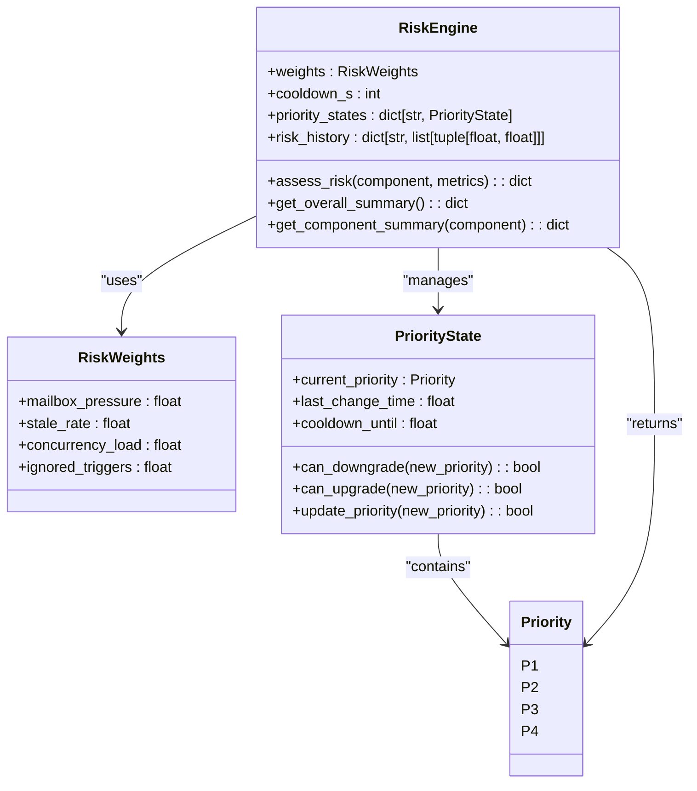
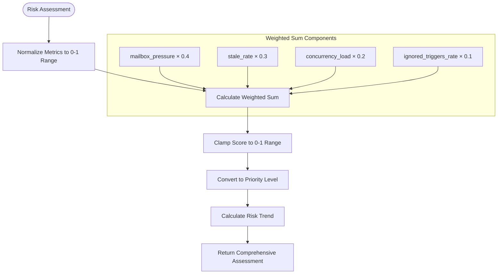
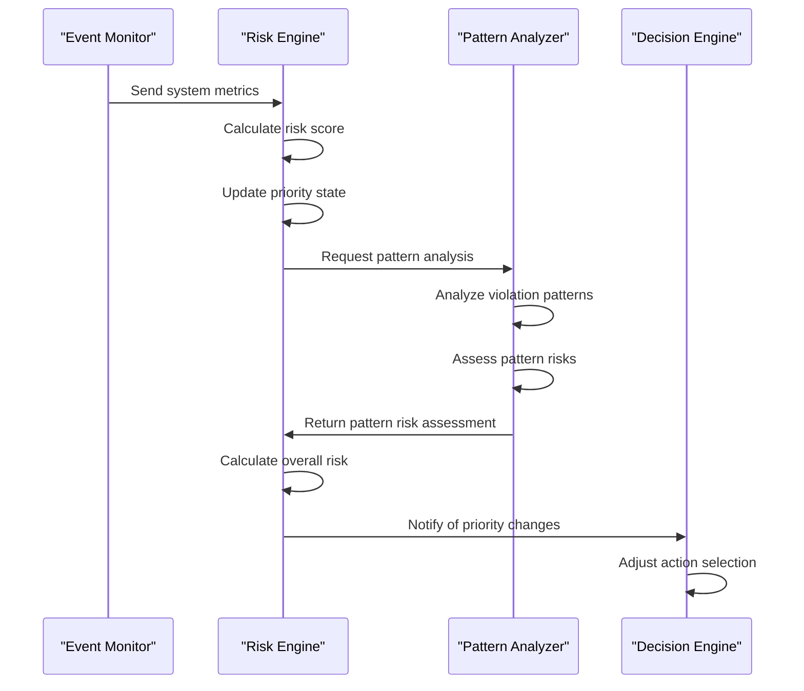
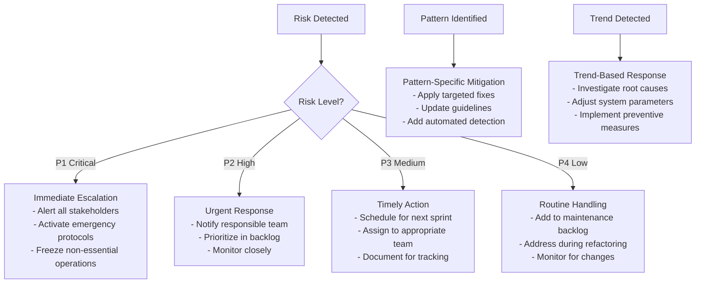
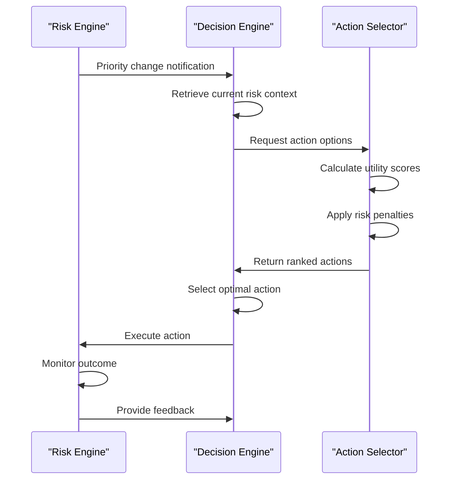
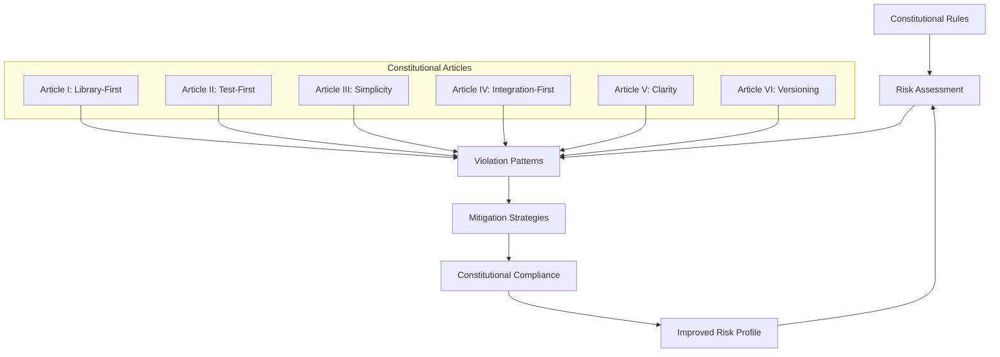
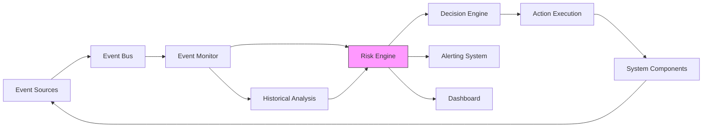
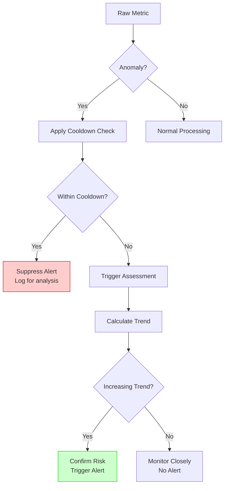

# Risk Assessment

<cite>
**Referenced Files in This Document**   
- [risk_engine.py](file://src/core/risk_engine.py)
- [pattern_analyzer.py](file://src/performance_monitoring/advanced/pattern_analyzer.py)
- [policy_engine.py](file://src/core/optimization/policy_engine.py)
</cite>

## Table of Contents
1. [Introduction](#introduction)
2. [Risk Engine Architecture](#risk-engine-architecture)
3. [Risk Scoring Algorithm](#risk-scoring-algorithm)
4. [Threat Detection Mechanisms](#threat-detection-mechanisms)
5. [Mitigation Strategies](#mitigation-strategies)
6. [Integration with Decision Engine](#integration-with-decision-engine)
7. [Relationship with Constitutional Governance](#relationship-with-constitutional-governance)
8. [Event Monitoring Integration](#event-monitoring-integration)
9. [False Positive Management](#false-positive-management)
10. [Risk Model Customization](#risk-model-customization)
11. [Threshold Tuning](#threshold-tuning)
12. [Conclusion](#conclusion)

## Introduction

The Risk Assessment component in the Super Alita framework serves as a critical safeguard mechanism that evaluates system health, identifies potential threats, and influences decision-making processes. This comprehensive system combines quantitative risk scoring with qualitative governance principles to ensure safe and reliable operation. The risk engine continuously monitors key performance indicators and system metrics, converting them into actionable risk scores that drive priority adjustments and mitigation strategies.

This documentation provides a detailed examination of the risk assessment implementation, focusing on the core risk engine, its integration with other system components, and practical considerations for customization and optimization. The system is designed to be accessible to beginners while providing sufficient technical depth for experienced developers to understand and extend its capabilities.

## Risk Engine Architecture

The Risk Engine architecture is built around a stateful assessment system that tracks risk over time and applies cooldown protections to prevent rapid priority oscillations. The core components work together to provide a stable and reliable risk assessment framework.

**Diagram sources**
- [risk_engine.py](file://src/core/risk_engine.py#L0-L339)

**Section sources**
- [risk_engine.py](file://src/core/risk_engine.py#L0-L339)

The RiskEngine class serves as the central orchestrator of risk assessment, maintaining state across multiple components. It stores historical risk data and priority states, allowing for trend analysis and informed decision-making. The engine uses configurable weights to balance different risk factors and applies cooldown periods to prevent excessive priority changes.

The PriorityState class implements a sophisticated state machine that governs priority transitions with built-in cooldown protection. This prevents rapid oscillations between priority levels, which could destabilize the system. The state machine allows immediate upgrades (escalations) for urgent issues but requires cooldown periods for downgrades, ensuring that resolved issues remain monitored for a sufficient period.

## Risk Scoring Algorithm

The risk scoring algorithm converts multiple normalized metrics into a single risk score between 0 and 1, where higher values indicate greater risk. The algorithm uses a weighted sum approach that combines four key metrics, each representing a different aspect of system health.

**Diagram sources**
- [risk_engine.py](file://src/core/risk_engine.py#L50-L86)
- [risk_engine.py](file://src/core/risk_engine.py#L166-L245)

**Section sources**
- [risk_engine.py](file://src/core/risk_engine.py#L50-L86)
- [risk_engine.py](file://src/core/risk_engine.py#L166-L245)

The risk_score function takes four normalized metrics and combines them using configurable weights. Each metric represents a different dimension of system risk:

- **Mailbox Pressure** (40% weight): Measures the utilization of component mailboxes, indicating potential responsiveness issues
- **Stale Rate** (30% weight): Tracks the rate of stale completions, which may indicate concurrency problems
- **Concurrency Load** (20% weight): Monitors concurrent operation load on the system
- **Ignored Triggers Rate** (10% weight): Measures the rate of ignored triggers, which could indicate design issues

The weights are designed to reflect the relative importance of each metric, with mailbox pressure having the highest weight as it directly impacts system responsiveness. The algorithm ensures that all inputs are normalized to the 0-1 range and that the final score is clamped within the same range to maintain consistency.

## Threat Detection Mechanisms

The threat detection system employs multiple layers of analysis to identify potential risks, combining real-time metric monitoring with pattern-based analysis and trend detection. This multi-faceted approach ensures comprehensive coverage of both immediate threats and emerging risks.

**Diagram sources**
- [risk_engine.py](file://src/core/risk_engine.py#L166-L245)
- [pattern_analyzer.py](file://src/performance_monitoring/advanced/pattern_analyzer.py#L0-L714)

**Section sources**
- [risk_engine.py](file://src/core/risk_engine.py#L166-L245)
- [pattern_analyzer.py](file://src/performance_monitoring/advanced/pattern_analyzer.py#L0-L714)

The primary threat detection mechanism is the real-time assessment of system metrics through the assess_risk method. This method evaluates incoming metrics, calculates a risk score, and determines whether priority changes are warranted. The engine maintains a history of risk scores for each component, enabling trend analysis and preventing false positives from transient spikes.

Complementing this real-time monitoring is the pattern-based analysis system implemented in the AdvancedConstitutionalValidator. This component identifies violation patterns in code and system behavior, assessing risks based on frequency and severity. The system maintains a registry of violation patterns, each with associated severity levels and mitigation strategies.

The _calculate_trend method provides an additional layer of threat detection by analyzing historical risk data. It compares recent risk scores with older ones to identify increasing, decreasing, or stable trends. This helps distinguish between temporary anomalies and genuine emerging threats, reducing false positives and enabling proactive mitigation.

## Mitigation Strategies

The risk assessment system implements a comprehensive set of mitigation strategies that address both immediate threats and systemic issues. These strategies are designed to be both reactive and proactive, responding to current risks while preventing future occurrences.

**Diagram sources**
- [risk_engine.py](file://src/core/risk_engine.py#L118-L155)
- [pattern_analyzer.py](file://src/performance_monitoring/advanced/pattern_analyzer.py#L673-L702)

**Section sources**
- [risk_engine.py](file://src/core/risk_engine.py#L118-L155)
- [pattern_analyzer.py](file://src/performance_monitoring/advanced/pattern_analyzer.py#L673-L702)

The mitigation strategies are tiered according to the priority level of the detected risk. Critical risks (P1) trigger immediate escalation procedures, including alerts to all stakeholders and activation of emergency protocols. High-risk issues (P2) require urgent response with notification to responsible teams and close monitoring.

For pattern-based risks, the system provides specific mitigation strategies tailored to each violation pattern. For example, frequent occurrences of "custom HTTP implementation" trigger recommendations to review library usage and update dependency guidelines. Similarly, missing test files prompt suggestions to create corresponding test files and implement test-first practices.

The system also implements cooldown periods as a mitigation strategy to prevent overreaction to transient issues. When a priority is escalated, a cooldown period is established during which downgrades are prevented. This ensures that resolved issues remain under observation for a sufficient period, preventing premature reversion to lower priority levels.

## Integration with Decision Engine

The risk assessment component integrates closely with the decision engine to influence action selection and execution strategies. This integration ensures that higher-risk situations receive appropriate attention and that risk considerations are factored into all decision-making processes.

**Diagram sources**
- [risk_engine.py](file://src/core/risk_engine.py#L166-L245)
- [policy_engine.py](file://src/core/optimization/policy_engine.py#L154-L187)

**Section sources**
- [risk_engine.py](file://src/core/risk_engine.py#L166-L245)
- [policy_engine.py](file://src/core/optimization/policy_engine.py#L154-L187)

The integration between risk assessment and decision making occurs through several mechanisms. The DecisionPolicyEngine incorporates risk considerations directly into its utility calculations through the risk_penalty method. This method applies penalties to actions based on their potential side effects and the current risk level, discouraging risky actions in high-risk scenarios.

When the risk engine detects a priority change, it notifies the decision engine, which then adjusts its action selection strategy accordingly. Higher-risk situations trigger more conservative decision-making, with greater emphasis on safety and reliability over efficiency or speed.

The decision engine also uses risk information to determine execution strategies. In high-risk scenarios, it may choose sequential execution over parallel execution to maintain better control and monitoring. It can also activate guardrail strategies that limit the scope of actions or require additional approvals before proceeding.

## Relationship with Constitutional Governance

The risk assessment system maintains a strong relationship with constitutional governance, ensuring that all risk mitigation activities align with the framework's core principles. This integration creates a feedback loop where risk assessments inform constitutional compliance, and constitutional rules guide risk mitigation strategies.

**Diagram sources**
- [pattern_analyzer.py](file://src/performance_monitoring/advanced/pattern_analyzer.py#L0-L714)

**Section sources**
- [pattern_analyzer.py](file://src/performance_monitoring/advanced/pattern_analyzer.py#L0-L714)

Each constitutional article is mapped to specific risk patterns and mitigation strategies. For example, Article I (Library-First) is associated with patterns like "custom HTTP implementation," while Article II (Test-First) relates to "missing test file" patterns. This mapping ensures that risk mitigation activities directly support constitutional compliance.

The AdvancedConstitutionalValidator uses the risk assessment system to prioritize compliance activities. High-risk areas receive immediate attention, while lower-risk issues are addressed according to their severity and impact. This risk-based approach to constitutional governance ensures efficient allocation of resources while maintaining high compliance standards.

The system also uses constitutional rules to guide risk mitigation strategies. For instance, when addressing a "missing docstring" violation (related to Article V: Clarity), the recommended mitigation is to improve documentation and clarify naming conventions, directly supporting the constitutional principle of clarity.

## Event Monitoring Integration

The risk assessment component integrates seamlessly with event monitoring systems to receive real-time metrics and provide feedback on system health. This bidirectional integration creates a comprehensive monitoring and response ecosystem that enhances overall system reliability.

**Diagram sources**
- [risk_engine.py](file://src/core/risk_engine.py#L166-L245)

**Section sources**
- [risk_engine.py](file://src/core/risk_engine.py#L166-L245)

The integration begins with event sources generating metrics and logs that are published to the event bus. The event monitor subscribes to relevant events and aggregates metrics from various system components. These aggregated metrics are then forwarded to the risk engine for assessment.

The risk engine processes these metrics to calculate risk scores and determine priority levels. It maintains a history of risk assessments for trend analysis and provides summarized risk information to dashboards and alerting systems.

When significant risk changes occur, the risk engine can trigger specific monitoring actions, such as increasing the sampling rate for certain metrics or activating additional diagnostic tools. This adaptive monitoring approach ensures that resources are focused on areas of highest risk.

The system also uses historical event data to refine its risk assessment models. By analyzing past incidents and their corresponding metrics, the risk engine can improve its scoring algorithms and better predict future risks.

## False Positive Management

The risk assessment system incorporates several mechanisms to minimize false positives and ensure that alerts and priority changes are meaningful and actionable. These mechanisms balance sensitivity with specificity to maintain trust in the system while still detecting genuine threats.

**Diagram sources**
- [risk_engine.py](file://src/core/risk_engine.py#L118-L155)
- [risk_engine.py](file://src/core/risk_engine.py#L247-L289)

**Section sources**
- [risk_engine.py](file://src/core/risk_engine.py#L118-L155)
- [risk_engine.py](file://src/core/risk_engine.py#L247-L289)

The primary mechanism for false positive management is the cooldown system implemented in the PriorityState class. When a priority is escalated due to high risk, a cooldown period is established during which downgrades are prevented. However, if the risk score remains elevated beyond the cooldown period, the system confirms that the issue is persistent and not a transient anomaly.

The trend analysis system provides another layer of protection against false positives. Instead of reacting to single data points, the _calculate_trend method analyzes historical data to identify genuine patterns. A risk score must show a consistent increasing trend (defined as a 5% increase over recent samples