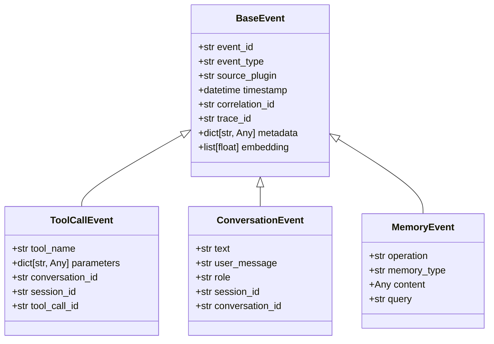
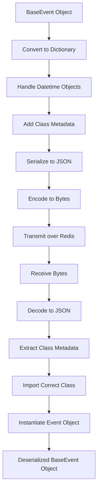
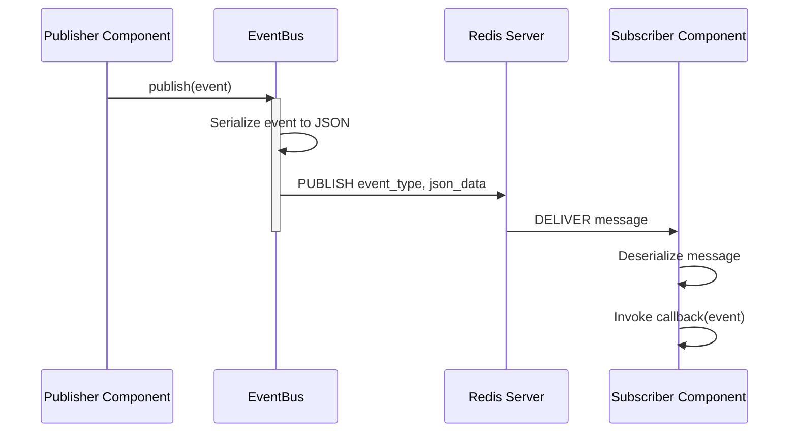

# Event Lifecycle

<cite>
**Referenced Files in This Document**   
- [event_bus.py](file://src/core/event_bus.py)
- [events.py](file://src/core/events.py)
- [event_serializer.py](file://src/core/event_serializer.py)
- [event_builders.py](file://src/utils/event_builders.py)
- [event_schemas.py](file://src/orchestration/event_schemas.py)
- [event_pb2.py](file://src/core/proto/event_pb2.py)
</cite>

## Table of Contents
1. [Introduction](#introduction)
2. [Event Structure and Schema](#event-structure-and-schema)
3. [Event Creation and the Builder Pattern](#event-creation-and-the-builder-pattern)
4. [Serialization and Deserialization Pipeline](#serialization-and-deserialization-pipeline)
5. [Event Publishing and Routing](#event-publishing-and-routing)
6. [Event Consumption and Handling](#event-consumption-and-handling)
7. [Metadata, Correlation, and Tracing](#metadata-correlation-and-tracing)
8. [Schema Evolution and Compatibility](#schema-evolution-and-compatibility)
9. [Common Issues and Best Practices](#common-issues-and-best-practices)

## Introduction
This document provides a comprehensive overview of the Event Lifecycle within the Super Alita system. It details the complete journey of an event from its creation through publishing, routing, and consumption. The document covers the structure of events, the serialization formats used (primarily JSON), and the patterns for constructing and processing events. It explains the use of metadata, correlation IDs, and tracing context to maintain observability across distributed components. The content is designed to be accessible to beginners while providing the technical depth required by experienced developers working with the event system.

**Section sources**
- [event_bus.py](file://src/core/event_bus.py#L0-L615)
- [events.py](file://src/core/events.py#L0-L768)

## Event Structure and Schema
The foundation of the event system is the `BaseEvent` class, which defines a standardized structure for all events. This structure ensures consistency and enables robust processing and analytics across the system.

All events inherit from `BaseEvent`, which includes core telemetry fields such as `event_id`, `event_type`, `source_plugin`, `timestamp`, `correlation_id`, and `trace_id`. The `event_type` field is crucial as it determines the routing of the event to the appropriate subscribers. The `source_plugin` identifies the component that generated the event, which is vital for debugging and monitoring.

The system uses a registry pattern, defined by the `EVENT_TYPES` dictionary in `events.py`, to map event type strings to their corresponding Python classes. This allows for dynamic creation and deserialization of events. For example, an event with `event_type: "tool_call"` will be instantiated as a `ToolCallEvent` object, which has specific fields like `tool_name` and `parameters`.



**Diagram sources**
- [events.py](file://src/core/events.py#L48-L555)

## Event Creation and the Builder Pattern
Events are created using a combination of direct instantiation and a builder pattern. The most common method is to use the `create_event` factory function from `events.py`, which takes an `event_type` and keyword arguments to create the appropriate event class.

For more complex or frequently created events, the system employs a builder pattern. A prime example is the `build_tool_call_event` function in `event_builders.py`. This function ensures that all required fields for a `ToolCallEvent` are present and provides safe defaults. It generates unique IDs using `uuid4()` when they are not provided, guaranteeing that every event has a valid and unique `tool_call_id`. This pattern prevents common errors such as missing required fields and promotes consistency in event creation.

```python
# Example of using the builder pattern
from src.utils.event_builders import build_tool_call_event

tool_call = build_tool_call_event(
    source_plugin="pythonic_preprocessor",
    tool_name="web_agent",
    parameters={"query": "latest AI research"},
    conversation_id="conv_123",
    session_id="sess_456"
)
```

**Section sources**
- [events.py](file://src/core/events.py#L748-L752)
- [event_builders.py](file://src/utils/event_builders.py#L14-L41)

## Serialization and Deserialization Pipeline
The event lifecycle relies on a robust serialization and deserialization pipeline to transmit events over the network, primarily using Redis as the message broker.

The `EventSerializer` class in `event_serializer.py` is responsible for converting `BaseEvent` objects into a byte stream for storage and transmission. The process involves:
1.  Converting the event object to a dictionary using Pydantic's `model_dump()` method.
2.  Handling special data types, such as converting `datetime` objects to ISO 8601 strings.
3.  Adding metadata about the event's class and module to enable proper deserialization.
4.  Serializing the dictionary to a JSON string and then encoding it to bytes.

Deserialization is the reverse process. The `deserialize` method takes a byte stream, decodes it to JSON, and then reconstructs the original event object. It uses the `_event_class` and `_event_module` metadata to dynamically import and instantiate the correct event class, ensuring type safety and preserving the event's full functionality.



**Diagram sources**
- [event_serializer.py](file://src/core/event_serializer.py#L18-L108)

## Event Publishing and Routing
Events are published to the system using the `EventBus` class, which acts as a central hub for message distribution. The primary method for publishing is `publish(event: BaseEvent)`, which serializes the event and sends it to a Redis channel named after the event's `event_type`.

The `EventBus` uses Redis's publish/subscribe (pub/sub) model for routing. When a component calls `subscribe(event_type, callback)`, the `EventBus` registers the callback and ensures the underlying Redis connection is subscribed to the corresponding channel. This allows for efficient, fire-and-forget message delivery. The system also supports wildcard subscriptions (using `*`) to allow components to receive all events for comprehensive monitoring or debugging.



**Diagram sources**
- [event_bus.py](file://src/core/event_bus.py#L293-L315)
- [event_bus.py](file://src/core/event_bus.py#L381-L467)

## Event Consumption and Handling
Event consumption is handled by asynchronous callback functions that are registered with the `EventBus`. When an event is published to a channel, the `EventBus`'s listener loop receives the message, deserializes it back into an event object, and invokes all registered callbacks for that event type.

The `EventBus` ensures that handlers are asynchronous (`async def`), allowing for non-blocking, concurrent processing of events. This is critical for maintaining system responsiveness. The listener loop runs continuously, polling Redis for new messages and dispatching them to handlers. Error handling within handlers is isolated to prevent one failing handler from disrupting the processing of other events.

A common pattern is for a component to subscribe to a specific `event_type` and then perform an action based on the event's data. For example, the `MemoryManagerPlugin` subscribes to `tool_call` events. When it receives an event where `tool_name` is "memory_manager", it processes the request (e.g., saving or recalling a memory) and then publishes a `tool_result` event to report its success or failure.

**Section sources**
- [event_bus.py](file://src/core/event_bus.py#L480-L531)
- [event_bus.py](file://src/core/event_bus.py#L293-L315)

## Metadata, Correlation, and Tracing
The event system incorporates several mechanisms to provide context and enable observability across distributed operations.

*   **Correlation ID**: Every `BaseEvent` has a `correlation_id` field, which is automatically generated if not provided. This ID is used to link a chain of related events that stem from a single user request or system operation. For example, a `conversation` event, the subsequent `tool_call` event, and the final `tool_result` event would all share the same `correlation_id`, allowing developers to trace the entire flow of a single user interaction.
*   **Trace ID**: The `trace_id` field is used for deeper debugging, often to track the execution path within a single service or across a complex workflow. It can be set explicitly by components that need to correlate events with external tracing systems.
*   **Metadata**: The `metadata` field is a free-form dictionary that allows any component to attach additional context to an event. This is used for various purposes, such as passing configuration parameters, storing intermediate results, or adding debugging information.

**Section sources**
- [events.py](file://src/core/events.py#L21-L35)

## Schema Evolution and Compatibility
The system is designed to handle schema evolution gracefully. The use of Pydantic models with `ConfigDict(extra="allow")` allows events to contain fields that are not explicitly defined in the model. This means that a newer version of a component can add new fields to an event, and an older component that receives the event will simply ignore the unknown fields, preventing breaking changes.

The `EVENT_ALIASES` dictionary in `events.py` provides a mechanism for backward compatibility. It allows different string values for `event_type` to be mapped to the same event class. For example, both "conversation_message" and "message" are aliased to the "conversation" event type, ensuring that components using different naming conventions can still interoperate.

When making breaking changes to an event schema, the recommended practice is to create a new event type (e.g., `tool_call_v2`) rather than modifying the existing one. This allows both old and new components to coexist during a migration period.

**Section sources**
- [events.py](file://src/core/events.py#L18-L20)
- [events.py](file://src/core/events.py#L50-L50)

## Common Issues and Best Practices
*   **Always Emit a Result**: For request-response patterns like `tool_call`, it is critical that the handling component always publishes a corresponding `tool_result` event. Failing to do so can cause the system to hang, waiting for a response that will never come.
*   **Use the Builder Pattern**: For complex events, use dedicated builder functions (like `build_tool_call_event`) to ensure all required fields are populated correctly and to avoid boilerplate code.
*   **Handle Errors in Handlers**: Always wrap event handler logic in try-except blocks. An unhandled exception in a handler will not stop the `EventBus` but can cause the specific handler to fail silently.
*   **Mind the Payload Size**: While the system can handle large payloads, excessively large events can degrade performance. For large data transfers, consider storing the data elsewhere (e.g., in a database) and sending only a reference in the event.
*   **Use Correlation IDs**: Always propagate the `correlation_id` from incoming events to any new events you publish as part of processing that request. This is essential for debugging and monitoring.