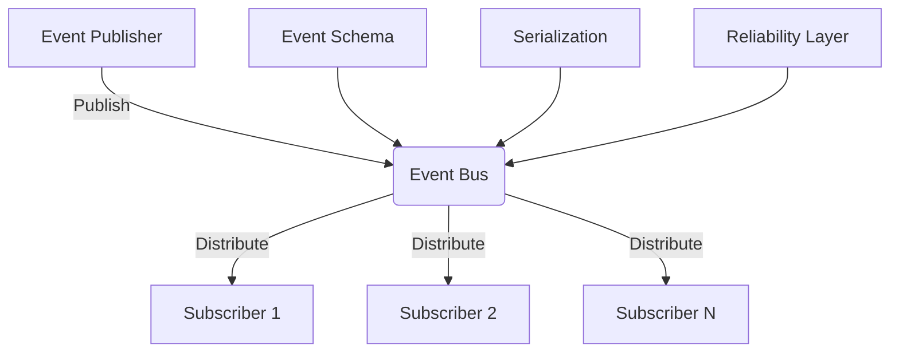
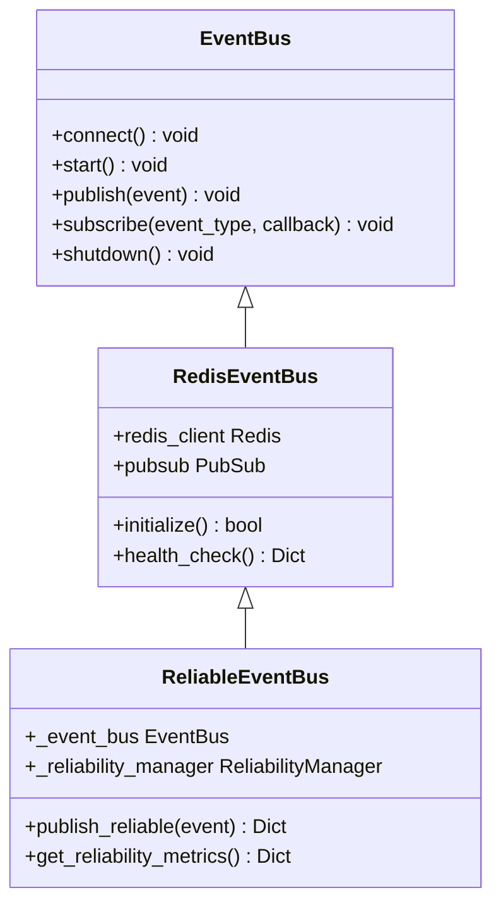

# Event System

<cite>
**Referenced Files in This Document**   
- [src/core/event_bus.py](file://src/core/event_bus.py)
- [src/core/events.py](file://src/core/events.py)
- [src/core/reliable_event_bus.py](file://src/core/reliable_event_bus.py)
- [src/adapters/redis_event_bus.py](file://src/adapters/redis_event_bus.py)
- [src/adapters/event_bus_adapter.py](file://src/adapters/event_bus_adapter.py)
</cite>

## Table of Contents
1. [Introduction](#introduction)
2. [Event Architecture Overview](#event-architecture-overview)
3. [Event Bus Implementations](#event-bus-implementations)
4. [Event Serialization and Message Structure](#event-serialization-and-message-structure)
5. [Event Flow and Processing](#event-flow-and-processing)
6. [Error Handling and Reliability](#error-handling-and-reliability)
7. [Integration with Core Components](#integration-with-core-components)
8. [Performance Considerations](#performance-considerations)
9. [Common Event Patterns](#common-event-patterns)

## Introduction
The Event System in the Super Alita framework provides a robust, decoupled communication mechanism that enables asynchronous, event-driven interactions between various components. This system facilitates loose coupling, scalability, and extensibility by allowing components to communicate through events rather than direct method calls. The event-driven architecture supports multiple transport mechanisms, reliability patterns, and serialization formats to accommodate different deployment scenarios and performance requirements.

**Section sources**
- [src/core/event_bus.py](file://src/core/event_bus.py#L1-L50)
- [src/core/events.py](file://src/core/events.py#L1-L50)

## Event Architecture Overview
The Super Alita event system is built around a publish-subscribe pattern where components emit events that are processed by interested subscribers. The architecture is designed to be flexible, supporting both in-memory and distributed communication through Redis. Events are strongly typed and versioned, ensuring compatibility across different system components.



**Diagram sources**
- [src/core/event_bus.py](file://src/core/event_bus.py#L48-L610)
- [src/core/events.py](file://src/core/events.py#L38-L50)

## Event Bus Implementations
The Super Alita framework provides multiple event bus implementations to accommodate different deployment scenarios and reliability requirements.

### In-Memory Event Bus
The in-memory event bus provides lightweight, high-performance event distribution within a single process. It's suitable for development and testing environments where persistence and fault tolerance are not critical requirements.

### Redis-Backed Event Bus
The Redis-backed implementation provides distributed event distribution across multiple processes and machines. It uses Redis pub/sub for real-time messaging with configurable connection pooling, retry mechanisms, and graceful fallback to in-memory operation when Redis is unavailable.

### Reliable Event Bus
The reliable event bus wraps the Redis-backed implementation with additional reliability features including idempotent processing, circuit breaking, dead letter queue handling, and backpressure management. This implementation is designed for production environments requiring high availability and message delivery guarantees.



**Diagram sources**
- [src/core/event_bus.py](file://src/core/event_bus.py#L48-L610)
- [src/core/reliable_event_bus.py](file://src/core/reliable_event_bus.py#L26-L342)
- [src/adapters/redis_event_bus.py](file://src/adapters/redis_event_bus.py#L30-L326)

## Event Serialization and Message Structure
Events in the Super Alita framework are structured data objects with a consistent schema that includes metadata for routing, tracing, and processing.

### Base Event Structure
All events inherit from the `BaseEvent` class which provides common fields:
- `event_id`: Unique identifier for the event
- `event_type`: Type identifier for routing
- `source_plugin`: Originating component
- `timestamp`: Creation time in UTC
- `correlation_id`: For tracing related events
- `trace_id`: For debugging purposes
- `embedding`: Optional semantic embedding for intelligent routing
- `metadata`: Additional context-specific data

### Serialization Format
Events are serialized to JSON format with special handling for non-serializable objects:
- Datetime objects are converted to ISO8601 format with 'Z' suffix
- Enum values are serialized to their string representation
- Pydantic models are converted to dictionaries using model_dump()
- Exceptions are serialized with type and message information

The system supports optional fast JSON parsing using orjson when available, providing 2-5x performance improvement over the standard library.

**Section sources**
- [src/core/events.py](file://src/core/events.py#L38-L50)
- [src/core/event_bus.py](file://src/core/event_bus.py#L150-L200)

## Event Flow and Processing
The event flow in Super Alita follows a consistent pattern from generation to processing, with mechanisms to ensure reliable delivery and proper error handling.

### Event Generation
Events are generated by system components using the `emit` method, which automatically populates required fields such as `event_id`, `timestamp`, and `correlation_id`. The emit method supports both direct event objects and keyword arguments for convenience.

### Subscription and Routing
Subscribers register handlers for specific event types using the `subscribe` method. The event bus supports:
- Exact event type matching
- Wildcard subscriptions using pattern matching (*)
- Idempotent handler registration to prevent duplicate subscriptions

### Message Distribution
When an event is published, the event bus:
1. Serializes the event to JSON format
2. Publishes the message to the appropriate Redis channel
3. Delivers the message to all registered subscribers
4. Invokes subscriber handlers asynchronously
5. Tracks delivery metrics

```mermaid
sequenceDiagram
    participant Publisher
    participant EventBus
    participant Subscriber1
    participant Subscriber2
    
    Publisher->>EventBus: emit(event_type, **kwargs)
    EventBus->>EventBus: Create event with metadata
    EventBus->>EventBus: Serialize event to JSON
    EventBus->>Event