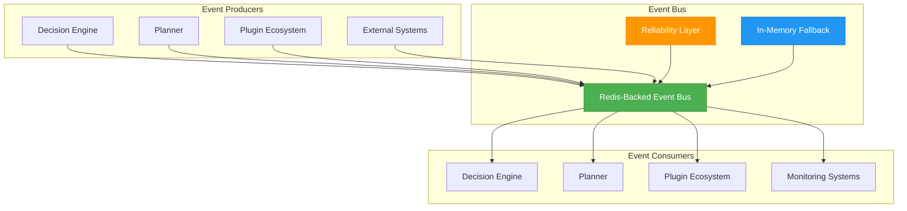
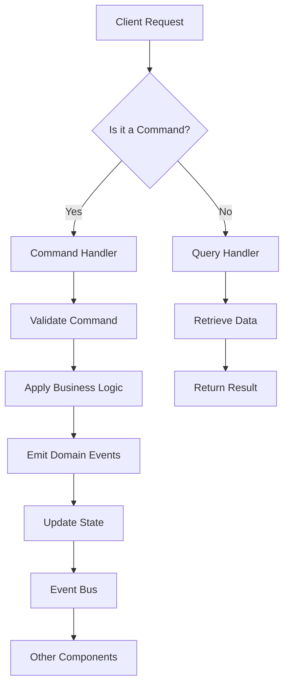
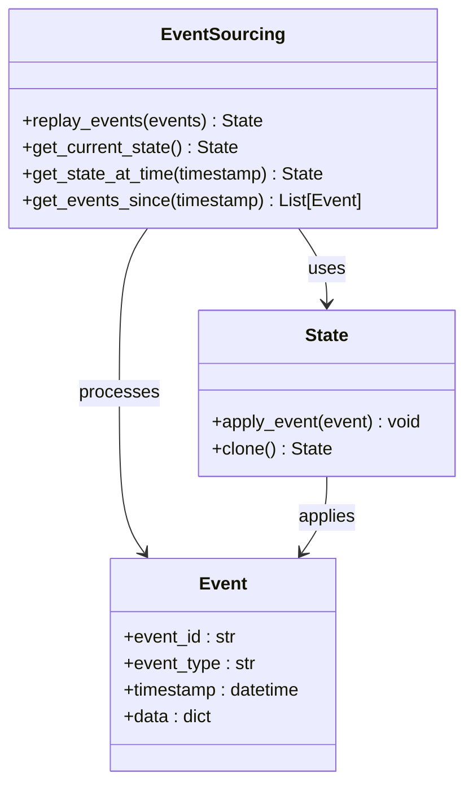
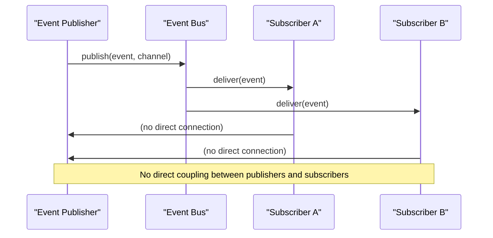
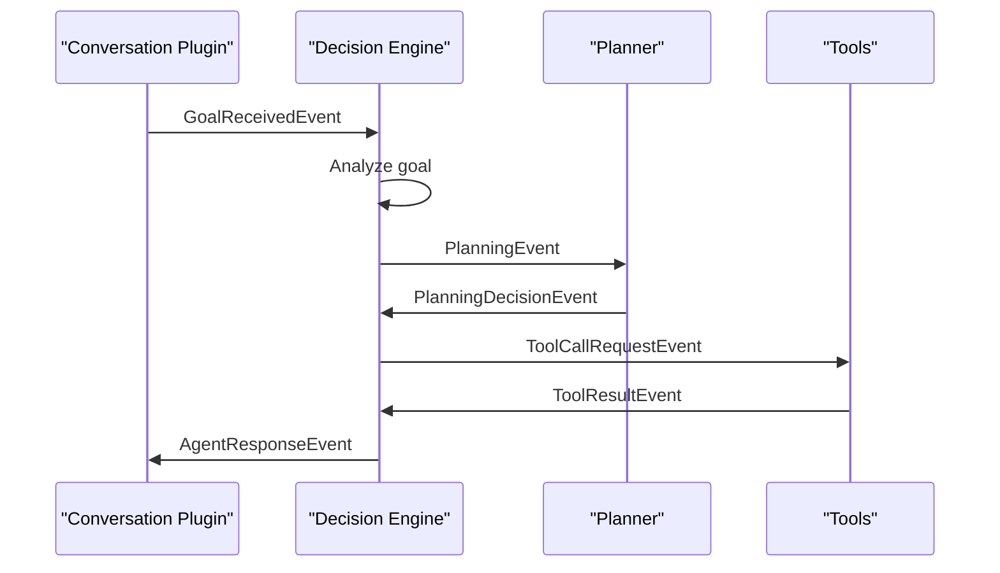
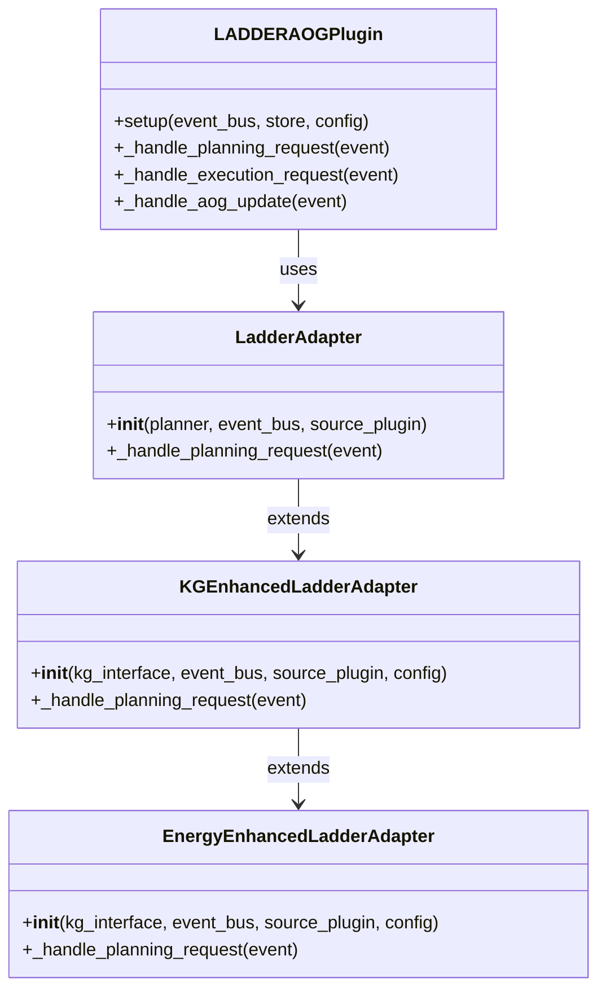

# Integration Patterns

<cite>
**Referenced Files in This Document**   
- [src/core/events.py](file://src/core/events.py)
- [src/core/event_bus.py](file://src/core/event_bus.py)
- [src/plugins/mangle_plugin.py](file://src/plugins/mangle_plugin.py)
- [src/plugins/llm_planner_plugin.py](file://src/plugins/llm_planner_plugin.py)
- [src/plugins/atom_tools_plugin.py](file://src/plugins/atom_tools_plugin.py)
- [src/plugins/brainstorm_plugin.py](file://src/plugins/brainstorm_plugin.py)
- [src/plugins/ladder_aog_plugin.py](file://src/plugins/ladder_aog_plugin.py)
- [src/ladder/integration/cortex_adapter.py](file://src/ladder/integration/cortex_adapter.py)
- [src/ladder/integration/kg_enhanced_adapter.py](file://src/ladder/integration/kg_enhanced_adapter.py)
- [src/ladder/prioritization/energy_enhanced_adapter.py](file://src/ladder/prioritization/energy_enhanced_adapter.py)
- [src/core/genealogy.py](file://src/core/genealogy.py)
- [src/core/reliability.py](file://src/core/reliability.py)
- [src/core/reliable_event_bus.py](file://src/core/reliable_event_bus.py)
</cite>

## Table of Contents
1. [Introduction](#introduction)
2. [Event System Architecture](#event-system-architecture)
3. [Core Integration Patterns](#core-integration-patterns)
4. [Component-Specific Integration](#component-specific-integration)
5. [Event-Driven State Management](#event-driven-state-management)
6. [Reliability and Error Handling](#reliability-and-error-handling)
7. [Common Integration Issues](#common-integration-issues)
8. [Best Practices for Event-Driven Components](#best-practices-for-event-driven-components)
9. [Conclusion](#conclusion)

## Introduction
This document provides a comprehensive guide to the integration patterns used in the Super Alita system, focusing on how various components interact with the event system. The system employs a sophisticated event-driven architecture that enables seamless communication between the decision engine, planner, and plugin ecosystem. Key patterns such as command-query separation, event sourcing, and publish-subscribe are implemented throughout the codebase to ensure loose coupling and high cohesion. This documentation explains these patterns in detail, providing concrete examples from the actual codebase to illustrate how components publish and subscribe to events. It also addresses the relationship between events and system state changes, how components react to event streams, and common issues such as race conditions, event ordering, and circular dependencies. The content is designed to be accessible to beginners while providing sufficient technical depth for experienced developers extending the system with new event-driven components.

## Event System Architecture

**Diagram sources**
- [src/core/event_bus.py](file://src/core/event_bus.py#L48-L610)
- [src/core/reliable_event_bus.py](file://src/core/reliable_event_bus.py#L1-L403)

**Section sources**
- [src/core/event_bus.py](file://src/core/event_bus.py#L48-L610)
- [src/core/reliable_event_bus.py](file://src/core/reliable_event_bus.py#L1-L403)

The Super Alita system employs a distributed event bus architecture that serves as the central nervous system for all component communication. At its core, the system uses a Redis-backed event bus that provides high-performance, persistent message queuing with pub/sub capabilities. This architecture enables true decoupling between event producers and consumers, allowing components to communicate without direct dependencies. The event bus implements a publish-subscribe pattern where components can publish events to specific channels and subscribe to events they are interested in processing. For reliability, the system includes an in-memory fallback mechanism that activates when Redis is unavailable, ensuring continued operation in degraded mode. The reliability layer adds idempotency, circuit breaking, and dead letter queue functionality to prevent message loss and handle transient failures. This multi-layered approach ensures that events are delivered reliably even under high load or partial system failures, making the architecture both robust and scalable.

## Core Integration Patterns

### Command-Query Separation
The system implements a strict command-query separation pattern where commands (actions that change state) and queries (requests for data) are handled through distinct event types and processing paths. This separation ensures that read operations do not have side effects and that write operations are properly validated and logged.

**Diagram sources**
- [src/core/events.py](file://src/core/events.py#L43-L767)
- [src/core/event_bus.py](file://src/core/event_bus.py#L293-L379)

**Section sources**
- [src/core/events.py](file://src/core/events.py#L43-L767)
- [src/core/event_bus.py](file://src/core/event_bus.py#L293-L379)

The command-query separation pattern is implemented through distinct event types and processing pipelines. Commands are represented by events that trigger state changes, such as `GoalReceivedEvent`, `ToolCallRequestEvent`, and `PlanExecutionEvent`. These events are processed by command handlers that validate the request, apply business logic, and emit domain events to reflect the state changes. Queries, on the other hand, are represented by events like `SystemStatusRequestEvent` and `KnowledgeQueryEvent`, which are handled by query handlers that retrieve data without modifying state. This separation provides several benefits: it makes the system's behavior more predictable, simplifies testing by isolating side effects, and enables performance optimizations such as caching query results without affecting command processing. The pattern also facilitates auditing and debugging, as all state changes are explicitly represented as events in the system.

### Event Sourcing
Event sourcing is a fundamental pattern in the Super Alita system, where the state of the system is derived from a sequence of events rather than being stored directly. This approach provides a complete audit trail of all state changes and enables powerful features like temporal queries and state reconstruction.

**Diagram sources**
- [src/core/events.py](file://src/core/events.py#L43-L767)
- [src/core/genealogy.py](file://src/core/genealogy.py#L1-L510)

**Section sources**
- [src/core/events.py](file://src/core/events.py#L43-L767)
- [src/core/genealogy.py](file://src/core/genealogy.py#L1-L510)

In the Super Alita system, event sourcing is implemented through the `GenealogyTracer` class, which maintains a complete history of all significant events and uses them to reconstruct the current state of the system. Each state change is represented as an event, such as `AtomBirthEvent`, `SkillProposalEvent`, or `StateTransitionEvent`, which is published to the event bus and stored in a durable event store. The current state of the system is derived by replaying these events in chronological order, applying each event's effect to a base state. This approach provides several advantages: it creates a complete audit trail of all system changes, enables temporal queries to determine the state of the system at any point in time, and facilitates debugging by allowing developers to replay event sequences to reproduce issues. The system also supports projections, which are derived views of the event stream optimized for specific query patterns, such as retrieving all skills proposed by a particular component or finding all atoms created during a specific time period.

### Publish-Subscribe Pattern
The publish-subscribe pattern is the primary communication mechanism in the Super Alita system, enabling loose coupling between components. Components publish events to specific channels without knowledge of the subscribers, and other components subscribe to channels of interest without knowledge of the publishers.

**Diagram sources**
- [src/core/event_bus.py](file://src/core/event_bus.py#L337-L379)
- [src/plugins/mangle_plugin.py](file://src/plugins/mangle_plugin.py#L86-L122)

**Section sources**
- [src/core/event_bus.py](file://src/core/event_bus.py#L337-L379)
- [src/plugins/mangle_plugin.py](file://src/plugins/mangle_plugin.py#L86-L122)

The publish-subscribe pattern is implemented through the `EventBus` class, which acts as a central message broker. Components publish events by calling the `emit` method with an event type and payload, and the event bus delivers the event to all subscribers of that event type. Subscribers register their interest in specific event types by calling the `subscribe` method with an event type and a callback function. The event bus ensures that events are delivered to all interested parties, even if they were not running when the event was published, by using Redis's persistent pub/sub capabilities. This pattern enables several important architectural benefits: it allows components to be developed and deployed independently, supports dynamic scaling of components, and enables the addition of new functionality through event listeners without modifying existing code. The system also supports wildcard subscriptions, allowing components to receive all events or events matching a pattern, which is useful for monitoring and debugging.

## Component-Specific Integration

### Decision Engine Integration
The decision engine integrates with the event system as both a producer and consumer of events, using events to coordinate complex decision-making processes and respond to system state changes.

**Diagram sources**
- [src/core/events.py](file://src/core/events.py#L143-L160)
- [src/plugins/llm_planner_plugin.py](file://src/plugins/llm_planner_plugin.py#L186-L239)

**Section sources**
- [src/core/events.py](file://src/core/events.py#L143-L160)
- [src/plugins/llm_planner_plugin.py](file://src/plugins/llm_planner_plugin.py#L186-L239)

The decision engine integrates with the event system by subscribing to high-level events such as `GoalReceivedEvent` and `UserMessageEvent`, which represent user requests and goals. When such an event is received, the decision engine analyzes the request and determines the appropriate course of action, which may involve planning, tool usage, or direct response generation. The decision engine then publishes events to coordinate these actions, such as `PlanningEvent` to initiate planning or `ToolCallRequestEvent` to execute a tool. It also subscribes to the results of these actions, such as `PlanningDecisionEvent` and `ToolResultEvent`, to incorporate the outcomes into its decision-making process. This event-driven approach allows the decision engine to coordinate complex workflows involving multiple components without direct dependencies, enabling a flexible and extensible architecture. The use of correlation IDs ensures that related events can be traced across the system, facilitating debugging and monitoring.

### Planner Integration
The planner component integrates with the event system to receive planning requests, publish planning decisions, and coordinate with other components to execute plans.

**Diagram sources**
- [src/plugins/ladder_aog_plugin.py](file://src/plugins/ladder_aog_plugin.py#L143-L149)
- [src/ladder/integration/cortex_adapter.py](file://src/ladder/integration/cortex_adapter.py#L50-L74)
- [src/ladder/integration/kg_enhanced_adapter.py](file://src/ladder/integration/kg_enhanced_adapter.py#L56-L98)
- [src/ladder/prioritization/energy_enhanced_adapter.py](file://src/ladder/prioritization/energy_enhanced_adapter.py#L55-L104)

**Section sources**
- [src/plugins/ladder_aog_plugin.py](file://src/plugins/ladder_aog_plugin.py#L143-L14