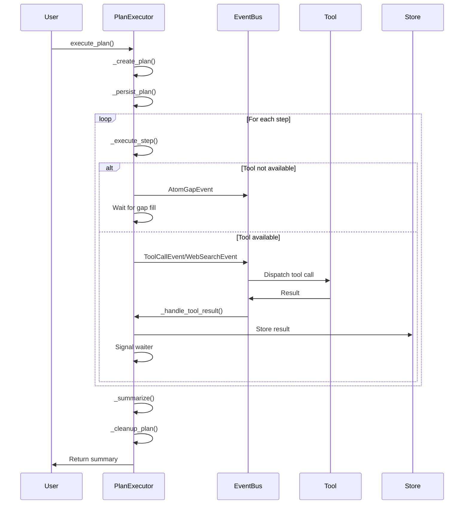
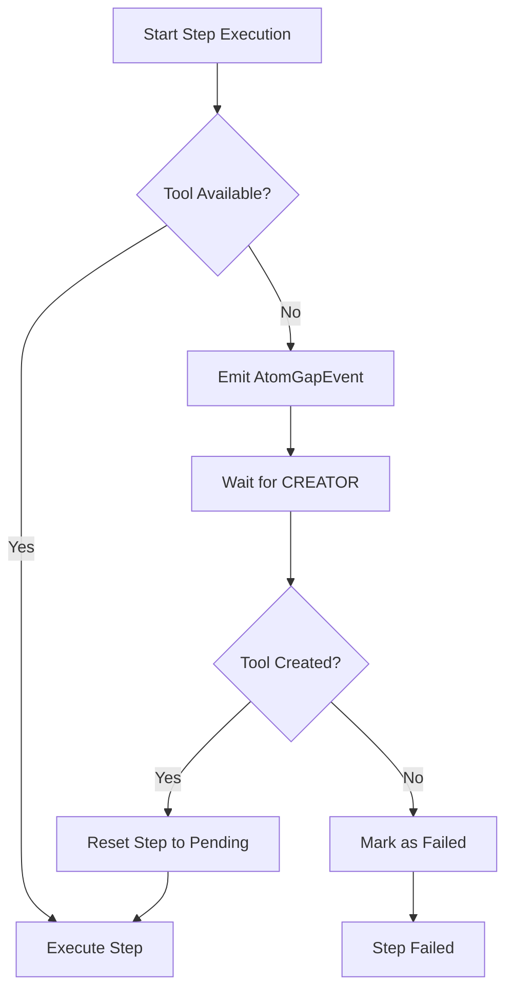
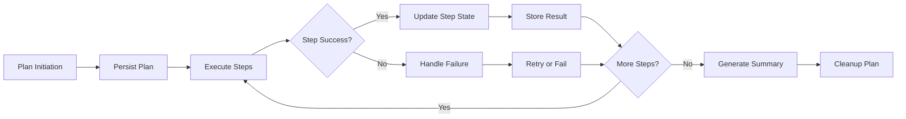
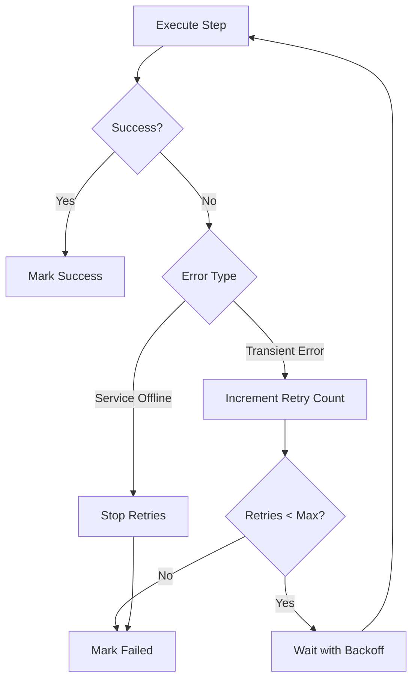

# Plan Execution

<cite>
**Referenced Files in This Document**   
- [plan_executor.py](file://src/core/plan_executor.py)
- [neural_atom.py](file://src/core/neural_atom.py)
- [events.py](file://src/core/events.py)
- [secure_executor.py](file://src/core/secure_executor.py)
- [dynamic_tools.py](file://src/tools/dynamic_tools.py)
</cite>

## Table of Contents
1. [Introduction](#introduction)
2. [Core Components](#core-components)
3. [Execution Lifecycle](#execution-lifecycle)
4. [Task Dependency Management](#task-dependency-management)
5. [State Management and Checkpointing](#state-management-and-checkpointing)
6. [Integration with Task Management System](#integration-with-task-management-system)
7. [Event Bus Integration](#event-bus-integration)
8. [Reliability Manager Integration](#reliability-manager-integration)
9. [Configuration and Execution Parameters](#configuration-and-execution-parameters)
10. [Failure Recovery Scenarios](#failure-recovery-scenarios)
11. [Performance Considerations](#performance-considerations)
12. [Common Issues and Best Practices](#common-issues-and-best-practices)

## Introduction
The Plan Execution system in the Super Alita framework is responsible for interpreting and executing generated plans with closed-loop tracking and recovery. This system manages the complete execution lifecycle from plan ingestion to completion or failure, handling task dependencies, execution state, checkpointing, and recovery mechanisms. The plan executor integrates with various components including the task management system, event bus, and reliability manager to ensure robust and reliable execution of complex plans.

## Core Components

The core component of the Plan Execution system is the `PlanExecutor` class, which manages the execution of plans and tracks their state. The executor uses a step-based approach where each plan consists of multiple steps that are executed sequentially.

The `Step` class represents a single step in an execution plan, containing information about the tool to be used, parameters, execution status, result, error information, retry count, and timing information. Each step can be in one of several states: pending, running, success, or failed.

The executor maintains active plans in memory using a dictionary that maps plan IDs to lists of steps. It also tracks pending results using asyncio Events, which allow the system to wait for tool results asynchronously.

**Section sources**
- [plan_executor.py](file://src/core/plan_executor.py#L35-L563)
- [plan_executor.py](file://src/core/plan_executor.py#L22-L32)

## Execution Lifecycle

The execution lifecycle begins when the `execute_plan` method is called with a plan ID, session ID, goal, and list of tools needed. The executor first generates an execution plan using the `_create_plan` method, which creates a sequence of steps based on the goal and required tools.



**Diagram sources**
- [plan_executor.py](file://src/core/plan_executor.py#L58-L94)
- [plan_executor.py](file://src/core/plan_executor.py#L172-L288)
- [plan_executor.py](file://src/core/plan_executor.py#L290-L329)
- [plan_executor.py](file://src/core/plan_executor.py#L331-L353)
- [plan_executor.py](file://src/core/plan_executor.py#L355-L414)
- [plan_executor.py](file://src/core/plan_executor.py#L416-L441)

**Section sources**
- [plan_executor.py](file://src/core/plan_executor.py#L58-L94)
- [plan_executor.py](file://src/core/plan_executor.py#L172-L288)

## Task Dependency Management

The Plan Executor manages task dependencies through its sequential execution model and gap detection system. When a step requires a tool that is not available, the executor detects this gap and emits an `AtomGapEvent` to trigger the CREATOR system to generate the missing tool.

The gap detection mechanism works by checking if the requested tool exists in the tool registry before executing a step. If the tool is not found, the executor pauses execution and requests the creation of the missing tool. After a brief wait, it checks again to see if the tool has been created, allowing execution to continue if successful.



**Diagram sources**
- [plan_executor.py](file://src/core/plan_executor.py#L172-L288)
- [events.py](file://src/core/events.py#L520-L528)

**Section sources**
- [plan_executor.py](file://src/core/plan_executor.py#L172-L288)
- [events.py](file://src/core/events.py#L520-L528)

## State Management and Checkpointing

The Plan Executor implements comprehensive state management and checkpointing to ensure execution resilience. When a plan is started, it is persisted in the NeuralStore using a `TextualMemoryAtom`, which allows for recovery in case of system failures.

The executor maintains execution state in memory using the `active_plans` dictionary, which tracks all currently executing plans. Each step's state is updated throughout the execution process, including status, result, error information, and timing data.

Checkpointing occurs at multiple levels:
1. Plan persistence before execution begins
2. Step state updates during execution
3. Result storage upon completion
4. Final cleanup after execution



**Diagram sources**
- [plan_executor.py](file://src/core/plan_executor.py#L522-L543)
- [plan_executor.py](file://src/core/plan_executor.py#L172-L288)
- [neural_atom.py](file://src/core/neural_atom.py#L998-L1159)

**Section sources**
- [plan_executor.py](file://src/core/plan_executor.py#L522-L543)
- [neural_atom.py](file://src/core/neural_atom.py#L998-L1159)

## Integration with Task Management System

The Plan Executor integrates with the task management system through the tool registry and execution model. Each step in a plan corresponds to a task that is executed by dispatching a tool call event to the appropriate tool.

The executor uses the `DynamicToolRegistry` to manage available tools and their schemas. When executing a step, it checks the registry to determine if the required tool is available. The registry provides methods to list tools, get tool schemas, and track tool usage.

Task execution is handled by dispatching events to the event bus, which routes them to the appropriate handlers. The executor supports different event types for different tools, such as `WebSearchEvent` for web-related tasks and `ToolCallEvent` for general tool invocations.

**Section sources**
- [plan_executor.py](file://src/core/plan_executor.py#L290-L329)
- [secure_executor.py](file://src/core/secure_executor.py#L382-L384)
- [dynamic_tools.py](file://src/tools/dynamic_tools.py#L147-L228)

## Event Bus Integration

The Plan Executor is tightly integrated with the event bus system, which serves as the communication backbone for the entire framework. The executor subscribes to "tool_result" events to receive results from executed tools, and publishes various events to coordinate execution.

During initialization, the executor sets up subscriptions to receive tool results:
```python
async def _setup_subscriptions(self):
    """Set up event subscriptions for tool results."""
    await self.event_bus.subscribe("tool_result", self._handle_tool_result)
```

When executing a step, the executor dispatches tool calls as events:
```python
await self.event_bus.publish(tool_event)
```

The event bus integration enables loose coupling between components, allowing tools to be developed and deployed independently while still participating in the execution flow.

**Section sources**
- [plan_executor.py](file://src/core/plan_executor.py#L54-L56)
- [plan_executor.py](file://src/core/plan_executor.py#L290-L329)
- [plan_executor.py](file://src/core/plan_executor.py#L355-L414)

## Reliability Manager Integration

The Plan Executor incorporates several reliability mechanisms to handle failures and ensure robust execution. These include retry logic with exponential backoff, timeout handling, and fail-fast policies for certain types of errors.

For each step, the executor implements a retry mechanism with a maximum of three attempts. Between retries, it uses exponential backoff (2^retries seconds) to avoid overwhelming systems. This is particularly important for transient failures that may resolve with time.

The executor also implements a fail-fast policy for certain critical errors, such as service connectivity issues. When a step fails due to a "Perplexica offline" error, the executor stops further retries and halts plan execution, as additional attempts would be futile.



**Diagram sources**
- [plan_executor.py](file://src/core/plan_executor.py#L172-L288)

**Section sources**
- [plan_executor.py](file://src/core/plan_executor.py#L172-L288)

## Configuration and Execution Parameters

The Plan Executor supports various configuration options for execution parameters, timeout settings, and retry policies. These are primarily hardcoded in the current implementation but could be externalized for greater flexibility.

Key execution parameters include:
- Maximum retries: 3 attempts per step
- Timeout for tool results: 60 seconds
- Exponential backoff factor: 2^retries seconds
- Web search parameters: 5 web results, 3 GitHub results by default

These parameters balance reliability with performance, allowing sufficient time for tool execution while preventing indefinite blocking. The timeout value ensures that stuck operations don't hang the entire plan indefinitely.

The executor could be enhanced to support configurable parameters through a configuration file or API, allowing users to adjust these values based on their specific requirements and tolerance for execution time versus reliability.

**Section sources**
- [plan_executor.py](file://src/core/plan_executor.py#L172-L288)
- [plan_executor.py](