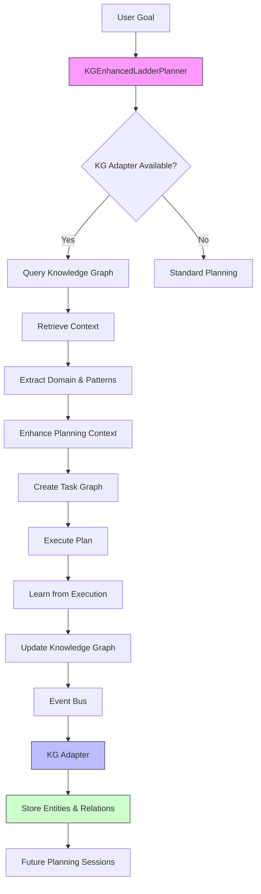
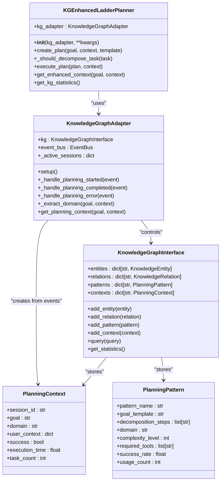
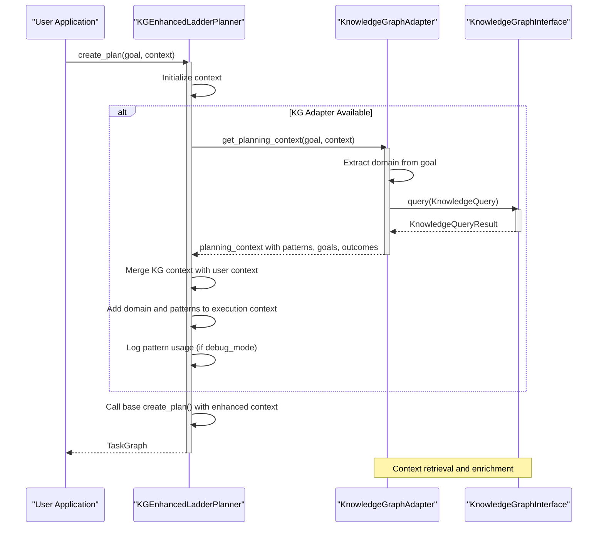

# Knowledge-Graph Enhanced Planner

<cite>
**Referenced Files in This Document**   
- [kg_enhanced_planner.py](file://src/ladder/kg_enhanced_planner.py)
- [kg_adapter.py](file://src/knowledge_graph/kg_adapter.py)
- [kg_interface.py](file://src/knowledge_graph/kg_interface.py)
- [planner.py](file://src/ladder/planner.py)
</cite>

## Table of Contents
1. [Introduction](#introduction)
2. [Architecture Overview](#architecture-overview)
3. [Core Components](#core-components)
4. [Knowledge Graph Integration](#knowledge-graph-integration)
5. [Planning Process with KG Enhancement](#planning-process-with-kg-enhancement)
6. [Domain Model and Knowledge Representation](#domain-model-and-knowledge-representation)
7. [Execution and Learning Workflow](#execution-and-learning-workflow)
8. [Performance Considerations](#performance-considerations)
9. [Troubleshooting Guide](#troubleshooting-guide)
10. [Configuration and Integration](#configuration-and-integration)

## Introduction

The Knowledge-Graph Enhanced Planner is a context-aware planning system within the Super Alita framework that leverages a knowledge graph (KG) to make informed decisions during task planning and execution. This planner extends the base LADDER planner by integrating historical knowledge, domain-specific patterns, and contextual awareness into the planning process.

By connecting to a knowledge graph, the planner can retrieve relevant context for any given goal, evaluate planning options based on past experiences, and generate task sequences that are contextually appropriate and optimized for success. The system learns from each planning session, continuously improving its decision-making capabilities through feedback loops that update the knowledge graph with new insights from successful and failed executions.

This documentation provides a comprehensive overview of the KG-enhanced planner's implementation, focusing on how it queries the knowledge graph for relevant context, incorporates historical data into planning decisions, and maintains consistency with existing knowledge. It also covers the domain model, integration patterns, and practical guidance for developers working with this system.

## Architecture Overview

The Knowledge-Graph Enhanced Planner operates as an extension of the base LADDER planner, integrating with the knowledge graph through a dedicated adapter pattern. The architecture follows a layered approach where planning decisions are enhanced by contextual knowledge retrieved from the graph database.



**Diagram sources**
- [kg_enhanced_planner.py](file://src/ladder/kg_enhanced_planner.py#L11-L147)
- [kg_adapter.py](file://src/knowledge_graph/kg_adapter.py#L18-L311)

**Section sources**
- [kg_enhanced_planner.py](file://src/ladder/kg_enhanced_planner.py#L1-L148)
- [kg_adapter.py](file://src/knowledge_graph/kg_adapter.py#L1-L312)

## Core Components

The Knowledge-Graph Enhanced Planner consists of several key components that work together to provide context-aware planning capabilities. The primary component is the `KGEnhancedLadderPlanner` class, which extends the base `LadderPlanner` with knowledge graph integration features.

The planner enhances task decomposition by using knowledge graph patterns to guide decision-making. When creating a plan, it first queries the knowledge graph for relevant context based on the goal and user-provided context. This information includes domain classification, relevant planning patterns, similar past goals, and historical outcomes.

During execution, the planner captures results and feeds them back into the knowledge graph through the event bus system. This learning loop allows the system to improve over time by updating pattern success rates and storing new planning contexts. The planner also provides methods to retrieve enhanced context and get statistics about the knowledge graph's current state.

The integration between the planner and knowledge graph is mediated by the `KnowledgeGraphAdapter`, which handles event subscriptions and knowledge extraction from planning outcomes. This adapter listens to planning events such as "planning_started", "planning_completed", and "planning_error", using these events to update the knowledge graph with new entities, relations, and patterns.

**Section sources**
- [kg_enhanced_planner.py](file://src/ladder/kg_enhanced_planner.py#L11-L147)
- [planner.py](file://src/ladder/planner.py#L70-L498)

## Knowledge Graph Integration

The Knowledge-Graph Enhanced Planner integrates with the knowledge graph through the `KnowledgeGraphAdapter`, which serves as the bridge between the planning system and the knowledge storage. This integration enables bidirectional knowledge flow: the planner retrieves contextual information from the graph before creating plans, and contributes new knowledge back to the graph after plan execution.

The integration process begins when the planner is initialized with a knowledge graph adapter instance. This adapter provides access to the `KnowledgeGraphInterface`, which offers methods for querying, storing, and retrieving knowledge. When enabled, the planner automatically activates knowledge graph features in its configuration.

Context retrieval occurs through the `get_planning_context` method of the adapter, which analyzes the goal and user context to determine the appropriate domain. The system supports multiple domains including software development, research, documentation, testing/debugging, and design. Based on this domain classification, the adapter queries the knowledge graph for relevant patterns, similar goals, and historical outcomes.

The knowledge graph stores various entity types including goals, outcomes, and planning patterns. Each planning pattern contains information such as decomposition steps, success rate, complexity level, and required tools. These patterns are used to guide task decomposition decisions, with higher success rate patterns influencing the planner to decompose tasks more thoroughly.



**Diagram sources**
- [kg_enhanced_planner.py](file://src/ladder/kg_enhanced_planner.py#L11-L147)
- [kg_adapter.py](file://src/knowledge_graph/kg_adapter.py#L18-L311)
- [kg_interface.py](file://src/knowledge_graph/kg_interface.py#L17-L377)

**Section sources**
- [kg_adapter.py](file://src/knowledge_graph/kg_adapter.py#L18-L311)
- [kg_interface.py](file://src/knowledge_graph/kg_interface.py#L17-L377)

## Planning Process with KG Enhancement

The planning process in the Knowledge-Graph Enhanced Planner follows an enhanced version of the standard LADDER planning workflow, with additional steps for knowledge retrieval and context enrichment. When a planning request is initiated, the system first determines whether a knowledge graph adapter is available.

If a knowledge graph adapter is present, the planner calls the `get_planning_context` method with the goal and user context. This method extracts the domain from the goal text and queries the knowledge graph for relevant information. The query returns planning patterns, similar past goals, and historical outcomes, which are then merged into the planning context.

During task decomposition, the planner uses the retrieved knowledge to make more informed decisions. The `_should_decompose_task` method checks if there are relevant patterns with high success rates (>0.5) and multiple steps. If such patterns exist, the planner is more likely to decompose the task, leveraging proven approaches from similar past scenarios.

The enhanced context is also added to the execution context, making domain information and relevant patterns available throughout the planning and execution process. In debug mode, the system logs the number of relevant patterns found and their success rates, providing visibility into how knowledge is influencing planning decisions.

When creating the actual plan, the enhanced context is passed to the base planner's `create_plan` method, which uses this information to generate a more informed task graph. The resulting plan benefits from historical knowledge about what approaches have worked well for similar goals in the past.



**Diagram sources**
- [kg_enhanced_planner.py](file://src/ladder/kg_enhanced_planner.py#L11-L147)
- [kg_adapter.py](file://src/knowledge_graph/kg_adapter.py#L18-L311)

**Section sources**
- [kg_enhanced_planner.py](file://src/ladder/kg_enhanced_planner.py#L11-L147)

## Domain Model and Knowledge Representation

The Knowledge-Graph Enhanced Planner uses a rich domain model to represent planning knowledge, with entities, relations, and patterns forming the core of its knowledge representation system. The model is designed to capture both explicit planning knowledge and implicit patterns learned from past execution outcomes.

The primary entities in the knowledge graph include Goals, Outcomes, and Planning Patterns. Goals represent planning objectives and contain metadata about their domain and context. Outcomes capture the results of planning sessions, including whether they succeeded, execution time, and task completion counts. Planning Patterns are reusable templates for successful planning approaches, containing decomposition steps, success rates, and domain-specific information.

Relations in the knowledge graph connect these entities, creating a web of interconnected knowledge. For example, a Goal entity might be related to an Outcome entity through a "SUCCEEDED_BY" or "FAILED_WITH" relation, indicating the result of a planning attempt. These relations help the system understand the effectiveness of different approaches for specific types of goals.

The knowledge representation system includes several key components:

- **Entity Types**: Goal, Outcome, Pattern, and other planning-related entities
- **Relation Types**: SUCCEEDED_BY, FAILED_WITH, and other semantic relationships
- **Planning Patterns**: Reusable templates with success metrics and decomposition steps
- **Contextual Indexing**: Efficient lookup structures for fast knowledge retrieval

The system initializes with several base patterns for common domains like software development, problem solving, and research. These patterns serve as starting points and are refined over time as the system learns from actual planning sessions.

```mermaid
erDiagram
  GOAL {
    string id PK
    string name
    string description
    string domain
    json properties
    timestamp created_at
    int access_count
    float confidence
  }

  OUTCOME {
    string id PK
    string name
    string description
    boolean success
    float execution_time
    int task_count
    string session_id
    json properties
  }

  PATTERN {
    string id PK
    string pattern_name
    string goal_template
    string domain
    int complexity_level
    float success_rate
    int usage_count
    timestamp last_updated
    json decomposition_steps
    json required_tools
    json preconditions
  }

  CONTEXT {
    string session_id PK
    string goal
    string