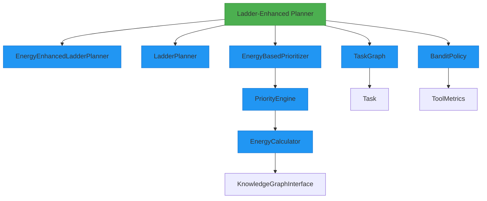
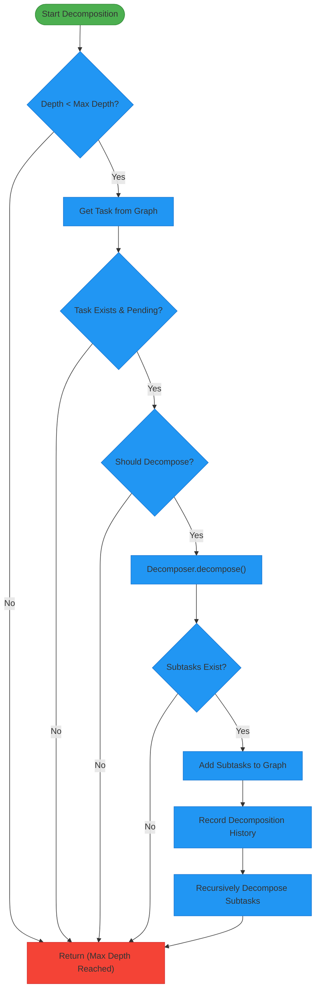
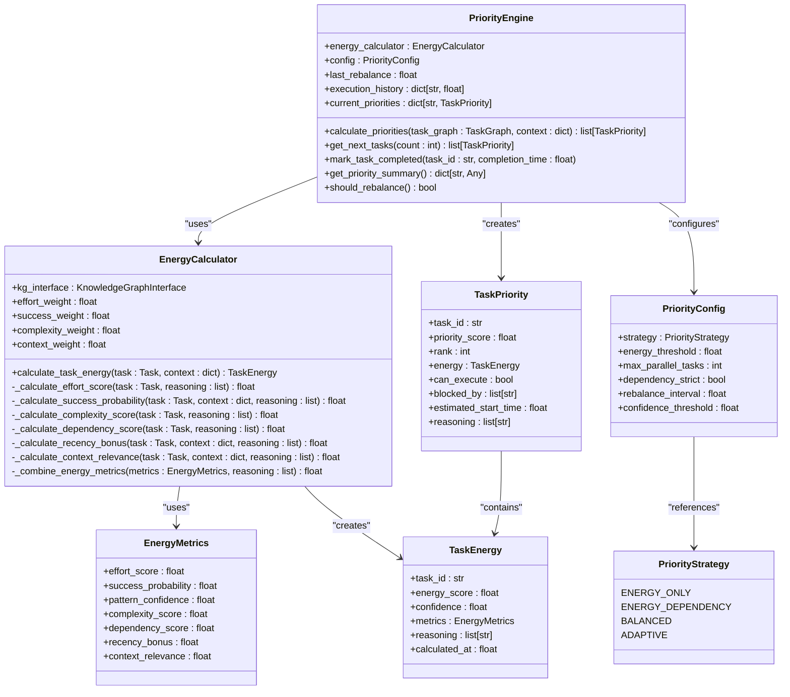

# Ladder-Enhanced Planner

<cite>
**Referenced Files in This Document**   
- [planner.py](file://src/ladder/planner.py)
- [decomposers/base.py](file://src/ladder/decomposers/base.py)
- [prioritization/energy_enhanced_planner.py](file://src/ladder/prioritization/energy_enhanced_planner.py)
- [prioritization/energy_prioritizer.py](file://src/ladder/prioritization/energy_prioritizer.py)
- [prioritization/priority_engine.py](file://src/ladder/prioritization/priority_engine.py)
- [prioritization/energy_calculator.py](file://src/ladder/prioritization/energy_calculator.py)
- [graph/task_graph.py](file://src/ladder/graph/task_graph.py)
- [models/task.py](file://src/ladder/models/task.py)
- [policies/bandit.py](file://src/ladder/policies/bandit.py)
</cite>

## Table of Contents
1. [Introduction](#introduction)
2. [Core Architecture](#core-architecture)
3. [Recursive Decomposition Algorithm](#recursive-decomposition-algorithm)
4. [Energy-Based Prioritization System](#energy-based-prioritization-system)
5. [Domain Model and Task Metadata](#domain-model-and-task-metadata)
6. [Integration with Ladder Components](#integration-with-ladder-components)
7. [Decomposition Patterns and Examples](#decomposition-patterns-and-examples)
8. [Common Issues and Troubleshooting](#common-issues-and-troubleshooting)
9. [Performance Characteristics](#performance-characteristics)
10. [Conclusion](#conclusion)

## Introduction

The Ladder-Enhanced Planner is an advanced planning system within the Super Alita framework that implements hierarchical task decomposition using the Ladder architecture. This planner extends the standard planning capabilities by incorporating energy-based prioritization, recursive decomposition algorithms, and deep integration with the Ladder's policy system.

The planner operates as a hierarchical task orchestrator that breaks down complex goals into manageable subproblems through recursive decomposition. It leverages the Knowledge Graph for context awareness and historical pattern recognition while applying energy-based metrics to prioritize tasks effectively. The system is designed to handle complex planning scenarios by balancing exploration and exploitation through multi-armed bandit policies.

This documentation provides a comprehensive analysis of the Ladder-Enhanced Planner's implementation, covering its recursive decomposition algorithm, energy-based prioritization system, domain model extensions, and integration with other Ladder components. The content is structured to be accessible to beginners while offering technical depth on optimization strategies and performance characteristics for experienced developers.

**Section sources**
- [planner.py](file://src/ladder/planner.py#L1-L50)
- [LADDER_ARCHITECTURE.md](file://LADDER_ARCHITECTURE.md#L433-L441)

## Core Architecture

The Ladder-Enhanced Planner follows a modular architecture that extends the base LadderPlanner with energy-based prioritization capabilities. The core components work together to create a hierarchical planning system that can decompose complex goals into executable subtasks while optimizing for energy efficiency and success probability.

The architecture consists of several key components:
- **LadderPlanner**: The base planner orchestrator that manages task decomposition and execution
- **EnergyEnhancedLadderPlanner**: An extension that adds energy-based prioritization
- **EnergyBasedPrioritizer**: The prioritization engine that calculates task priorities
- **PriorityEngine**: The core engine for calculating and managing task priorities
- **EnergyCalculator**: Calculates task energy based on historical data and task characteristics
- **TaskGraph**: Manages the directed acyclic graph of tasks and dependencies
- **BanditPolicy**: Implements multi-armed bandit algorithms for adaptive tool selection

The planner follows the LADDER methodology: Localize → Assess → Decompose → Decide → Execute → Review. This cyclical process ensures that plans are continuously refined and optimized based on execution feedback and historical data.



**Diagram sources **
- [planner.py](file://src/ladder/planner.py#L70-L498)
- [prioritization/energy_enhanced_planner.py](file://src/ladder/prioritization/energy_enhanced_planner.py#L14-L332)
- [prioritization/energy_prioritizer.py](file://src/ladder/prioritization/energy_prioritizer.py#L48-L342)

**Section sources**
- [planner.py](file://src/ladder/planner.py#L1-L500)
- [prioritization/energy_enhanced_planner.py](file://src/ladder/prioritization/energy_enhanced_planner.py#L1-L334)

## Recursive Decomposition Algorithm

The recursive decomposition algorithm is the core mechanism by which the Ladder-Enhanced Planner breaks down complex goals into executable subtasks. This algorithm operates through a depth-first traversal of the task hierarchy, recursively decomposing tasks until atomic tasks are reached.

The decomposition process begins with a high-level goal and proceeds through the following steps:
1. Create a root task representing the initial goal
2. Initialize a task graph to represent the hierarchical structure
3. Recursively decompose tasks based on their complexity and type
4. Apply energy-based optimization to the task ordering
5. Validate the plan for consistency and feasibility

The algorithm is governed by several configuration parameters that control its behavior:
- **max_decomposition_depth**: Limits the depth of recursive decomposition
- **enable_energy_optimization**: Enables energy-based task ordering
- **task_retry_limit**: Specifies the maximum number of retries for failed tasks

The decomposition process is implemented in the `_decompose_task_hierarchically` method, which checks if a task should be decomposed further based on its atomicity and the current decomposition depth. Tasks are considered atomic if they start with simple action words (read, write, delete, etc.) or have descriptions shorter than five words.



**Diagram sources **
- [planner.py](file://src/ladder/planner.py#L220-L278)

**Section sources**
- [planner.py](file://src/ladder/planner.py#L220-L278)
- [decomposers/base.py](file://src/ladder/decomposers/base.py#L42-L70)

## Energy-Based Prioritization System

The energy-based prioritization system is a key innovation in the Ladder-Enhanced Planner that optimizes task execution order based on energy metrics. This system combines historical data from the Knowledge Graph with real-time task characteristics to calculate energy scores that guide prioritization decisions.

The prioritization process involves several components working together:
- **EnergyCalculator**: Computes energy scores based on effort, success probability, complexity, and context
- **PriorityEngine**: Applies prioritization strategies to order tasks
- **EnergyBasedPrioritizer**: Coordinates the prioritization process and maintains state
- **EnergyEnhancedLadderPlanner**: Integrates prioritization into the planning workflow

The energy calculation formula combines multiple factors with configurable weights:
- **Effort score**: Estimated effort required to complete the task
- **Success probability**: Historical success rate from similar tasks
- **Complexity score**: Task complexity based on description and dependencies
- **Dependency score**: Complexity of task dependencies
- **Recency bonus**: Bonus for recently successful patterns
- **Context relevance**: Relevance to current planning context

The system supports multiple prioritization strategies through the PriorityStrategy enum:
- **ENERGY_ONLY**: Pure energy-based ordering
- **ENERGY_DEPENDENCY**: Energy + dependency constraints
- **BALANCED**: Energy + dependencies + resource constraints
- **ADAPTIVE**: Dynamic strategy based on context



**Diagram sources **
- [prioritization/energy_calculator.py](file://src/ladder/prioritization/energy_calculator.py#L1-L452)
- [prioritization/priority_engine.py](file://src/ladder/prioritization/priority_engine.py#L1-L362)
- [prioritization/energy_prioritizer.py](file://src/ladder/prioritization/energy_prioritizer.py#L1-L343)

**Section sources**
- [prioritization/energy_calculator.py](file://src/ladder/prioritization/energy_calculator.py#L1-L452)
- [prioritization/priority_engine.py](file://src/ladder/prioritization/priority_engine.py#L1-L362)
- [prioritization/energy_prioritizer.py](file://src/ladder/prioritization/energy_prioritizer.py#L1-L343)

## Domain Model and Task Metadata

The domain model of the Ladder-Enhanced Planner extends the standard planner with additional metadata for task energy and decomposition strategies. This enriched model enables more sophisticated planning and prioritization decisions based on comprehensive task characteristics.

The core domain entities include:
- **Task**: Represents a single unit of work with properties for description, status, dependencies, and energy
- **TaskGraph**: Manages the directed acyclic graph of tasks and their dependencies
- **TaskTemplate**: Provides predefined patterns for common task types
- **TaskType**: Enumerates different categories of tasks (CODING, RESEARCH, ANALYSIS, etc.)

Each task contains extensive metadata that supports the energy-based prioritization system:
- **Energy**: A float value representing the estimated cost of executing the task
- **Tool options**: List of tools that can execute the task
- **Dependencies**: List of task IDs that must be completed before this task can start
- **Metadata**: Dictionary containing additional information such as task type, decomposer, and priority scores

The Task class includes several calculated properties that simplify planning logic:
- **is_atomic**: Determines if a task can be executed directly (has tool options)
- **is_ready**: Checks if a task is ready for execution (dependencies satisfied)
- **duration**: Calculates execution duration if the task is completed

The system also includes specialized task templates for common patterns:
- **Plan → Implement → Test**: For software development tasks
- **Research → Analyze → Document**: For research-oriented tasks
- **Analyze → Execute → Finalize**: For general problem-solving

```mermaid
classDiagram
    class Task {
        +description: str
        +id: str
        +status: TaskStatus
        +dependencies: list[str]
        +result: Any
        +energy: float
        +tool_options: list[str]
        +metadata: dict[str, Any]
        +created_at: float
        +started_at: float
        +completed_at: float
        +error_message: str
        +is_atomic: bool
        +is_ready: bool
        +duration: float