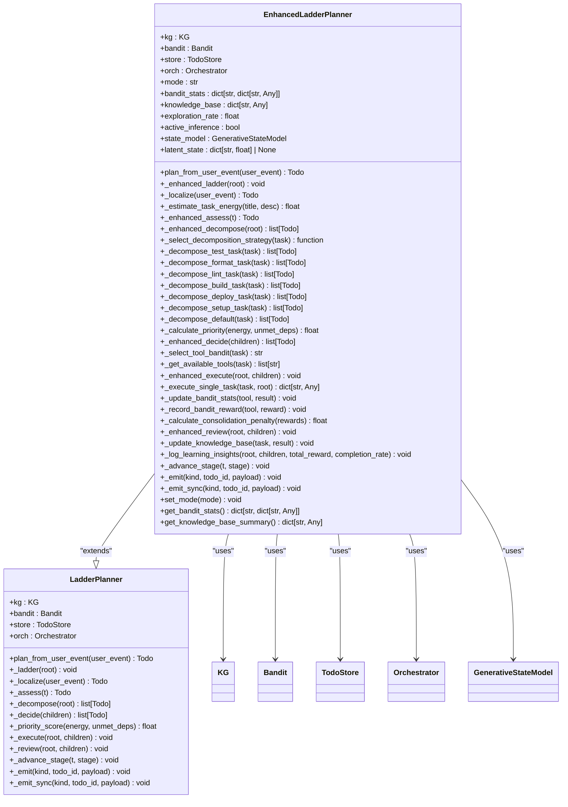

# Planner Implementations

<cite>
**Referenced Files in This Document**   
- [ladder.py](file://cortex/planner/ladder.py)
- [ladder_enhanced.py](file://cortex/planner/ladder_enhanced.py)
- [interfaces.py](file://cortex/planner/interfaces.py)
- [models.py](file://cortex/todo/models.py)
- [planner.py](file://src/core/planner.py)
- [planner.py](file://src/ladder/planner.py)
- [ladder.py](file://cortex/api/endpoints/ladder.py)
</cite>

## Table of Contents
1. [Introduction](#introduction)
2. [Standard Planner](#standard-planner)
3. [Ladder-Enhanced Planner](#ladder-enhanced-planner)
4. [Knowledge-Graph Enhanced Planner](#knowledge-graph-enhanced-planner)
5. [Architecture Overview](#architecture-overview)
6. [Domain Models and Contracts](#domain-models-and-contracts)
7. [Task Decomposition and Prioritization](#task-decomposition-and-prioritization)
8. [Execution Patterns and Modes](#execution-patterns-and-modes)
9. [Integration with Ladder Architecture](#integration-with-ladder-architecture)
10. [Integration with Knowledge Graph](#integration-with-knowledge-graph)
11. [Integration with Decision Engine](#integration-with-decision-engine)
12. [Common Issues and Troubleshooting](#common-issues-and-troubleshooting)
13. [Performance Characteristics](#performance-characteristics)
14. [Conclusion](#conclusion)

## Introduction
The Super Alita framework implements a sophisticated planning system with three primary planner types: the standard planner, ladder-enhanced planner, and knowledge-graph enhanced planner. These planners work together to transform high-level goals into executable task sequences through hierarchical decomposition, intelligent prioritization, and adaptive learning. The system follows the LADDER methodology (Localize → Assess → Decompose → Decide → Execute → Review) as its core architectural pattern, enabling systematic task processing and continuous improvement through feedback loops. Each planner type specializes in different aspects of the planning process, from basic task decomposition to advanced learning from execution outcomes. This documentation provides comprehensive coverage of all three planner implementations, detailing their architectures, domain models, algorithms, and integration points within the broader Super Alita ecosystem.

## Standard Planner
The standard planner in the Super Alita framework provides foundational planning capabilities through retrieval-augmented generation and semantic search. It operates by analyzing input queries and proposing chains of operations (atoms) that can satisfy the requested goal. The planner leverages a VectorIndex to find semantically similar atoms based on the input query, then expands these candidates into complete plans using a GraphStore that maintains adjacency relationships and input/output contracts between atoms. The planning process begins with checking a built-in LRU cache for previously successful plans, ensuring efficiency for repeated queries. When no cached plan exists, the system retrieves candidate atoms through semantic similarity search, sorts them by relevance score, and attempts to compose a valid plan by chaining compatible atoms according to their input/output contracts. The planner enforces contract compatibility by verifying that the output fields of each atom satisfy the input requirements of the subsequent atom in the chain. This standard planner serves as the baseline implementation, providing reliable plan generation for straightforward tasks while caching successful plans for future reuse. Its modular design allows for easy extension and integration with more sophisticated planning strategies.

**Section sources**
- [planner.py](file://src/core/planner.py#L1-L244)

## Ladder-Enhanced Planner
The ladder-enhanced planner represents the primary planning implementation in the Super Alita framework, extending the basic LADDER methodology with advanced features for learning, optimization, and adaptability. This planner implements the full LADDER workflow through six distinct stages: Localize, Assess, Decompose, Decide, Execute, and Review. The enhanced version introduces several key improvements over the standard implementation, including multi-armed bandit learning for tool selection, energy-based task prioritization, shadow/active execution modes, and knowledge base integration for continuous learning. The planner's architecture centers around the EnhancedLadderPlanner class, which coordinates with external components such as a knowledge graph (KG), bandit algorithm, todo store, and orchestrator. During the Localize stage, the planner creates a root TODO and estimates initial task energy based on complexity indicators such as keywords and description length. The Assess stage integrates knowledge from the knowledge graph and calculates confidence scores based on historical performance of similar tasks. The Decompose stage employs task-specific strategies, with specialized decomposition methods for different task types like testing, formatting, linting, building, and deployment. The Decide stage implements ε-greedy multi-armed bandit algorithms to select optimal tools based on historical success rates, while the Execute stage supports both shadow mode (simulation) and active mode (real execution) with priority-based task ordering. Finally, the Review stage updates the knowledge base with execution results and calculates rewards that incorporate success proxies, metric deltas, energy efficiency bonuses, and confidence factors, enabling the system to learn from experience and improve over time.

**Diagram sources **
- [ladder_enhanced.py](file://cortex/planner/ladder_enhanced.py#L36-L1029)
- [ladder.py](file://cortex/planner/ladder.py#L12-L244)

**Section sources**
- [ladder_enhanced.py](file://cortex/planner/ladder_enhanced.py#L36-L1029)
- [ladder.py](file://cortex/planner/ladder.py#L12-L244)

## Knowledge-Graph Enhanced Planner
The knowledge-graph enhanced planner in the Super Alita framework leverages semantic relationships and contextual information from the knowledge graph to improve planning accuracy and efficiency. This planner implementation integrates tightly with the knowledge graph system through the KG interface, which provides methods for retrieving context, estimating task energy, writing decisions, and calculating metric deltas. During the planning process, the knowledge-graph enhanced planner queries the knowledge graph for relevant context based on task titles, incorporating this information into task descriptions and assessments. The system uses the knowledge graph to compute energy values for tasks by analyzing historical data and similar tasks, combining these KG-derived energy estimates with other factors to produce final energy calculations. The planner also utilizes the knowledge graph for similarity matching, finding previously executed tasks with similar titles and leveraging their outcomes to calculate confidence scores for new tasks. During the review phase, the planner writes decision records back to the knowledge graph, including tool usage, node identifiers, and reward values, creating a feedback loop that enables continuous