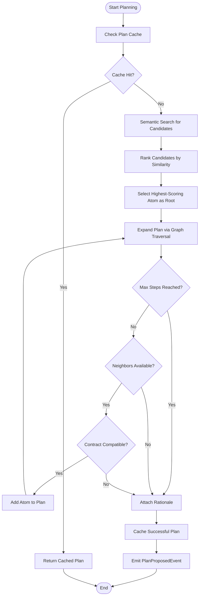
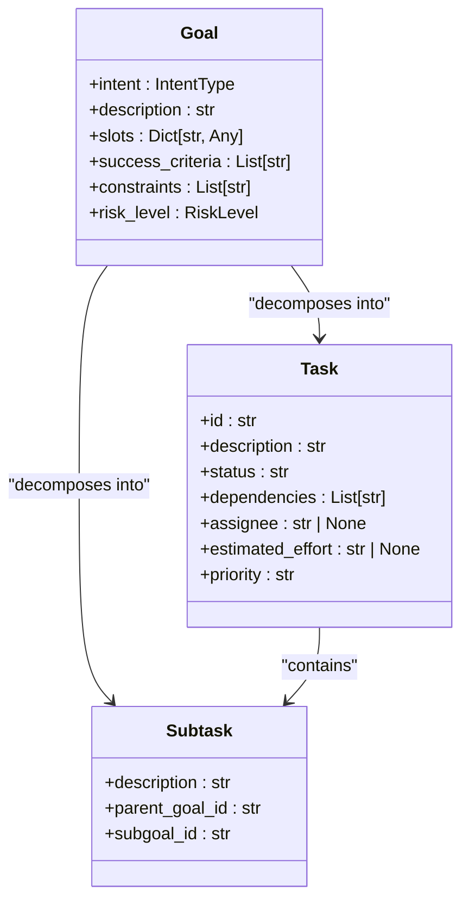
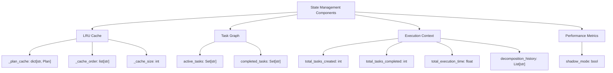

# Standard Planner

<cite>
**Referenced Files in This Document**   
- [planner.py](file://src/core/planner.py)
- [planner_plugin_v2.py](file://src/plugins/planner_plugin_v2.py)
- [ladder/planner.py](file://src/ladder/planner.py)
- [decision_policy.py](file://src/core/decision_policy.py)
- [decision_policy_v1.py](file://src/core/decision_policy_v1.py)
- [sdd_models.py](file://scripts/sdd_models.py)
</cite>

## Table of Contents
1. [Introduction](#introduction)
2. [Core Components](#core-components)
3. [Planning Algorithm](#planning-algorithm)
4. [Domain Model](#domain-model)
5. [State Management](#state-management)
6. [Integration with Decision Engine](#integration-with-decision-engine)
7. [Event Bus Integration](#event-bus-integration)
8. [Plugin System Interaction](#plugin-system-interaction)
9. [Common Issues and Troubleshooting](#common-issues-and-troubleshooting)
10. [Configuration and Performance](#configuration-and-performance)
11. [Extension Points](#extension-points)

## Introduction
The Standard Planner in the Super Alita framework serves as the foundational planning system responsible for processing high-level goals and decomposing them into executable subtasks. This document provides comprehensive documentation on its implementation, covering the planning algorithm, state management, domain model, and integration points with other core components. The planner operates as a retrieval-augmented system that combines semantic search with graph-based expansion to generate task sequences. It plays a critical role in the agent's decision-making pipeline by transforming abstract goals into concrete action plans that can be executed by downstream components.

## Core Components

The Standard Planner implementation consists of several key components that work together to generate and manage execution plans. At its core, the planner uses a retrieval-augmented approach that combines semantic search capabilities with graph-based planning to create effective task sequences. The main components include the Planner class, which orchestrates the planning process; the VectorIndex, which enables semantic similarity search for relevant atoms; and the GraphStore, which maintains the relationships and contracts between different operations. The planner also implements caching mechanisms to improve performance by reusing previously generated plans. The system is designed to be extensible through plugins, with the PlannerPluginV2 serving as the strategic layer in the OaK (Objective and Knowledge) architecture.

**Section sources**
- [planner.py](file://src/core/planner.py#L1-L243)
- [planner_plugin_v2.py](file://src/plugins/planner_plugin_v2.py#L1-L41)

## Planning Algorithm

The Standard Planner employs a multi-step algorithm to generate execution plans from high-level goals. The process begins with checking the plan cache to determine if a suitable plan already exists for the given query. If no cached plan is found, the system performs semantic similarity search using the VectorIndex to identify candidate atoms that are relevant to the goal. These candidates are ranked by their similarity scores, and the planner attempts to compose a plan starting with the highest-scoring atom as the root.

The plan expansion process uses graph traversal to build a sequence of compatible operations. Starting from the selected root atom, the planner examines neighboring atoms in the GraphStore and adds those that have compatible input/output contracts. This expansion continues until either the maximum number of steps is reached or no further compatible atoms can be found. The algorithm ensures that each subsequent atom in the sequence can consume the outputs produced by the previous atom, maintaining data flow integrity throughout the plan.



**Diagram sources**
- [planner.py](file://src/core/planner.py#L123-L193)
- [planner.py](file://src/core/planner.py#L195-L220)

**Section sources**
- [planner.py](file://src/core/planner.py#L123-L220)

## Domain Model

The Standard Planner operates on a well-defined domain model that includes key entities such as Goal, Task, and Subtask. The Goal entity represents high-level objectives that the system aims to achieve, containing properties like intent, description, success criteria, constraints, and risk level. This structured representation allows the planner to understand the context and requirements of each goal.

The Task entity serves as the fundamental unit of work in the planning system, representing individual actions that contribute to goal achievement. Each task has a unique identifier, description, status, dependencies, assignee, estimated effort, and priority. The Subtask entity is used to represent decomposed components of larger goals, maintaining a parent-child relationship with the original goal or task. This hierarchical structure enables the planner to break down complex objectives into manageable components.



**Diagram sources**
- [decision_policy.py](file://src/core/decision_policy.py#L61-L69)
- [sdd_models.py](file://scripts/sdd_models.py#L45-L60)
- [planner_plugin_v2.py](file://src/plugins/planner_plugin_v2.py#L70-L103)

**Section sources**
- [decision_policy.py](file://src/core/decision_policy.py#L61-L69)
- [sdd_models.py](file://scripts/sdd_models.py#L45-L60)

## State Management

The Standard Planner maintains its internal state through several mechanisms that track the planning process and execution context. The planner uses an LRU (Least Recently Used) cache to store recently generated plans, allowing for quick retrieval of previously computed solutions. This cache is bounded by size and automatically evicts the oldest entries when capacity is reached, ensuring memory efficiency.

The planner's state includes the task graph, which represents the current plan structure with nodes as tasks and edges as dependencies. It also maintains execution context that tracks active tasks, completed tasks, and various performance metrics such as total execution time and decomposition depth. The system supports shadow mode operation, which allows for plan simulation without actual execution, enabling safe testing and validation of proposed plans.



**Diagram sources**
- [planner.py](file://src/core/planner.py#L105-L242)
- [ladder/planner.py](file://src/ladder/planner.py#L480-L498)

**Section sources**
- [planner.py](file://src/core/planner.py#L105-L242)
- [ladder/planner.py](file://src/ladder/planner.py#L480-L498)

## Integration with Decision Engine

The Standard Planner integrates closely with the core decision engine to form a cohesive planning and execution pipeline. When a high-level goal is received, the decision engine routes it to the planner, which then generates a detailed execution plan. The planner's output, in the form of a PlanProposedEvent, is consumed by the decision engine to determine the next steps in the agent's workflow.

This integration enables a closed-loop decision-making process where the planner's proposed actions are evaluated by the decision engine for feasibility, risk, and alignment with overall objectives. The decision engine can request modifications to the plan or approve it for execution. This collaborative approach ensures that all actions taken by the agent are both technically sound and strategically aligned with its goals.

The planner also receives feedback from the decision engine during plan execution, allowing it to adapt and refine future plans based on real-world outcomes. This feedback loop is essential for continuous improvement and learning within the agent system.

```mermaid
sequenceDiagram
    participant DecisionEngine as "Decision Engine"
    participant Planner as "Standard