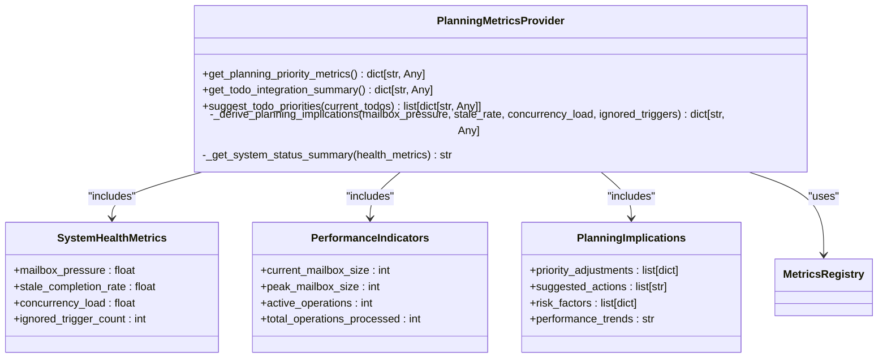
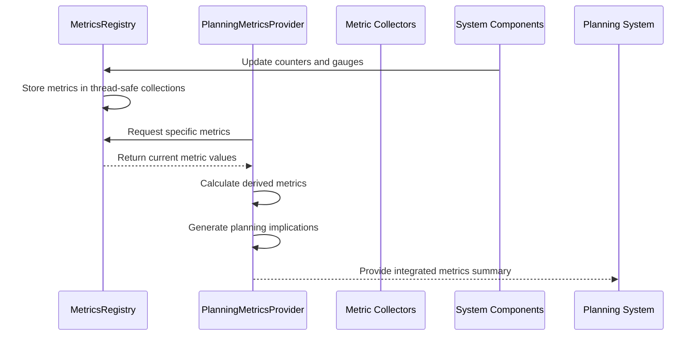
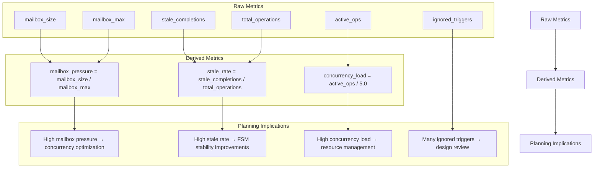
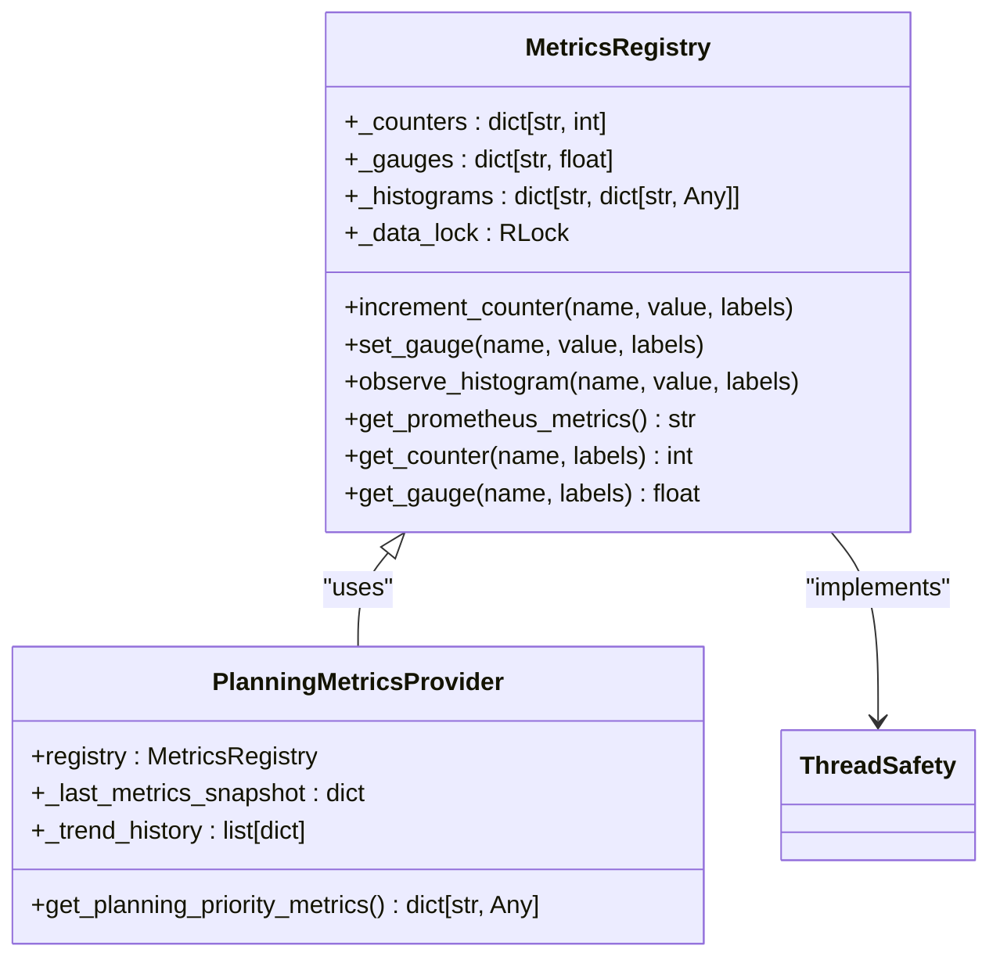
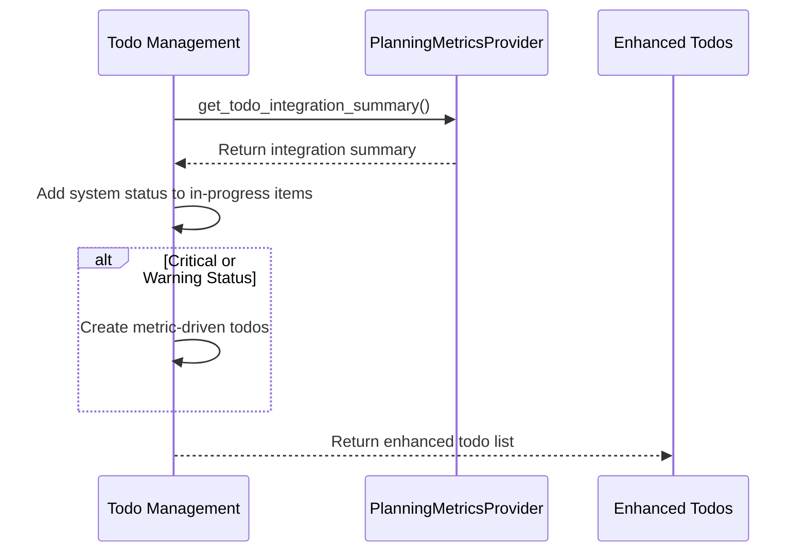

# Planning Metrics

<cite>
**Referenced Files in This Document**   
- [planning_metrics.py](file://src/core/planning_metrics.py)
- [metrics_registry.py](file://src/core/metrics_registry.py)
- [cortex_adapter.py](file://src/ladder/integration/cortex_adapter.py)
- [energy_enhanced_adapter.py](file://src/ladder/prioritization/energy_enhanced_adapter.py)
- [telemetry.py](file://src/ecosystem/telemetry.py)
</cite>

## Table of Contents
1. [Introduction](#introduction)
2. [Metrics Domain Model](#metrics-domain-model)
3. [Data Collection Mechanisms](#data-collection-mechanisms)
4. [Storage and Aggregation](#storage-and-aggregation)
5. [Integration with Planning System](#integration-with-planning-system)
6. [Telemetry System Integration](#telemetry-system-integration)
7. [Performance Considerations](#performance-considerations)
8. [Troubleshooting Guide](#troubleshooting-guide)
9. [Conclusion](#conclusion)

## Introduction
The Planning Metrics system in the Super Alita framework provides real-time operational insights that directly influence planning decisions and todo prioritization. This system collects key performance indicators from various components and transforms them into actionable intelligence for the planning engine. The metrics are designed to identify system health issues, performance bottlenecks, and optimization opportunities that affect planning efficiency and reliability.

The implementation focuses on integrating operational metrics into the planning workflow, allowing the agent to make informed decisions about priorities and resource allocation based on real-time system performance data. This documentation details the architecture, implementation, and usage patterns of the planning metrics system, providing guidance for both beginners and experienced developers.

## Metrics Domain Model

The planning metrics system is built around a comprehensive domain model that captures various aspects of system performance and health. The core metrics are organized into logical categories that reflect different dimensions of system operation.

### Core Metric Categories



**Diagram sources**
- [planning_metrics.py](file://src/core/planning_metrics.py#L17-L297)

**Section sources**
- [planning_metrics.py](file://src/core/planning_metrics.py#L17-L297)

### Key Planning Metrics

The system measures several critical aspects of planning performance and system health:

| Metric Category | Specific Metrics | Purpose | Data Type |
|----------------|------------------|---------|---------|
| **System Health** | mailbox_pressure | Measures input queue pressure (0.0-1.0) | float |
| | stale_completion_rate | Tracks concurrency issues from stale completions | float |
| | concurrency_load | Indicates system load level | float |
| | ignored_trigger_count | Counts ignored triggers that may indicate design issues | int |
| **Performance Indicators** | current_mailbox_size | Current number of items in FSM mailbox | int |
| | peak_mailbox_size | Maximum mailbox size observed | int |
| | active_operations | Number of currently active operations | int |
| | total_operations_processed | Total operations processed by FSM | int |
| **Planning Implications** | priority_adjustments | Suggested priority changes based on metrics | list[dict] |
| | suggested_actions | Recommended actions to address issues | list[str] |
| | risk_factors | Identified risk factors with impact assessment | list[dict] |
| | performance_trends | Overall trend (stable, improving, degrading) | str |

These metrics are derived from lower-level system metrics collected by the metrics registry and transformed into planning-relevant insights. The system uses these metrics to assess the overall health of the planning process and identify areas that require attention or optimization.

## Data Collection Mechanisms

The planning metrics system employs a multi-layered approach to data collection, gathering information from various sources across the Super Alita framework.

### Metrics Collection Flow



**Diagram sources**
- [planning_metrics.py](file://src/core/planning_metrics.py#L34-L81)
- [metrics_registry.py](file://src/core/metrics_registry.py#L0-L194)

**Section sources**
- [planning_metrics.py](file://src/core/planning_metrics.py#L34-L81)
- [metrics_registry.py](file://src/core/metrics_registry.py#L0-L194)

### Primary Data Sources

The planning metrics are primarily collected from the Finite State Machine (FSM) components, which serve as the central coordination mechanism in the Super Alita framework. The key metrics sources include:

- **FSM Mailbox**: Tracks the size and pressure of the input queue, indicating how quickly the system is processing incoming requests.
- **Operation Lifecycle**: Monitors active operations and completion rates, identifying potential concurrency issues.
- **Event Processing**: Measures trigger handling and identifies ignored triggers that may indicate design problems.
- **System Resources**: Collects CPU, memory, and other system-level metrics that affect planning performance.

The `PlanningMetricsProvider` class serves as the central collection point, retrieving raw metrics from the `MetricsRegistry` and transforming them into planning-relevant insights. This provider uses the `get_metrics_registry()` function to access the global metrics registry instance, ensuring consistent and thread-safe access to metric data.

### Derived Metrics Calculation

The system calculates several derived metrics that provide deeper insights into planning performance:



**Diagram sources**
- [planning_metrics.py](file://src/core/planning_metrics.py#L34-L81)
- [planning_metrics.py](file://src/core/planning_metrics.py#L83-L160)

**Section sources**
- [planning_metrics.py](file://src/core/planning_metrics.py#L83-L160)

The `_derive_planning_implications` method analyzes these derived metrics and generates actionable recommendations for the planning system. For example, when mailbox pressure exceeds 0.7, the system suggests prioritizing concurrency improvements. Similarly, a stale completion rate above 0.1 triggers recommendations for FSM stability improvements.

## Storage and Aggregation

The planning metrics system implements a sophisticated storage and aggregation strategy to maintain historical context while providing real-time insights.

### Metrics Storage Architecture



**Diagram sources**
- [metrics_registry.py](file://src/core/metrics_registry.py#L0-L194)
- [planning_metrics.py](file://src/core/planning_metrics.py#L17-L297)

**Section sources**
- [metrics_registry.py](file://src/core/metrics_registry.py#L0-L194)

### Data Retention and History

The system maintains a rolling history of metric snapshots to enable trend analysis and historical comparisons. The `PlanningMetricsProvider` stores up to 100 recent metric snapshots in its `_trend_history` list, automatically removing older entries when the limit is exceeded.

```python
# Store for trend analysis
self._trend_history.append(planning_metrics)
if len(self._trend_history) > 100:  # Keep last 100 snapshots
    self._trend_history.pop(0)
```

This historical data enables the system to detect performance trends by comparing recent metrics with past values. For example, the system can identify whether mailbox pressure is increasing, decreasing, or remaining stable over time, providing valuable context for planning decisions.

### Aggregation Strategies

The metrics registry implements several aggregation strategies to handle different types of metrics:

- **Counters**: Monotonically increasing values that track the number of events (e.g., total operations processed).
- **Gauges**: Point-in-time measurements that can go up and down (e.g., current mailbox size).
- **Histograms**: Distribution of values across predefined buckets, useful for understanding latency distributions.

The registry uses thread-safe data structures and locking mechanisms to ensure data consistency in multi-threaded environments. The `threading.RLock` ensures that metric operations are atomic and prevents race conditions when multiple components access the registry simultaneously.

## Integration with Planning System

The planning metrics are tightly integrated with the planning system, directly influencing todo prioritization and planning decisions.

### Todo List Enhancement

The system provides functions to enhance todo lists with metrics-driven insights, making performance data actionable for the planning engine.



**Diagram sources**
- [planning_metrics.py](file://src/core/planning_metrics.py#L249-L284)
- [planning_metrics.py](file://src/core/planning_metrics.py#L162-L178)

**Section sources**
- [planning_metrics.py](file://src/core/planning_metrics.py#L249