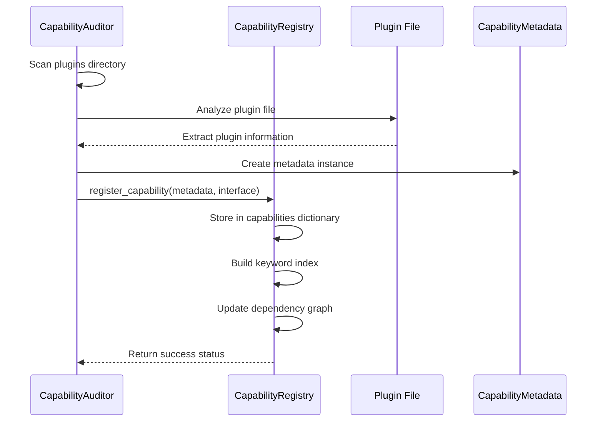
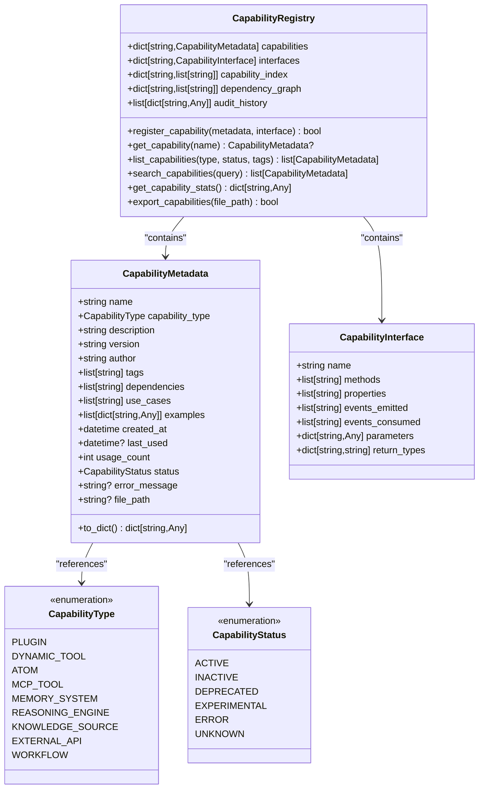
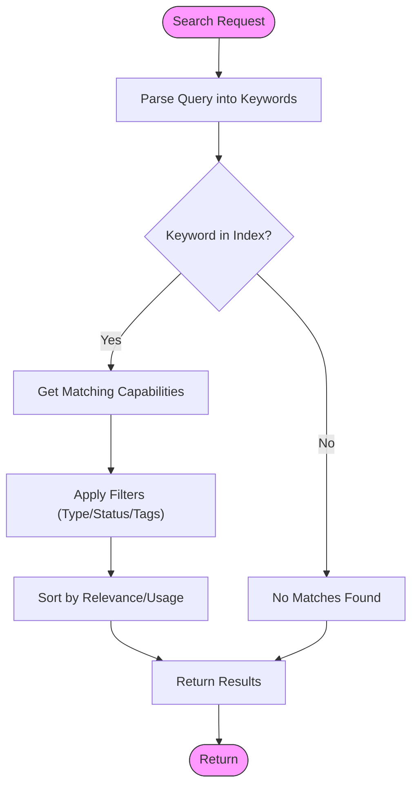
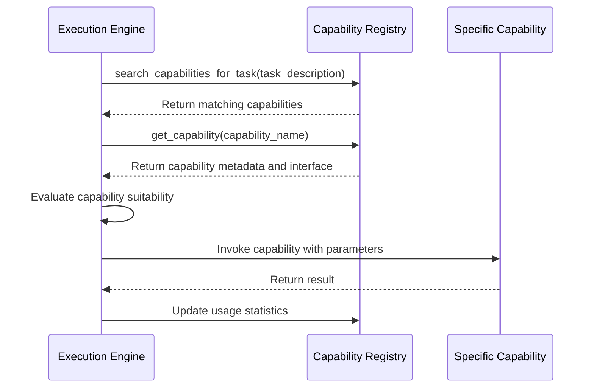

# Capability Registry

<cite>
**Referenced Files in This Document**   
- [capability_audit.py](file://src/core/capability_audit.py)
- [plugin_interface.py](file://src/plugins/plugin_interface.py)
- [capability_integration.py](file://src/core/capability_integration.py)
</cite>

## Table of Contents
1. [Introduction](#introduction)
2. [Capability Registration Process](#capability-registration-process)
3. [Data Model for Capabilities](#data-model-for-capabilities)
4. [Capability Discovery and Query Mechanisms](#capability-discovery-and-query-mechanisms)
5. [Integration with Dynamic Execution Engine](#integration-with-dynamic-execution-engine)
6. [Versioning and Conflict Resolution](#versioning-and-conflict-resolution)
7. [Common Issues and Performance Considerations](#common-issues-and-performance-considerations)
8. [Distributed Registry Patterns and Caching](#distributed-registry-patterns-and-caching)

## Introduction
The Capability Registry serves as the central nervous system for Super Alita's agent architecture, providing a comprehensive inventory and management system for all available capabilities across the platform. This registry enables intelligent routing, dependency management, and dynamic composition of capabilities from various sources including plugins, dynamic tools, atoms, and external services. The system supports comprehensive auditing, health monitoring, and gap analysis to ensure robust capability coverage and system reliability.

**Section sources**
- [capability_audit.py](file://src/core/capability_audit.py#L1-L50)

## Capability Registration Process
The capability registration process begins when the `CapabilityAuditor` scans designated directories such as `src/plugins`, `src/tools`, and MCP server paths to discover available capabilities. Each discovered capability is analyzed and registered through the `register_capability` method of the `CapabilityRegistry` class. The registration process involves creating a `CapabilityMetadata` instance containing essential information like name, type, description, version, author, tags, dependencies, use cases, examples, and file path. Optionally, a `CapabilityInterface` can be provided, specifying methods, properties, events emitted and consumed, parameters, and return types.

During registration, the system automatically builds a keyword index by processing the capability's name, description, tags, and use cases, enabling efficient text-based search. The dependency graph is also updated to reflect any declared dependencies between capabilities. The registration process is designed to be fault-tolerant, with error handling that logs failures while allowing the system to continue registering other capabilities. The `CapabilityAuditor` performs comprehensive audits of different capability types including plugins, dynamic tools, atoms, MCP tools, memory systems, and reasoning engines, automatically registering them in the central registry.

**Diagram sources **
- [capability_audit.py](file://src/core/capability_audit.py#L346-L403)
- [capability_audit.py](file://src/core/capability_audit.py#L119-L142)

**Section sources**
- [capability_audit.py](file://src/core/capability_audit.py#L109-L146)
- [capability_audit.py](file://src/core/capability_audit.py#L346-L403)

## Data Model for Capabilities
The capability data model is built around two primary classes: `CapabilityMetadata` and `CapabilityInterface`. `CapabilityMetadata` captures comprehensive information about a capability including its name, type (from the `CapabilityType` enum which includes categories like PLUGIN, DYNAMIC_TOOL, ATOM, MCP_TOOL, MEMORY_SYSTEM, REASONING_ENGINE, KNOWLEDGE_SOURCE, EXTERNAL_API, and WORKFLOW), description, version, author, tags, dependencies, use cases, examples, creation and usage timestamps, usage count, status (from the `CapabilityStatus` enum), error messages, and file path. The `CapabilityInterface` class defines the programmatic interface of a capability, specifying its methods, properties, events emitted and consumed, parameters with their types, and return types.

The registry maintains several data structures to support efficient operations: a dictionary mapping capability names to their metadata, a separate dictionary for interfaces, a keyword index for fast text search, a dependency graph tracking capability dependencies, and an audit history. The data model supports serialization through the `to_dict` method, enabling capabilities to be exported to JSON format for persistence or sharing. The system also tracks capability statistics including total counts by type and status, most and least used capabilities, recent additions, and error conditions.

**Diagram sources **
- [capability_audit.py](file://src/core/capability_audit.py#L56-L93)
- [capability_audit.py](file://src/core/capability_audit.py#L97-L106)
- [capability_audit.py](file://src/core/capability_audit.py#L109-L146)

**Section sources**
- [capability_audit.py](file://src/core/capability_audit.py#L56-L110)

## Capability Discovery and Query Mechanisms
The Capability Registry provides multiple mechanisms for discovering and querying registered capabilities. The primary method is the `search_capabilities` function, which performs keyword-based search by tokenizing the query and looking up each word in the pre-built keyword index. This index is constructed during registration by extracting words from the capability name, description, tags, and use cases, allowing for fast and efficient text matching. The system also supports filtered listing through the `list_capabilities` method, which can filter by capability type, status, or tags.

For task-specific capability discovery, the system offers the `search_capabilities_for_task` function, which analyzes a task description by splitting it into keywords and searching for capabilities that match any of the keywords. This enables intelligent routing of tasks to the most relevant capabilities. The registry also maintains comprehensive statistics through the `get_capability_stats` method, providing insights into the distribution of capabilities by type and status, most and least used capabilities, recent additions, and error conditions. These statistics support system health monitoring and gap analysis.

**Diagram sources **
- [capability_audit.py](file://src/core/capability_audit.py#L174-L196)
- [capability_integration.py](file://src/core/capability_integration.py#L45-L65)

**Section sources**
- [capability_audit.py](file://src/core/capability_audit.py#L148-L172)
- [capability_integration.py](file://src/core/capability_integration.py#L45-L65)

## Integration with Dynamic Execution Engine
The Capability Registry integrates closely with the dynamic execution engine to enable intelligent capability resolution at runtime. During system initialization, the `initialize_capability_system` function runs a comprehensive audit to populate the registry with all available capabilities. The execution engine queries the registry to determine which capabilities can handle specific input patterns and produce required output patterns, using the metadata and interface information to make informed routing decisions.

The integration enables dynamic composition of capabilities, where complex tasks are broken down into sequences of simpler operations executed by specialized capabilities. The dependency graph maintained by the registry helps the execution engine understand capability relationships and ensure proper execution order. The system also tracks capability usage statistics, which can inform optimization decisions and load balancing. When executing a task, the engine searches for capabilities matching the task description, evaluates their suitability based on metadata, and invokes the most appropriate capability or composition of capabilities.

**Diagram sources **
- [capability_integration.py](file://src/core/capability_integration.py#L45-L65)
- [capability_audit.py](file://src/core/capability_audit.py#L144-L146)

**Section sources**
- [capability_integration.py](file://src/core/capability_integration.py#L30-L75)

## Versioning and Conflict Resolution
The capability system implements a comprehensive versioning strategy through the `version` field in `CapabilityMetadata`, which defaults to "1.0.0" but can be specified for each capability. The system handles capability conflicts and deprecations through the `status` field, which can indicate whether a capability is ACTIVE, INACTIVE, DEPRECATED, EXPERIMENTAL, or in ERROR state. When multiple capabilities with similar functionality exist, the system can prioritize based on usage statistics, recency, or explicit configuration.

The dependency graph helps prevent conflicts by tracking capability dependencies and ensuring that required capabilities are available before attempting to use dependent capabilities. The audit system identifies potential conflicts by detecting capabilities with overlapping functionality or conflicting dependencies. For deprecated capabilities, the system maintains them in the registry but marks them appropriately, allowing for gradual migration to newer alternatives while maintaining backward compatibility during transition periods.

**Section sources**
- [capability_audit.py](file://src/core/capability_audit.py#L75-L93)

## Common Issues and Performance Considerations
Common issues in the capability registry include capability collision, namespace management challenges, and performance implications of large registries. Capability collision occurs when multiple capabilities have similar names or functionality, which the system addresses through comprehensive metadata and tagging. Namespace management is handled through the hierarchical directory structure and naming conventions, with the registry providing tools to identify and resolve naming conflicts.

For large registries, performance is optimized through the use of efficient data structures including hash maps for capability lookup, inverted indexes for text search, and adjacency lists for dependency tracking. The keyword index enables O(1) average-case lookup for search operations, while the dependency graph allows for efficient