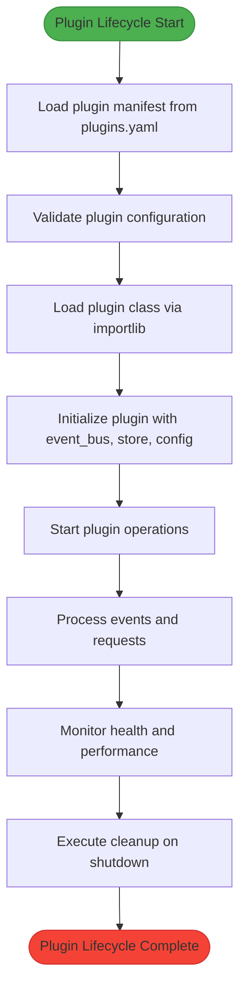
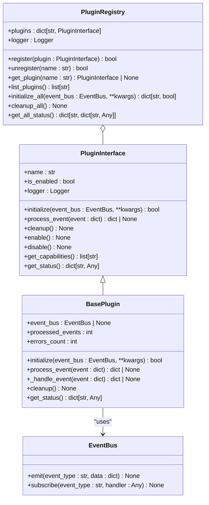
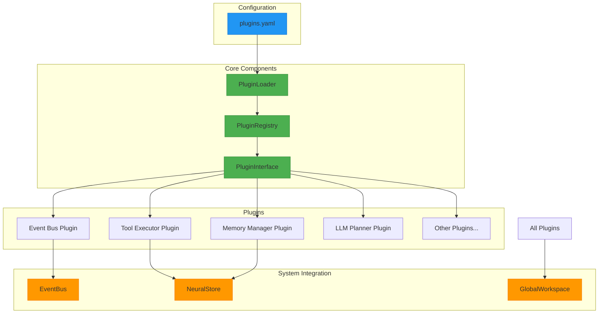
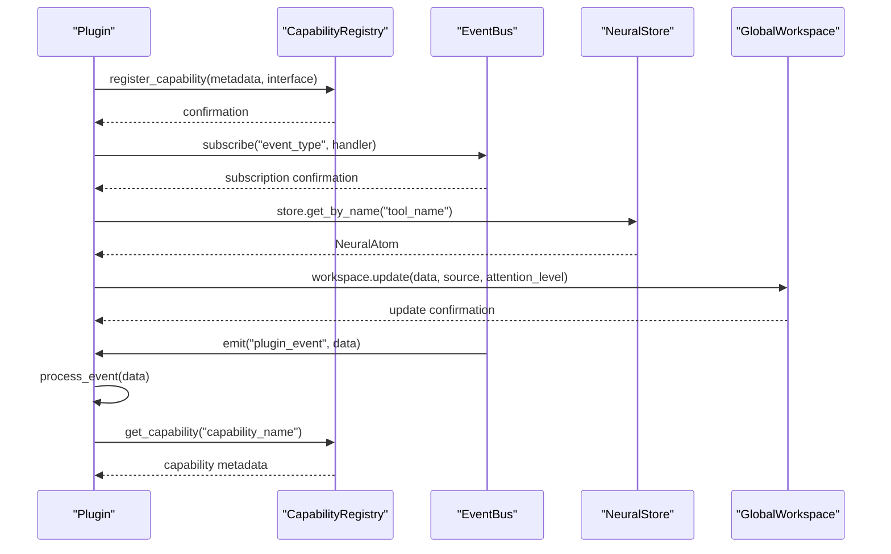

# Plugin Architecture

<cite>
**Referenced Files in This Document**   
- [plugins.yaml](file://plugins.yaml)
- [src/core/plugin_loader.py](file://src/core/plugin_loader.py)
- [src/plugins/plugin_interface.py](file://src/plugins/plugin_interface.py)
- [src/plugins/event_bus_plugin.py](file://src/plugins/event_bus_plugin.py)
- [src/plugins/tool_executor_plugin_unified.py](file://src/plugins/tool_executor_plugin_unified.py)
- [src/plugins/memory_manager_plugin_unified.py](file://src/plugins/memory_manager_plugin_unified.py)
- [src/core/capability_audit.py](file://src/core/capability_audit.py)
</cite>

## Table of Contents
1. [Introduction](#introduction)
2. [Plugin Lifecycle](#plugin-lifecycle)
3. [Core Components](#core-components)
4. [Architecture Overview](#architecture-overview)
5. [Plugin Types and Use Cases](#plugin-types-and-use-cases)
6. [Integration with System Components](#integration-with-system-components)
7. [Security Considerations](#security-considerations)
8. [Performance Implications](#performance-implications)
9. [Common Plugin Patterns](#common-plugin-patterns)
10. [Development Guidelines](#development-guidelines)
11. [Conclusion](#conclusion)

## Introduction

The Super Alita framework features a comprehensive plugin architecture designed to enable extensible, modular functionality through dynamic loading and capability registration. This architecture allows for seamless integration of new capabilities while maintaining system stability and performance. The plugin system serves as the foundation for the framework's adaptability, enabling third-party developers to extend functionality without modifying core components.

The architecture is built around several key principles: modularity, loose coupling, and dynamic extensibility. Plugins are designed to be self-contained units of functionality that can be discovered, loaded, and executed at runtime. This approach enables the system to adapt to changing requirements and incorporate new capabilities without requiring restarts or recompilation.

**Section sources**
- [plugins.yaml](file://plugins.yaml)
- [src/core/plugin_loader.py](file://src/core/plugin_loader.py)

## Plugin Lifecycle

The plugin lifecycle in the Super Alita framework consists of four distinct phases: discovery, loading, execution, and cleanup. This lifecycle is managed by the PluginLoader and PluginRegistry components, which ensure consistent behavior across all plugins.

During the discovery phase, the system scans the configuration file (plugins.yaml) to identify available plugins and their configuration parameters. The PluginLoader reads this manifest and validates the plugin definitions, checking for required fields such as name, module specification, and dependencies.

**Diagram sources **
- [src/core/plugin_loader.py](file://src/core/plugin_loader.py#L24-L246)
- [src/plugins/plugin_interface.py](file://src/plugins/plugin_interface.py#L20-L97)

**Section sources**
- [src/core/plugin_loader.py](file://src/core/plugin_loader.py#L24-L246)
- [src/plugins/plugin_interface.py](file://src/plugins/plugin_interface.py#L20-L97)

## Core Components

The plugin architecture consists of several core components that work together to provide a robust and extensible system. The PluginInterface defines the contract that all plugins must implement, ensuring consistency across the system. This interface includes methods for initialization, event processing, and cleanup, as well as properties for plugin metadata.

The PluginLoader is responsible for discovering and loading plugins based on the configuration in plugins.yaml. It uses Python's importlib to dynamically load plugin classes and validate that they implement the required interface. The loader also handles dependency resolution, ensuring that plugins are loaded in the correct order based on their dependencies.

**Diagram sources **
- [src/plugins/plugin_interface.py](file://src/plugins/plugin_interface.py#L20-L97)
- [src/core/plugin_loader.py](file://src/core/plugin_loader.py#L24-L246)

**Section sources**
- [src/plugins/plugin_interface.py](file://src/plugins/plugin_interface.py#L20-L97)
- [src/core/plugin_loader.py](file://src/core/plugin_loader.py#L24-L246)

## Architecture Overview

The plugin architecture follows a modular design with clear separation of concerns between components. At the core is the PluginRegistry, which maintains a collection of all loaded plugins and provides methods for managing their lifecycle. Plugins are discovered through a declarative configuration file (plugins.yaml) that specifies which plugins should be loaded, their priority, and configuration parameters.

**Diagram sources **
- [plugins.yaml](file://plugins.yaml)
- [src/core/plugin_loader.py](file://src/core/plugin_loader.py#L24-L246)
- [src/plugins/plugin_interface.py](file://src/plugins/plugin_interface.py#L20-L97)

**Section sources**
- [plugins.yaml](file://plugins.yaml)
- [src/core/plugin_loader.py](file://src/core/plugin_loader.py#L24-L246)

## Plugin Types and Use Cases

The Super Alita framework supports several types of plugins, each designed for specific use cases and functional domains. Core system plugins provide essential functionality for the framework's operation, including the event bus, tool execution, memory management, and planning capabilities. These plugins are typically enabled by default and have high priority in the loading order.

Functional plugins extend the framework's capabilities in specific domains such as AI reasoning, code generation, and knowledge management. Examples include the enhanced_consensus plugin for advanced AI decision-making, the deepcode_orchestrator for code analysis and generation, and the perplexica_search plugin for web search integration. These plugins can be enabled or disabled based on the specific requirements of the deployment.

```mermaid
flowchart TD
PluginTypes[Plugin Types] --> Core[Core System Plugins]
PluginTypes --> Functional[Functional Plugins]
PluginTypes --> Integration[Integration Plugins]
PluginTypes --> Experimental[Experimental Plugins]
Core --> Event[Event Bus Plugin]
Core --> Tool[Tool Executor Plugin]
Core --> Memory[Memory Manager Plugin]
Core --> Planner[LLM Planner Plugin]
Functional --> Consensus[Enhanced Consensus]
Functional --> DeepCode[DeepCode Orchestrator]
Functional --> Search[Perplexica Search]
Functional --> Creation[Creator Plugin]
Integration --> MCP[MCP Adapter]
Integration --> AutoGen[AutoGen Creator]
Integration --> Puter[Puter Bridge]
Experimental --> Brainstorm[Brainstorm Plugin]
Experimental --> Knowledge[Knowledge Gap Detector]
style Core fill:#2196F3,stroke:#1976D2
style Functional fill:#4CAF50,stroke:#388E3C
style Integration fill:#FF9800,stroke:#F57C00
style Experimental fill:#9C27B0,stroke:#7B1FA2
```

**Diagram sources **
- [plugins.yaml](file://plugins.yaml)
- [src/plugins/plugin_interface.py](file://src/plugins/plugin_interface.py#L20-L97)

**Section sources**
- [plugins.yaml](file://plugins.yaml)
- [src/plugins/plugin_interface.py](file://src/plugins/plugin_interface.py#L20-L97)

## Integration with System Components

Plugins in the Super Alita framework integrate with several key system components to provide cohesive functionality. The event bus serves as the primary communication mechanism between plugins, allowing them to emit and subscribe to events. This event-driven architecture enables loose coupling between components while maintaining system responsiveness.

The capability registry tracks all available capabilities across plugins, providing a centralized mechanism for capability discovery and routing. When a plugin registers with the system, it declares its capabilities, which are then indexed and made available for discovery by other components. This allows the system to intelligently route requests to the appropriate plugins based on their declared capabilities.

**Diagram sources **
- [src/core/capability_audit.py](file://src/core/capability_audit.py#L109-L299)
- [src/plugins/event_bus_plugin.py](file://src/plugins/event_bus_plugin.py#L0-L473)
- [src/plugins/tool_executor_plugin_unified.py](file://src/plugins/tool_executor_plugin_unified.py#L0-L523)

**Section sources**
- [src/core/capability_audit.py](file://src/core/capability_audit.py#L109-L299)
- [src/plugins/event_bus_plugin.py](file://src/plugins/event_bus_plugin.py#L0-L473)

## Security Considerations

Security is a critical aspect of the plugin architecture, particularly when dealing with third-party plugins. The framework implements several security measures to protect the system from malicious or poorly behaved plugins. Plugin execution occurs in isolated contexts with restricted access to system resources, preventing plugins from directly accessing sensitive data or system functions.

The configuration file (plugins.yaml) includes security-related settings such as strict_loading and fallback_to_static, which control how the system behaves when plugin loading fails. These settings help prevent the system from entering an unstable state due to problematic plugins. Additionally, the framework supports environment variable interpolation for sensitive configuration values, allowing credentials and API keys to be managed securely.

The plugin interface includes built-in logging and monitoring capabilities, enabling administrators to track plugin behavior and detect potential security issues. Each plugin has its own logger instance, which records initialization, event processing, and error conditions. This detailed logging helps identify suspicious activity and provides an audit trail for security investigations.

**Section sources**
- [plugins.yaml](file://plugins.yaml)
- [src/plugins/plugin_interface.py](file://src/plugins/plugin_interface.py#L20-L97)

## Performance Implications

The dynamic loading mechanism used by the plugin architecture has several performance implications that must be considered in system design. The plugin loader performs validation and dependency checking during startup, which can impact initialization time, especially when many plugins are configured. However, this upfront cost is offset by the flexibility and extensibility it provides.

Once loaded, plugins are designed to be lightweight and efficient in their operation. The event-driven architecture minimizes polling and ensures that plugins only execute when relevant events occur. Background tasks are carefully managed through the add_task method, which ensures proper cleanup during plugin shutdown and prevents resource leaks.

The framework includes performance monitoring capabilities that track key metrics such as event processing rates, execution times, and resource usage. These metrics are exposed through the health_check method, allowing administrators to monitor plugin performance and identify potential bottlenecks. The system also supports configuration options for tuning