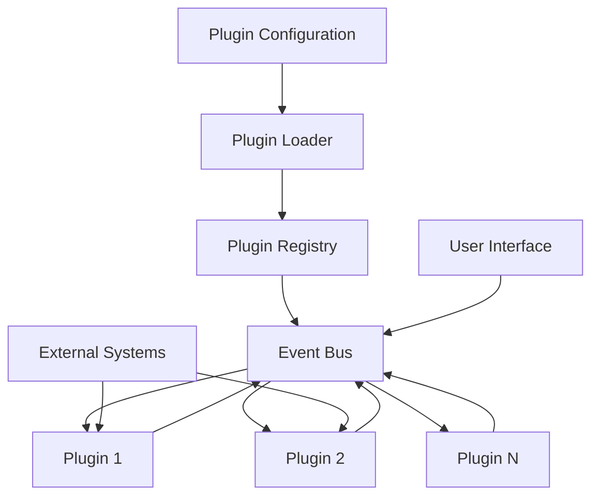
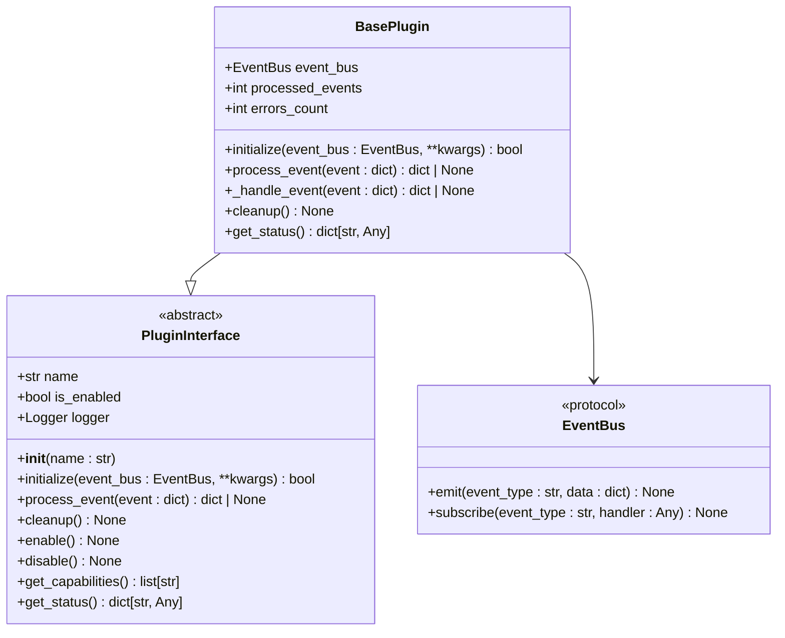
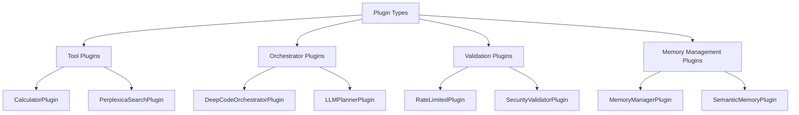
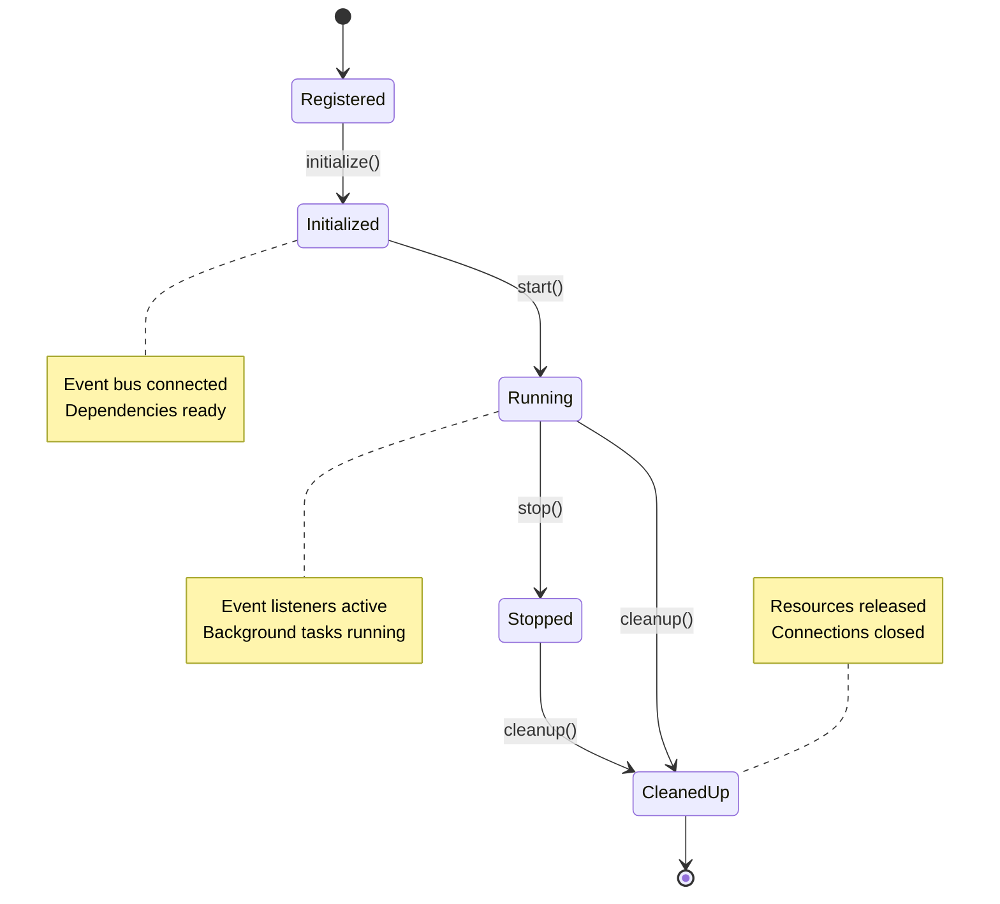
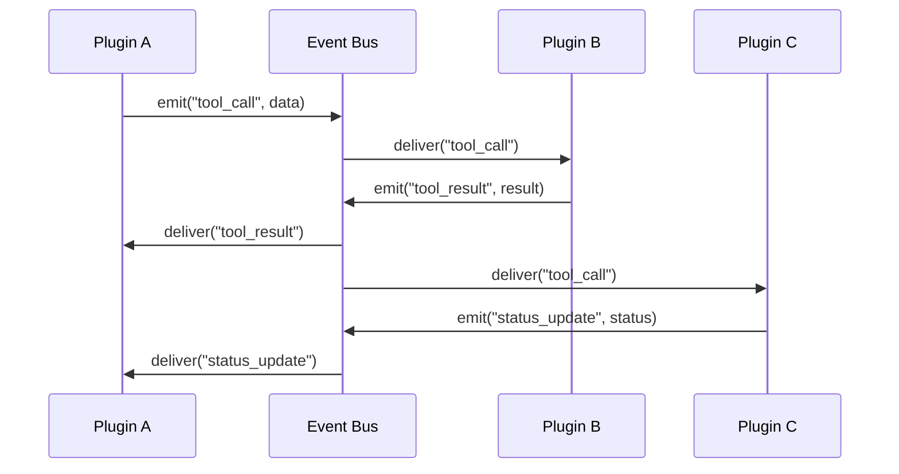

# Plugin Development

<cite>
**Referenced Files in This Document**   
- [plugin_interface.py](file://src/plugins/plugin_interface.py)
- [plugins.yaml](file://plugins.yaml)
- [calculator_plugin.py](file://src/plugins/calculator_plugin.py)
- [deepcode_orchestrator_plugin.py](file://src/plugins/deepcode_orchestrator_plugin.py)
- [memory_manager_plugin_unified.py](file://src/plugins/memory_manager_plugin_unified.py)
- [AGENTS.md](file://src/plugins/AGENTS.md)
- [ADVANCED_DEVELOPMENT_PATTERNS.md](file://ADVANCED_DEVELOPMENT_PATTERNS.md)
</cite>

## Table of Contents
1. [Introduction](#introduction)
2. [Plugin Architecture Overview](#plugin-architecture-overview)
3. [Core Plugin Interface](#core-plugin-interface)
4. [Plugin Types and Development Patterns](#plugin-types-and-development-patterns)
5. [Configuration and Settings](#configuration-and-settings)
6. [Plugin Lifecycle Management](#plugin-lifecycle-management)
7. [Event Processing and Communication](#event-processing-and-communication)
8. [Tool Integration and Capabilities](#tool-integration-and-capabilities)
9. [Testing and Debugging](#testing-and-debugging)
10. [Security Best Practices](#security-best-practices)
11. [Advanced Development Patterns](#advanced-development-patterns)
12. [Deployment Considerations](#deployment-considerations)

## Introduction

The Super Alita framework provides a comprehensive plugin system that enables developers to extend the agent's capabilities through modular components. This document details the process of creating, configuring, and deploying plugins within the Super Alita ecosystem. The plugin architecture follows a consistent interface pattern across different components of the system, allowing for seamless integration and interoperability.

Plugins in Super Alita serve as the primary mechanism for adding new functionality, from simple utility tools to complex cognitive systems. The framework supports various plugin types, each designed for specific use cases and integration patterns. This documentation provides a comprehensive guide for developers at all levels, from beginners creating their first plugin to experienced developers implementing advanced patterns like dynamic capability modification and plugin composition.

**Section sources**
- [plugin_interface.py](file://src/plugins/plugin_interface.py#L1-L256)
- [plugins.yaml](file://plugins.yaml#L1-L205)

## Plugin Architecture Overview

The Super Alita plugin architecture is designed around a consistent interface pattern that enables modular extension of the agent's capabilities. The system supports multiple plugin interface definitions across different components, with the primary interface located in `src/plugins/plugin_interface.py`. This interface defines the contract that all plugins must implement to integrate with the REUG v9.0 cognitive architecture.

The plugin system follows an event-driven architecture where plugins communicate through a shared event bus. This decoupled design allows plugins to interact without direct dependencies, promoting loose coupling and high cohesion. The event bus implementation supports both Redis/Memurai for distributed environments and in-memory alternatives for development and testing.

Plugins are configured through the `plugins.yaml` file, which defines the plugin registry including name, module path, priority, and configuration parameters. The configuration system supports environment variable interpolation, allowing for flexible deployment across different environments. Plugin loading follows a priority-based order, with dependencies loaded first to ensure proper initialization sequence.



**Diagram sources**
- [plugin_interface.py](file://src/plugins/plugin_interface.py#L1-L256)
- [plugins.yaml](file://plugins.yaml#L1-L205)

**Section sources**
- [plugin_interface.py](file://src/plugins/plugin_interface.py#L1-L256)
- [plugins.yaml](file://plugins.yaml#L1-L205)

## Core Plugin Interface

The core plugin interface defines the essential methods that all plugins must implement. The `PluginInterface` abstract base class in `src/plugins/plugin_interface.py` establishes the contract for plugin lifecycle management, event processing, and resource cleanup. This interface ensures consistent behavior across all plugins in the system.

The interface requires three core methods: `initialize`, `process_event`, and `cleanup`. The `initialize` method accepts an event bus instance and optional keyword arguments, returning a boolean indicating success. This method is responsible for setting up the plugin's dependencies and preparing it for operation. The `process_event` method handles incoming events from the event bus, processing them and returning results when applicable. The `cleanup` method performs resource cleanup during shutdown, ensuring proper resource management.

Plugins can inherit from the `BasePlugin` class, which provides default implementations of the interface methods along with common functionality like logging, status reporting, and error handling. The base implementation includes metrics tracking for processed events and error counts, providing visibility into plugin performance.



**Diagram sources**
- [plugin_interface.py](file://src/plugins/plugin_interface.py#L1-L256)

**Section sources**
- [plugin_interface.py](file://src/plugins/plugin_interface.py#L1-L256)

## Plugin Types and Development Patterns

Super Alita supports several plugin types, each designed for specific use cases and integration patterns. The primary plugin types include tool plugins, orchestrator plugins, validation plugins, and memory management plugins. Each type follows specific development patterns that align with its intended functionality.

Tool plugins, such as the `CalculatorPlugin`, provide specific capabilities that can be invoked through the MCP (Model Context Protocol) interface. These plugins implement the `get_tools` method to register their available tools with the system. The tools are described using a standardized schema that includes name, description, parameters, and metadata for validation and discovery.

Orchestrator plugins, like the `DeepCodeOrchestratorPlugin`, coordinate complex workflows across multiple systems. These plugins typically manage multi-phase processes, handling state transitions and error recovery. They emit a series of domain-specific events that other components can subscribe to, providing visibility into the orchestration process.

Validation plugins ensure the integrity and security of operations within the system. These plugins intercept requests and apply validation rules before allowing them to proceed. They can implement rate limiting, input validation, and security checks to protect the system from malicious or erroneous inputs.

Memory management plugins handle the storage and retrieval of information across different memory types, including working memory, episodic memory, and semantic memory. These plugins integrate with vector databases like ChromaDB for efficient similarity search and knowledge retrieval.



**Diagram sources**
- [calculator_plugin.py](file://src/plugins/calculator_plugin.py#L1-L250)
- [deepcode_orchestrator_plugin.py](file://src/plugins/deepcode_orchestrator_plugin.py#L1-L542)
- [memory_manager_plugin_unified.py](file://src/plugins/memory_manager_plugin_unified.py#L1-L594)

**Section sources**
- [calculator_plugin.py](file://src/plugins/calculator_plugin.py#L1-L250)
- [deepcode_orchestrator_plugin.py](file://src/plugins/deepcode_orchestrator_plugin.py#L1-L542)
- [memory_manager_plugin_unified.py](file://src/plugins/memory_manager_plugin_unified.py#L1-L594)

## Configuration and Settings

Plugin configuration in Super Alita is managed through the `plugins.yaml` file, which serves as the central registry for all plugins. This configuration file defines each plugin's name, module path, priority, and specific configuration parameters. The configuration system supports environment variable interpolation, allowing for flexible deployment across different environments.

Each plugin can define its own configuration schema with parameters that control its behavior. For example, the `CalculatorPlugin` might have configuration options for maximum expression complexity, while the `MemoryManagerPlugin` could have settings for memory capacity and persistence intervals. Configuration parameters are passed to the plugin during initialization, allowing it to adapt its behavior based on the deployment context.

The configuration system supports default values for optional parameters, ensuring that plugins can operate with minimal configuration while allowing for fine-tuning when needed. The `plugins.yaml` file also includes global settings that affect all plugins, such as auto-discovery behavior, loading strictness, and health monitoring intervals.

Plugins can access their configuration through the `config` parameter passed to the `initialize` method. The configuration is provided as a dictionary, allowing plugins to extract their specific settings using standard dictionary operations. This approach provides a clean separation between configuration management and plugin logic.

```mermaid
flowchart TD
A[plugins.yaml] --> B[Plugin Loader]
B --> C[Configuration Parser]
C --> D[Environment Variables]
C --> E[Default Values]
C --> F[Plugin Instance]
F --> G[Configuration Access]
G --> H[config.get("parameter", default)]
```

**Diagram sources**
- [plugins.yaml](file://plugins.yaml#L1-L205)
- [plugin_interface.py](file://src/plugins/plugin_interface.py#L1-L256)

**Section sources**
- [plugins.yaml](file://plugins.yaml#L1-L205)
- [plugin_interface.py](file://src/plugins/plugin_interface.py#L1-L256)

## Plugin Lifecycle Management

The plugin lifecycle in Super Alita follows a well-defined sequence of states from registration to cleanup. The lifecycle is managed by the `PluginRegistry` class, which handles the registration, initialization, and shutdown of plugins. This centralized management ensures consistent behavior across all plugins in the system.

Plugins progress through several states during their lifecycle: registered, initialized, running, and cleaned up. The `register` method adds a plugin to the registry, while the `initialize` method sets up the plugin's dependencies and prepares it for operation. The `start` method begins the plugin's main operations, typically involving event subscription and background task creation. Finally, the `cleanup` method performs resource cleanup during shutdown.

The `PluginRegistry` provides methods for managing multiple plugins simultaneously, such as `initialize_all` and `cleanup_all`. These methods ensure that plugins are initialized and cleaned up in the correct order, respecting dependencies between plugins. The registry also maintains a list of active plugins and provides status information for monitoring and debugging.

Plugins can implement additional lifecycle methods beyond the core interface. For example, they might implement a `health_check` method to provide status information or a `reload` method to support hot-swapping of configuration changes. These extensions allow for more sophisticated lifecycle management while maintaining compatibility with the core interface.



**Diagram sources**
- [plugin_interface.py](file://src/plugins/plugin_interface.py#L1-L256)

**Section sources**
- [plugin_interface.py](file://src/plugins/plugin_interface.py#L1-L256)

## Event Processing and Communication

Event processing is a core aspect of plugin development in Super Alita, enabling plugins to respond to system events and communicate with other components. The event-driven architecture uses a publish-subscribe pattern, where plugins can emit events and subscribe to events of interest. This decoupled design promotes loose coupling and high cohesion between components.

Plugins interact with the event bus through the `EventBus` protocol, which defines methods for emitting and subscribing to events. The `emit_event` method allows plugins to publish events with specific types and data, while the `subscribe` method enables them to register handlers for specific event types. Events are structured as dictionaries with standardized fields, including event type, source plugin, and timestamp.

The event system supports both direct event handling and pattern-based subscription. Plugins can subscribe to specific event types or use wildcard patterns to capture related events. This flexibility allows for sophisticated event routing and filtering, enabling plugins to focus on the events relevant to their functionality.

Plugins can also communicate directly with each other through the plugin messaging system. This inter-plugin communication allows for capability discovery, data sharing, and coordinated workflows. The messaging system uses the event bus as a transport layer, ensuring reliable delivery and proper error handling.



**Diagram sources**
- [plugin_interface.py](file://src/plugins/plugin_interface.py#L1-L256)
- [ADVANCED_DEVELOPMENT_PATTERNS.md](file://ADVANCED_DEVELOPMENT_PATTERNS.md#L241-L292)

**Section sources**
- [plugin_interface.py](file://src/plugins/plugin_interface.py#L1-L256)
- [ADVANCED_DEVELOPMENT_PATTERNS.md](file://ADVANCED_DEVELOPMENT_PATTERNS.md#L241-L292)

## Tool Integration and Capabilities

Tool integration in Super Alita is facilitated through the MCP (Model Context Protocol) interface, allowing plugins to expose their functionality to external systems and other components. Plugins implement the `get_tools` method to register their available tools with the system, providing a standardized description of each tool's capabilities.

