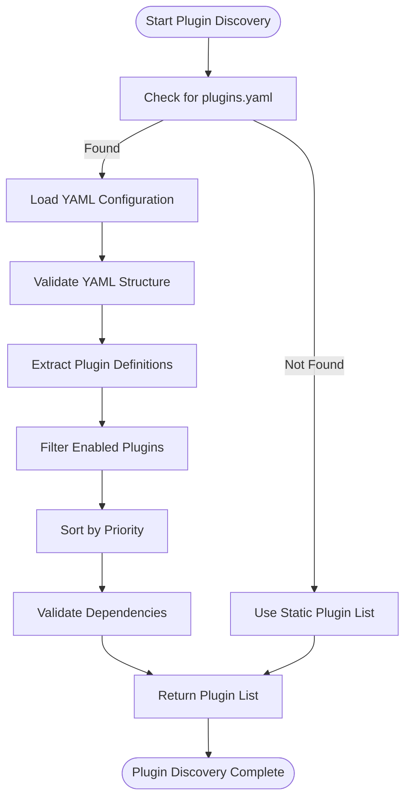
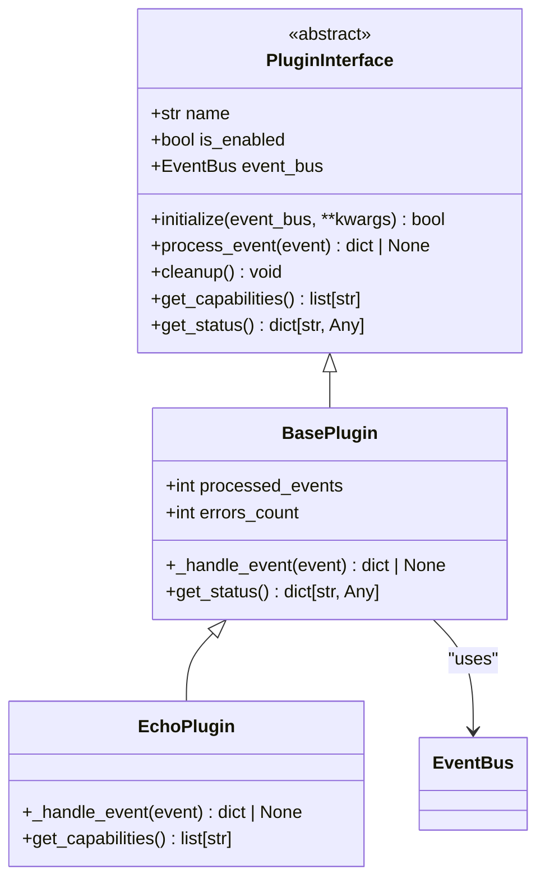
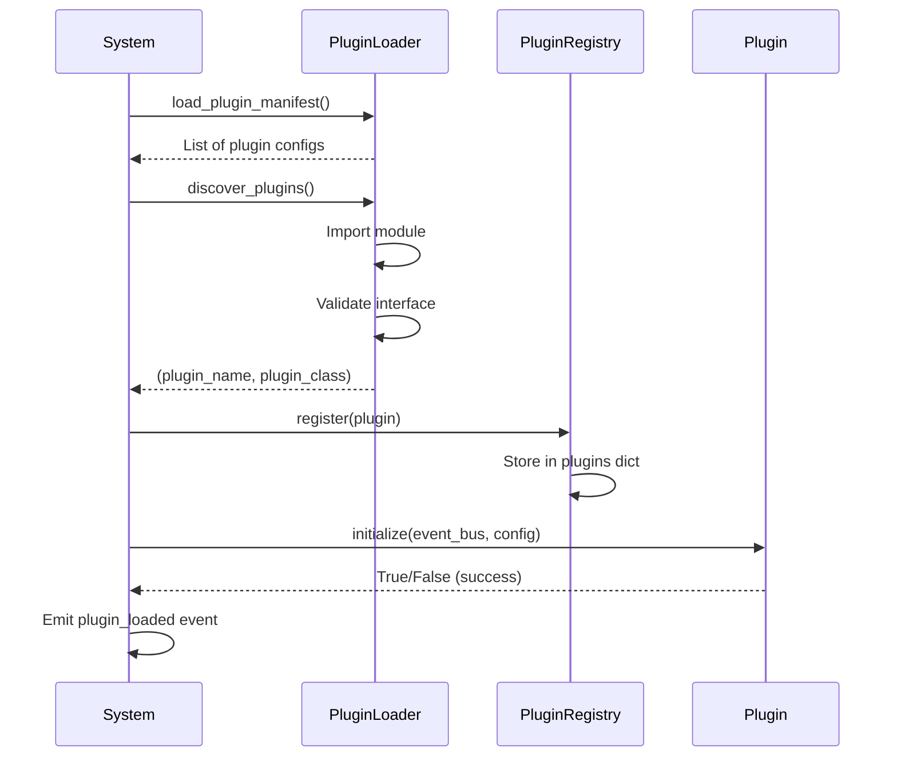
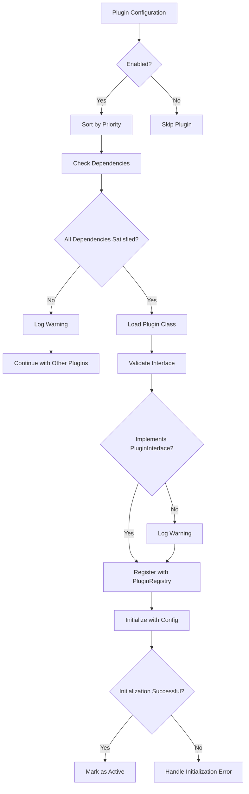
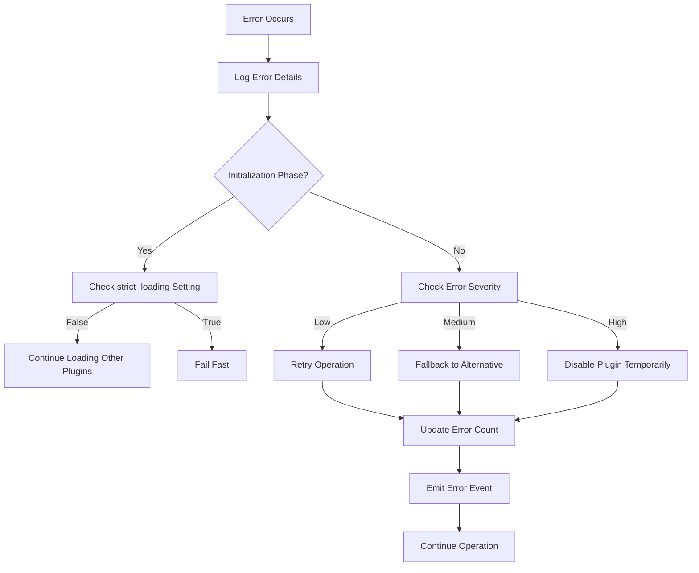

# Plugin Lifecycle

<cite>
**Referenced Files in This Document**   
- [plugin_interface.py](file://src/plugins/plugin_interface.py)
- [plugin_loader.py](file://src/core/plugin_loader.py)
- [plugin_registry.py](file://src/core/plugin_registry.py)
- [plugins.yaml](file://plugins.yaml)
- [test_plugin_loader.py](file://tests/test_plugin_loader.py)
</cite>

## Table of Contents
1. [Introduction](#introduction)
2. [Plugin Discovery and Loading](#plugin-discovery-and-loading)
3. [Plugin Interface Contracts](#plugin-interface-contracts)
4. [Initialization Process](#initialization-process)
5. [Registration and Dependency Management](#registration-and-dependency-management)
6. [Execution Lifecycle](#execution-lifecycle)
7. [Shutdown and Cleanup](#shutdown-and-cleanup)
8. [Error Handling and Recovery](#error-handling-and-recovery)
9. [Common Issues and Isolation Strategies](#common-issues-and-isolation-strategies)
10. [Asynchronous Loading Patterns](#asynchronous-loading-patterns)

## Introduction
The Super Alita framework employs a robust plugin architecture that enables dynamic extensibility and modular functionality. This document details the complete lifecycle of plugins within the system, from discovery through shutdown. The framework supports over 70 plugins that provide capabilities ranging from enhanced consensus algorithms to deep code analysis and memory management. Plugins follow a well-defined lifecycle with strict interface contracts, enabling reliable integration and operation within the cognitive architecture.

**Section sources**
- [plugin_interface.py](file://src/plugins/plugin_interface.py#L1-L50)
- [plugin_loader.py](file://src/core/plugin_loader.py#L1-L30)

## Plugin Discovery and Loading
The plugin discovery mechanism in Super Alita follows a declarative approach using YAML configuration files. The system scans for `plugins.yaml` in the root directory and processes plugin definitions in priority order. Each plugin is specified with a name, module path, priority level, and configuration parameters.

The discovery process begins with loading the plugin manifest from `plugins.yaml`, which contains definitions for all available plugins. The system validates the manifest structure, ensuring required fields like `name` and `module` are present. Plugins are then filtered by their enabled status and sorted by priority to establish the loading sequence.



**Diagram sources**
- [plugin_loader.py](file://src/core/plugin_loader.py#L45-L100)
- [plugins.yaml](file://plugins.yaml#L1-L20)

**Section sources**
- [plugin_loader.py](file://src/core/plugin_loader.py#L45-L120)
- [plugins.yaml](file://plugins.yaml#L1-L205)

## Plugin Interface Contracts
All plugins in the Super Alita framework must implement the `PluginInterface` contract, which defines the essential methods for integration with the system. This interface ensures consistency across plugins and provides a standardized way for the framework to interact with plugin functionality.

The core interface methods include:
- `initialize(event_bus: EventBus, **kwargs)`: Sets up the plugin with required dependencies
- `process_event(event: dict)`: Handles incoming events from the system
- `cleanup()`: Performs cleanup operations during shutdown

Plugins can inherit from `BasePlugin`, which provides default implementations of these methods along with common functionality like event counting and error tracking. The interface contract is validated during loading to ensure that each plugin class properly implements the required methods.



**Diagram sources**
- [plugin_interface.py](file://src/plugins/plugin_interface.py#L30-L150)
- [plugin_interface.py](file://src/plugins/plugin_interface.py#L160-L180)

**Section sources**
- [plugin_interface.py](file://src/plugins/plugin_interface.py#L30-L200)

## Initialization Process
The initialization process begins after a plugin class is successfully loaded and validated. During initialization, the plugin receives references to core system components, primarily the event bus, which enables communication with other system components. The `initialize` method is responsible for setting up the plugin's internal state and establishing connections to required services.

Initialization follows a strict sequence where plugins are initialized in priority order, ensuring that dependencies are available before dependent plugins start. The system provides configuration parameters from the `plugins.yaml` file to each plugin during initialization, allowing for environment-specific settings. If initialization fails, the system logs the error and may attempt recovery based on the global plugin settings.



**Diagram sources**
- [plugin_loader.py](file://src/core/plugin_loader.py#L120-L200)
- [plugin_interface.py](file://src/plugins/plugin_interface.py#L34-L45)
- [plugin_registry.py](file://src/core/plugin_registry.py#L20-L30)

**Section sources**
- [plugin_loader.py](file://src/core/plugin_loader.py#L120-L247)
- [plugin_interface.py](file://src/plugins/plugin_interface.py#L34-L45)

## Registration and Dependency Management
The plugin registry serves as the central management point for all active plugins in the system. When a plugin is successfully initialized, it is registered with the `PluginRegistry`, which maintains a dictionary of active plugin instances indexed by name. The registry provides methods for retrieving, listing, and managing plugins throughout their lifecycle.

Dependency management is handled through the `depends_on` field in the plugin configuration, which specifies other plugins that must be loaded before the current plugin. The system validates these dependencies during the discovery phase and generates warnings if dependency ordering conflicts exist. The `validate_dependencies` and `validate_plugin_order` functions check for missing dependencies and incorrect loading sequences, respectively.



**Diagram sources**
- [plugin_registry.py](file://src/core/plugin_registry.py#L20-L50)
- [plugin_loader.py](file://src/core/plugin_loader.py#L105-L120)
- [plugins.yaml](file://plugins.yaml#L200-L205)

**Section sources**
- [plugin_registry.py](file://src/core/plugin_registry.py#L20-L50)
- [plugin_loader.py](file://src/core/plugin_loader.py#L105-L120)

## Execution Lifecycle
Once initialized and registered, plugins enter their execution phase where they actively participate in the system's operation. The primary mechanism for plugin execution is event-driven processing through the event bus. Plugins subscribe to specific event types and implement the `process_event` method to handle incoming events.

The execution lifecycle includes continuous monitoring of plugin health and performance. Each plugin maintains metrics such as processed events and error counts, which can be accessed through the `get_status` method. The system may dynamically enable or disable plugins based on their performance or system requirements using the `enable()` and `disable()` methods.

Plugins can also create and manage background tasks through the `_tasks` attribute, allowing for asynchronous operations that don't block the main event loop. These tasks are automatically cleaned up during shutdown to prevent resource leaks.

**Section sources**
- [plugin_interface.py](file://src/plugins/plugin_interface.py#L60-L80)
- [test_plugin_loader.py](file://tests/test_plugin_loader.py#L250-L300)

## Shutdown and Cleanup
The shutdown process is a critical phase that ensures proper resource cleanup and system stability. When the system is terminating or a plugin needs to be unloaded, the `cleanup` method is called on each registered plugin. This method should release any acquired resources, close network connections, and perform other necessary cleanup operations.

The `PluginRegistry` coordinates the shutdown of all plugins through its `cleanup_all` method, which iterates through all registered plugins and calls their `cleanup` methods. The system implements error handling during cleanup to prevent one plugin's failure from affecting the shutdown of others. After successful cleanup, plugins are unregistered from the registry.

```mermaid
flowchart TD
A[Shutdown Initiated] --> B[Call cleanup_all()]
B --> C{More Plugins?}
C --> |Yes| D[Get Next Plugin]
D --> E[Call plugin.cleanup()]
E --> F{Error?}
F --> |Yes| G[Log Error, Continue]
F --> |No| H[Proceed to Next]
H --> C
G --> C
C --> |No| I[Clear Registry]
I --> J[Shutdown Complete]
```

**Diagram sources**
- [plugin_interface.py](file://src/plugins/plugin_interface.py#L61-L65)
- [plugin_interface.py](file://src/plugins/plugin_interface.py#L190-L200)

**Section sources**
- [plugin_interface.py](file://src/plugins/plugin_interface.py#L61-L65)
- [plugin_interface.py](file://src/plugins/plugin_interface.py#L190-L200)

## Error Handling and Recovery
The Super Alita framework implements comprehensive error handling strategies to maintain system reliability during plugin operations. When a plugin encounters an error during initialization or execution, the system captures the exception, logs detailed information, and attempts recovery based on predefined policies.

The error recovery mechanism includes multiple strategies such as retrying failed operations, falling back to alternative plugins, or temporarily disabling problematic plugins. The system emits error events through the event bus, allowing monitoring components to respond appropriately. For initialization failures, the system may continue operation with reduced functionality if the `strict_loading` setting is disabled.



**Diagram sources**
- [plugin_loader.py](file://src/core/plugin_loader.py#L200-L247)
- [test_plugin_loader.py](file://tests/test_plugin_loader.py#L150-L200)

**Section sources**
- [plugin_loader.py](file://src/core/plugin_loader.py#L200-L247)
- [test_plugin_loader.py](file://tests/test_plugin_loader.py#L150-L200)

## Common Issues and Isolation Strategies
Several common issues can arise in plugin-based systems, including dependency conflicts, version incompatibilities, and resource contention. The Super Alita framework addresses these through careful design and isolation strategies.

Dependency conflicts are prevented through the priority-based loading order and explicit dependency declarations in the configuration. Version incompatibilities are mitigated by using semantic versioning in plugin specifications and maintaining backward compatibility in the plugin interface.

Resource isolation is achieved through separate execution contexts and resource limits for each plugin. The system monitors plugin resource usage and can throttle or restart plugins that exceed predefined limits. Configuration isolation ensures that plugins cannot interfere with each other's settings, with each plugin receiving only its designated configuration parameters.

**Section sources**
- [plugins.yaml](file://plugins.yaml#L200-L205)
- [plugin_loader.py](file://src/core/plugin_loader.py#L105-L120)

## Asynchronous Loading Patterns
The plugin loading system employs asynchronous patterns to improve startup performance and responsiveness. The entire loading process is designed to be non-blocking, allowing the system to continue initialization while plugins are being loaded in the background.

The `discover_plugins` function uses asynchronous imports and validation to load multiple plugins concurrently. This parallel loading approach significantly reduces startup time, especially when dealing with a large number of plugins. The system also implements race condition prevention through proper locking mechanisms when accessing shared resources like the plugin registry.

Hot-swapping capabilities allow plugins to be reloaded at runtime without restarting the entire system, though this feature is disabled in production for stability. The asynchronous design ensures that plugin loading does not block the main event loop, maintaining system responsiveness during dynamic plugin operations.

**Section sources**
- [plugin_loader.py](file://src/core/plugin_loader.py#L120-L247)
- [plugin_interface.py](file://src/plugins/plugin_interface.py#L34-L45)