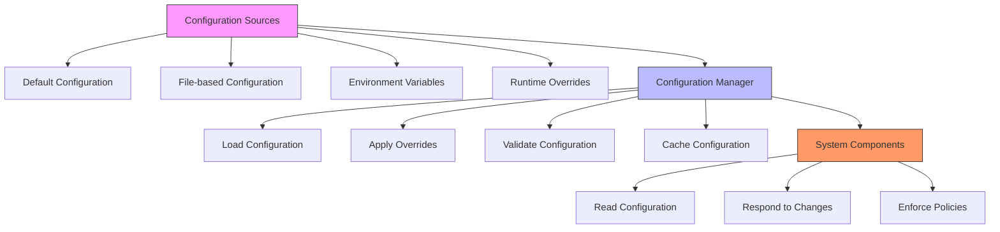
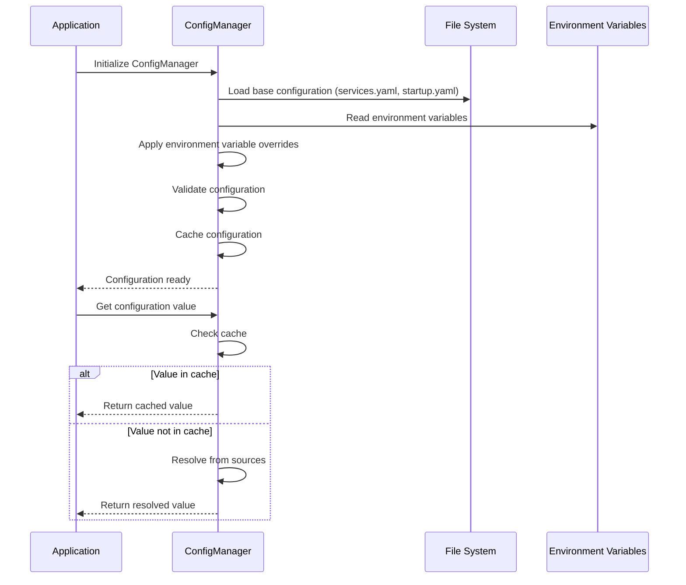
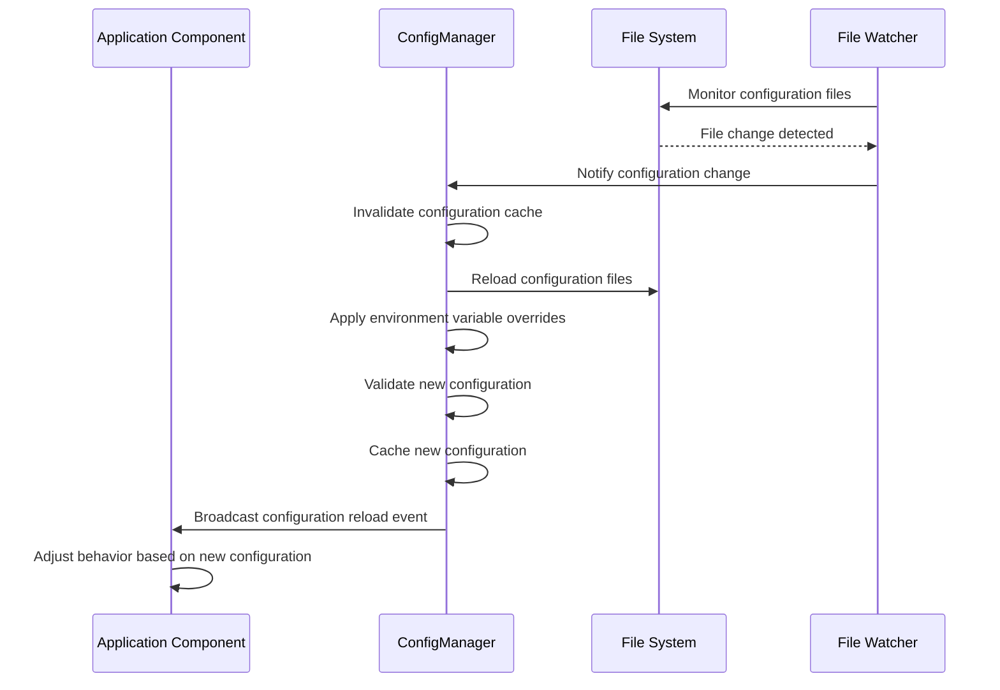
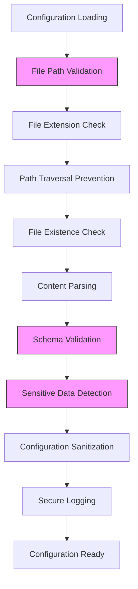
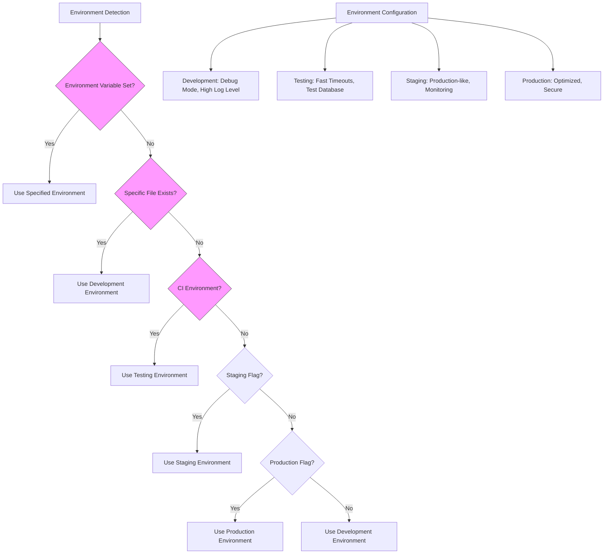

# Configuration Management

<cite>
**Referenced Files in This Document**   
- [services.yaml](file://config/services.yaml)
- [startup.yaml](file://config/startup.yaml)
- [security_policies.yaml](file://config/security_policies.yaml)
- [AGENTS.md](file://src/config/AGENTS.md)
- [INSTRUCTIONS.md](file://config/INSTRUCTIONS.md)
- [puter_config.py](file://config/puter_config.py)
</cite>

## Table of Contents
1. [Introduction](#introduction)
2. [Configuration Architecture](#configuration-architecture)
3. [Core Configuration Files](#core-configuration-files)
4. [Configuration Loading Process](#configuration-loading-process)
5. [Environment Variable Overrides](#environment-variable-overrides)
6. [Dynamic Configuration Reloading](#dynamic-configuration-reloading)
7. [Configuration Validation and Security](#configuration-validation-and-security)
8. [Multi-Environment Management](#multi-environment-management)
9. [Common Configuration Issues](#common-configuration-issues)
10. [Best Practices](#best-practices)

## Introduction
The Super Alita system employs a comprehensive configuration management framework that enables flexible, secure, and maintainable system behavior across different environments. This document details the configuration architecture, focusing on the three primary configuration files: services.yaml, startup.yaml, and security_policies.yaml. The system follows a hierarchical configuration model with multiple layers of precedence, allowing for environment-specific overrides while maintaining consistent defaults. Configuration management is central to the system's operation, controlling everything from service initialization and security policies to feature toggles and runtime behavior.

## Configuration Architecture
The Super Alita configuration system follows a layered architecture with multiple sources of configuration data. The system prioritizes flexibility and security, allowing configuration to be defined in files, environment variables, and runtime overrides. The architecture supports environment-specific configurations, validation, and dynamic reloading, making it suitable for both development and production environments.



**Diagram sources**
- [AGENTS.md](file://src/config/AGENTS.md#L0-L642)
- [INSTRUCTIONS.md](file://config/INSTRUCTIONS.md#L64-L123)

**Section sources**
- [AGENTS.md](file://src/config/AGENTS.md#L0-L642)
- [INSTRUCTIONS.md](file://config/INSTRUCTIONS.md#L64-L123)

## Core Configuration Files

### services.yaml
The services.yaml file defines the configuration for external services and LLM providers used by the system. It includes API keys, endpoints, and timeout settings for various services.

```yaml
# LLM Provider Configuration
llm_providers:
  gemini:
    api_key: "${GEMINI_API_KEY}"
    model: "gemini-1.5-pro"
    timeout: 30

  openai:
    api_key: "${OPENAI_API_KEY}"
    model: "gpt-4"
    timeout: 30

  anthropic:
    api_key: "${ANTHROPIC_API_KEY}"
    model: "claude-3-sonnet"
    timeout: 30

external_services:
  redis:
    url: "${REDIS_URL}"
    timeout: 5

  puter:
    base_url: "${PUTER_BASE_URL}"
    api_key: "${PUTER_API_KEY}"
```

This configuration file uses environment variable references (e.g., ${GEMINI_API_KEY}) for sensitive information, promoting security by keeping credentials out of version control. The file structure separates LLM providers from other external services, making it easy to manage and extend.

**Section sources**
- [services.yaml](file://config/services.yaml#L1-L26)

### startup.yaml
The startup.yaml file controls the behavior of the system's startup scripts and server configuration. It includes settings for the main server, MCP server, browser behavior, health checks, and development options.

```yaml
# Super Alita Startup Configuration
main_server:
  port: 8080
  host: "127.0.0.1"
  auto_reload: true

mcp_server:
  enabled: true
  script: "mcp_server_wrapper.py"

browser:
  auto_open: true
  url_path: "/"
  delay: 3

health_check:
  timeout: 30
  interval: 1
  endpoints:
    - "/health"
    - "/healthz"

startup:
  show_banner: true
  verbose: true

services:
  telemetry:
    enabled: true
  gui_server:
    enabled: false
    port: 8081

development:
  auto_restart: true
  debug_mode: false
  log_level: "INFO"
```

This configuration file demonstrates a hierarchical structure with logical grouping of related settings. It supports feature toggles (e.g., enabling/disabling services) and provides sensible defaults for development and production environments.

**Section sources**
- [startup.yaml](file://config/startup.yaml#L1-L47)

### security_policies.yaml
The security_policies.yaml file defines the system's security rules and access control policies. It follows a deny-by-default approach with explicit allow rules based on conditions.

```yaml
default_decision: deny
description: Super Alita Security Policies - Deny by default, explicit allow
rules:
- conditions:
    resources:
    - echo
    - secure_scan_code
    - python_import_smoke
    - pytest_run
  description: Allow core system tools for all actors
  effect: allow
  id: allow_core_tools
  priority: 10
- conditions:
    environment:
      authenticated: true
    resources:
    - github_*
  description: Allow GitHub tools for authenticated requests
  effect: allow
  id: allow_authenticated_github
  priority: 20
- conditions:
    environment:
      env: development
    resources:
    - code_synthesize*
    - ladder_reug_generate
    - unified_execute
  description: Allow development tools in dev environment
  effect: allow
  id: allow_development_tools
  priority: 30
- conditions:
    actions:
    - delete
    - destroy
    - overwrite
    environment:
      env: production
  description: Deny destructive operations in production
  effect: deny
  id: deny_destructive_production
  priority: 5
```

This security policy configuration uses a rule-based approach with priority-based evaluation. Rules can match on various conditions including resources (with wildcard support), environment variables, and actions. The deny-by-default approach ensures that only explicitly allowed operations can proceed, enhancing system security.

**Section sources**
- [security_policies.yaml](file://config/security_policies.yaml#L1-L45)

## Configuration Loading Process
The configuration loading process in Super Alita follows a well-defined hierarchy with multiple sources and precedence rules. The system uses a ConfigManager class to centralize configuration management and provide a consistent interface for accessing configuration values.



**Diagram sources**
- [AGENTS.md](file://src/config/AGENTS.md#L0-L642)
- [INSTRUCTIONS.md](file://config/INSTRUCTIONS.md#L124-L182)

**Section sources**
- [AGENTS.md](file://src/config/AGENTS.md#L0-L642)
- [INSTRUCTIONS.md](file://config/INSTRUCTIONS.md#L124-L182)

The configuration loading process follows these steps:
1. **Initialize ConfigManager**: The configuration manager is instantiated, optionally with a specific configuration file path.
2. **Load base configuration**: The manager loads configuration from YAML files in the config directory.
3. **Apply environment variable overrides**: Environment variables take precedence over file-based configuration, allowing for runtime customization.
4. **Validate configuration**: The loaded configuration is validated against expected schemas and security requirements.
5. **Cache configuration**: The final configuration is cached for performance, with individual values also cached when accessed.
6. **Provide access interface**: The manager provides methods to retrieve configuration values using dot notation.

The ConfigManager class supports both file-based and environment-based configuration loading, with a fallback to environment variables when file configuration is not available. This ensures the system can operate in various deployment scenarios.

## Environment Variable Overrides
Environment variable overrides provide a powerful mechanism for customizing system behavior without modifying configuration files. This is particularly useful for deployment-specific settings, sensitive credentials, and temporary debugging configurations.

```mermaid
flowchart TD
A[Configuration Value Request] --> B{Value in Environment Variables?}
B --> |Yes| C[Return Environment Variable Value]
B --> |No| D{Value in Configuration File?}
D --> |Yes| E[Return File Configuration Value]
D --> |No| F[Return Default Value]
G[Environment Variable Format] --> H["${VARIABLE_NAME}"]
H --> I[Example: ${GEMINI_API_KEY}]
I --> J[Resolved to value of GEMINI_API_KEY environment variable]
style B fill:#f9f,stroke:#333
style D fill:#f9f,stroke:#333
```

**Diagram sources**
- [services.yaml](file://config/services.yaml#L1-L26)
- [INSTRUCTIONS.md](file://config/INSTRUCTIONS.md#L124-L182)

**Section sources**
- [services.yaml](file://config/services.yaml#L1-L26)
- [INSTRUCTIONS.md](file://config/INSTRUCTIONS.md#L124-L182)

The system uses a specific syntax for environment variable references: ${VARIABLE_NAME}. When the configuration loader encounters this pattern, it replaces it with the value of the corresponding environment variable. If the environment variable is not set, the original placeholder text is retained, which can help identify missing configuration.

Key benefits of environment variable overrides include:
- **Security**: Sensitive information like API keys can be kept out of version control.
- **Flexibility**: Different deployments can use different configurations without code changes.
- **Environment-specific settings**: Development, staging, and production environments can have different configurations.
- **Temporary overrides**: Debugging and testing can use temporary configuration changes.

The ConfigManager's _apply_env_overrides method recursively processes the configuration dictionary, replacing any string values that match the ${VARIABLE_NAME} pattern with their corresponding environment variable values.

## Dynamic Configuration Reloading
The Super Alita system supports dynamic configuration reloading, allowing certain configuration changes to take effect without requiring a full system restart. This capability is particularly valuable in production environments where downtime must be minimized.



**Diagram sources**
- [AGENTS.md](file://src/config/AGENTS.md#L0-L642)
- [startup.yaml](file://config/startup.yaml#L1-L47)

**Section sources**
- [AGENTS.md](file://src/config/AGENTS.md#L0-L642)
- [startup.yaml](file://config/startup.yaml#L1-L47)

Dynamic configuration reloading works as follows:
1. **File monitoring**: A file watcher monitors configuration files for changes.
2. **Change detection**: When a configuration file is modified, the change is detected.
3. **Cache invalidation**: The configuration manager invalidates its internal cache.
4. **Configuration reload**: The manager reloads configuration from files and applies environment variable overrides.
5. **Validation**: The new configuration is validated to ensure it's correct and secure.
6. **Event broadcasting**: The manager broadcasts a configuration reload event to interested components.
7. **Behavior adjustment**: Components that subscribe to configuration changes adjust their behavior accordingly.

Not all configuration changes can be applied dynamically. Some changes, such as database connection settings or fundamental architectural parameters, may require a full system restart. The system distinguishes between "hot-reloadable" and "cold-reload-required" configuration options.

## Configuration Validation and Security
Configuration validation and security are critical aspects of the Super Alita system. The configuration management framework includes multiple layers of validation and security checks to prevent misconfiguration and protect sensitive information.



**Diagram sources**
- [AGENTS.md](file://src/config/AGENTS.md#L0-L642)
- [INSTRUCTIONS.md](file://config/INSTRUCTIONS.md#L124-L182)

**Section sources**
- [AGENTS.md](file://src/config/AGENTS.md#L0-L642)
- [INSTRUCTIONS.md](file://config/INSTRUCTIONS.md#L124-L182)

The validation and security process includes:
- **File path validation**: Ensures configuration files are within allowed directories and don't contain path traversal attempts.
- **File extension check**: Validates that configuration files have appropriate extensions (.yaml, .json, etc.).
- **File existence check**: Verifies that specified configuration files actually exist.
- **Content parsing**: Parses configuration content safely, handling potential parsing errors.
- **Schema validation**: Validates configuration against expected schemas to ensure required fields are present and values are of correct types.
- **Sensitive data detection**: Identifies configuration keys that contain sensitive information (passwords, API keys, etc.).
- **Configuration sanitization**: Redacts sensitive values when logging configuration for security.
- **Secure logging**: Ensures that sensitive configuration values are not exposed in logs.

The SecureConfigLoader class implements many of these security features, including path validation and configuration sanitization. It maintains a list of sensitive key patterns and redacts their values when logging configuration, helping to prevent accidental exposure of credentials.

## Multi-Environment Management
The Super Alita system supports multiple environments (development, testing, staging, production) through environment-specific configuration management. This allows different settings to be applied based on the current environment, ensuring appropriate behavior for each deployment scenario.



**Diagram sources**
