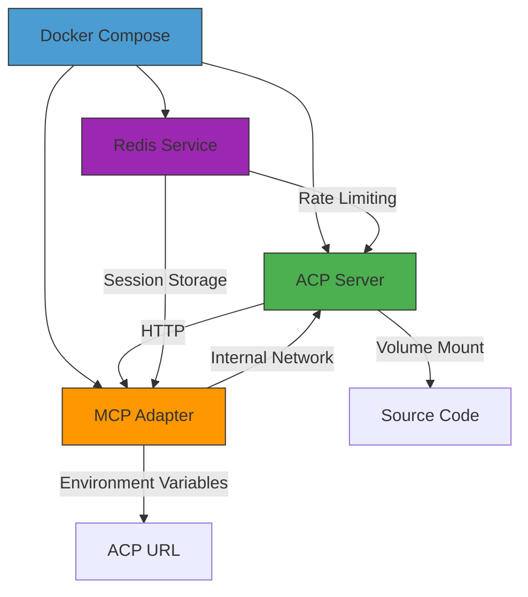
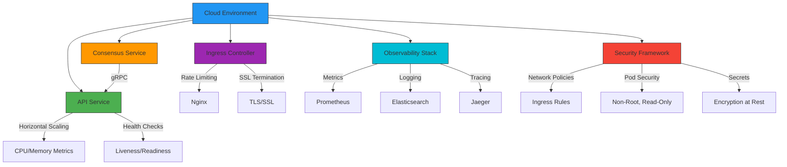
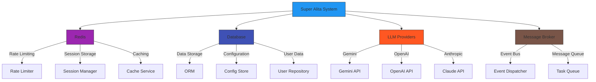

# Deployment Strategies

<cite>
**Referenced Files in This Document**   
- [docker-compose.yml](file://docker/docker-compose.yml)
- [docker-compose.redis.yml](file://docker/docker-compose.redis.yml)
- [Dockerfile](file://Dockerfile)
- [services.yaml](file://config/services.yaml)
- [startup.yaml](file://config/startup.yaml)
- [production-deployment.yml](file://deployment/production-deployment.yml)
- [PRODUCTION_DEPLOYMENT_GUIDE.md](file://PRODUCTION_DEPLOYMENT_GUIDE.md)
- [MICROSERVICES_DEPLOYMENT.md](file://MICROSERVICES_DEPLOYMENT.md)
</cite>

## Table of Contents
1. [Introduction](#introduction)
2. [Docker-Based Deployments](#docker-based-deployments)
3. [Bare-Metal Deployments](#bare-metal-deployments)
4. [Cloud Environment Configurations](#cloud-environment-configurations)
5. [Service Orchestration Patterns](#service-orchestration-patterns)
6. [Container Networking and Volume Management](#container-networking-and-volume-management)
7. [Environment Variable Management](#environment-variable-management)
8. [Service Dependencies and Startup Sequences](#service-dependencies-and-startup-sequences)
9. [Infrastructure Integration](#infrastructure-integration)
10. [Deployment Approach Comparison](#deployment-approach-comparison)
11. [Troubleshooting Guide](#troubleshooting-guide)

## Introduction
The Super Alita system offers multiple deployment strategies to accommodate various operational requirements, from local development to production-scale cloud deployments. This document provides comprehensive guidance on the available deployment options, including Docker-based deployments using docker-compose, bare-metal installations, and cloud environment configurations. The system's architecture supports flexible deployment patterns with robust service orchestration, container networking, and volume management capabilities. The deployment strategies are designed to integrate seamlessly with infrastructure services like Redis, databases, and message brokers, providing a resilient and scalable foundation for the Super Alita system.

## Docker-Based Deployments

The Super Alita system provides comprehensive Docker-based deployment options through docker-compose configurations that enable rapid setup and consistent environments across different deployment targets. The primary docker-compose.yml file defines a multi-service architecture with an ACP server and MCP adapter, establishing a bridge network for secure inter-service communication. The ACP server is built from a custom Dockerfile.acp with volume mounting for the source code, enabling development-friendly hot-reloading capabilities. The MCP adapter service depends on the ACP server and connects to it via the internal acp-network, demonstrating a clear service dependency pattern.

For production and staging environments, the system includes specialized docker-compose configurations that incorporate Redis for rate limiting and session management. The docker-compose.redis.yml file provides a Redis service configuration with persistence disabled for optimal performance in rate-limiting scenarios. This modular approach to docker-compose files allows for flexible composition of services based on the deployment environment, following the principle of configuration over convention. The Dockerfile for the main application specifies a slim Python 3.11 base image with optimized layer caching, health checks, and proper environment variable configuration for production readiness.

**Diagram sources**
- [docker-compose.yml](file://docker/docker-compose.yml)
- [docker-compose.redis.yml](file://docker/docker-compose.redis.yml)

**Section sources**
- [docker-compose.yml](file://docker/docker-compose.yml)
- [docker-compose.redis.yml](file://docker/docker-compose.redis.yml)
- [Dockerfile](file://Dockerfile)

## Bare-Metal Deployments

Bare-metal deployments of the Super Alita system provide maximum performance and control for production environments, leveraging direct hardware access and optimized system configurations. The system can be deployed on bare-metal servers using traditional process management tools like systemd or container orchestration platforms like Kubernetes. For simple deployments, the system can be run directly using Gunicorn with Uvicorn workers, as demonstrated in the production deployment guide. This approach allows for fine-grained control over worker processes, connection handling, and resource allocation.

The bare-metal deployment strategy emphasizes performance tuning and security hardening, with specific configurations for CPU, memory, and GPU utilization. The system supports vertical scaling by increasing hardware resources and horizontal scaling through load balancing across multiple instances. For optimal performance, the deployment guide recommends using quantized models for faster inference and configuring Ollama for GPU acceleration when available. The systemd service configuration provides reliable process management with automatic restarts and health monitoring, ensuring high availability and resilience.

**Section sources**
- [PRODUCTION_DEPLOYMENT_GUIDE.md](file://PRODUCTION_DEPLOYMENT_GUIDE.md)
- [MICROSERVICES_DEPLOYMENT.md](file://MICROSERVICES_DEPLOYMENT.md)

## Cloud Environment Configurations

The Super Alita system is designed for seamless deployment in cloud environments, with comprehensive configuration for intelligent routing, autoscaling, and observability. The production-deployment.yml file defines a sophisticated cloud deployment configuration with multiple services, including API and consensus components, each with defined resource requests and limits. The configuration specifies horizontal autoscaling based on CPU and memory utilization, ensuring optimal resource utilization and cost efficiency. The routing configuration includes ingress rules with rate limiting and SSL redirection, providing enterprise-grade security and reliability.

Cloud deployments leverage advanced observability features, including Prometheus metrics collection, structured JSON logging with Elasticsearch aggregation, and distributed tracing with Jaeger. The configuration includes comprehensive alerting rules for high error rates, latency issues, and pod restarts, enabling proactive monitoring and incident response. Security is prioritized with network policies, pod security standards, and secrets encryption at rest. The deployment also addresses regional compliance requirements, including data residency controls, cross-region replication, and adherence to SOC2, GDPR, and ISO27001 frameworks.

**Diagram sources**
- [production-deployment.yml](file://deployment/production-deployment.yml)

**Section sources**
- [production-deployment.yml](file://deployment/production-deployment.yml)
- [PRODUCTION_DEPLOYMENT_GUIDE.md](file://PRODUCTION_DEPLOYMENT_GUIDE.md)

## Service Orchestration Patterns

The Super Alita system employs sophisticated service orchestration patterns to manage complex interactions between components and ensure reliable operation. The system supports multiple deployment modes, including local, gRPC, and hybrid consensus service modes, allowing for flexible architecture choices based on deployment requirements. In microservices deployments, the gRPC mode enables distributed consensus across multiple nodes, while the hybrid mode provides resilience by falling back to local processing when the gRPC service is unavailable.

The orchestration patterns are designed to handle service dependencies and startup sequences effectively. The docker-compose configurations use the depends_on directive to ensure proper startup ordering, while the system's health checks verify service readiness before allowing traffic. For production deployments, the blue-green deployment strategy with automatic rollback capabilities minimizes downtime and risk during updates. The CI/CD pipeline integrates comprehensive validation steps, including artifact creation, environment preparation, deployment execution, and health checks, ensuring deployment reliability.

**Section sources**
- [MICROSERVICES_DEPLOYMENT.md](file://MICROSERVICES_DEPLOYMENT.md)
- [configs/trae/builders/performance-optimized.yml](file://configs/trae/builders/performance-optimized.yml)

## Container Networking and Volume Management

The Super Alita system implements robust container networking and volume management strategies to ensure secure communication and persistent data storage. The docker-compose configuration defines a custom bridge network (acp-network) for isolated communication between services, preventing unauthorized access from other containers on the host. This network segmentation enhances security by limiting the attack surface and ensuring that only authorized services can communicate with each other.

Volume management is implemented through explicit volume mounts that map host directories to container paths, enabling persistent storage of models, logs, and configuration files. The system uses volume mounts for the source code directory (../src:/app/src), allowing for development-friendly hot-reloading while maintaining separation between the application code and container image. For production deployments, additional volumes are recommended for logs and models to ensure data persistence across container restarts and updates.

**Section sources**
- [docker-compose.yml](file://docker/docker-compose.yml)
- [PRODUCTION_DEPLOYMENT_GUIDE.md](file://PRODUCTION_DEPLOYMENT_GUIDE.md)

## Environment Variable Management

The Super Alita system employs a comprehensive environment variable management strategy to control configuration across different deployment environments. The configuration system supports hierarchical configuration with multiple sources, including environment variables, configuration files, and runtime overrides. Environment variables follow a consistent naming convention with uppercase letters and underscores, making them easily discoverable and standardized across the system.

Critical configuration parameters include server settings (HOST, PORT), logging levels (LOG_LEVEL), database connections (DATABASE_URL), and security credentials (API keys, tokens). The system also supports feature flags and operational modes through environment variables, such as SUPER_ALITA_MODE for controlling system behavior and CONSENSUS_SERVICE_MODE for selecting between local, gRPC, and hybrid consensus modes. Sensitive configuration values are managed securely, with recommendations to use environment variables rather than hard-coded values in configuration files.

**Section sources**
- [services.yaml](file://config/services.yaml)
- [PRODUCTION_DEPLOYMENT_GUIDE.md](file://PRODUCTION_DEPLOYMENT_GUIDE.md)

## Service Dependencies and Startup Sequences

The Super Alita system manages service dependencies and startup sequences through a combination of configuration directives and health checks. The docker-compose configuration uses the depends_on directive to establish explicit dependencies between services, ensuring that the ACP server starts before the MCP adapter. However, depends_on only waits for the container to start, not for the service to be ready, so additional health checks are implemented to verify service readiness.

The system includes comprehensive health check endpoints (/health, /healthz) that are used by both the orchestration system and external monitoring tools to verify service health. The startup.yaml configuration file defines health check parameters, including timeout, interval, and specific endpoints to monitor. For production deployments, the system implements a startup sequence that includes waiting for database connectivity, loading configuration, initializing services, and performing self-tests before accepting traffic.

**Section sources**
- [docker-compose.yml](file://docker/docker-compose.yml)
- [startup.yaml](file://config/startup.yaml)

## Infrastructure Integration

The Super Alita system integrates seamlessly with various infrastructure services, including Redis, databases, and message brokers, to provide enhanced functionality and reliability. The system uses Redis for multiple purposes, including rate limiting, session storage, and caching, with configuration options to enable or disable Redis integration based on deployment requirements. The services.yaml configuration file defines the Redis URL as an environment variable (REDIS_URL), allowing for flexible configuration across different environments.

Database integration is supported through configurable connection strings, with support for various database types and connection pooling. The system also integrates with external LLM providers (Gemini, OpenAI, Anthropic) through configurable API endpoints and authentication keys. For message brokering and event-driven architectures, the system supports Redis as an event bus, enabling real-time communication between components and services.

**Diagram sources**
- [services.yaml](file://config/services.yaml)

**Section sources**
- [services.yaml](file://config/services.yaml)
- [config/INSTRUCTIONS.md](file://config/INSTRUCTIONS.md)

## Deployment Approach Comparison

The Super Alita system offers multiple deployment approaches, each with distinct trade-offs and use case recommendations. Docker-based deployments provide consistency and isolation, making them ideal for development and testing environments where reproducibility is critical. The containerized approach ensures that the application runs the same way across different environments, reducing the "it works on my machine" problem. However, containerization introduces additional overhead and complexity, which may not be justified for