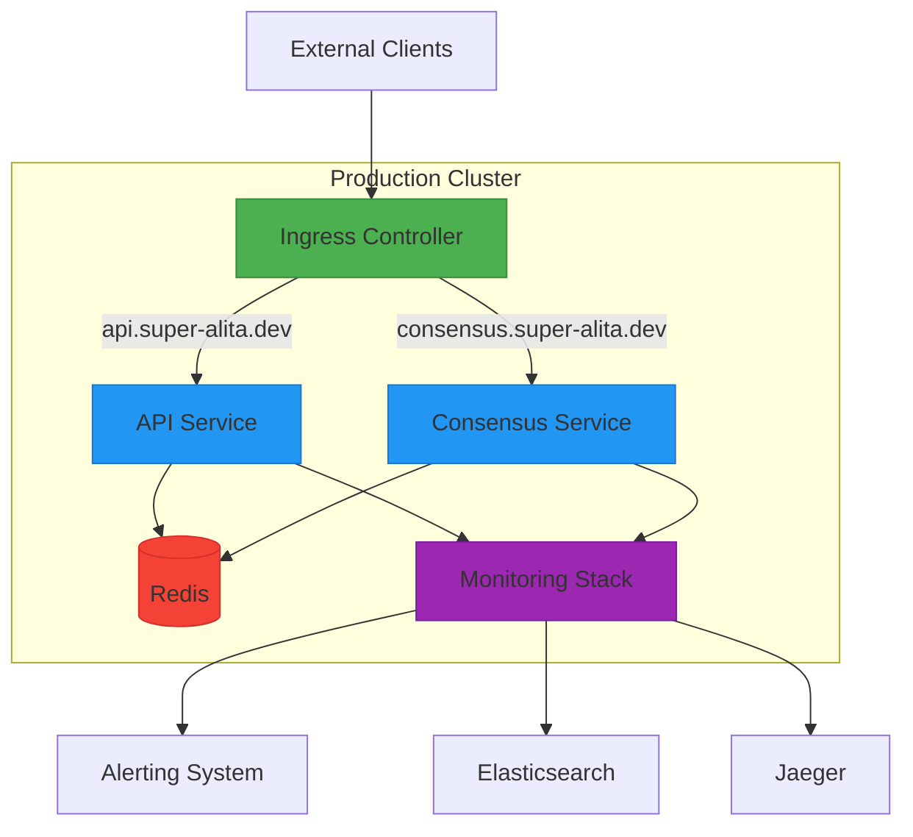
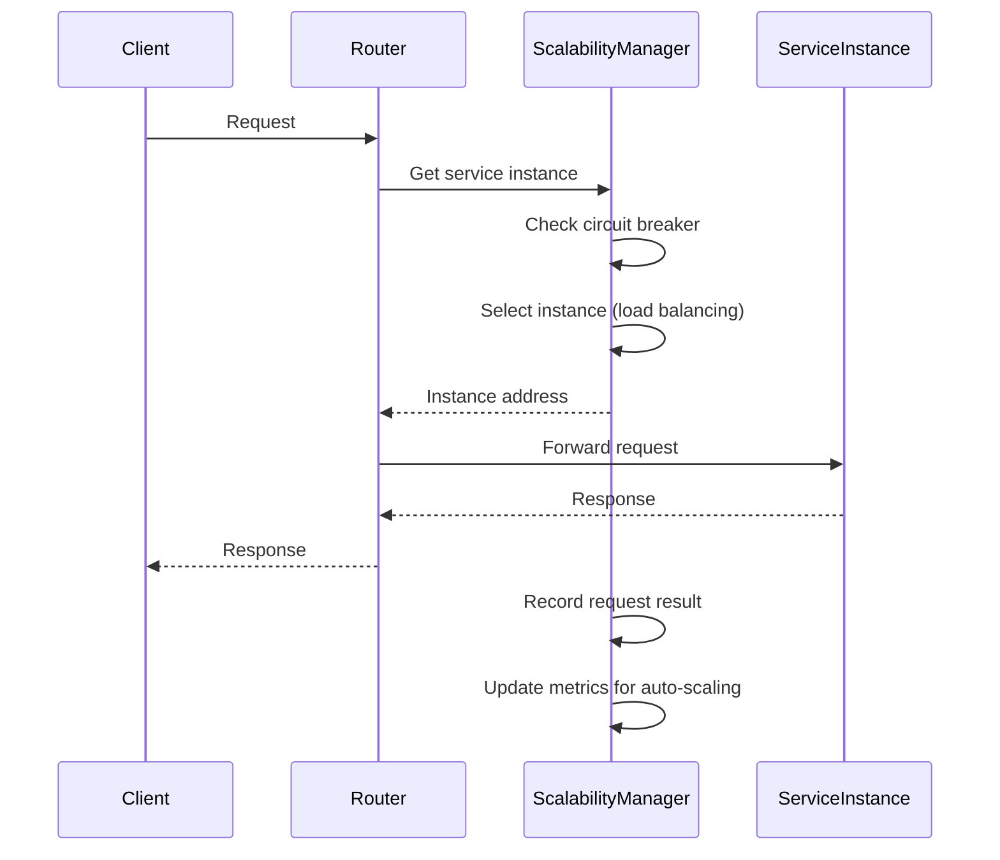
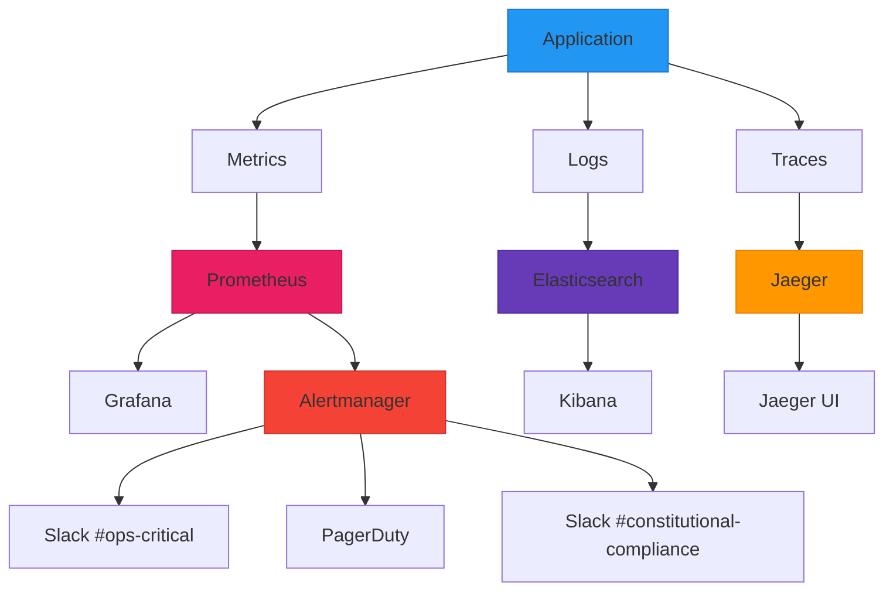

# Deployment and Operations

<cite>
**Referenced Files in This Document**   
- [Dockerfile](file://Dockerfile)
- [docker-compose.yml](file://docker/docker-compose.yml)
- [docker-compose.redis.yml](file://docker/docker-compose.redis.yml)
- [production-deployment.yml](file://deployment/production-deployment.yml)
- [services.yaml](file://config/services.yaml)
- [startup.yaml](file://config/startup.yaml)
- [security_policies.yaml](file://config/security_policies.yaml)
- [telemetry_pipeline.yaml](file://config/telemetry_pipeline.yaml)
</cite>

## Table of Contents
1. [Introduction](#introduction)
2. [Deployment Options](#deployment-options)
3. [Configuration Management](#configuration-management)
4. [Production Topology Architecture](#production-topology-architecture)
5. [Service Orchestration and Scaling](#service-orchestration-and-scaling)
6. [Observability and Monitoring](#observability-and-monitoring)
7. [Security and Compliance](#security-and-compliance)
8. [Operational Procedures](#operational-procedures)
9. [Troubleshooting Guide](#troubleshooting-guide)
10. [Performance Tuning and Capacity Planning](#performance-tuning-and-capacity-planning)

## Introduction
This document provides comprehensive guidance for deploying and operating the Super Alita system in production environments. It covers deployment strategies, configuration management, architectural considerations, and operational best practices for maintaining a reliable and scalable system. The documentation focuses on practical implementation details for various deployment scenarios including Docker, bare metal, and cloud environments, with emphasis on high availability, monitoring, and security compliance.

## Deployment Options

The Super Alita system supports multiple deployment options to accommodate different infrastructure requirements and operational preferences. The primary deployment methods include containerized deployments using Docker, bare metal installations, and cloud-native deployments.

For containerized environments, the system provides Docker configuration files that define the application services and their dependencies. The main Docker Compose configuration orchestrates the ACP server and MCP adapter services, exposing the necessary ports for API access and configuring environment variables for runtime behavior. The Docker setup includes volume mounting for source code, enabling development workflows with live reloading capabilities.

The system also supports Redis integration for rate limiting and distributed state management, with a dedicated Docker Compose file that configures a Redis instance and provides guidance on environment variables required to enable rate limiting functionality. This modular approach allows operators to selectively enable Redis-based features based on their scalability and reliability requirements.

For production deployments, the system includes a comprehensive Kubernetes-style deployment configuration that defines service replicas, resource requests and limits, health checks, and networking policies. This configuration can be adapted for various container orchestration platforms including Kubernetes, OpenShift, and cloud-managed Kubernetes services.

**Section sources**
- [Dockerfile](file://Dockerfile#L1-L28)
- [docker-compose.yml](file://docker/docker-compose.yml#L1-L33)
- [docker-compose.redis.yml](file://docker/docker-compose.redis.yml#L1-L18)
- [production-deployment.yml](file://deployment/production-deployment.yml#L1-L189)

## Configuration Management

The Super Alita system employs a hierarchical configuration management approach that supports environment-specific settings and secure credential handling. Configuration is organized into multiple YAML files that address different aspects of system behavior, including service endpoints, startup parameters, security policies, and telemetry pipelines.

The service configuration file (`services.yaml`) defines external dependencies such as LLM providers (Gemini, OpenAI, Anthropic) and external services (Redis, Puter). These configurations use environment variable references for sensitive credentials, following security best practices for secret management. The configuration supports multiple LLM providers with customizable API endpoints, models, and timeout settings, enabling flexibility in provider selection and failover strategies.

The startup configuration (`startup.yaml`) controls application server behavior, MCP server integration, browser auto-opening, and health check parameters. This configuration allows operators to customize the startup sequence, enable or disable specific services, and configure development options such as auto-reload and debug mode. The health check configuration specifies multiple endpoints to verify service readiness, ensuring comprehensive health assessment before traffic routing.

Environment detection is automated through the system's configuration manager, which evaluates environment variables, CI/CD context, and filesystem conditions to determine the appropriate environment (development, testing, staging, or production). This auto-detection enables consistent behavior across different deployment stages while allowing environment-specific overrides for logging levels, timeout values, and database configurations.

**Section sources**
- [services.yaml](file://config/services.yaml#L1-L26)
- [startup.yaml](file://config/startup.yaml#L1-L47)
- [src/config/AGENTS.md](file://src/config/AGENTS.md#L185-L256)

## Production Topology Architecture

The production deployment architecture is designed for high availability, scalability, and resilience. The system topology follows a microservices pattern with clearly defined service boundaries, intelligent routing, and comprehensive observability.

The deployment configuration defines multiple services including the main API service and a dedicated consensus service, each with independent scaling policies and resource allocations. The API service is configured with a minimum of two replicas and a maximum of ten, enabling horizontal scaling based on CPU and memory utilization. The consensus service maintains a smaller replica count (1-3) reflecting its specialized role in decision coordination.

Network routing is managed through an ingress controller with host-based routing rules that direct traffic to appropriate services based on domain names. The configuration includes rate limiting at the ingress level and SSL redirection to enforce secure communications. Load balancing is configured with round-robin algorithm and client IP affinity, ensuring even distribution of requests while maintaining session consistency when required.

The architecture incorporates regional compliance requirements, with data residency policies that restrict deployment to specific geographic regions (us-east-1, eu-west-1) and enable cross-region replication for disaster recovery. This ensures compliance with data protection regulations such as GDPR while maintaining system availability across regions.

**Diagram sources**
- [production-deployment.yml](file://deployment/production-deployment.yml#L1-L189)

**Section sources**
- [production-deployment.yml](file://deployment/production-deployment.yml#L1-L189)

## Service Orchestration and Scaling

The Super Alita system implements sophisticated service orchestration and auto-scaling capabilities to ensure optimal performance and resource utilization. The scalability manager provides service discovery, load balancing, circuit breaking, and auto-scaling based on real-time metrics.

Service instances are registered with the service registry, which maintains health status and metadata for each instance. The load balancer supports multiple algorithms including round-robin, weighted round-robin, least connections, and consistent hashing, allowing operators to select the most appropriate strategy based on their traffic patterns and performance requirements.

Auto-scaling is driven by metrics such as response time and success rate, with configurable thresholds for scale-up and scale-down actions. Scaling rules can be defined for specific services with minimum and maximum instance limits, preventing over-provisioning while ensuring adequate capacity during traffic spikes. The system records request metrics including success status and response time, which feed into the auto-scaling decision engine.

The circuit breaker pattern is implemented to prevent cascading failures during service degradation. When a service's failure rate exceeds a threshold, the circuit breaker opens, temporarily stopping requests to the failing service and allowing it to recover. This fault tolerance mechanism protects the overall system stability during partial outages.

**Diagram sources**
- [src/performance_monitoring/optimization/scalability_manager.py](file://src/performance_monitoring/optimization/scalability_manager.py#L1-L41)
- [src/performance_monitoring/optimization/scalability_manager.py](file://src/performance_monitoring/optimization/scalability_manager.py#L433-L472)
- [src/performance_monitoring/optimization/scalability_manager.py](file://src/performance_monitoring/optimization/scalability_manager.py#L502-L531)

**Section sources**
- [src/performance_monitoring/optimization/scalability_manager.py](file://src/performance_monitoring/optimization/scalability_manager.py#L1-L41)
- [src/performance_monitoring/optimization/scalability_manager.py](file://src/performance_monitoring/optimization/scalability_manager.py#L433-L472)
- [demo_optimization_suite.py](file://demo_optimization_suite.py#L91-L125)
- [test_optimization_integration.py](file://test_optimization_integration.py#L110-L144)

## Observability and Monitoring

The Super Alita system includes a comprehensive observability framework that provides metrics, logging, tracing, and alerting capabilities. The monitoring stack is designed to give operators deep visibility into system performance, reliability, and constitutional compliance.

Metrics collection is enabled through Prometheus, with a scrape interval of 15 seconds and 30-day retention. The system exposes custom metrics including SDD validation counts and constitutional scores, allowing operators to track key business and quality metrics alongside traditional performance indicators. The metrics endpoint is protected by health checks to ensure only healthy instances contribute to monitoring data.

Centralized logging is implemented with JSON-formatted logs aggregated to Elasticsearch, providing 7-day retention for troubleshooting and analysis. The logging configuration includes structured fields that facilitate searching and correlation of events across services. Tracing is enabled with Jaeger backend and 10% sampling rate, capturing distributed traces for performance analysis and latency troubleshooting.

Alerting rules are configured to detect critical issues including high error rates (>5%), high latency (>1000ms p95), and excessive pod restarts (>3 in 10 minutes). These alerts are routed to appropriate channels based on severity, with critical alerts sent to operations teams and compliance alerts directed to constitutional oversight teams. The alerting system includes hysteresis and debouncing to prevent alert storms during transient issues.

**Diagram sources**
- [production-deployment.yml](file://deployment/production-deployment.yml#L108-L188)
- [monitoring/alertmanager/alerting_rules.yml](file://monitoring/alertmanager/alerting_rules.yml#L32-L67)
- [src/core/decision_engine.py](file://src/core/decision_engine.py#L1-L46)

**Section sources**
- [production-deployment.yml](file://deployment/production-deployment.yml#L108-L188)
- [monitoring/prometheus/prometheus.yml](file://monitoring/prometheus/prometheus.yml#L51-L76)
- [monitoring/alertmanager/alerting_rules.yml](file://monitoring/alertmanager/alerting_rules.yml#L32-L67)
- [src/dta/monitoring.py](file://src/dta/monitoring.py#L649-L692)
- [src/core/decision_engine.py](file://src/core/decision_engine.py#L1-L46)

## Security and Compliance

The Super Alita system implements a multi-layered security approach that includes network policies, pod security standards, secret management, and constitutional compliance. The security framework is designed to protect against common threats while ensuring regulatory compliance.

Network policies restrict ingress traffic to authorized sources, specifically allowing traffic from the ingress controller and monitoring namespaces. This zero-trust networking model prevents unauthorized access to services while enabling necessary monitoring and management functions. The policies are enforced at the Kubernetes network layer, providing defense in depth.

Pod security standards are enforced with multiple controls including running as non-root user, read-only root filesystem, and prevention of privilege escalation. These security controls reduce the attack surface and limit the potential impact of container escapes or privilege escalation attempts. Secrets are encrypted at rest with a 90-day rotation policy, ensuring protection of sensitive credentials and configuration data.

The system supports multiple compliance frameworks including SOC2, GDPR, and ISO27001, with data residency policies that restrict data storage to specific geographic regions. Regular backups are performed daily with 30-day retention, providing data protection and recovery capabilities. The constitutional compliance framework monitors system behavior against defined rules, ensuring adherence to organizational principles and ethical guidelines.

**Section sources**
- [production-deployment.yml](file://deployment/production-deployment.yml#L108-L188)
- [SECURITY_RESILIENCE_IMPLEMENTATION.md](file://SECURITY_RESILIENCE_IMPLEMENTATION.md#L96-L133)
- [src/security/policy_manager.py](file://src/security/policy_manager.py#L194-L231)

## Operational Procedures

Effective operation of the Super Alita system requires adherence to established procedures for deployment, updates, and routine maintenance. The system supports continuous deployment through a comprehensive pipeline that includes quality checks, packaging, and deployment validation.

Deployment environments are defined with specific requirements, including minimum constitutional scores and test coverage thresholds. The deployment pipeline validates artifacts, prepares the target environment, executes the deployment, and performs health checks to ensure service availability. This structured approach ensures consistent deployment outcomes and reduces the risk of introducing defects into production.

Service updates should follow a blue-green or canary deployment strategy to minimize risk and enable rapid rollback if issues are detected. The system's health checks and monitoring provide early warning of deployment issues, allowing operators to intervene before user impact occurs. Configuration changes should be applied through version-controlled configuration files and deployed using the same pipeline as code changes.

Regular maintenance tasks include monitoring system health, reviewing alert patterns, analyzing performance trends, and updating dependencies. The system's observability data should be reviewed periodically to identify performance bottlenecks, resource constraints, and potential reliability issues before they impact users.

**Section sources**
- [src/performance_monitoring/ci/comprehensive_pipeline.py](file://src/performance_monitoring/ci/comprehensive_pipeline.py#L293-L327)
- [src/performance_monitoring/ci/comprehensive_pipeline.py](file://src/performance_monitoring/ci/comprehensive_pipeline.py#L701-L716)
- [startup.yaml](file://config/startup.yaml#L1-L47)

## Troubleshooting Guide

Common operational issues in the Super Alita system typically fall into categories of service failures, performance bottlenecks, and configuration drift. Effective troubleshooting requires systematic analysis of logs, metrics, and system state.

For service failures, begin by checking the health endpoints (`/health/simple` and `/healthz`) to determine if the service is responsive. Review