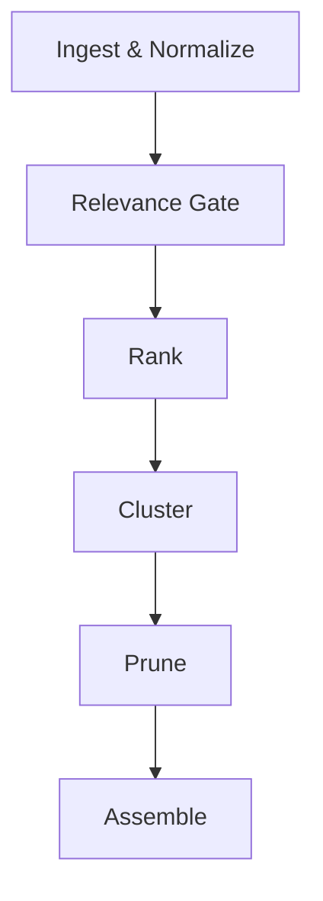
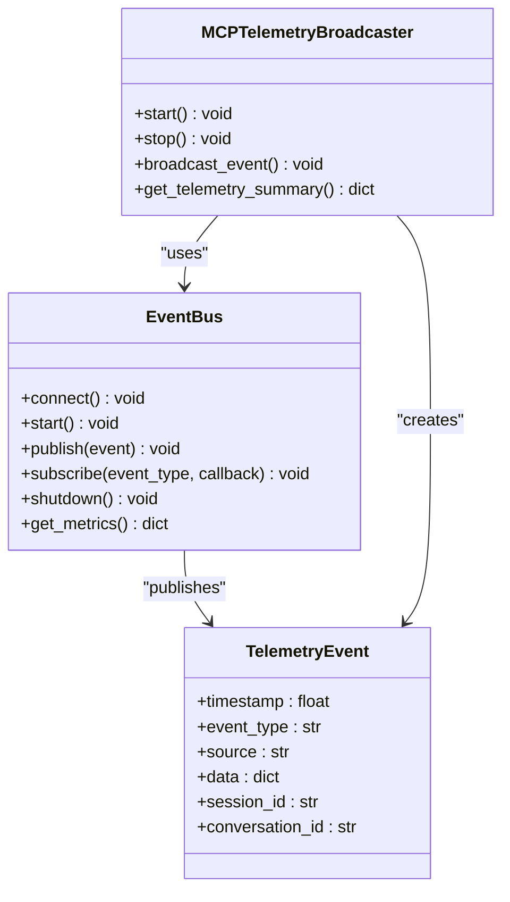
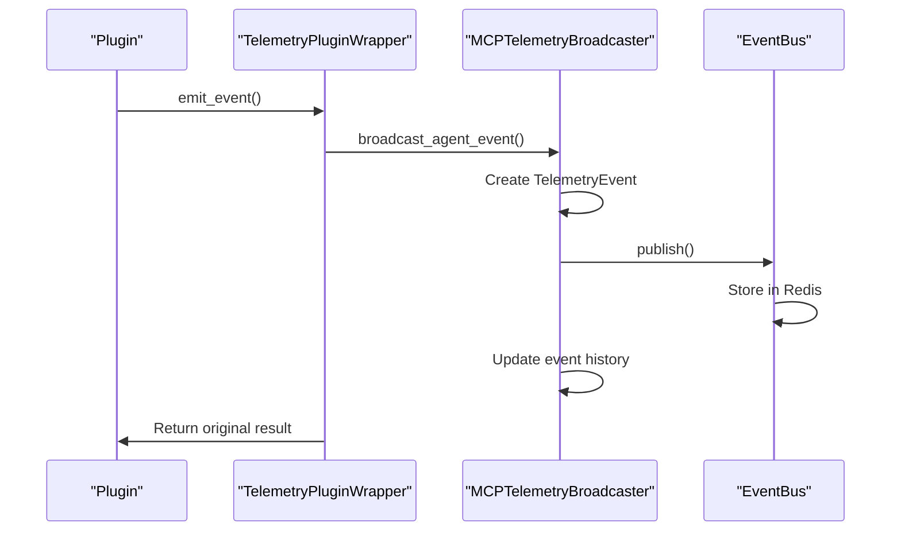
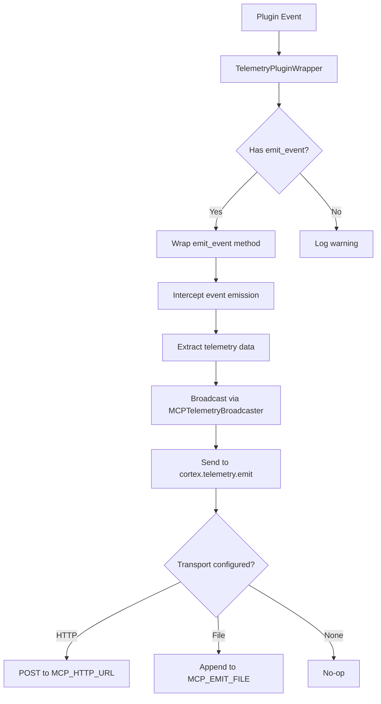
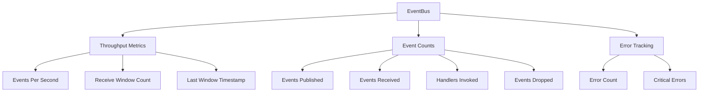

# Monitoring and Observability

<cite>
**Referenced Files in This Document**   
- [telemetry_pipeline.yaml](file://config/telemetry_pipeline.yaml)
- [telemetry.py](file://cortex/telemetry.py)
- [mcp_broadcaster.py](file://src/telemetry/mcp_broadcaster.py)
- [plugin_wrapper.py](file://src/telemetry/plugin_wrapper.py)
- [telemetry_dashboard.py](file://scripts/telemetry_dashboard.py)
- [event_bus.py](file://src/core/event_bus.py)
</cite>

## Table of Contents
1. [Introduction](#introduction)
2. [Telemetry Pipeline Configuration](#telemetry-pipeline-configuration)
3. [Event Streaming Architecture](#event-streaming-architecture)
4. [Monitoring Components](#monitoring-components)
5. [Data Collection Mechanisms](#data-collection-mechanisms)
6. [Metrics and Performance Tracking](#metrics-and-performance-tracking)
7. [Distributed Tracing and Log Aggregation](#distributed-tracing-and-log-aggregation)
8. [Common Issues and Solutions](#common-issues-and-solutions)
9. [Troubleshooting Guide](#troubleshooting-guide)
10. [Conclusion](#conclusion)

## Introduction
This document provides comprehensive coverage of the monitoring and observability system within the Super Alita architecture. It details the telemetry pipeline, event streaming architecture, and monitoring components that enable real-time visibility into system behavior. The documentation explains configuration options, data collection mechanisms, and metrics exposure while addressing common operational challenges. The system is designed to support both beginners through accessible dashboards and experienced developers through advanced features like distributed tracing and custom metric creation.

## Telemetry Pipeline Configuration

The telemetry pipeline is configured through the `telemetry_pipeline.yaml` file, which defines the processing stages and default parameters for telemetry data. The pipeline consists of multiple sequential stages that process telemetry data from ingestion to final assembly.

**Diagram sources**
- [telemetry_pipeline.yaml](file://config/telemetry_pipeline.yaml#L1-L24)

The pipeline configuration includes default values for token budget, top N items, relevance threshold, and cluster similarity threshold. These parameters control the processing behavior across all stages. The evaluation section specifies metrics thresholds for precision, recall, redundancy rate, and token efficiency, along with the path to golden sets for validation.

**Section sources**
- [telemetry_pipeline.yaml](file://config/telemetry_pipeline.yaml#L1-L24)

## Event Streaming Architecture

The event streaming architecture is built around the EventBus system, which provides a Redis-backed pub/sub mechanism for distributed communication. Events are published to specific channels based on their type and consumed by registered handlers. The architecture supports both specific channel subscriptions and wildcard pattern subscriptions for comprehensive event monitoring.

**Diagram sources**
- [event_bus.py](file://src/core/event_bus.py#L48-L610)
- [mcp_broadcaster.py](file://src/telemetry/mcp_broadcaster.py#L1-L245)

The EventBus implementation includes throughput optimization features such as performance metrics tracking and efficient message handling. It maintains connection state, manages handler registrations with idempotency tracking, and provides graceful shutdown capabilities. The listener loop processes messages with robust error handling and supports both regular and pattern-based message types.

**Section sources**
- [event_bus.py](file://src/core/event_bus.py#L48-L610)

## Monitoring Components

The monitoring system consists of several key components that work together to provide comprehensive observability. The MCPTelemetryBroadcaster serves as the central component for capturing and broadcasting agent events and telemetry data to the MCP server. It maintains event history, tracks event counts by type, and provides real-time streaming to Copilot Chat.

The TelemetryPluginWrapper enables automatic event broadcasting by intercepting plugin event emissions and forwarding them to the telemetry system. This wrapper monitors plugin events and broadcasts telemetry data about event emissions, including metadata about the original event type and data structure.

**Diagram sources**
- [mcp_broadcaster.py](file://src/telemetry/mcp_broadcaster.py#L1-L245)
- [plugin_wrapper.py](file://src/telemetry/plugin_wrapper.py#L1-L101)

The TelemetryDashboard provides real-time monitoring of Copilot interactions, tracking guideline references, mode usage, and compliance patterns. It calculates a compliance score based on the presence of architectural guidelines and best practices in Copilot responses.

**Section sources**
- [mcp_broadcaster.py](file://src/telemetry/mcp_broadcaster.py#L1-L245)
- [plugin_wrapper.py](file://src/telemetry/plugin_wrapper.py#L1-L101)
- [telemetry_dashboard.py](file://scripts/telemetry_dashboard.py#L1-L169)

## Data Collection Mechanisms

Data collection is implemented through a multi-layered approach that captures telemetry from various system components. The cortex.telemetry module provides a lightweight emit hook that supports both HTTP POST and file-based JSONL output. This module is designed to be non-intrusive and will become a no-op if no transport is configured.

The MCPTelemetryBroadcaster captures structured telemetry events containing timestamp, event type, source, data payload, session ID, conversation ID, and metadata. These events are filtered based on predefined event types such as tool calls, conversation events, cognitive turns, and performance metrics. The broadcaster maintains a circular buffer of recent events and tracks event counts by type.

**Diagram sources**
- [telemetry.py](file://cortex/telemetry.py#L1-L66)
- [plugin_wrapper.py](file://src/telemetry/plugin_wrapper.py#L1-L101)

The system supports multiple transport mechanisms for telemetry data, allowing flexibility in deployment scenarios. The HTTP transport sends JSON payloads to a configured MCP_HTTP_URL, while the file transport appends JSON lines to a specified file path for debugging purposes. Both transports are best-effort and non-fatal on errors, ensuring that telemetry collection does not impact application functionality.

**Section sources**
- [telemetry.py](file://cortex/telemetry.py#L1-L66)

## Metrics and Performance Tracking

The system exposes a comprehensive set of metrics for performance tracking and monitoring. The EventBus provides throughput metrics including events published, events received, handlers invoked, and events dropped. These metrics are updated in real-time and can be accessed through the get_metrics() method.

The MCPTelemetryBroadcaster exposes a telemetry summary containing broadcaster status, runtime duration, total events processed, event counts by type, events per second, and recent events. This summary provides a high-level overview of system activity and performance.

**Diagram sources**
- [event_bus.py](file://src/core/event_bus.py#L48-L610)
- [mcp_broadcaster.py](file://src/telemetry/mcp_broadcaster.py#L1-L245)

The TelemetryDashboard tracks interaction metrics including total interactions, guideline references, mode usage, and compliance patterns. It calculates a compliance score based on the presence of architectural guidelines and best practices in Copilot responses. The dashboard can generate comprehensive reports showing metric trends and compliance over time.

**Section sources**
- [event_bus.py](file://src/core/event_bus.py#L48-L610)
- [mcp_broadcaster.py](file://src/telemetry/mcp_broadcaster.py#L1-L245)
- [telemetry_dashboard.py](file://scripts/telemetry_dashboard.py#L1-L169)

## Distributed Tracing and Log Aggregation

Distributed tracing is implemented through correlation IDs and trace IDs that are automatically populated in events. The EventBus emit method auto-fills correlation_id from the current context and trace_id if available, enabling end-to-end tracing of requests across system boundaries. This allows for reconstructing the complete flow of operations for debugging and performance analysis.

Log aggregation is achieved through the structured telemetry events that include consistent fields such as timestamp, event type, source, and metadata. The system uses Python's logging framework with structured logging patterns, ensuring that logs can be easily parsed and analyzed. The telemetry events are serialized to JSON with proper datetime handling, making them compatible with standard log aggregation tools.

The MCPTelemetryBroadcaster maintains a history of recent events, which serves as a local trace buffer. This history can be queried by event type and provides detailed information about each event, including its timestamp, source, and data payload. The event history is limited to a configurable maximum number of events to prevent memory exhaustion.

**Section sources**
- [event_bus.py](file://src/core/event_bus.py#L48-L610)
- [mcp_broadcaster.py](file://src/telemetry/mcp_broadcaster.py#L1-L245)

## Common Issues and Solutions

### Metric Collection Failures
Metric collection failures can occur due to misconfigured transport endpoints or network connectivity issues. The system handles these failures gracefully by swallowing errors in the telemetry components, ensuring that application functionality is not impacted. To diagnose metric collection issues, verify that the MCP_HTTP_URL or MCP_EMIT_FILE environment variables are correctly configured.

### High Cardinality Problems
High cardinality in metrics can lead to performance degradation and increased storage costs. The system mitigates this through event type filtering in the MCPTelemetryBroadcaster, which only broadcasts events of predefined types. Additionally, the telemetry pipeline configuration includes relevance thresholds and clustering to reduce the dimensionality of collected data.

### Alert Fatigue
Alert fatigue can occur when too many low-priority alerts are generated. The system addresses this through intelligent event filtering and severity classification. The TelemetryDashboard calculates a compliance score that provides a single, meaningful metric for system health, reducing the need for numerous individual alerts.

### Solutions
- Configure appropriate relevance thresholds in telemetry_pipeline.yaml
- Use the broadcast_event_types filter in MCPTelemetryBroadcaster to limit event volume
- Implement sampling for high-frequency events
- Use the TelemetryDashboard to identify and focus on critical issues
- Regularly review and tune alerting rules based on actual incident response data

**Section sources**
- [telemetry_pipeline.yaml](file://config/telemetry_pipeline.yaml#L1-L24)
- [mcp_broadcaster.py](file://src/telemetry/mcp_broadcaster.py#L1-L245)
- [telemetry_dashboard.py](file://scripts/telemetry_dashboard.py#L1-L169)

## Troubleshooting Guide

When troubleshooting monitoring and observability issues, follow these steps:

1. Verify that the MCPTelemetryBroadcaster is active by checking its status in the telemetry summary
2. Check the environment variables MCP_HTTP_URL and MCP_EMIT_FILE to ensure proper transport configuration
3. Review the event bus connection status and ensure Redis/Memurai is running
4. Examine the event history for recent events to confirm data collection is working
5. Check the TelemetryDashboard for compliance score trends and guideline references

For high event volumes, consider adjusting the token_budget and top_n_items parameters in the telemetry pipeline configuration. For missing events, verify that the event types are included in the broadcast_event_types set in the MCPTelemetryBroadcaster.

The system includes comprehensive error handling with non-fatal telemetry operations. If telemetry collection is not working, check the application logs for warnings or errors from the telemetry components. The lightweight nature of the cortex.telemetry module ensures that even if telemetry fails, it will not impact core application functionality.

**Section sources**
- [telemetry.py](file://cortex/telemetry.py#L1-L66)
- [mcp_broadcaster.py](file://src/telemetry/mcp_broadcaster.py#L1-L245)
- [event_bus.py](file://src/core/event_bus.py#L48-L610)

## Conclusion
The monitoring and observability system in Super Alita provides comprehensive telemetry