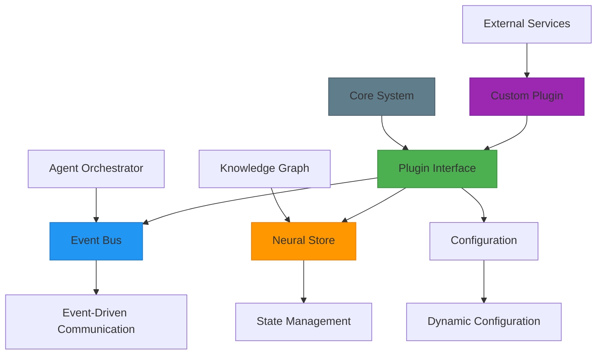

# Extending the Framework

<cite>
**Referenced Files in This Document**   
- [plugin_interface.py](file://src/core/plugin_interface.py)
- [event_bus_plugin.py](file://src/plugins/event_bus_plugin.py)
- [self_reflection_plugin.py](file://src/plugins/self_reflection_plugin.py)
- [llm_planner_plugin.py](file://src/plugins/llm_planner_plugin.py)
- [planner_plugin_v2.py](file://src/plugins/planner_plugin_v2.py)
- [semantic_fsm_plugin.py](file://src/plugins/semantic_fsm_plugin.py)
- [skill_discovery_plugin.py](file://src/plugins/skill_discovery_plugin.py)
- [auto_tools_plugin.py](file://src/plugins/auto_tools_plugin.py)
- [deepcode_orchestrator_plugin.py](file://src/plugins/deepcode_orchestrator_plugin.py)
- [calculator_plugin.py](file://src/plugins/calculator_plugin.py)
- [puter_plugin.py](file://src/plugins/puter_plugin.py)
- [memory_manager_atom.py](file://src/atoms/memory_manager_atom.py)
- [web_agent_atom.py](file://src/atoms/web_agent_atom.py)
</cite>

## Table of Contents
1. [Introduction](#introduction)
2. [Plugin Architecture Overview](#plugin-architecture-overview)
3. [Core Extension Points](#core-extension-points)
4. [Plugin Lifecycle Management](#plugin-lifecycle-management)
5. [Creating Custom Plugins](#creating-custom-plugins)
6. [Integration with Core Systems](#integration-with-core-systems)
7. [Best Practices for Extension Development](#best-practices-for-extension-development)
8. [Common Issues and Solutions](#common-issues-and-solutions)
9. [Conclusion](#conclusion)

## Introduction
The Super Alita framework is designed with extensibility as a core principle, enabling developers to enhance agent capabilities through a robust plugin architecture. This document provides comprehensive guidance on extending the framework through custom plugins, covering extension points, implementation details, integration patterns, and best practices. The plugin system allows for the creation of new agent capabilities, custom tools, and specialized handlers that seamlessly integrate with the core system's event-driven architecture and knowledge graph.

## Plugin Architecture Overview
The framework's plugin architecture is built around a modular, event-driven design that enables dynamic extension of agent capabilities. At its core is the `PluginInterface` which defines the standard lifecycle and interaction patterns for all plugins. Plugins interact with the system through the EventBus for event communication and the NeuralStore for state management, creating a loosely coupled ecosystem where components can be added, removed, or modified without disrupting the overall system.

**Diagram sources**
- [plugin_interface.py](file://src/core/plugin_interface.py#L17-L294)
- [event_bus_plugin.py](file://