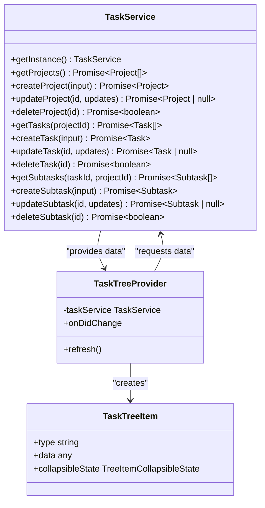
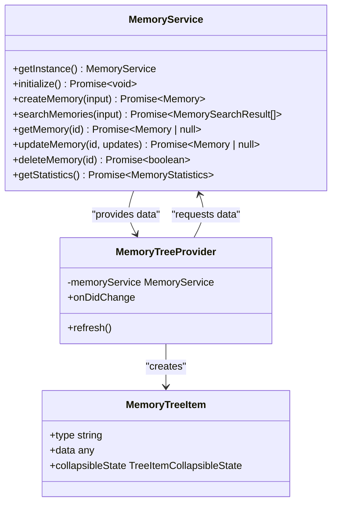
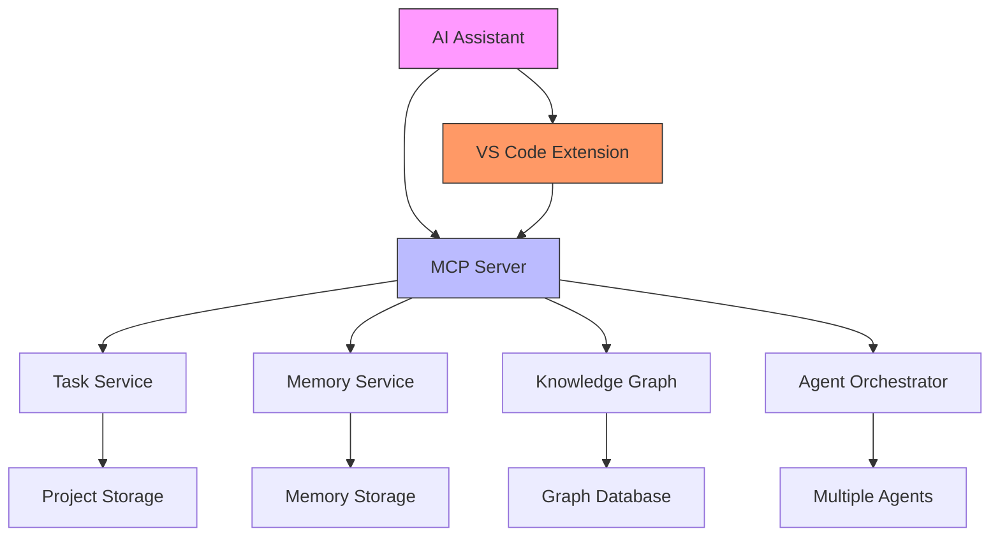

# Client Integration Patterns

<cite>
**Referenced Files in This Document**   
- [mcp_server.py](file://backend/mcp_server.py)
- [server.ts](file://agentic-tools-mcp/src/server.ts)
- [extension.ts](file://agentic-tools-mcp-companion/src/extension.ts)
- [agent_mcp_server.py](file://src/vscode_integration/agent_mcp_server.py)
- [taskService.ts](file://agentic-tools-mcp-companion/src/services/taskService.ts)
- [memoryService.ts](file://agentic-tools-mcp-companion/src/services/memoryService.ts)
- [agent_integration.py](file://src/vscode_integration/agent_integration.py)
</cite>

## Table of Contents
1. [Introduction](#introduction)
2. [Integration Approaches](#integration-approaches)
3. [Task and Memory Services](#task-and-memory-services)
4. [Implementation Examples](#implementation-examples)
5. [Authentication and Resilience](#authentication-and-resilience)
6. [Component Relationships](#component-relationships)
7. [Troubleshooting Guide](#troubleshooting-guide)

## Introduction
This document details client integration patterns for the Model Context Protocol (MCP) server, focusing on various approaches to connect clients with the MCP infrastructure. The system enables AI assistants to interact with task management and agent memory capabilities through standardized protocols. The integration ecosystem includes direct API calls, gRPC clients, and specialized VS Code extensions that provide both visual interfaces and programmatic access to MCP tools. The architecture supports project-specific storage with Git-trackable data, allowing teams to collaborate effectively while maintaining persistent agent memories and structured task hierarchies.

## Integration Approaches

### Direct API Integration
Direct API integration with the MCP server allows clients to communicate using standard HTTP protocols. The server exposes tools through a well-defined interface that supports both tool listing and execution. Clients can discover available tools by calling the `list_tools` endpoint, which returns comprehensive metadata including tool names, descriptions, and input schemas. Tool execution follows a request-response pattern where clients send tool name and arguments to the `call_tool` endpoint and receive structured responses. The API supports asynchronous operations through async/await patterns, enabling non-blocking interactions with the server. Authentication is handled through environment variables and configuration files, with support for API keys and secure credential storage.

### gRPC Client Integration
gRPC client integration provides a high-performance alternative to HTTP-based APIs, offering efficient binary serialization and streaming capabilities. The gRPC interface exposes the same tool functionality as the HTTP API but with improved latency and reduced overhead. Clients establish persistent connections to the MCP server, enabling bidirectional communication and real-time updates. The protocol supports advanced features like connection pooling, circuit breakers for resilience, and deadline propagation for timeout management. Type safety is enforced through protocol buffer definitions, ensuring that clients and servers maintain compatibility. The gRPC client implementation includes built-in retry mechanisms and load balancing capabilities, making it suitable for production environments with high availability requirements.

### VS Code Extension Integration
The VS Code extension provides a comprehensive integration layer that combines visual interface components with MCP protocol capabilities. The extension implements a provider pattern that exposes MCP servers to the VS Code environment, allowing users to manage multiple MCP instances simultaneously. The integration includes tree views for tasks and memories, with rich visual indicators for status, priority, and hierarchy level. Context menus enable users to perform operations like creating projects, editing tasks, and managing memories directly from the IDE. The extension communicates with the MCP server through the standard protocol while providing enhanced user experience features like form validation, real-time synchronization, and visual feedback for operations. This approach enables seamless collaboration between human users and AI assistants, with changes made in either interface immediately reflected in the other.

**Section sources**
- [extension.ts](file://agentic-tools-mcp-companion/src/extension.ts#L0-L265)
- [builtin_mcp_provider.ts](file://src/vscode_integration/builtin_mcp_provider.ts#L134-L166)

## Task and Memory Services

### Task Service Implementation
The task service implements a comprehensive task management system with support for unlimited hierarchy depth. Tasks are organized within projects, with each task containing metadata such as priority (1-10 scale), complexity estimation, status workflow (pending, in-progress, blocked, done), tags for categorization, and time tracking for estimated and actual hours. The service provides CRUD operations for projects, tasks, and subtasks, with validation to ensure referential integrity and prevent orphaned items. Operations are atomic to prevent data corruption, and the service includes confirmation safeguards for destructive operations. The implementation supports both flat and hierarchical views of tasks, with intelligent dependency management that validates prerequisite completion before allowing dependent tasks to proceed.

**Diagram sources **
- [taskService.ts](file://agentic-tools-mcp-companion/src/services/taskService.ts#L52-L1042)
- [extension.ts](file://agentic-tools-mcp-companion/src/extension.ts#L0-L265)

### Memory Service Implementation
The memory service provides persistent storage for agent memories with intelligent search capabilities. Memories consist of a title (limited to 50 characters for file organization), detailed content, optional metadata as key-value pairs, and an optional category for organization. The service stores memories as individual JSON files organized by category, enabling human-readable storage that can be version controlled alongside project code. Search functionality uses a multi-field matching algorithm that scores results based on title matches (60% weight), content matches (30% weight), and category bonuses (20% weight). The service includes validation to prevent duplicate titles within categories and handles file naming conflicts by appending sequential numbers. All operations are designed to be atomic to prevent data corruption during concurrent access.

**Diagram sources **
- [memoryService.ts](file://agentic-tools-mcp-companion/src/services/memoryService.ts#L47-L654)
- [extension.ts](file://agentic-tools-mcp-companion/src/extension.ts#L0-L265)

## Implementation Examples

### CLI Client Implementation
The CLI client implementation demonstrates how to integrate with the MCP server from command-line environments. The client uses the `npx` command to execute the MCP server package, with options to specify storage mode (project-specific or global). Configuration is handled through JSON files that define server endpoints and authentication parameters. The implementation includes error handling for common issues like missing working directories and permission errors. For project-specific storage, the client requires a `workingDirectory` parameter that specifies where to store the `.agentic-tools-mcp/` folder. The CLI interface supports all MCP tools through command-line arguments, with automatic validation of input parameters against the tool's schema.

### Web Client Implementation
The web client implementation leverages the MCP server's HTTP interface to provide browser-based access to task and memory management features. The client uses fetch API to communicate with the server, with request/response payloads following the MCP protocol specification. Authentication is handled through JWT tokens stored in browser localStorage, with automatic token refresh mechanisms. The implementation includes connection resilience features like automatic reconnection after network interruptions and local caching of data to maintain functionality during offline periods. Error handling is comprehensive, with user-friendly messages for common issues like timeout errors, payload serialization problems, and authentication failures. The web interface provides real-time updates through polling mechanisms that periodically refresh data from the server.

### IDE Integration Implementation
The IDE integration implementation, specifically for VS Code, demonstrates a sophisticated client that combines visual interface components with MCP protocol capabilities. The extension uses the VS Code API to create custom tree views for tasks and memories, with rich visual indicators for status, priority, and hierarchy level. The implementation includes form editors with validation for creating and updating tasks and memories, providing a user experience that exceeds the capabilities of the raw MCP API. Real-time synchronization ensures that changes made through the visual interface are immediately available to AI assistants through the MCP server, and vice versa. The integration supports multiple storage modes, including project-specific storage for team collaboration and global storage for personal knowledge management.

**Section sources**
- [server.ts](file://agentic-tools-mcp/src/server.ts#L0-L799)
- [extension.ts](file://agentic-tools-mcp-companion/src/extension.ts#L0-L265)
- [agent_integration.py](file://src/vscode_integration/agent_integration.py#L23-L176)

## Authentication and Resilience

### Authentication Patterns
Authentication for MCP clients is primarily handled through environment variables and configuration files, with support for API keys and secure credential storage. The system uses a configuration-driven approach where authentication parameters are specified in server definitions, allowing multiple authentication schemes to coexist. For Claude Desktop integration, the configuration includes environment variable mapping that automatically injects credentials into the MCP server process. The implementation follows security best practices by never storing credentials in version-controlled files and providing mechanisms for secure credential management. Token-based authentication is supported through JWT, with configurable expiration times and refresh mechanisms to maintain long-running sessions.

### Connection Resilience
Connection resilience is implemented through multiple mechanisms that ensure reliable communication between clients and the MCP server. The system includes automatic reconnection logic that attempts to restore connectivity after network interruptions, with exponential backoff to prevent overwhelming the server during outages. For gRPC clients, the implementation includes circuit breaker patterns that temporarily halt requests during prolonged server unavailability, preventing cascading failures. Connection pooling is used to maintain persistent connections and reduce the overhead of establishing new connections for each request. Timeout handling is configurable, with default values that balance responsiveness with the need to accommodate slower operations. The client libraries include retry mechanisms for transient failures, with intelligent retry scheduling based on error types.

### Error Handling Strategies
Error handling strategies are comprehensive and designed to provide meaningful feedback to users and developers. All tools return structured error responses that include error type, detailed description, and recovery suggestions. The system distinguishes between different error categories such as validation errors, network errors, processing errors, and system errors, allowing clients to implement appropriate recovery strategies. For destructive operations, the implementation includes confirmation safeguards that require explicit user approval before proceeding. Input validation is performed on both client and server sides to catch errors early and provide immediate feedback. The error handling system includes logging at multiple levels, from debug information for developers to user-friendly messages for end users.

**Section sources**
- [server.ts](file://agentic-tools-mcp/src/server.ts#L0-L799)
- [mcp_server.py](file://backend/mcp_server.py#L0-L58)
- [agent_mcp_server.py](file://src/vscode_integration/agent_mcp_server.py#L229-L613)

## Component Relationships

### Agent Orchestrator Integration
The agent orchestrator integrates with the MCP server to coordinate multiple AI agents and their interactions with task and memory services. The orchestrator uses the MCP protocol to discover available tools and invoke them as needed to accomplish complex workflows. It maintains state across multiple tool invocations, allowing for multi-step processes that combine information retrieval, task creation, and memory updates. The relationship between the orchestrator and MCP server is bidirectional, with the orchestrator both consuming tools from the server and potentially exposing its own capabilities as MCP tools. This integration enables sophisticated agent behaviors like task decomposition, progress tracking, and adaptive planning based on current context and available resources.

### Knowledge Graph Integration
The knowledge graph integrates with the MCP server to provide enhanced context and reasoning capabilities for AI assistants. The graph stores structured information about entities, relationships, and concepts, which can be queried through MCP tools to augment the agent's understanding of the current situation. The integration allows agents to perform semantic searches across project documentation, codebases, and historical data, retrieving relevant information to inform their responses and actions. The relationship between the knowledge graph and MCP server is mediated through specialized tools that translate natural language queries into graph traversals and return structured results. This integration enables agents to provide more accurate and contextually relevant assistance by leveraging the collective knowledge of the organization.

**Diagram sources **
- [agent_mcp_server.py](file://src/vscode_integration/agent_mcp_server.py#L229-L613)
- [agent_integration.py](file://src/vscode_integration/agent_integration.py#L23-L176)

## Troubleshooting Guide

### Payload Serialization Errors
Payload serialization errors typically occur when there are mismatches between the expected data types and the actual values being sent to the MCP server. Common causes include sending strings where numbers are expected, omitting required fields, or including invalid characters in text fields. To resolve these issues, validate the payload against the tool's input schema before sending, ensuring that all required fields are present and that data types match the schema definitions. Use JSON validation tools to check the structure of your payloads, and consult the API reference documentation for each tool to understand the expected format. For complex nested objects, validate each level of the hierarchy separately to isolate the source of the problem.

### Timeout Handling
Timeout issues can arise from various factors including network latency, server overload, or long-running operations. The default timeout values are