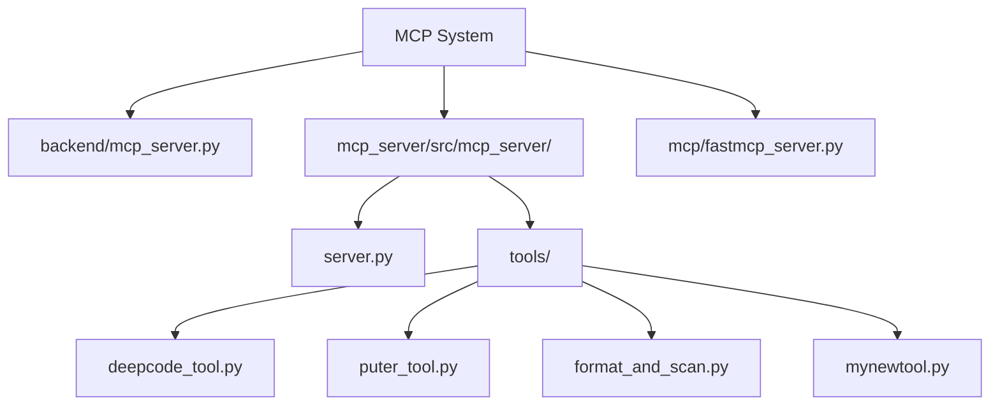
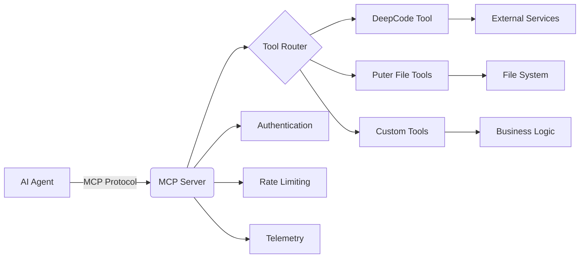
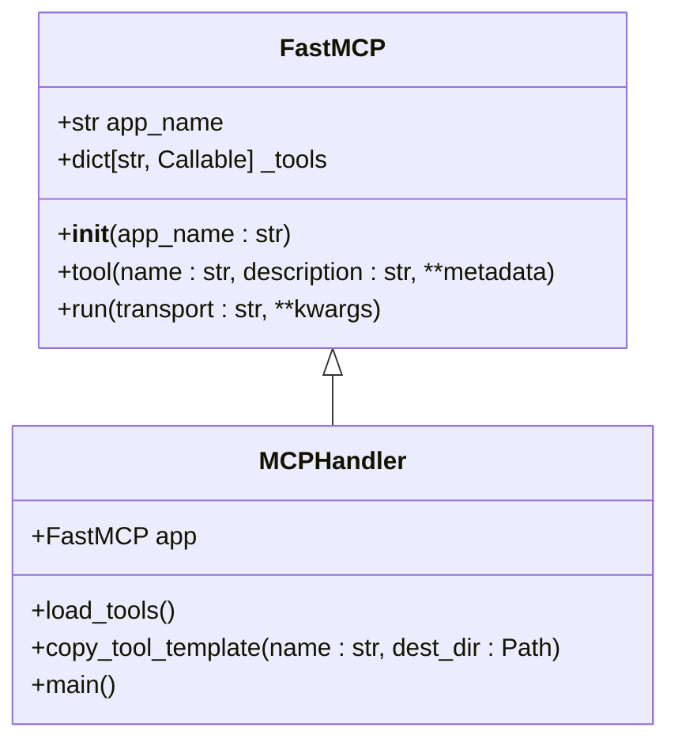
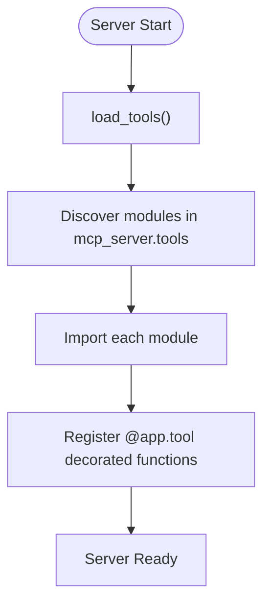
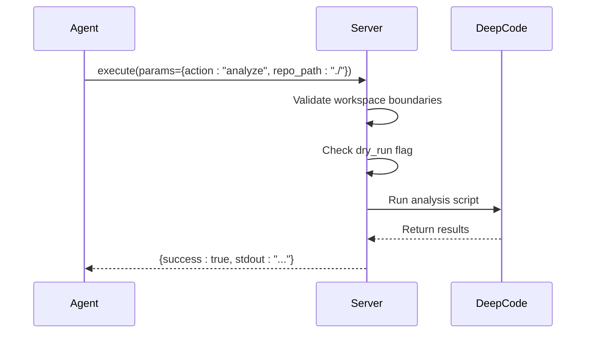
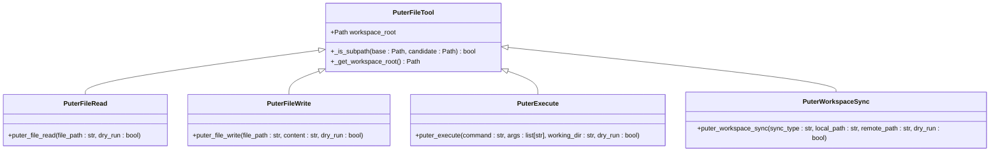
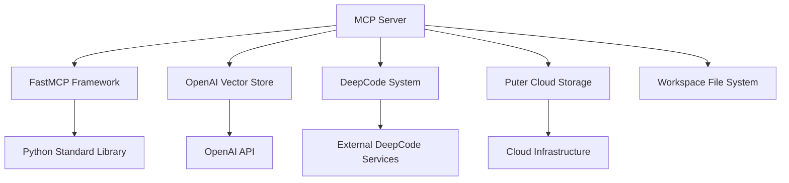

# MCP Integration

<cite>
**Referenced Files in This Document**   
- [mcp_server.py](file://backend/mcp_server.py)
- [server.py](file://mcp_server/src/mcp_server/server.py)
- [fastmcp_server.py](file://mcp/fastmcp_server.py)
- [deepcode_tool.py](file://mcp_server/src/mcp_server/tools/deepcode_tool.py)
- [puter_tool.py](file://mcp_server/src/mcp_server/tools/puter_tool.py)
- [README.md](file://mcp_server/README.md)
- [AGENTS.md](file://mcp_server/AGENTS.md)
</cite>

## Table of Contents
1. [Introduction](#introduction)
2. [Project Structure](#project-structure)
3. [Core Components](#core-components)
4. [Architecture Overview](#architecture-overview)
5. [Detailed Component Analysis](#detailed-component-analysis)
6. [Dependency Analysis](#dependency-analysis)
7. [Performance Considerations](#performance-considerations)
8. [Troubleshooting Guide](#troubleshooting-guide)
9. [Conclusion](#conclusion)

## Introduction
The Model Context Protocol (MCP) integration enables seamless interoperability between AI models and external tools within the Super Alita ecosystem. This documentation provides comprehensive coverage of the MCP server implementation, protocol specifications, tool development, and integration patterns. The MCP system serves as a standardized interface layer that allows agents to discover, register, and invoke tools while maintaining security boundaries and providing structured communication. This document details the server architecture, tool registration mechanisms, message formats, and practical implementation examples for building custom MCP tools.

## Project Structure
The MCP implementation is organized across multiple directories with clear separation of concerns. The core server logic resides in dedicated packages while tools are modularly organized for extensibility.

**Diagram sources**
- [server.py](file://mcp_server/src/mcp_server/server.py)
- [mcp_server.py](file://backend/mcp_server.py)
- [fastmcp_server.py](file://mcp/fastmcp_server.py)

**Section sources**
- [server.py](file://mcp_server/src/mcp_server/server.py)
- [README.md](file://mcp_server/README.md)

## Core Components
The MCP system consists of several core components that work together to enable tool interoperability. The FastMCP class serves as the foundation for tool registration and execution, providing a decorator-based interface for exposing functions as discoverable tools. The server implementation handles request/response processing through various transport mechanisms including stdio and SSE. Tool modules implement specific capabilities such as code analysis, file operations, and system execution, each following standardized patterns for input validation, error handling, and security boundaries. The dynamic tool loader automatically discovers and imports tools from the tools package, enabling extensibility without requiring server modifications.

**Section sources**
- [server.py](file://mcp_server/src/mcp_server/server.py)
- [fastmcp.py](file://src/mcp/server/fastmcp.py)
- [AGENTS.md](file://mcp_server/AGENTS.md)

## Architecture Overview
The MCP architecture follows a client-server pattern where AI agents communicate with tool servers through a standardized protocol. The server acts as a bridge between the agent's high-level requests and concrete tool implementations, handling authentication, parameter validation, and response formatting.

**Diagram sources**
- [server.py](file://mcp_server/src/mcp_server/server.py)
- [fastmcp_server.py](file://mcp/fastmcp_server.py)
- [puter_tool.py](file://mcp_server/src/mcp_server/tools/puter_tool.py)

## Detailed Component Analysis

### MCP Server Implementation
The MCP server implementation provides the runtime environment for tool execution and protocol handling. It uses the FastMCP framework to manage tool registration and request processing.

**Diagram sources**
- [server.py](file://mcp_server/src/mcp_server/server.py)
- [fastmcp.py](file://src/mcp/server/fastmcp.py)

#### Tool Registration System
The dynamic tool loading system automatically discovers and imports tools from the tools package, enabling seamless extensibility.

**Diagram sources**
- [server.py](file://mcp_server/src/mcp_server/server.py)

### Tool Implementation Patterns
MCP tools follow standardized patterns for security, validation, and response formatting. Each tool implements both dry-run and execution modes to enable safe previewing of operations.

#### DeepCode Integration Tool
The DeepCode tool provides repository-level analysis and code generation capabilities with safety checks.

**Diagram sources**
- [deepcode_tool.py](file://mcp_server/src/mcp_server/tools/deepcode_tool.py)

#### Puter File Operations Tools
The Puter tool suite provides secure file system operations with workspace boundary enforcement.

**Diagram sources**
- [puter_tool.py](file://mcp_server/src/mcp_server/tools/puter_tool.py)

## Dependency Analysis
The MCP system depends on several core components and external services to provide its functionality. The architecture maintains clear separation between protocol handling, tool implementation, and external integrations.

**Diagram sources**
- [fastmcp_server.py](file://mcp/fastmcp_server.py)
- [deepcode_tool.py](file://mcp_server/src/mcp_server/tools/deepcode_tool.py)
- [puter_tool.py](file://mcp_server/src/mcp_server/tools/puter_tool.py)

## Performance Considerations
The MCP server implementation includes several performance optimizations to ensure responsive tool execution and efficient resource utilization. Asynchronous execution allows concurrent handling of multiple tool requests, while caching mechanisms reduce redundant operations. The server supports both stdio and SSE transports, with SSE recommended for remote servers to maintain persistent connections and reduce overhead. Input validation and security checks are optimized to minimize processing latency while maintaining safety guarantees. For high-latency operations such as external API calls, the implementation includes timeout handling and error recovery mechanisms.

## Troubleshooting Guide
Common integration issues with the MCP system typically fall into several categories: tool registration failures, payload validation errors, and connection timeouts. For tool registration issues, verify that the tool module is properly imported and the @app.tool decorator is correctly applied. Payload validation errors often result from incorrect parameter types or missing required fields; consult the tool's input schema for proper formatting. Connection timeouts may occur due to network issues or long-running operations; ensure the server is running and consider increasing timeout thresholds for complex operations. Authentication failures require verifying API keys and token permissions, while file access errors should be checked against workspace boundary restrictions.

**Section sources**
- [AGENTS.md](file://mcp_server/AGENTS.md)
- [fastmcp_server.py](file://mcp/fastmcp_server.py)
- [README.md](file://mcp_server/README.md)

## Conclusion
The MCP integration provides a robust framework for connecting AI agents with external tools through a standardized protocol. The system's modular architecture enables easy extension with new capabilities while maintaining security and reliability. By following the documented patterns for tool development and integration, developers can create powerful extensions that enhance the agent's functionality. The combination of dynamic tool loading, standardized interfaces, and comprehensive security measures makes the MCP system a critical