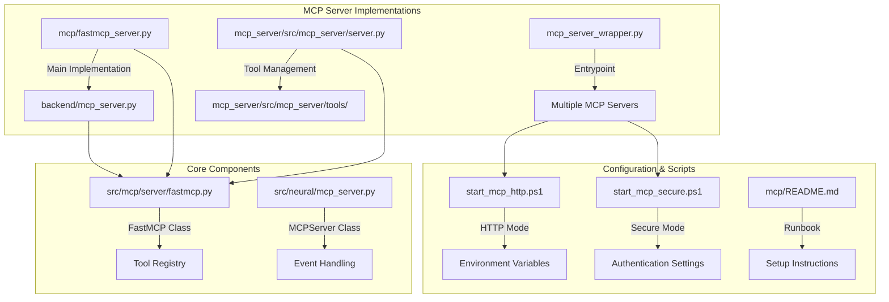
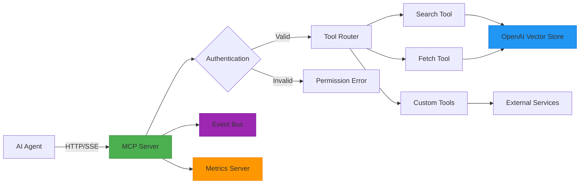
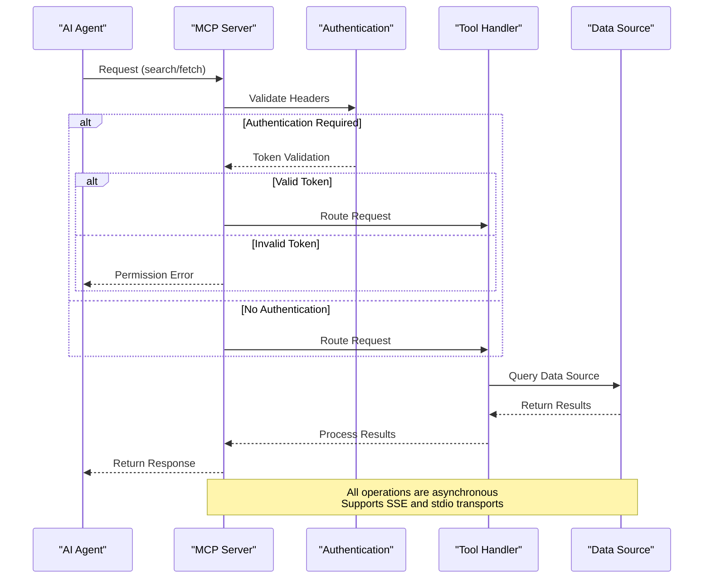
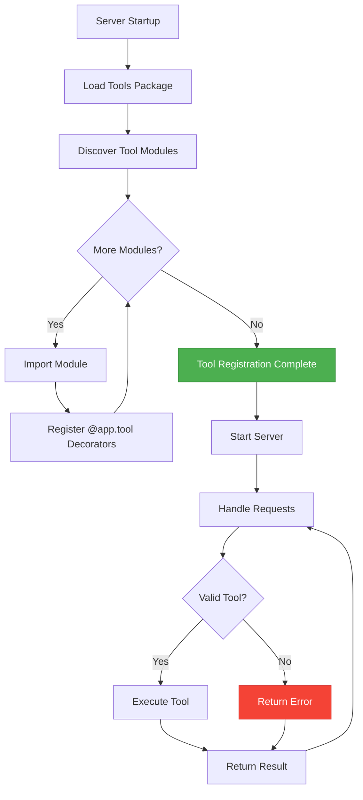
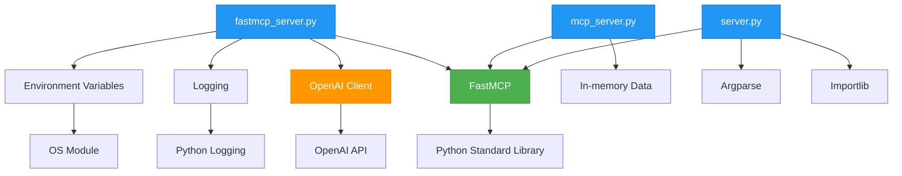

# MCP Server Implementation

<cite>
**Referenced Files in This Document**   
- [fastmcp_server.py](file://mcp/fastmcp_server.py)
- [mcp_server.py](file://backend/mcp_server.py)
- [server.py](file://mcp_server/src/mcp_server/server.py)
- [FastMCP](file://src/mcp/server/fastmcp.py)
- [MCPServer](file://src/neural/mcp_server.py)
- [mcp_server_wrapper.py](file://mcp_server_wrapper.py)
- [start_mcp_http.ps1](file://start_mcp_http.ps1)
- [start_mcp_secure.ps1](file://start_mcp_secure.ps1)
- [README.md](file://mcp/README.md)
</cite>

## Table of Contents
1. [Introduction](#introduction)
2. [Project Structure](#project-structure)
3. [Core Components](#core-components)
4. [Architecture Overview](#architecture-overview)
5. [Detailed Component Analysis](#detailed-component-analysis)
6. [Dependency Analysis](#dependency-analysis)
7. [Performance Considerations](#performance-considerations)
8. [Troubleshooting Guide](#troubleshooting-guide)
9. [Conclusion](#conclusion)

## Introduction
The MCP (Model Context Protocol) Server Implementation provides a standardized interface for AI agents to access external tools and data sources. This documentation details the architecture and implementation of the MCP server within the Super Alita ecosystem, focusing on its role in agent communication, request handling, and integration with external systems. The server supports both HTTP/SSE and secure communication modes, enabling seamless integration with various AI platforms and tools.

## Project Structure
The MCP server implementation is distributed across multiple directories within the repository, each serving a specific purpose in the overall architecture. The primary components are organized in a modular fashion to facilitate extensibility and maintainability.



**Diagram sources**
- [fastmcp_server.py](file://mcp/fastmcp_server.py)
- [mcp_server.py](file://backend/mcp_server.py)
- [server.py](file://mcp_server/src/mcp_server/server.py)
- [FastMCP](file://src/mcp/server/fastmcp.py)
- [start_mcp_http.ps1](file://start_mcp_http.ps1)
- [start_mcp_secure.ps1](file://start_mcp_secure.ps1)

**Section sources**
- [fastmcp_server.py](file://mcp/fastmcp_server.py)
- [mcp_server.py](file://backend/mcp_server.py)
- [server.py](file://mcp_server/src/mcp_server/server.py)

## Core Components
The MCP server implementation consists of several core components that work together to provide a robust and extensible platform for agent-tool communication. These components include the FastMCP framework, the server implementation, tool management system, and authentication mechanisms. The architecture is designed to support both simple in-memory data stores and complex external data sources like OpenAI Vector Stores.

**Section sources**
- [fastmcp_server.py](file://mcp/fastmcp_server.py)
- [mcp_server.py](file://backend/mcp_server.py)
- [server.py](file://mcp_server/src/mcp_server/server.py)
- [FastMCP](file://src/mcp/server/fastmcp.py)

## Architecture Overview
The MCP server architecture is designed as a modular, extensible system that facilitates communication between AI agents and external tools. The architecture follows a decorator-based pattern for tool registration and supports multiple transport protocols for flexibility in deployment scenarios.



**Diagram sources**
- [fastmcp_server.py](file://mcp/fastmcp_server.py)
- [mcp_server.py](file://backend/mcp_server.py)
- [server.py](file://mcp_server/src/mcp_server/server.py)
- [MCPServer](file://src/neural/mcp_server.py)

## Detailed Component Analysis

### FastMCP Framework Analysis
The FastMCP framework serves as the foundation for the MCP server implementation, providing a lightweight decorator-based system for tool registration and execution. This framework enables developers to easily create and register tools that can be accessed by AI agents.

```mermaid
classDiagram
class FastMCP {
+str app_name
-dict[str, Callable] _tools
+__init__(app_name : str)
+tool(name : str, description : str | None, **metadata) Decorator
+run(transport : str, **kwargs) None
}
class ToolDecorator {
+Callable func
+str name
+str description
+dict metadata
+__call__(func) Callable
}
FastMCP --> ToolDecorator : "uses"
FastMCP "1" --> "0..*" Tool : "registers"
note right of FastMCP
Core class for MCP server implementation
Manages tool registration and execution
Supports multiple transport protocols
end
```

**Diagram sources**
- [FastMCP](file://src/mcp/server/fastmcp.py)

**Section sources**
- [FastMCP](file://src/mcp/server/fastmcp.py)

### MCP Server Implementation Analysis
The MCP server implementation provides concrete functionality for handling agent requests, managing authentication, and interfacing with data sources. The server supports both secure and non-secure modes of operation, with configurable authentication mechanisms.



**Diagram sources**
- [fastmcp_server.py](file://mcp/fastmcp_server.py)
- [mcp_server.py](file://backend/mcp_server.py)

**Section sources**
- [fastmcp_server.py](file://mcp/fastmcp_server.py)
- [mcp_server.py](file://backend/mcp_server.py)

### Tool Management System
The tool management system enables dynamic loading and registration of tools, allowing for extensible functionality without requiring server restarts. This system supports both built-in tools and custom tools developed by third parties.



**Diagram sources**
- [server.py](file://mcp_server/src/mcp_server/server.py)

**Section sources**
- [server.py](file://mcp_server/src/mcp_server/server.py)

## Dependency Analysis
The MCP server implementation has a well-defined dependency structure that ensures modularity and ease of maintenance. The core dependencies include the FastMCP framework, OpenAI client library, and various utility packages for configuration and logging.



**Diagram sources**
- [fastmcp_server.py](file://mcp/fastmcp_server.py)
- [mcp_server.py](file://backend/mcp_server.py)
- [server.py](file://mcp_server/src/mcp_server/server.py)
- [FastMCP](file://src/mcp/server/fastmcp.py)

**Section sources**
- [fastmcp_server.py](file://mcp/fastmcp_server.py)
- [mcp_server.py](file://backend/mcp_server.py)
- [server.py](file://mcp_server/src/mcp_server/server.py)

## Performance Considerations
The MCP server implementation includes several performance optimizations to ensure efficient handling of agent requests. These include connection pooling, caching mechanisms, and asynchronous processing of requests. The server is designed to handle high-throughput scenarios with minimal latency.

**Section sources**
- [fastmcp_server.py](file://mcp/fastmcp_server.py)
- [mcp_server.py](file://backend/mcp_server.py)

## Troubleshooting Guide
Common issues with the MCP server typically relate to configuration, authentication, and connectivity. The following guidance can help resolve these issues:

**Section sources**
- [fastmcp_server.py](file://mcp/fastmcp_server.py)
- [mcp_server.py](file://backend/mcp_server.py)
- [README.md](file://mcp/README.md)

## Conclusion
The MCP Server Implementation provides a robust and extensible platform for AI agent communication within the Super Alita ecosystem. Its modular architecture, support for multiple transport protocols, and flexible authentication mechanisms make it suitable for a wide range of