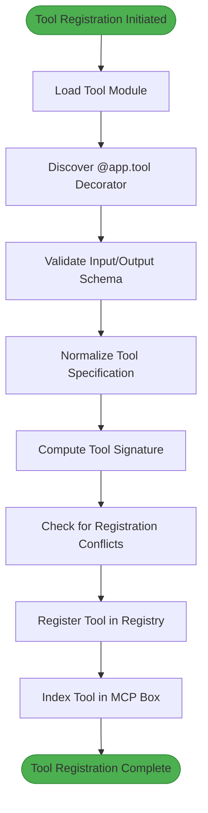
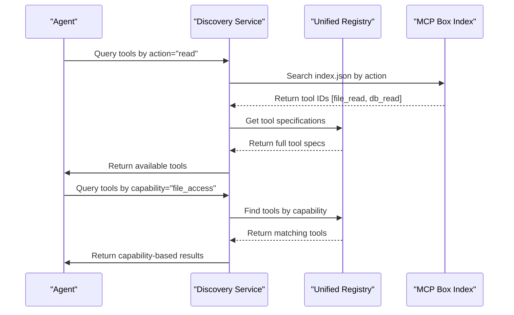

# Tool Registration and Discovery

<cite>
**Referenced Files in This Document**   
- [server.py](file://mcp_server/src/mcp_server/server.py)
- [deepcode_tool.py](file://mcp_server/src/mcp_server/tools/deepcode_tool.py)
- [puter_tool.py](file://mcp_server/src/mcp_server/tools/puter_tool.py)
- [format_and_scan.py](file://mcp_server/src/mcp_server/tools/format_and_scan.py)
- [mynewtool.py](file://mcp_server/src/mcp_server/tools/mynewtool.py)
- [__init__.py](file://mcp_server/src/mcp_server/tools/__init__.py)
- [mcp_abstractor.py](file://src/reug_runtime/mcp_abstractor.py)
- [unified_registry.py](file://src/core/unified_registry.py)
- [tool_lifecycle.py](file://src/core/tool_lifecycle.py)
- [test_mcp_registration_canonical.py](file://tests/test_mcp_registration_canonical.py)
</cite>

## Table of Contents
1. [Introduction](#introduction)
2. [Tool Registration Process](#tool-registration-process)
3. [Tool Discovery Mechanism](#tool-discovery-mechanism)
4. [Domain Model of Tool Capabilities](#domain-model-of-tool-capabilities)
5. [Implementation Examples](#implementation-examples)
6. [Common Issues and Solutions](#common-issues-and-solutions)
7. [Best Practices](#best-practices)
8. [Conclusion](#conclusion)

## Introduction

The Tool Registration and Discovery system enables agents to dynamically register, discover, and utilize capabilities within the MCP (Modular Capability Platform) framework. This documentation details the complete lifecycle of tool management, from registration and schema validation to discovery and usage. The system supports various tool types including agent-memories, task-management, and code analysis tools, providing a robust foundation for extensible agent functionality.

The architecture leverages a centralized registry pattern with lifecycle management, ensuring tools are properly validated, indexed, and made available for discovery. The system handles both static tool definitions and dynamically loaded capabilities, maintaining consistency across different execution contexts.

**Section sources**
- [server.py](file://mcp_server/src/mcp_server/server.py#L1-L73)
- [unified_registry.py](file://src/core/unified_registry.py#L1-L53)

## Tool Registration Process

The tool registration process follows a structured workflow that ensures proper validation, indexing, and lifecycle management of capabilities. Tools are registered through the MCP server using a decorator-based approach that automatically discovers and registers tool functions.

The registration begins with the `FastMCP` application instance in `server.py`, which serves as the central registry for all tools. When the server starts, it dynamically loads all modules in the `mcp_server.tools` package using the `load_tools()` function. This function iterates through all available modules and imports them, triggering the execution of any `@app.tool()` decorators that register tool functions with the application instance.

**Diagram sources**
- [server.py](file://mcp_server/src/mcp_server/server.py#L1-L73)
- [mcp_abstractor.py](file://src/reug_runtime/mcp_abstractor.py#L1-L193)

Each tool registration includes capability declaration through schema definitions that specify the tool's input parameters and expected output format. The system validates these schemas against JSON Schema standards to ensure type safety and consistency. During registration, the system computes a unique signature for each tool based on its action, input properties, and required parameters, which is used for deduplication and conflict detection.

The `UnifiedCapabilityRegistry` class manages the registration of capabilities across different registry types (normal, MCP, neural, and dynamic tools). When a tool is registered, it is added to the appropriate registry based on its type, making it available for discovery and invocation.

**Section sources**
- [server.py](file://mcp_server/src/mcp_server/server.py#L1-L73)
- [unified_registry.py](file://src/core/unified_registry.py#L44-L52)
- [tool_lifecycle.py](file://src/core/tool_lifecycle.py#L267-L396)

## Tool Discovery Mechanism

The tool discovery mechanism enables agents to query available capabilities and select appropriate tools for specific tasks. The system provides multiple discovery pathways, including direct registry queries and indexed catalog access.

The primary discovery mechanism is implemented through the MCP Box abstraction, which creates a canonical view of all available tools. The `abstract_mcp_box()` function in `mcp_abstractor.py` normalizes, deduplicates, and indexes tool specifications from JSON files in the `.mcp_box` directory. This process generates two key artifacts: `index.json` and `catalog.json`.

The `index.json` file contains a comprehensive index of all tools with metadata including tool ID, action, properties, required parameters, and signature. This index supports efficient lookups by action type and provides information about tool aliases and file sources. The `catalog.json` file contains a simplified representation of tools in a format suitable for direct loading by the runtime, including only essential information like name, description, and schema definitions.

Agents can discover tools through several methods:
1. **Action-based discovery**: Query tools by their action type (e.g., "read", "write", "execute")
2. **Capability-based discovery**: Find tools that provide specific capabilities
3. **Keyword-based discovery**: Search tools by name or description
4. **Signature-based discovery**: Identify tools with specific input/output patterns

The discovery process also handles tool versioning and backward compatibility by maintaining canonical IDs for tool signatures. When multiple tools with the same signature but different IDs are registered, the system creates aliases to ensure consistent access regardless of the specific tool implementation.

**Diagram sources**
- [mcp_abstractor.py](file://src/reug_runtime/mcp_abstractor.py#L93-L192)
- [unified_registry.py](file://src/core/unified_registry.py#L1-L53)

**Section sources**
- [mcp_abstractor.py](file://src/reug_runtime/mcp_abstractor.py#L1-L193)
- [unified_registry.py](file://src/core/unified_registry.py#L1-L53)

## Domain Model of Tool Capabilities

The domain model for