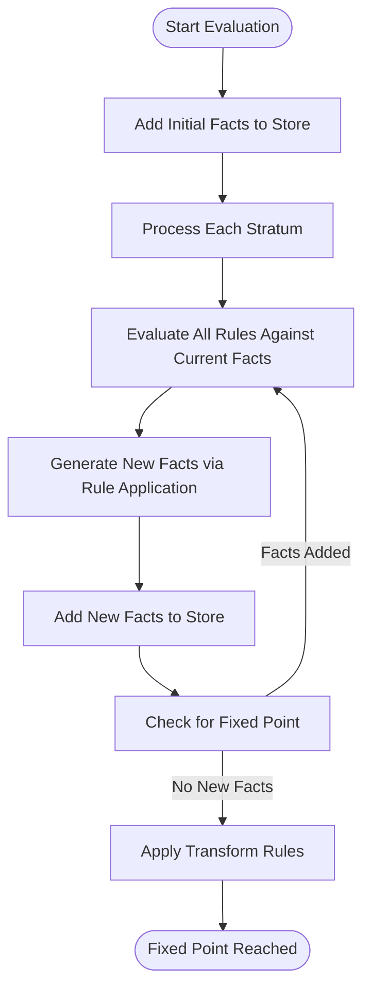
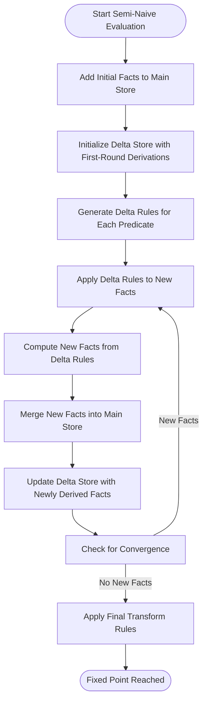
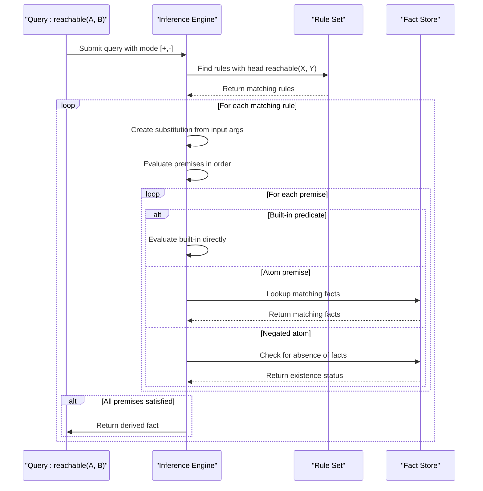

# Inference Engine

<cite>
**Referenced Files in This Document**   
- [naivebottomup.go](file://mangle/engine/naivebottomup.go)
- [seminaivebottomup.go](file://mangle/engine/seminaivebottomup.go)
- [topdown.go](file://mangle/engine/topdown.go)
- [factstore.go](file://mangle/factstore/factstore.go)
- [parse.go](file://mangle/parse/parse.go)
- [ast.go](file://mangle/ast/ast.go)
</cite>

## Table of Contents
1. [Introduction](#introduction)
2. [Core Evaluation Strategies](#core-evaluation-strategies)
3. [Execution Model and Fixed Point Computation](#execution-model-and-fixed-point-computation)
4. [Lattice-Based Computation and Merge Predicates](#lattice-based-computation-and-merge-predicates)
5. [Component Integration](#component-integration)
6. [Performance Characteristics and Optimization](#performance-characteristics-and-optimization)
7. [Common Issues and Solutions](#common-issues-and-solutions)
8. [Conclusion](#conclusion)

## Introduction

The Mangle inference engine implements a Datalog-based reasoning system that evaluates logical rules to derive new facts from existing knowledge. The engine supports three primary evaluation strategies: naive bottom-up, semi-naive bottom-up, and top-down evaluation. These strategies enable the system to handle complex logical reasoning tasks while balancing performance, memory usage, and termination guarantees. The inference engine is tightly integrated with other components such as the parser, fact store, and agent orchestrator, forming a critical part of the overall reasoning architecture.

The engine operates on a stratified Datalog program where rules are processed in layers to ensure consistent evaluation of negation. It uses a lattice-based computation model for handling fact merging and supports fixpoint iteration to determine when all possible facts have been derived. The implementation includes optimizations for large-scale datasets and provides mechanisms to prevent infinite recursion and non-terminating evaluations.

**Section sources**
- [naivebottomup.go](file://mangle/engine/naivebottomup.go#L1-L200)
- [seminaivebottomup.go](file://mangle/engine/seminaivebottomup.go#L1-L534)
- [topdown.go](file://mangle/engine/topdown.go#L1-L114)

## Core Evaluation Strategies

### Naive Bottom-Up Evaluation

The naive bottom-up evaluation strategy systematically applies all rules to the current set of facts until no new facts can be derived. This approach, implemented in `EvalProgramNaive`, processes rules in stratified layers and repeatedly evaluates the entire rule set against all known facts. The algorithm begins by adding initial facts to the fact store and then iteratively applies rules to generate new facts.

The core evaluation loop continues until a fixed point is reached, indicated by the absence of newly added facts in an iteration. For each rule, the engine computes one-step derivations by joining premises and applying substitutions to the rule head. Built-in predicates and equality constraints are handled specially during premise evaluation. While conceptually simple, this approach can be inefficient for large datasets as it reprocesses all facts in every iteration, potentially generating the same facts multiple times.



**Diagram sources**
- [naivebottomup.go](file://mangle/engine/naivebottomup.go#L100-L150)

### Semi-Naive Bottom-Up Evaluation

The semi-naive bottom-up evaluation strategy optimizes the naive approach by tracking only newly derived facts (delta facts) and applying rules specifically to these incremental changes. Implemented in `EvalStratifiedProgramWithStats`, this method significantly reduces redundant computation by focusing on the consequences of newly discovered facts rather than reprocessing the entire fact base.

The algorithm maintains two fact stores: the main store containing all derived facts and a delta store holding facts from the current iteration. In each iteration, the engine generates "delta rules" that target specific premises which could match newly added facts. This approach leverages the principle that only new facts can lead to new derivations, avoiding the recomputation of previously established relationships.

The semi-naive evaluation includes sophisticated handling of merge predicates and lattice operations, allowing for custom fact combination logic when conflicts arise. It also supports evaluation limits to prevent excessive memory consumption and provides detailed performance statistics for monitoring execution.



**Diagram sources**
- [seminaivebottomup.go](file://mangle/engine/seminaivebottomup.go#L300-L500)

### Top-Down Evaluation

The top-down evaluation strategy, also known as backward chaining, starts from a query and works backward through rules to determine if the query can be proven. Implemented in the `QueryContext` type, this approach follows a PROLOG-style SLD resolution strategy where the engine attempts to satisfy a query by finding matching rules and recursively evaluating their premises.

The evaluation process begins with a query atom and examines all rules whose heads could unify with the query. For each matching rule, the engine creates a substitution based on input arguments and then evaluates the rule's premises in sequence. The process continues recursively until either all premises are satisfied (proving the query) or a contradiction is found.

Top-down evaluation is particularly efficient for answering specific queries without computing the entire consequence set. It supports both input and output arguments through mode declarations and handles negation by checking for the absence of facts. This strategy is ideal for interactive querying and on-demand reasoning tasks where computing the complete closure would be unnecessarily expensive.



**Diagram sources**
- [topdown.go](file://mangle/engine/topdown.go#L50-L100)

## Execution Model and Fixed Point Computation

### Rule Processing and Stratification

The Mangle inference engine processes rules through a stratified evaluation model that ensures consistent handling of negation. Before evaluation begins, the engine analyzes the dependency graph of predicates to determine strata—layers of rules that can be evaluated independently. This stratification process, implemented in the analysis package, prevents logical inconsistencies that could arise from negation in cyclic dependencies.

Each stratum contains predicates that can be evaluated based solely on facts from lower strata and extensional database predicates. The engine processes strata in order, ensuring that all necessary facts are available before evaluating rules in a higher stratum. This approach enables the use of negation while maintaining the declarative semantics of Datalog.

During rule processing, the engine handles various clause components including regular premises, negated atoms, equality constraints, and transform rules. Transform rules, indicated by "do" or "let" keywords, are applied after the fixed point is reached and enable procedural extensions to the declarative logic.

**Section sources**
- [seminaivebottomup.go](file://mangle/engine/seminaivebottomup.go#L150-L250)
- [naivebottomup.go](file://mangle/engine/naivebottomup.go#L50-L100)

### Fixed Point Determination

The inference engine reaches a fixed point when no new facts can be derived from the current set of rules and facts. This termination condition is detected by monitoring fact additions during each evaluation iteration. In the naive evaluation strategy, the fixed point is reached when an entire pass through all rules produces no new facts.

The semi-naive evaluation uses a more sophisticated convergence detection mechanism by tracking the delta store. The algorithm terminates when a complete iteration over delta rules produces no new facts for the delta store. This approach provides faster convergence detection since it focuses only on incremental changes rather than the entire fact base.

The engine also supports evaluation limits through the `EvalOptions` structure, which can terminate evaluation based on created fact limits or total fact limits. This prevents non-terminating evaluations on recursive rules without proper base cases and protects against excessive memory consumption.

```mermaid
flowchart TD
    Start([Start Evaluation]) --> Initialize["Initialize Fact Stores"]
    Initialize -->