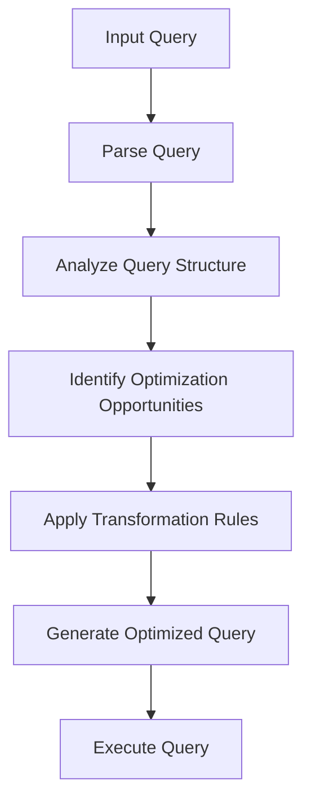
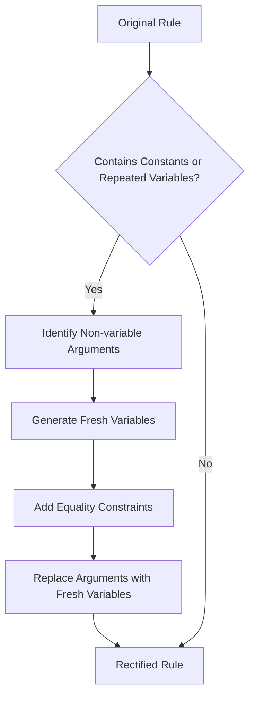
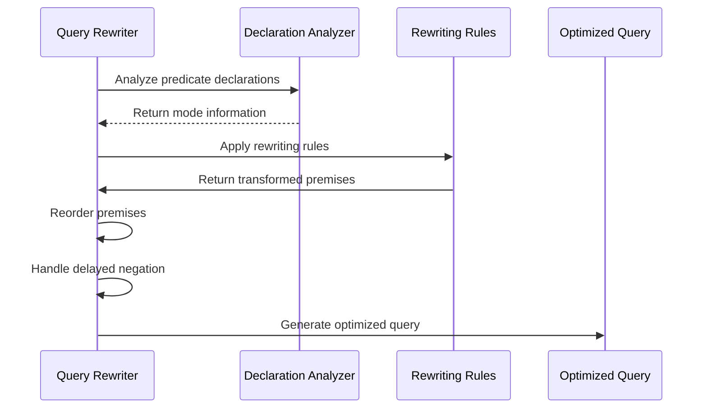
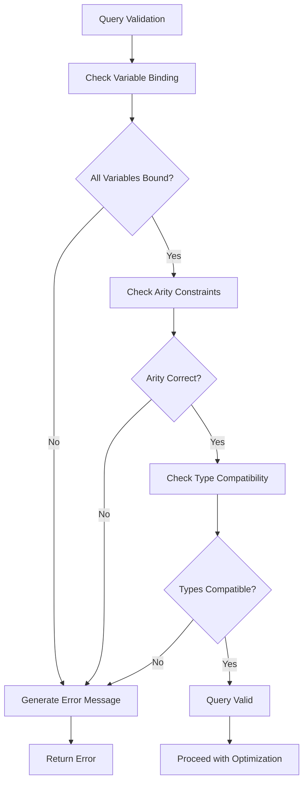
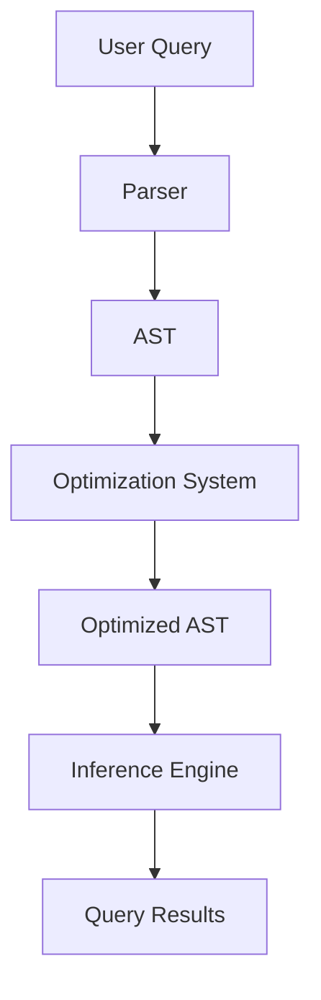
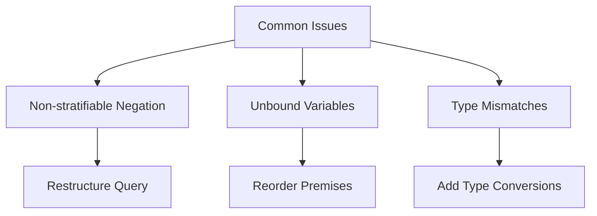

# Optimization

<cite>
**Referenced Files in This Document**   
- [stratification.go](file://mangle/analysis/stratification.go)
- [rectify.go](file://mangle/analysis/rectify.go)
- [rewriteclause.go](file://mangle/analysis/rewriteclause.go)
- [validation.go](file://mangle/analysis/validation.go)
- [mangle_reasoner.py](file://src/sdd/mangle_reasoner.py)
- [mangle_rules.py](file://src/sdd/mangle_rules.py)
</cite>

## Table of Contents
1. [Introduction](#introduction)
2. [Query Analysis and Transformation](#query-analysis-and-transformation)
3. [Stratification Analysis](#stratification-analysis)
4. [Rule Rectification](#rule-rectification)
5. [Query Rewriting](#query-rewriting)
6. [Semantic Correctness and Error Handling](#semantic-correctness-and-error-handling)
7. [Integration with Parser and Inference Engine](#integration-with-parser-and-inference-engine)
8. [Common Issues and Debugging Strategies](#common-issues-and-debugging-strategies)
9. [Performance Optimization](#performance-optimization)
10. [Best Practices](#best-practices)

## Introduction
This document provides a comprehensive overview of Mangle's optimization system, focusing on query analysis and transformation techniques. The system implements key optimizations including stratification analysis, rule rectification, and query rewriting to ensure efficient and semantically correct evaluation of complex queries. The optimization process detects and resolves issues such as non-stratifiable negation, ensuring that queries are transformed into optimal execution plans. This document explains the implementation details of these optimizations, their relationship with other components like the parser and inference engine, and provides guidance on debugging common issues and performance optimization.

## Query Analysis and Transformation
Mangle's optimization system performs comprehensive query analysis and transformation to ensure efficient evaluation. The process begins with parsing the input query and analyzing its structure to identify optimization opportunities. The system then applies a series of transformations to rewrite the query in a more efficient form while preserving its semantic meaning.

The query analysis phase examines the syntactic structure of the query, identifying predicates, variables, and logical operators. This analysis enables the system to understand the query's dependencies and potential execution paths. The transformation phase applies optimization rules to rewrite the query, eliminating redundant operations and reordering clauses to minimize computational overhead.



**Diagram sources**
- [validation.go](file://mangle/analysis/validation.go#L49-L60)
- [rewriteclause.go](file://mangle/analysis/rewriteclause.go#L1-L120)

**Section sources**
- [validation.go](file://mangle/analysis/validation.go#L49-L60)
- [rewriteclause.go](file://mangle/analysis/rewriteclause.go#L1-L120)

## Stratification Analysis
Stratification analysis is a critical optimization technique used to handle negation in logic programs. The system analyzes the dependency graph of predicates to determine if a program can be stratified, meaning it can be divided into layers such that negation only occurs between layers, not within them.

The stratification process involves constructing a dependency graph where nodes represent predicates and edges represent dependencies between them. The system then applies Kosaraju's algorithm to identify strongly connected components (SCCs) in the graph. If any SCC contains a negative dependency, the program is deemed non-stratifiable.

When a program is stratifiable, the system assigns each predicate to a stratum (layer) such that all dependencies on negated predicates point to lower strata. This stratification enables the system to evaluate the program in a bottom-up manner, processing each stratum in order and ensuring that negated predicates are fully evaluated before they are used.

```mermaid
classDiagram
class Program {
+EdbPredicates map[ast.PredicateSym]struct{}
+IdbPredicates map[ast.PredicateSym]struct{}
+Rules []ast.Clause
}
class depGraph {
+initNode(src ast.PredicateSym)
+addEdge(src ast.PredicateSym, dest ast.PredicateSym, negated bool)
+transpose() depGraph
+sccs() []Nodeset
+sortResult(strata []Nodeset, predToStratumMap map[ast.PredicateSym]int) ([]Nodeset, map[ast.PredicateSym]int)
}
class Nodeset {
+struct{}
}
Program --> depGraph : "uses"
depGraph --> Nodeset : "contains"
```

**Diagram sources**
- [stratification.go](file://mangle/analysis/stratification.go#L1-L215)

**Section sources**
- [stratification.go](file://mangle/analysis/stratification.go#L1-L215)

## Rule Rectification
Rule rectification is the process of transforming rules to ensure they meet specific syntactic requirements for efficient evaluation. The system rectifies rules by introducing fresh variables and equality constraints to handle cases where the head of a rule contains constants or repeated variables.

For example, a rule like `knows(X, X) :- person(X).` would be rectified to `knows(X, Y) :- person(X), Y = X.` This transformation ensures that all arguments in the head of a rule are distinct variables, simplifying subsequent analysis and optimization.

The rectification process involves examining each atom in the rule and ensuring that all arguments are variables. When a constant or repeated variable is encountered, the system introduces a fresh variable and adds an equality constraint to maintain the original semantics. This process is applied recursively to nested structures, ensuring that the entire rule is properly rectified.



**Diagram sources**
- [rectify.go](file://mangle/analysis/rectify.go#L1-L53)

**Section sources**
- [rectify.go](file://mangle/analysis/rectify.go#L1-L53)

## Query Rewriting
Query rewriting is a sophisticated optimization technique that transforms queries to improve their efficiency while preserving their semantic meaning. The system applies a series of rewriting rules based on predicate declarations and mode information to optimize the query structure.

The rewriting process begins by analyzing the declarations associated with each predicate in the query. These declarations provide information about the expected argument modes (input, output, or input/output) and other constraints that can be used to guide the rewriting process. The system then applies transformation rules to reorder premises, eliminate redundant operations, and introduce more efficient alternatives.

One key aspect of query rewriting is the handling of delayed negation. When a negated atom contains variables that are not yet bound, the system delays its evaluation until the necessary variables are bound. This prevents premature evaluation of negated subgoals and ensures correct results.



**Diagram sources**
- [rewriteclause.go](file://mangle/analysis/rewriteclause.go#L1-L120)

**Section sources**
- [rewriteclause.go](file://mangle/analysis/rewriteclause.go#L1-L120)

## Semantic Correctness and Error Handling
Ensuring semantic correctness during query transformations is paramount to the optimization system. The system employs rigorous validation techniques to verify that transformations preserve the original meaning of queries.

The validation process checks several key aspects of the query, including variable binding, arity constraints, and type compatibility. A variable is considered bound if it appears in a positive atom, is unified with a constant, or is forced as input by a mode declaration. The system verifies that all variables in the query are properly bound to prevent undefined behavior.

Error handling is integrated throughout the optimization process, with specific error messages for different types of violations. When a query cannot be stratified or contains unbound variables, the system provides detailed error messages that help users understand and fix the issues.



**Section sources**
- [validation.go](file://mangle/analysis/validation.go#L49-L60)

## Integration with Parser and Inference Engine
The optimization system is tightly integrated with the parser and inference engine to provide a seamless query processing pipeline. The parser converts the input query into an abstract syntax tree (AST), which is then passed to the optimization system for analysis and transformation.

After optimization, the transformed query is handed to the inference engine for evaluation. The inference engine uses the optimized query structure to efficiently compute the results, leveraging the stratification and rewriting performed by the optimization system.

This integration ensures that optimizations are applied at the appropriate stage of query processing, maximizing their effectiveness while maintaining compatibility with the rest of the system.



**Section sources**
- [validation.go](file://mangle/analysis/validation.go#L49-L60)
- [mangle_reasoner.py](file://src/sdd/mangle_reasoner.py#L324-L433)

## Common Issues and Debugging Strategies
Several common issues can arise during query optimization, including non-stratifiable negation, unbound variables, and type mismatches. Understanding these issues and their debugging strategies is essential for effective query development.

Non-stratifiable negation occurs when a program contains recursive negation within the same stratum. This can be resolved by restructuring the query to eliminate the recursive negation or by using alternative approaches that achieve the same logical result.

Unbound variables are another common issue, typically occurring when a variable is used in a negated atom before it is bound by a positive atom. The solution is to reorder the premises to ensure that all variables are properly bound before they are used in negated subgoals.

Type mismatches can occur when the arguments to a predicate or function do not match the expected types. These can be resolved by ensuring that the query uses the correct types and by adding explicit type conversions when necessary.



**Section sources**
- [stratification.go](file://mangle/analysis/stratification.go#L1-L215)
- [validation.go](file://mangle/analysis/validation.go#L49-L60)

## Performance Optimization
Performance optimization is a key focus of the system, with several techniques employed to minimize query execution time and resource usage. The system uses caching to store the results of expensive operations, such as dependency graph analysis and type inference, avoiding redundant computation.

Query planning is another important aspect of performance optimization. The system analyzes the query structure to determine the most efficient execution order, minimizing the number of intermediate results and reducing memory usage.

The system also employs lazy evaluation for certain operations, deferring computation until the results are actually needed. This reduces unnecessary processing and improves overall efficiency.

```mermaid
flowchart TD
    A[Performance Optimization] --> B[Caching]
    A --> C[Query Planning]
    A --> D[Lazy Evaluation]
    B --> E[Cache Dependency Graphs]
    B --> F[Cache Type Inference]
    C --> G[Determine Execution Order]
    C --> H[Minimize Intermediate Results]
    D --> I[De