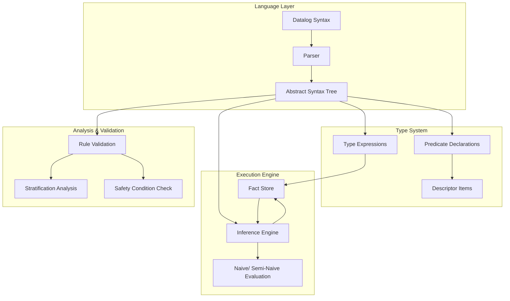
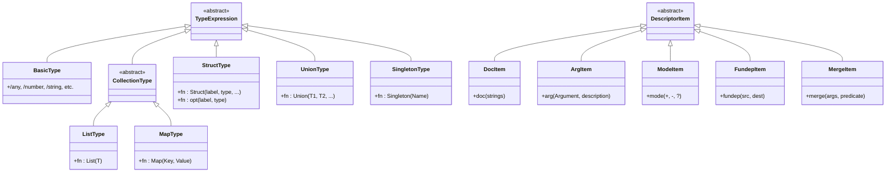
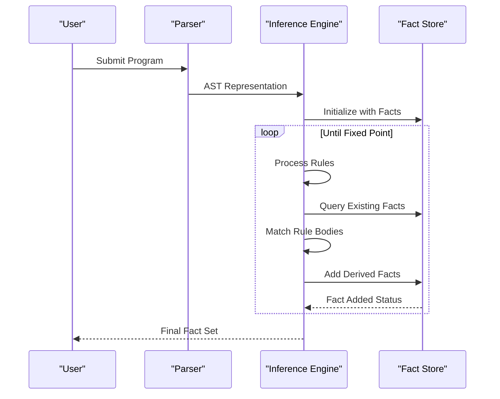
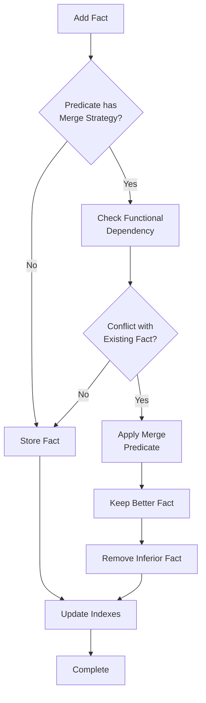
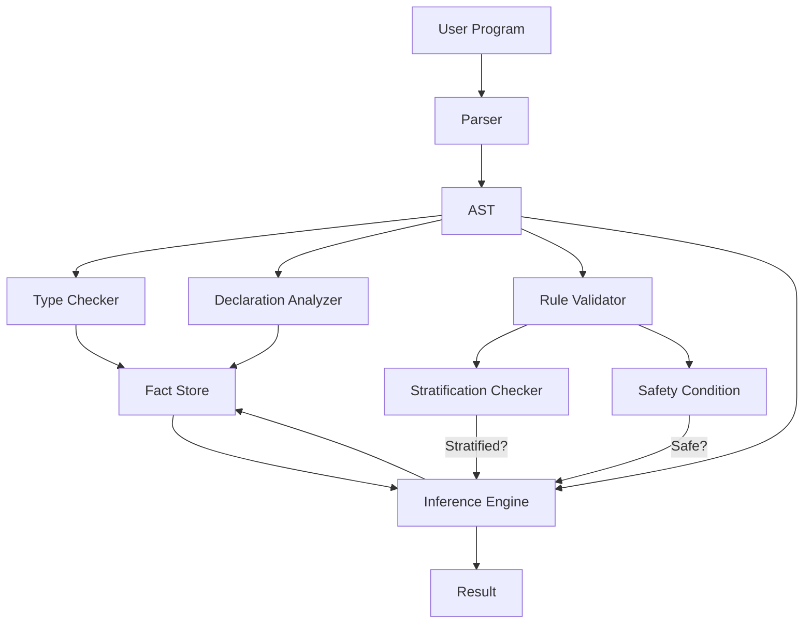

# Query Language

<cite>
**Referenced Files in This Document**   
- [ast.go](file://mangle/ast/ast.go)
- [parse.go](file://mangle/parse/parse.go)
- [datalog.md](file://mangle/readthedocs/datalog.md)
- [spec_decls.md](file://mangle/docs/spec_decls.md)
- [engine.go](file://mangle/engine/naivebottomup.go)
- [factstore.go](file://mangle/factstore/factstore.go)
- [builtin.go](file://mangle/builtin/builtin.go)
- [stratification.go](file://mangle/analysis/stratification.go)
- [validation.go](file://mangle/analysis/validation.go)
- [interpreter.go](file://mangle/interpreter/interpreter.go)
</cite>

## Table of Contents
1. [Introduction](#introduction)
2. [Core Components](#core-components)
3. [Architecture Overview](#architecture-overview)
4. [Detailed Component Analysis](#detailed-component-analysis)
5. [Dependency Analysis](#dependency-analysis)
6. [Performance Considerations](#performance-considerations)
7. [Troubleshooting Guide](#troubleshooting-guide)
8. [Conclusion](#conclusion)

## Introduction
Mangle is a Datalog-based declarative query language designed for expressing logical rules and querying structured data. It enables users to define facts, rules, and queries that describe relationships within data, supporting recursive reasoning, type-safe declarations, and efficient evaluation through multiple execution strategies. The language is particularly suited for knowledge representation, inference, and rule-based computation in complex systems.

The Mangle query language combines formal logic foundations with practical programming constructs, allowing both beginners and advanced users to model data relationships effectively. Its implementation includes a full parser, abstract syntax tree (AST), type system, inference engine, and fact store, making it a comprehensive solution for logical computation.

**Section sources**
- [datalog.md](file://mangle/readthedocs/datalog.md#L1-L198)
- [spec_decls.md](file://mangle/docs/spec_decls.md#L1-L121)

## Core Components

The Mangle query language consists of several core components that work together to enable declarative programming: the grammar and syntax based on Datalog, the parser and AST generation system, the type and declaration system, the inference engine for rule evaluation, and the fact store for data persistence. These components are implemented across multiple packages in the codebase, with clear separation of concerns.

The language supports three primary constructs: facts (ground assertions), rules (logical implications), and queries (requests for derived information). It extends standard Datalog with advanced features such as type declarations, functional dependencies, merge strategies for lattice-based computation, and safety conditions to ensure termination.

**Section sources**
- [ast.go](file://mangle/ast/ast.go#L1-L200)
- [parse.go](file://mangle/parse/parse.go#L1-L150)
- [spec_decls.md](file://mangle/docs/spec_decls.md#L1-L121)

## Architecture Overview



**Diagram sources**
- [ast.go](file://mangle/ast/ast.go#L1-L50)
- [parse.go](file://mangle/parse/parse.go#L1-L30)
- [naivebottomup.go](file://mangle/engine/naivebottomup.go#L1-L20)

## Detailed Component Analysis

### Grammar and Syntax Analysis

Mangle's syntax is based on Datalog, a subset of Prolog designed for database queries and logical reasoning. The language uses a simple, readable format where facts and rules are expressed as predicate applications. Facts are written as `predicate(arg1, arg2).` while rules use the implication operator `⟸` (or `:-`) to express logical relationships.

The language supports variables in rules, which act as placeholders that get bound during pattern matching. A key constraint is the safety condition: all variables in the rule head must appear in the body, ensuring that rule evaluation terminates and produces well-defined results.

```mermaid
flowchart TD
Start[Rule Definition] --> Head[Head: predicate(Var1, Var2)]
Head --> Operator[Operator: ⟸ or :-]
Operator --> Body[Body: atom1, atom2, ...]
Body --> Safety{Safety Condition}
Safety --> |All head variables<br>in body| Valid[Valid Rule]
Safety --> |Unsafe| Invalid[Rejected]
Valid --> Compilation[Compile to AST]
```

**Diagram sources**
- [datalog.md](file://mangle/readthedocs/datalog.md#L50-L100)
- [validation.go](file://mangle/analysis/validation.go#L15-L40)

### Parser and AST Generation

The Mangle parser transforms source text into an Abstract Syntax Tree (AST) that represents the program structure. The parser is implemented using ANTLR-generated lexer and parser components, which handle the lexical analysis and syntactic parsing of Mangle programs.

The AST structure captures all language constructs including facts, rules, declarations, and expressions. Each node in the tree corresponds to a syntactic element, with appropriate fields for predicates, arguments, variables, and operators. The AST serves as the intermediate representation that subsequent phases of the compiler operate on.

```mermaid
classDiagram
class Program {
+[]Declaration declarations
+[]Rule rules
+[]Fact facts
}
class Declaration {
+string name
+[]Argument args
+[]DescriptorItem descriptors
+[]Bound bounds
}
class Rule {
+Atom head
+[]Atom body
}
class Fact {
+Atom atom
}
class Atom {
+string predicate
+[]Term arguments
}
class Term {
<<abstract>>
}
class Variable {
+string name
}
class Constant {
+interface{} value
}
Program --> Declaration : contains
Program --> Rule : contains
Program --> Fact : contains
Rule --> Atom : head
Rule --> Atom : body
Fact --> Atom : atom
Atom --> Term : arguments
Term <|-- Variable
Term <|-- Constant
```

**Diagram sources**
- [ast.go](file://mangle/ast/ast.go#L25-L100)
- [parse.go](file://mangle/parse/parse.go#L45-L80)
- [serde.go](file://mangle/ast/serde.go#L10-L25)

### Type System and Declarations

Mangle's type system is expressed through predicate declarations that specify the structure and constraints of relations. Declarations use the `Decl` keyword followed by the predicate name and argument types. The system supports rich type expressions including basic types, collections, structs, and unions.

Descriptor items provide metadata about predicates, including documentation (`doc`), argument descriptions (`arg`), mode specifications (`mode`), and optimization hints like functional dependencies (`fundep`) and merge strategies (`merge`). These descriptors enable both human understanding and compiler optimizations.



**Diagram sources**
- [spec_decls.md](file://mangle/docs/spec_decls.md#L25-L100)
- [typeexprs.go](file://mangle/symbols/typeexprs.go#L15-L50)
- [symbols.go](file://mangle/symbols/symbols.go#L20-L60)

### Inference Engine and Evaluation

The Mangle inference engine evaluates rules to derive new facts from existing ones. It implements multiple evaluation strategies including naive bottom-up evaluation and semi-naive evaluation. The engine processes rules iteratively until a fixed point is reached, meaning no new facts can be derived.

Naive evaluation recomputes all possible derivations in each iteration, while semi-naive evaluation optimizes this by only considering derivations that involve newly added facts. This significantly improves performance for recursive rules and large datasets.



**Diagram sources**
- [naivebottomup.go](file://mangle/engine/naivebottomup.go#L15-L50)
- [seminaivebottomup.go](file://mangle/engine/seminaivebottomup.go#L20-L60)
- [factstore.go](file://mangle/factstore/factstore.go#L10-L40)

### Fact Store Implementation

The fact store is responsible for storing and retrieving facts during rule evaluation. It provides efficient lookup operations for pattern matching and supports the addition of new facts during inference. The store maintains indexes to accelerate queries and handles duplicate detection based on predicate definitions.

For predicates with merge strategies, the fact store applies the specified merge predicate to determine which fact to keep when functional dependencies are violated. This enables lattice-based semantics where facts can be ordered by some criteria (e.g., confidence, recency).



**Diagram sources**
- [factstore.go](file://mangle/factstore/factstore.go#L15-L80)
- [simplecolumn.go](file://mangle/factstore/simplecolumn.go#L10-L35)
- [builtin.go](file://mangle/builtin/builtin.go#L20-L50)

## Dependency Analysis



**Diagram sources**
- [parse.go](file://mangle/parse/parse.go#L1-L20)
- [ast.go](file://mangle/ast/ast.go#L1-L30)
- [validation.go](file://mangle/analysis/validation.go#L1-L25)
- [stratification.go](file://mangle/analysis/stratification.go#L10-L40)
- [naivebottomup.go](file://mangle/engine/naivebottomup.go#L1-L20)

## Performance Considerations

The Mangle query language implements several performance optimizations to handle complex rule sets efficiently. The semi-naive evaluation strategy reduces redundant computation in recursive rules by only processing derivations that involve newly added facts. Indexing in the fact store accelerates pattern matching during rule body evaluation.

For large-scale applications, the system supports deferred predicates that can be computed on-demand rather than eagerly evaluated. Functional dependencies and merge strategies enable space-efficient storage by eliminating redundant facts according to user-defined criteria.

The choice of evaluation strategy depends on the nature of the rules: naive evaluation is simpler and suitable for small datasets, while semi-naive evaluation provides significant performance benefits for recursive rules and large fact bases.

## Troubleshooting Guide

Common issues in Mangle programs include syntax errors, type mismatches, rule stratification problems, and violations of the safety condition. The system provides validation tools that check programs before execution.

Syntax errors are typically caught by the parser and reported with line numbers. Type mismatches are detected during type checking and relate to incorrect argument types in facts or rules. Stratification issues occur when negation creates circular dependencies that cannot be resolved in a consistent order.

The safety condition prevents rules from generating infinite fact sets by requiring that all variables in the rule head appear in the body. This ensures that rule evaluation terminates and produces a well-defined result set.

**Section sources**
- [validation.go](file://mangle/analysis/validation.go#L1-L100)
- [stratification.go](file://mangle/analysis/stratification.go#L1-L80)
- [interpreter.go](file://mangle/interpreter/interpreter.go#L15-L50)

## Conclusion

The Mangle query language provides a powerful framework for declarative programming based on Datalog principles. Its combination of formal logic foundations with practical programming features makes it suitable for a wide range of applications from knowledge representation to complex system reasoning.

The architecture separates concerns effectively between parsing, type checking, rule validation, and execution, allowing each component to be developed and optimized independently. The extensibility through descriptors and merge strategies enables customization for specific use cases while maintaining a solid theoretical foundation.

For beginners, the simple syntax and clear semantics provide an accessible entry point to logical programming. For advanced users, features like recursive rules, functional dependencies, and lattice-based computation offer sophisticated tools for complex problem solving.