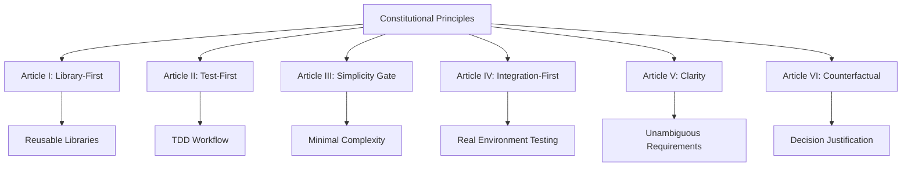

# Constitutional Validation

<cite>
**Referenced Files in This Document**   
- [constitutional_pipeline.py](file://src/sdd/constitutional_pipeline.py)
- [scorer.py](file://src/constitutional/scorer.py)
- [scorecard.py](file://src/constitutional/scorecard.py)
- [violations.py](file://src/constitutional/violations.py)
- [articles.py](file://src/constitutional/articles.py)
- [constitution.md](file://memory/constitution.md)
- [super_alita_servicer.py](file://src/grpc_server/super_alita_servicer.py)
</cite>

## Table of Contents
1. [Introduction](#introduction)
2. [Constitutional Principles](#constitutional-principles)
3. [Validation Pipeline Architecture](#validation-pipeline-architecture)
4. [Rule Checking Implementation](#rule-checking-implementation)
5. [Compliance Scoring System](#compliance-scoring-system)
6. [Violation Reporting and Remediation](#violation-reporting-and-remediation)
7. [Integration with SDD Framework](#integration-with-sdd-framework)
8. [Relationship with Other Components](#relationship-with-other-components)
9. [Common Issues and Solutions](#common-issues-and-solutions)
10. [Performance Optimization](#performance-optimization)

## Introduction

The Constitutional Validation system is a core component of the Specification-Driven Development (SDD) framework that ensures all features, plans, and implementations adhere to the system's constitutional principles and governance rules. This validation mechanism operates as a quality gate throughout the development lifecycle, enforcing architectural integrity and maintaining consistency across the codebase.

The validation system evaluates artifacts against six constitutional articles: Library-First Development, Test-First Development, Simplicity Gate, Integration-First Testing, Clarity and Unambiguity, and Counterfactual Justification. Each article represents a fundamental principle that guides development practices and ensures high-quality, maintainable software.

The validation process is integrated into the SDD workflow at three critical stages: specification, planning, and task breakdown. At each stage, the system performs comprehensive analysis to identify potential violations before development proceeds, preventing architectural drift and ensuring compliance with governance rules.

**Section sources**
- [constitutional_pipeline.py](file://src/sdd/constitutional_pipeline.py#L28-L1362)
- [constitution.md](file://memory/constitution.md#L1-L212)

## Constitutional Principles

The constitutional framework is built upon six core principles that govern all development activities within the system. These principles are designed to promote quality, maintainability, and consistency across all features and implementations.

**Article I: Library-First Development** requires that all features be designed as standalone, reusable libraries. This principle promotes modularity and reusability by ensuring each feature exposes a clean, well-defined API and can be imported and used independently. The implementation must avoid direct dependencies on application-specific concerns and maintain clear separation between library logic and application integration.

**Article II: Test-First Development** mandates that tests be defined before implementation code. This non-negotiable principle ensures that code meets specified requirements and provides clear success criteria. Tests must be confirmed to fail initially (Red Phase) before implementation begins, following the Test-Driven Development (TDD) methodology.

**Article III: Simplicity Gate** enforces minimal complexity in system design. Plans must justify any complexity beyond a minimal project structure (≤3 projects), and future-proofing is prohibited unless demonstrably necessary. This principle prevents over-engineering and maintains system comprehensibility.

**Article IV: Integration-First Testing** requires that tests be defined against realistic environments using real databases and actual services rather than mocks. This principle validates real-world behavior, catches integration issues early, and provides confidence in deployment.

**Article V: Clarity and Unambiguity** ensures that all specifications and code are clear and unambiguous. Requirements must be specific, terms and concepts well-defined, and contradictory requirements avoided. This principle supports maintainability and reduces misinterpretation.

**Article VI: Counterfactual Justification** requires documentation of alternative approaches and justification for chosen solutions. This principle ensures that decisions are made deliberately rather than by default, promoting thoughtful architectural choices.



**Diagram sources**
- [constitution.md](file://memory/constitution.md#L1-L212)

**Section sources**
- [constitution.md](file://memory/constitution.md#L1-L212)

## Validation Pipeline Architecture

The Constitutional Validation pipeline is implemented as an integral part of the SDD framework, operating at three distinct stages of the development workflow: specification, planning, and task breakdown. This multi-stage validation ensures compliance is maintained throughout the entire development lifecycle.

The pipeline is orchestrated by the `ConstitutionalSDDPipeline` class, which coordinates validation activities across the SDD phases. Each phase invokes the appropriate validation methods when constitutional gates are enabled in the request parameters. The pipeline architecture follows a consistent pattern across all stages, with validation occurring immediately after artifact generation but before the final response is returned.

At the specification phase, the pipeline validates the generated specification document against all constitutional articles. The validation occurs after the specification is written to disk but before the response is constructed. Similarly, at the planning phase, the implementation plan is validated after generation but before supporting documents are created. At the task breakdown phase, the tasks are validated after generation but before estimates and critical path calculations are performed.

The validation pipeline integrates with the next-step guidance system, which tracks outstanding clarifications, required artifacts, and workflow commands. When validation fails, the guidance system provides specific remediation steps to address the violations. This creates a feedback loop that helps developers understand and resolve compliance issues.

```mermaid
sequenceDiagram
    participant User as "Developer