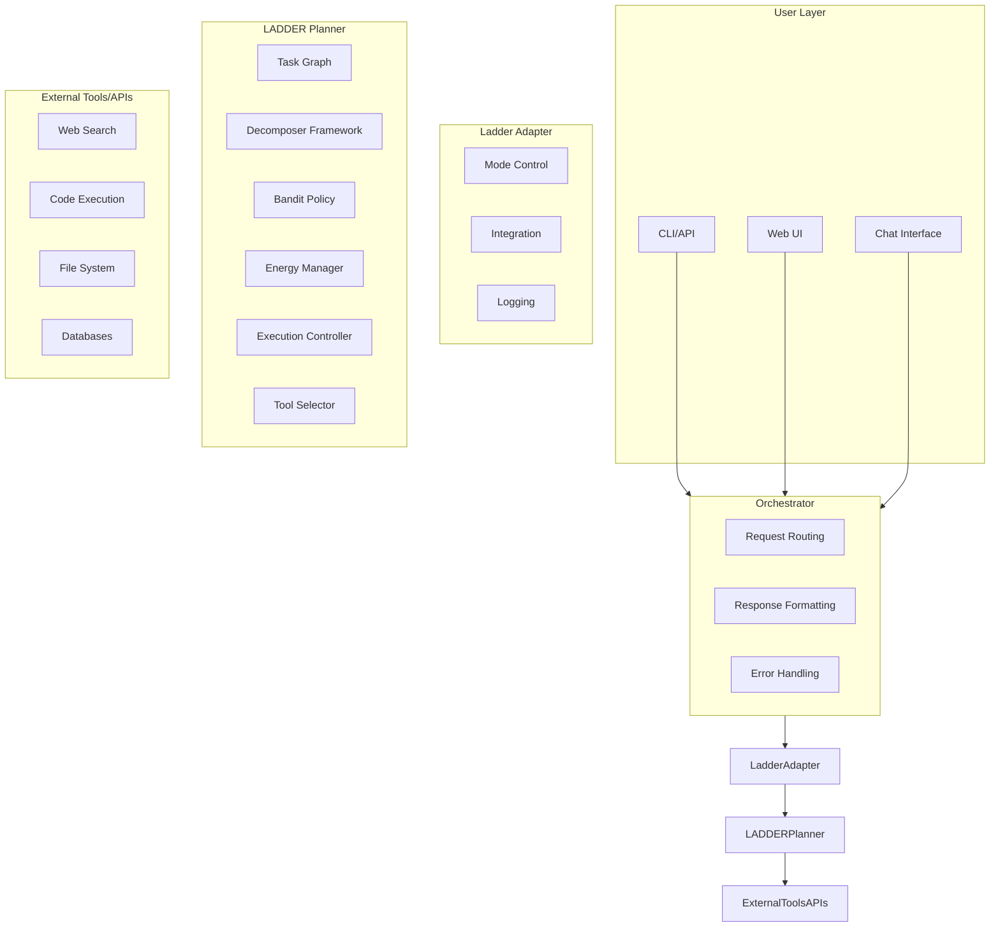
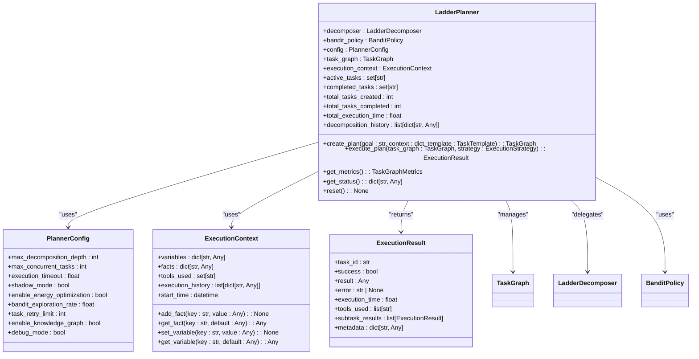
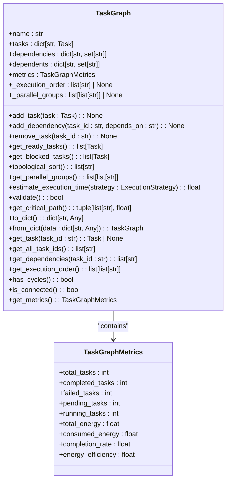
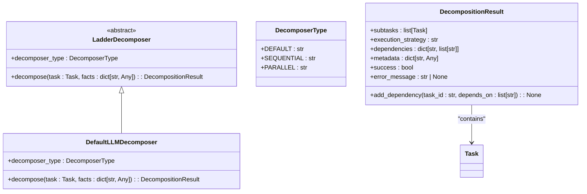

# Implementation Planning

<cite>
**Referenced Files in This Document**   
- [LADDER_ARCHITECTURE.md](file://LADDER_ARCHITECTURE.md)
- [KNOWLEDGE_GRAPH_INTERFACE_COMPLETE.md](file://KNOWLEDGE_GRAPH_INTERFACE_COMPLETE.md)
- [src/ladder/planner.py](file://src/ladder/planner.py)
- [src/knowledge_graph/kg_interface.py](file://src/knowledge_graph/kg_interface.py)
- [cortex/planner/ladder.py](file://cortex/planner/ladder.py)
- [src/ladder/graph/task_graph.py](file://src/ladder/graph/task_graph.py)
- [src/ladder/decomposers/base.py](file://src/ladder/decomposers/base.py)
</cite>

## Table of Contents
1. [Introduction](#introduction)
2. [Core Components](#core-components)
3. [Architecture Overview](#architecture-overview)
4. [Detailed Component Analysis](#detailed-component-analysis)
5. [Dependency Analysis](#dependency-analysis)
6. [Performance Considerations](#performance-considerations)
7. [Troubleshooting Guide](#troubleshooting-guide)
8. [Conclusion](#conclusion)

## Introduction
The Implementation Planning component of the Specification-Driven Development (SDD) framework is responsible for transforming high-level specifications into actionable implementation plans. This process leverages the Ladder planner and Mangle reasoning engine to decompose complex goals into manageable tasks, analyze dependencies, and allocate resources effectively. The system integrates with the agent orchestrator, task management system, and knowledge graph to ensure comprehensive planning and execution. This document provides a detailed analysis of the implementation planning process, including task decomposition, dependency analysis, and resource allocation strategies.

## Core Components
The implementation planning system is built around several core components that work together to transform specifications into detailed plans. The Ladder planner serves as the central orchestrator, managing the hierarchical decomposition of tasks and their execution. The Mangle reasoning engine provides logical inference capabilities for validating and optimizing plans. The knowledge graph stores historical planning data and patterns, enabling context-aware decision making. The agent orchestrator coordinates the overall workflow, while the task management system tracks the status and progress of individual tasks.

**Section sources**
- [LADDER_ARCHITECTURE.md](file://LADDER_ARCHITECTURE.md#L0-L441)
- [KNOWLEDGE_GRAPH_INTERFACE_COMPLETE.md](file://KNOWLEDGE_GRAPH_INTERFACE_COMPLETE.md#L0-L196)

## Architecture Overview
The implementation planning architecture follows a layered approach with clear separation of concerns. At the top level, the user interacts with the system through various interfaces such as CLI, web UI, or chat. These requests are routed through the orchestrator, which directs them to the appropriate planning components. The Ladder adapter acts as an integration layer between the orchestrator and the LADDER planner, handling mode control and logging. The core LADDER planner contains several subcomponents: the task graph for managing dependencies, the decomposer framework for breaking down tasks, the bandit policy for tool selection, the energy manager for prioritization, the execution controller for task scheduling, and the tool selector for validating and executing tools.



**Diagram sources **
- [LADDER_ARCHITECTURE.md](file://LADDER_ARCHITECTURE.md#L8-L84)

## Detailed Component Analysis

### Ladder Planner Analysis
The Ladder planner is the central component responsible for creating and executing hierarchical task plans. It follows the LADDER methodology: Localize → Assess → Decompose → Decide → Execute → Review. The planner initializes with a decomposer strategy, bandit policy for tool selection, and configuration options. When creating a plan, it starts with a root task representing the high-level goal and recursively decomposes it into subtasks based on complexity and atomicity heuristics.



**Diagram sources **
- [src/ladder/planner.py](file://src/ladder/planner.py#L70-L498)

**Section sources**
- [src/ladder/planner.py](file://src/ladder/planner.py#L70-L498)

### Task Graph Analysis
The task graph component manages a directed acyclic graph (DAG) of tasks with dependencies, providing topological sorting, cycle detection, and parallel execution planning. It maintains a collection of tasks and their dependencies, ensuring that the execution order respects all dependency constraints. The task graph supports various execution strategies including sequential, parallel safe, and parallel aggressive modes. It also provides metrics for monitoring plan progress and efficiency.



**Diagram sources **
- [src/ladder/graph/task_graph.py](file://src/ladder/graph/task_graph.py#L62-L515)

**Section sources**
- [src/ladder/graph/task_graph.py](file://src/ladder/graph/task_graph.py#L62-L515)

### Decomposer Framework Analysis
The decomposer framework provides a flexible system for breaking down complex tasks into smaller, manageable subtasks. It supports different decomposition strategies through the DecomposerType enum, including default, sequential, and parallel approaches. The framework uses heuristics to select the appropriate decomposer based on task characteristics such as the presence of conjunctions or step-by-step keywords. The DecompositionResult class captures the output of the decomposition process, including subtasks, execution strategy, dependencies, and metadata.



**Diagram sources **
- [src/ladder/decomposers/base.py](file://src/ladder/decomposers/base.py#L20-L39)

**Section sources**
- [src/ladder/decomposers/base.py](file://src/ladder/decomposers/base.py#L0-L44)

### Knowledge Graph Integration Analysis
The knowledge graph integration enhances the planning process by providing access to historical data, patterns, and relationships. The KnowledgeGraphInterface class serves as the core interface for storing and querying planning knowledge. It maintains entities, relations, patterns, and contexts, with indexes for efficient querying. The system includes built-in planning patterns for common domains such as code development, problem analysis, and research tasks. These patterns are used to guide task decomposition and improve planning efficiency.

```mermaid
classDiagram
    class KnowledgeGraphInterface {
        +entities: dict[str, KnowledgeEntity]
        +relations: dict[str, KnowledgeRelation]
        +patterns: dict[str, PlanningPattern]
        +contexts: dict[str, PlanningContext]
        +entity_by_type: dict[EntityType, set[str]]
        +relations_by_source: dict[str, set[str]]
        +relations_by_target: dict[str, set[str]]
        +patterns_by_domain: dict[str, set[str]]
        +add_entity(entity: KnowledgeEntity): str
        +add_relation(relation: KnowledgeRelation): str
        +add_pattern(pattern: PlanningPattern): str
        +add_context(context: PlanningContext): str
        +query(query: KnowledgeQuery): KnowledgeQueryResult
        +get_statistics(): dict[str, Any]
       