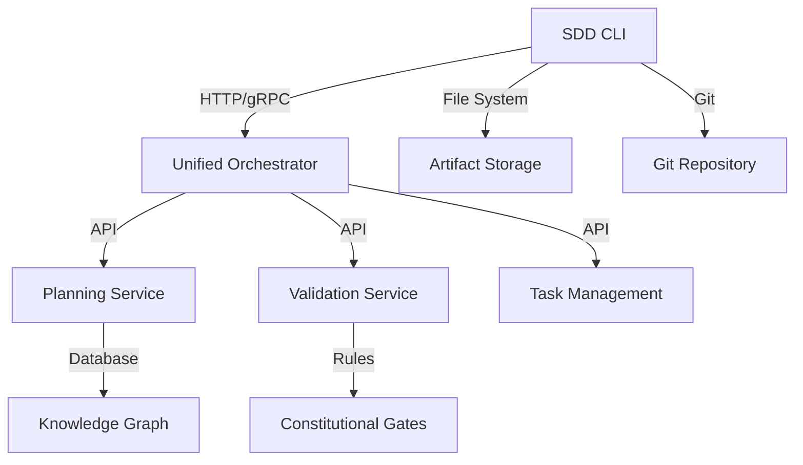
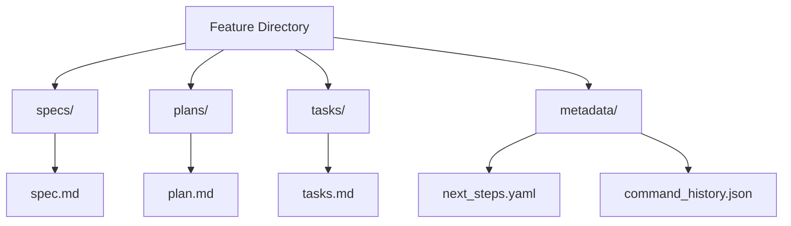

# SDD Command Line Interface

<cite>
**Referenced Files in This Document**   
- [sdd-common.sh](file://scripts/lib/sdd-common.sh)
- [test_cli_tasks_contract.py](file://tests/contract/test_cli_tasks_contract.py)
- [03-api-contracts.md](file://specs/001-specification-driven-development/implementation-details/03-api-contracts.md)
- [sdd.ts](file://extensions/alita-language-tools/src/sdd.ts)
- [models.py](file://src/sdd/models.py)
- [feature_session.py](file://src/sdd/feature_session.py)
- [constitutional_pipeline.py](file://src/sdd/constitutional_pipeline.py)
- [ladder.py](file://cortex/planner/ladder.py)
- [plan-template.md](file://templates/sdd/plan-template.md)
- [tasks-template.md](file://templates/sdd/tasks-template.md)
- [AGENTS.md](file://AGENTS.md)
- [super_alita_servicer.py](file://src/grpc_server/super_alita_servicer.py)
</cite>

## Table of Contents
1. [Introduction](#introduction)
2. [Core CLI Commands](#core-cli-commands)
3. [Command Implementation Architecture](#command-implementation-architecture)
4. [Workflow Orchestration](#workflow-orchestration)
5. [Integration with Backend Services](#integration-with-backend-services)
6. [Usage Patterns and Examples](#usage-patterns-and-examples)
7. [Relationship with SDD Components](#relationship-with-sdd-components)
8. [Common Issues and Troubleshooting](#common-issues-and-troubleshooting)
9. [Best Practices](#best-practices)
10. [Conclusion](#conclusion)

## Introduction
The SDD Command Line Interface (CLI) provides a comprehensive toolset for implementing Specification-Driven Development workflows. The CLI enables developers to create specifications, generate technical plans, manage implementation tasks, and run validations through a series of coordinated commands that integrate with the broader SDD ecosystem. This documentation details the available commands, their implementation architecture, and practical usage patterns for feature development workflows.

## Core CLI Commands

The SDD CLI provides three primary commands that form the foundation of the specification-driven development workflow: `specify`, `plan`, and `tasks`. These commands follow a sequential workflow that transforms high-level requirements into actionable implementation tasks.

### sdd specify Command
The `specify` command creates detailed specifications from user input, following the specification-driven development methodology.

```bash
sdd specify [options] "<user-input>"

Options:
  --output-file PATH     Save specification to file
  --interactive         Interactive mode with clarification prompts
  --template TEMPLATE   Use specific template (default: standard)
  --constitutional-only Validate constitutional compliance only
```

**Examples**:
```bash
# Basic specification
sdd specify "Build a chat application with real-time messaging"

# Interactive mode
sdd specify --interactive

# Save to specific file
sdd specify --output-file ./specs/chat-app.md "Real-time chat system"
```

**Section sources**
- [03-api-contracts.md](file://specs/001-specification-driven-development/implementation-details/03-api-contracts.md#L463-L485)

### sdd plan Command
The `plan` command generates a technical implementation plan from a specification file, incorporating technology recommendations and architectural decisions.

```bash
sdd plan [options] <specification-file>

Options:
  --technology TECH     Preferred technology (can be repeated)
  --output-file PATH    Save plan to file
  --phase-only PHASE    Generate specific phase only
  --constitutional-gates Enable all constitutional gates
```

**Examples**:
```bash
# Generate plan from specification
sdd plan ./specs/chat-app.md

# With technology preferences
sdd plan --technology python --technology fastapi ./specs/chat-app.md

# Constitutional validation enabled
sdd plan --constitutional-gates ./specs/chat-app.md
```

**Section sources**
- [03-api-contracts.md](file://specs/001-specification-driven-development/implementation-details/03-api-contracts.md#L487-L505)

### sdd tasks Command
The `tasks` command breaks down a technical plan into actionable implementation tasks, with options for filtering and formatting output.

```bash
sdd tasks [options] <plan-file>

Options:
  --phase PHASE         Filter by phase (can be repeated)
  --format FORMAT       Output format: list|kanban|json
  --estimate-hours     Include time estimates
  --constitutional     Include constitutional requirements
```

**Examples**:
```bash
# Generate tasks from plan
sdd tasks ./plans/chat-app.md

# Filter by phase and include estimates
sdd tasks --phase implementation --estimate-hours ./plans/chat-app.md

# Output in JSON format
sdd tasks --format json ./plans/chat-app.md
```

**Section sources**
- [03-api-contracts.md](file://specs/001-specification-driven-development/implementation-details/03-api-contracts.md#L507-L521)

## Command Implementation Architecture

The SDD CLI architecture follows a modular design that separates command parsing, workflow orchestration, and backend integration concerns. The implementation leverages both shell scripting utilities and Python-based processing components to provide a robust command-line experience.

### Command Parsing and Validation
The CLI uses a combination of shell scripts and Python modules to parse and validate commands. The `sdd-common.sh` library provides foundational utilities for command validation, including branch name validation and JSON serialization.

```bash
# Branch validation in sdd-common.sh
if [[ ! "${branch}" =~ ^[0-9]{3}- ]]; then
    echo "ERROR: Not on a feature branch. Current branch: ${branch}" >&2
    echo "Feature branches should be named like: 001-feature-name" >&2
    return 1
fi
```

The shell utilities handle basic validation and preprocessing, while more complex operations are delegated to Python modules that provide type safety and advanced data processing capabilities.

**Section sources**
- [sdd-common.sh](file://scripts/lib/sdd-common.sh#L80-L140)

### Feature Session Management
The Python implementation uses a `FeatureSession` class to manage the state and artifacts associated with a specific feature development workflow. This class coordinates the progression from specification to planning to task management.

```python
async def plan(
    self,
    *,
    technology_stack: str = "",
    constraints: dict[str, Any] | None = None,
) -> SessionArtifactResult:
    self._ensure_feature_dir()
    spec_path = self._spec_path or self.feature_dir / "spec.md"
    request = PlanRequest(
        specification_path=str(spec_path),
        technology_stack=technology_stack,
        constraints=constraints or {},
        feature_id=self.feature_id,
    )
    response = await self._pipeline.plan(request)
    self.guidance = response.next_step_guidance or self.guidance
    guidance_path = None
    if response.next_step_guidance and self.feature_dir:
        guidance_path = self._repo.save_guidance(self.feature_dir, response.next_step_guidance)
    plan_path = Path(response.plan_path)
    self._plan_path = plan_path
    artifact = self._repo.load_artifact(plan_path)
    return SessionArtifactResult(
        phase="plan",
        artifact=artifact,
        response=response,
        guidance=response.next_step_guidance,
        guidance_path=guidance_path,
    )
```

This implementation pattern ensures that each phase of the SDD workflow maintains continuity with previous phases through shared state and artifact management.

**Section sources**
- [feature_session.py](file://src/sdd/feature_session.py#L106-L134)

## Workflow Orchestration

The SDD CLI orchestrates a multi-stage workflow that transforms high-level requirements into actionable implementation tasks. This orchestration follows the LADDER architecture pattern, which provides a structured approach to AI-assisted development.

### LADDER Architecture Integration
The workflow follows the LADDER stages: Localize, Assess, Decide, Design, Execute, and Review. Each CLI command corresponds to specific stages in this architecture:

- **specify**: Localize and Assess stages
- **plan**: Decide and Design stages  
- **tasks**: Execute and Review stages

The `ladder.py` implementation demonstrates this stage-based approach:

```python
def _localize(self, user_event) -> Todo:
    """L: Localize the user request into a concrete Todo."""
    title = user_event.payload.get("query", "user task")
    desc = user_event.payload.get("context")
    t = Todo(
        title=title,
        description=(desc or ""),
        stage=LadderStage.LOCALIZE,
        exit_criteria=[ExitCriteria(description="Measurable outcome defined")],
    )
    return t
```

This architecture ensures that each phase of development builds upon the previous phase with appropriate validation and feedback loops.

**Section sources**
- [ladder.py](file://cortex/planner/ladder.py#L40-L82)

### Constitutional Validation Pipeline
The CLI integrates constitutional validation at each stage of the workflow, ensuring compliance with organizational principles and quality standards. The validation pipeline applies constitutional gates that check for compliance with core principles such as Library-First, Test-First, Simplicity, and Integration-First.

```python
# Constitutional gate validation (compliance threshold: 0.75)
if phase_result.get("compliance_score", 0.0) < 0.75:
    return pb2.SDDWorkflowResponse(
        workflow_id=request.workflow_id,
        success=False,
        error_message=f"Constitutional gate failure at {phase} phase",
        phase_results=results,
    )
```

This validation occurs at multiple levels, from shell script preconditions to Python-based compliance scoring and gRPC service enforcement.

**Section sources**
- [super_alita_servicer.py](file://src/grpc_server/super_alita_servicer.py#L252-L283)
- [AGENTS.md](file://AGENTS.md#L187-L202)

## Integration with Backend Services

The SDD CLI integrates with various backend services to provide a comprehensive development workflow. These integrations enable the CLI to leverage advanced capabilities while maintaining a simple command-line interface.

### Backend Service Architecture
The CLI interacts with several backend services that provide specialized capabilities:



**Diagram sources**
- [AGENTS.md](file://AGENTS.md#L187-L202)
- [super_alita_servicer.py](file://src/grpc_server/super_alita_servicer.py#L252-L283)

### Artifact Management
The CLI creates and manages various artifacts throughout the development workflow, storing them in a structured directory hierarchy:



This structure ensures that all artifacts are organized and discoverable, facilitating collaboration and auditability.

**Section sources**
- [feature_session.py](file://src/sdd/feature_session.py#L106-L134)
- [constitutional_pipeline.py](file://src/sdd/constitutional_pipeline.py#L245-L279)

## Usage Patterns and Examples

The SDD CLI supports various usage patterns for feature development workflows, from simple command-line operations to integrated development environment extensions.

### Standard Development Workflow
The standard workflow follows a sequential pattern from specification to implementation:

```bash
# 1. Create a feature branch
git checkout -b 001-new-feature

# 2. Create a specification
sdd specify "Implement user authentication system"

# 3. Generate a technical plan
sdd plan specs/001-new-feature.md --technology python --technology fastapi

# 4. Break down into tasks
sdd tasks plans/001-new-feature.md --estimate-hours --format kanban
```

This workflow ensures that each phase builds upon the previous phase with appropriate documentation and validation.

### VS Code Integration
The CLI functionality is also available through a VS Code extension, providing an integrated development experience:

```typescript
// VS Code extension command implementation
const defaultTasks = [
  { title: 'Project Setup', description: 'Initialize project structure and dependencies' },
  { title: 'Core Architecture', description: 'Implement main application architecture' },
  { title: 'Feature Implementation', description: 'Build core features' },
  { title: 'Testing', description: 'Add comprehensive tests' },
  { title: 'Documentation', description: 'Create user and developer documentation' },
];
```

The extension provides additional capabilities such as state persistence and quick pick interfaces for task management.

**Section sources**
- [sdd.ts](file://extensions/alita-language-tools/src/sdd.ts#L248-L285)
- [sdd.ts](file://extensions/alita-language-tools/src/sdd.ts#L52-L97)

## Relationship with SDD Components

The SDD CLI serves as the primary interface between developers and the broader SDD ecosystem, connecting various components into a cohesive development workflow.

### Template System Integration
The CLI leverages a template system to ensure consistency across specifications, plans, and tasks. These templates define the structure and content requirements for each artifact type.

```markdown
**Next Steps:**
1. Review and validate the implementation plan
2. Estimate effort for each phase
3. Proceed with `/tasks` command to break down into actionable items
```

The templates are stored in the `templates/sdd/` directory and are automatically applied based on the command being executed.

**Section sources**
- [plan-template.md](file://templates/sdd/plan-template.md#L341-L345)
- [tasks-template.md](file://templates/sdd/tasks-template.md#L468-L473)

### Planning System Integration
The CLI integrates with the planning system to generate technical implementation plans that include architecture decisions, technology recommendations, and next steps:

```python
technology_recommendations: list[str] = Field(
    default_factory=list, description="Technology stack recommendations"
)
architecture_decisions: list[str] = Field(
    default_factory=list, description="Key architectural decisions made"
)
next_steps: list[str] = Field(
    default_factory=list, description="Recommended next steps"
)
```

This integration ensures that plans are not just high-level overviews but actionable guides with specific recommendations.

**Section sources**
- [models.py](file://src/sdd/models.py#L229-L247)

## Common Issues and Troubleshooting

### Command Errors
Common command errors include invalid branch names, missing input parameters, and file path issues:

```bash
ERROR: Not on a feature branch. Current branch: main
Feature branches should be named like: 001-feature-name
```

**Solutions**:
- Ensure feature branches follow the naming convention: `[0-9]{3}-feature-name`
- Provide required input parameters for each command
- Verify file paths exist and are accessible

### Configuration Problems
Configuration issues often relate to missing or incorrect settings in the development environment:

**Solutions**:
- Verify that the SDD configuration files are properly set up
- Check that environment variables are correctly defined
- Ensure that required services are running and accessible

### Workflow Interruptions
Workflow interruptions can occur due to network issues, service outages, or validation failures:

**Solutions**:
- Implement retry logic for transient failures
- Check constitutional compliance scores and address validation failures
- Use the `--interactive` flag to guide the workflow through ambiguous situations

**Section sources**
- [sdd-common.sh](file://scripts/lib/sdd-common.sh#L80-L140)
- [super_alita_servicer.py](file://src/grpc_server/super_alita_servicer.py#L252-L283)

## Best Practices

### Feature Branch Management
Always use properly named feature branches for SDD workflows:

```bash
# Good: Properly formatted feature branch
git checkout -b 001-user-authentication

# Bad: Improperly formatted branch
git checkout -b user-auth
```

### Incremental Development
Break down large features into smaller, manageable specifications:

```bash
# Process one feature at a time
sdd specify "Implement user registration"
sdd plan specs/001-user-registration.md
sdd tasks plans/001-user-registration.md

sdd specify "Implement user login"
sdd plan specs/002-user-login.md  
sdd tasks plans/002-user-login.md
```

### Validation-First Approach
Always validate specifications and plans before proceeding to implementation:

```bash
# Validate the specification
sdd specify --constitutional-only "Implement user authentication"

# Validate the plan
sdd plan --constitutional-gates specs/001-user-auth.md

# Only proceed if validation passes
sdd tasks plans/001-user-auth.md
```

## Conclusion
The SDD Command Line Interface provides a powerful toolset for implementing specification-driven development workflows. By following the documented commands, architecture, and best practices, developers can leverage the full capabilities of the SDD ecosystem to create high-quality software efficiently. The integration with backend services, template system, and planning components ensures a consistent and validated development process from specification to implementation.