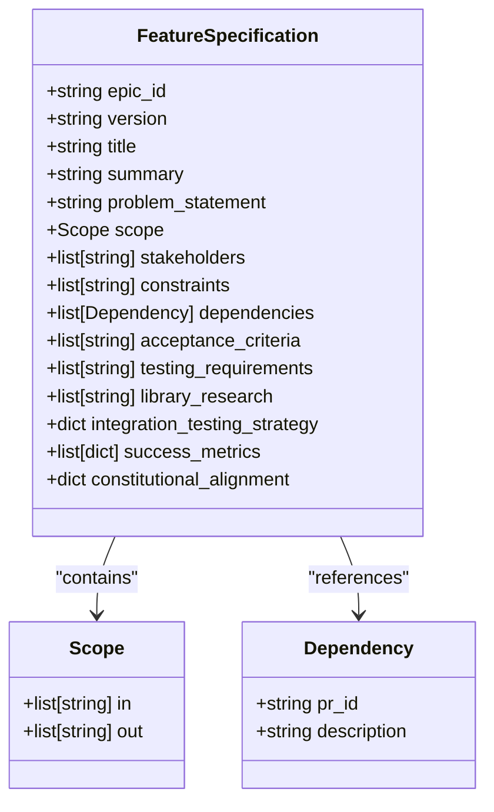
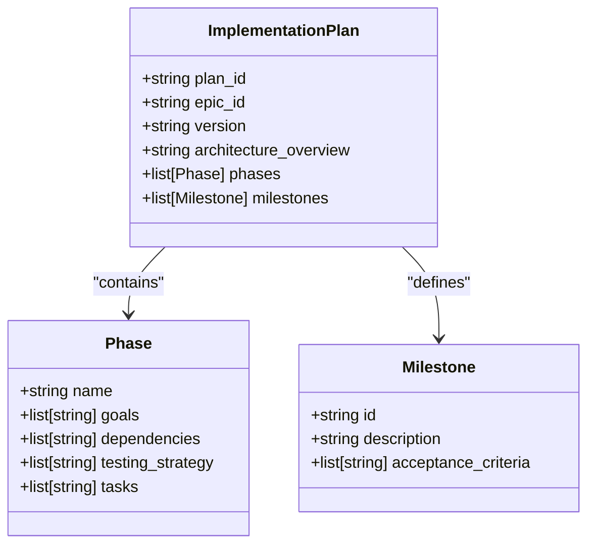
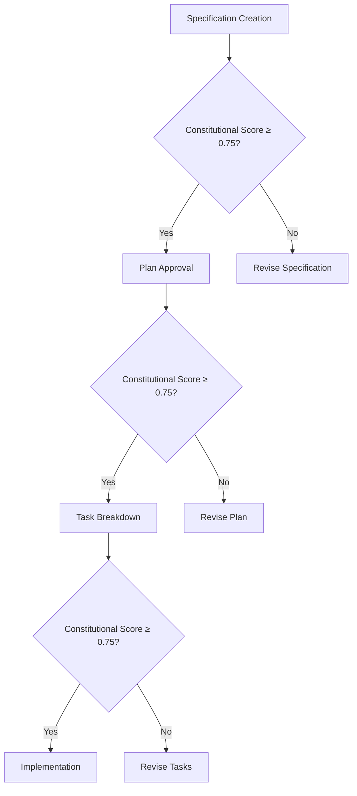
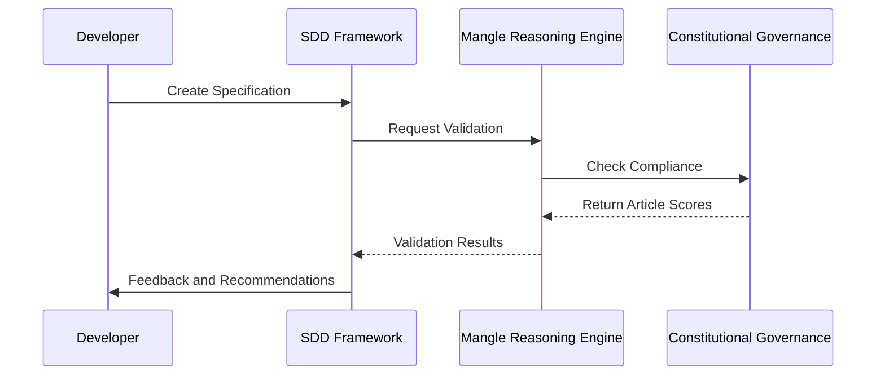

# Specification-Driven Development

<cite>
**Referenced Files in This Document**   
- [constitutional_sdd_framework.md](file://memory/sdd/constitutional_sdd_framework.md)
- [config.py](file://src/sdd/config.py)
- [spec.json](file://sdd/artifacts/advanced_debugging_and_perf/spec.json)
- [plan.json](file://sdd/artifacts/advanced_debugging_and_perf/plan.json)
- [copilot_sdd_seamless.py](file://copilot_sdd_seamless.py)
</cite>

## Table of Contents
1. [Introduction](#introduction)
2. [Core Principles of Specification-Driven Development](#core-principles-of-specification-driven-development)
3. [SDD Workflow Phases](#sdd-workflow-phases)
4. [Domain Model: Specifications, Plans, and Tasks](#domain-model-specifications-plans-and-tasks)
5. [Constitutional Integration and Validation](#constitutional-integration-and-validation)
6. [Practical Example: Advanced Debugging and Performance Optimization](#practical-example-advanced-debugging-and-performance-optimization)
7. [Integration with Mangle, Constitutional Governance, and Agent Orchestrator](#integration-with-mangle-constitutional-governance-and-agent-orchestrator)
8. [Best Practices for Writing Specifications and Implementation Plans](#best-practices-for-writing-specifications-and-implementation-plans)
9. [Common Issues and Solutions](#common-issues-and-solutions)
10. [Conclusion](#conclusion)

## Introduction
Specification-Driven Development (SDD) is a rigorous methodology that ensures feature development is aligned with organizational principles, constitutional guardrails, and quality standards. By enforcing a structured workflow from specification to validation, SDD promotes intent-driven development, clarity, and test-first practices. This document details the SDD framework as implemented in the Super-Alita system, focusing on its integration with constitutional governance, AI reasoning engines, and agent orchestration systems.

**Section sources**
- [constitutional_sdd_framework.md](file://memory/sdd/constitutional_sdd_framework.md#L0-L40)

## Core Principles of Specification-Driven Development
SDD is built on six foundational principles that guide every phase of development:

1. **Intent-Driven Development**: Specifications define the "what" before the "how", ensuring focus on user value and problem definition.
2. **Rich Specification Creation**: Leveraging templates and validation frameworks to produce high-quality, standardized specifications.
3. **Multi-Step Refinement Process**: Iterative improvement with constitutional validation at each phase transition.
4. **AI Model Capability Leverage**: Utilizing advanced AI for specification interpretation, gap analysis, and recommendations.
5. **Library-First Development**: Prioritizing existing solutions and libraries before custom implementation.
6. **Test-First Development**: Defining testable acceptance criteria before any implementation begins.

These principles are enforced through constitutional scoring and automated validation gates.

**Section sources**
- [constitutional_sdd_framework.md](file://memory/sdd/constitutional_sdd_framework.md#L0-L40)

## SDD Workflow Phases
The SDD process consists of five distinct phases, each with specific objectives, validation rules, and constitutional integration points.

### Phase 1: /specify - Specification Creation
This phase focuses on defining functional requirements without technical implementation details. Key requirements include:
- Minimum of three user stories
- Acceptance criteria in "Given-When-Then" format
- No mention of specific technologies or stacks
- Library research and alternative approach justification

**Section sources**
- [config.py](file://src/sdd/config.py#L45-L90)
- [constitutional_sdd_framework.md](file://memory/sdd/constitutional_sdd_framework.md#L42-L65)

### Phase 2: /plan - Implementation Planning
The planning phase translates specifications into technical implementation strategies. It requires:
- Clear definition of technology stack and architecture
- Reference to the original specification
- Constitutional compliance check with minimum score of 0.75
- Test strategy and coverage targets

**Section sources**
- [config.py](file://src/sdd/config.py#L45-L90)
- [constitutional_sdd_framework.md](file://memory/sdd/constitutional_sdd_framework.md#L66-L90)

### Phase 3: /tasks - Task Breakdown
This phase decomposes the implementation plan into actionable tasks with dependencies and effort estimates. Validation includes:
- Task dependency mapping
- Effort estimation realism
- Acceptance criteria for each task
- Constitutional task validation

**Section sources**
- [config.py](file://src/sdd/config.py#L45-L90)
- [constitutional_sdd_framework.md](file://memory/sdd/constitutional_sdd_framework.md#L91-L115)

### Phase 4: /implement - Implementation
The implementation phase executes tasks while maintaining alignment with the specification and plan. Key practices include:
- Continuous validation against constitutional criteria
- Regular updates to living documentation
- Integration testing before unit testing

### Phase 5: /validate - Validation
Final validation ensures all deliverables meet acceptance criteria and constitutional standards. This includes:
- Constitutional compliance scoring
- End-to-end testing
- Artifact publication and documentation linking

## Domain Model: Specifications, Plans, and Tasks
The SDD domain model consists of three core artifacts that evolve through the development lifecycle.

### Feature Specification
Defined in `spec.json`, the specification includes:
- **Epic ID and Version**: Unique identifier and version tracking
- **Problem Statement**: User stories in "As a... I want... So that..." format
- **Scope**: Clear in/out boundaries
- **Acceptance Criteria**: Testable conditions for success
- **Library Research**: Evaluation of existing solutions
- **Success Metrics**: Quantifiable outcomes

**Diagram sources**
- [spec.json](file://sdd/artifacts/advanced_debugging_and_perf/spec.json#L1-L123)

### Implementation Plan
Defined in `plan.json`, the implementation plan includes:
- **Plan ID and Epic Reference**: Links to the parent specification
- **Architecture Overview**: Technical approach and library usage
- **Phases**: High-level implementation stages
- **Milestones**: Key checkpoints with acceptance criteria

**Diagram sources**
- [plan.json](file://sdd/artifacts/advanced_debugging_and_perf/plan.json#L1-L84)

### Task Definitions
Tasks break down implementation into actionable items with:
- Task ID and phase association
- Dependencies on other tasks
- Effort estimates
- Acceptance criteria

## Constitutional Integration and Validation
SDD integrates with the constitutional governance system through six articles that serve as quality gates.

### Constitutional Articles
1. **Library-First Development**: Ensures existing solutions are evaluated before custom development
2. **Test-First Development**: Requires testable acceptance criteria for all user stories
3. **Simplicity Gate**: Enforces minimal viable scope and rejects over-engineering
4. **Integration-First Testing**: Prioritizes end-to-end scenarios over unit testing
5. **Clarity and Unambiguity**: Eliminates ambiguous requirements through standardized language
6. **Counterfactual Justification**: Documents alternative approaches and decision rationale

### Constitutional Scoring
Each specification, plan, and task is scored on a 0-1.0 scale across all six articles. The overall compliance score is calculated as the average of individual article scores. A score of ≥0.75 is required to pass each quality gate.

**Diagram sources**
- [constitutional_sdd_framework.md](file://memory/sdd/constitutional_sdd_framework.md#L200-L250)

**Section sources**
- [constitutional_sdd_framework.md](file://memory/sdd/constitutional_sdd_framework.md#L42-L250)

## Practical Example: Advanced Debugging and Performance Optimization
This section demonstrates the SDD workflow using the "Advanced Debugging and Performance Optimization" feature.

### Specification Phase
The specification (SDD-ADP-2025-09) defines enterprise-grade debugging, determinism, profiling, and deployment strategies. Key elements include:
- User stories for platform engineers, QA engineers, and developers
- Scope boundaries excluding vendor-specific hosting automation
- Acceptance criteria requiring constitutional score ≥0.75
- Library research on profiling, testing, and monitoring solutions

### Planning Phase
The implementation plan organizes work into three phases:
1. **Determinism & Debugging**: Using Python's cProfile with sandbox wrappers
2. **Profiling & Monitoring**: Integrating with existing telemetry framework
3. **Production Deployment**: Providing Kubernetes templates

Milestones require CI validation of SDD artifacts and documentation integration.

### Task Breakdown
Tasks are assigned IDs (ADP-001 to ADP-005) with dependencies and testing strategies defined for each phase.

**Section sources**
- [spec.json](file://sdd/artifacts/advanced_debugging_and_perf/spec.json#L1-L123)
- [plan.json](file://sdd/artifacts/advanced_debugging_and_perf/plan.json#L1-L84)

## Integration with Mangle, Constitutional Governance, and Agent Orchestrator
SDD is deeply integrated with core system components to ensure consistency and quality.

### Mangle Reasoning Engine Integration
The Mangle engine provides deductive reasoning for constitutional compliance checking:
- Validates that specifications avoid technical implementation details
- Checks for presence of user stories and acceptance criteria
- Ensures library research is documented
- Detects ambiguous language and contradictions

**Diagram sources**
- [copilot_sdd_seamless.py](file://copilot_sdd_seamless.py#L171-L207)
- [constitutional_sdd_framework.md](file://memory/sdd/constitutional_sdd_framework.md#L251-L270)

### Agent Orchestrator Integration
The agent orchestrator manages SDD workflow execution:
- Coordinates between specification, planning, and implementation agents
- Enforces phase dependencies and quality gates
- Tracks progress through milestones
- Integrates with CI/CD pipelines for artifact validation

## Best Practices for Writing Specifications and Implementation Plans
Effective SDD artifacts follow these best practices:

