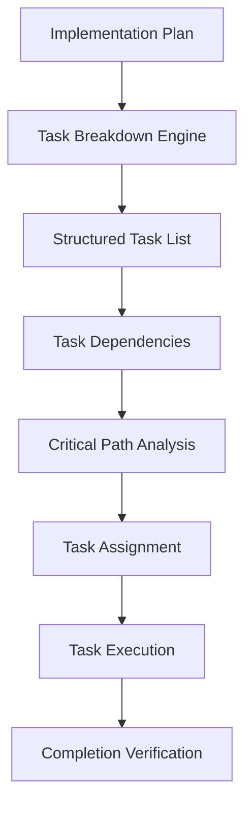
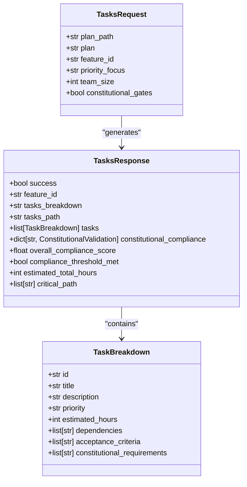
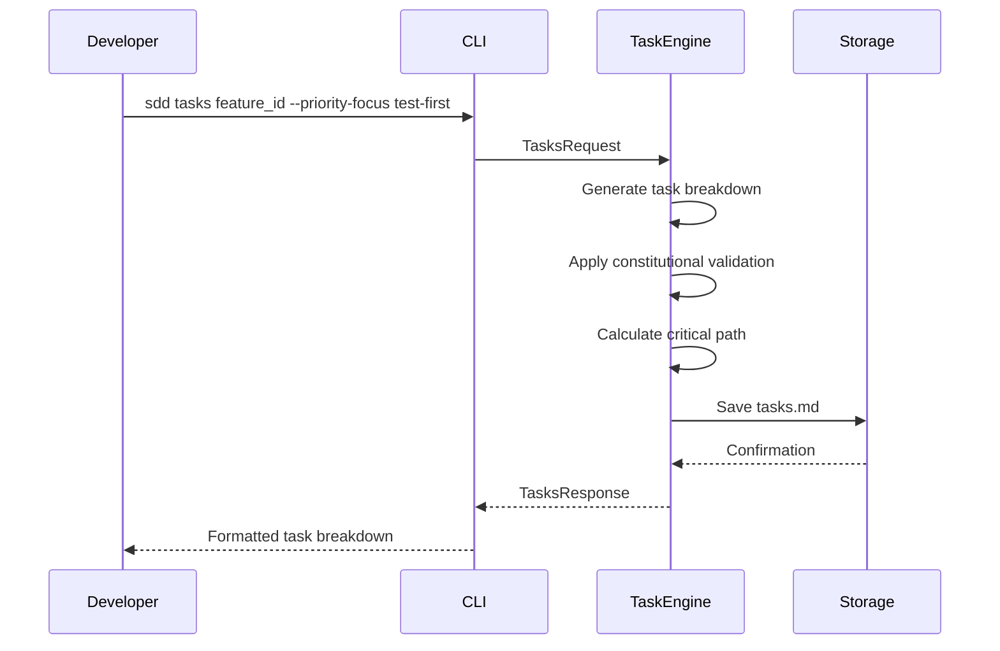
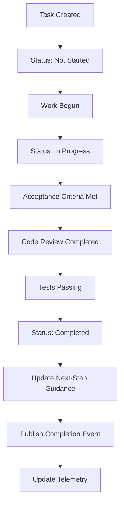
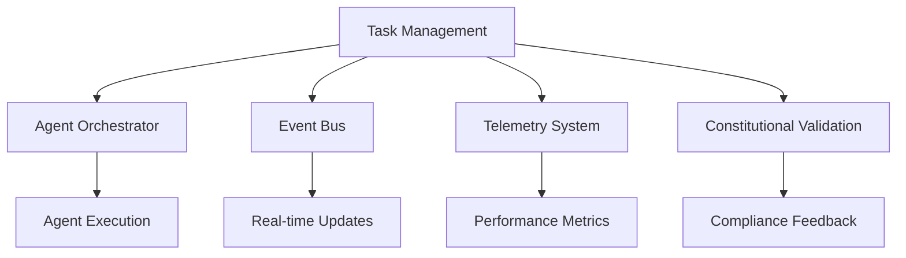

# Task Breakdown and Management

<cite>
**Referenced Files in This Document**   
- [constitutional_pipeline.py](file://src/sdd/constitutional_pipeline.py)
- [models.py](file://src/sdd/models.py)
- [tasks-template.md](file://templates/sdd/tasks-template.md)
- [test_cli_tasks_contract.py](file://tests/contract/test_cli_tasks_contract.py)
- [sdd.ts](file://extensions/alita-language-tools/src/sdd.ts)
- [advanced_debugging_and_perf.yaml](file://sdd/tasks/advanced_debugging_and_perf.yaml)
</cite>

## Table of Contents
1. [Introduction](#introduction)
2. [Task Breakdown Process](#task-breakdown-process)
3. [Task Management System Implementation](#task-management-system-implementation)
4. [Task Creation and Assignment](#task-creation-and-assignment)
5. [Task Tracking and Completion](#task-tracking-and-completion)
6. [Relationship with Other Components](#relationship-with-other-components)
7. [Common Issues and Solutions](#common-issues-and-solutions)
8. [Best Practices](#best-practices)
9. [Conclusion](#conclusion)

## Introduction
The Specification-Driven Development (SDD) framework implements a comprehensive task breakdown and management system that transforms high-level implementation plans into granular, actionable tasks with clear ownership and completion criteria. This system ensures that complex development workflows are decomposed into manageable units while maintaining constitutional compliance throughout the development lifecycle. The task management component integrates with the SDD CLI, agent orchestrator, event bus, and telemetry system to provide a cohesive development experience that emphasizes test-first development, library-first approaches, and simplicity.

**Section sources**
- [constitutional_pipeline.py](file://src/sdd/constitutional_pipeline.py#L222-L323)
- [models.py](file://src/sdd/models.py#L250-L344)

## Task Breakdown Process
The task breakdown process in the SDD framework follows a systematic approach to decompose implementation plans into actionable tasks. The process begins with the `/tasks` command, which accepts either a path to an existing plan file or raw plan content. The system then generates a detailed task breakdown that adheres to constitutional principles, ensuring each task has clear acceptance criteria and constitutional requirements.

The task breakdown engine creates structured tasks with unique identifiers, titles, descriptions, priority levels, estimated effort in hours, dependencies, acceptance criteria, and constitutional requirements. Tasks are organized into epics and phases, with dependencies explicitly defined to ensure proper sequencing. The system automatically calculates the critical path through tasks, identifying those with critical priority that must be completed to meet project deadlines.

**Diagram sources**
- [constitutional_pipeline.py](file://src/sdd/constitutional_pipeline.py#L222-L323)
- [models.py](file://src/sdd/models.py#L280-L299)

**Section sources**
- [constitutional_pipeline.py](file://src/sdd/constitutional_pipeline.py#L222-L323)
- [models.py](file://src/sdd/models.py#L280-L299)

## Task Management System Implementation
The task management system is implemented as part of the Constitutional SDD Pipeline, which handles the `/tasks` phase of the development workflow. The system uses Pydantic models to define the structure of task requests and responses, ensuring type safety and data validation. The `TasksRequest` model accepts parameters such as plan path, raw plan content, feature identifier, priority focus, team size, and whether to apply constitutional validation gates.

The `TasksResponse` model returns a comprehensive set of information including the generated tasks breakdown, path to the tasks file, structured list of tasks, constitutional compliance results, overall compliance score, estimated total hours, critical path, and recommended next steps. The system also maintains next-step guidance that tracks outstanding clarifications, required artifacts, and recommended commands throughout the development process.

**Diagram sources**
- [models.py](file://src/sdd/models.py#L250-L344)

**Section sources**
- [models.py](file://src/sdd/models.py#L250-L344)

## Task Creation and Assignment
Task creation in the SDD framework is initiated through the `/tasks` command, which can be executed via the CLI or integrated development environment. The system supports both file-based and inline plan inputs, allowing developers to work with existing implementation plans or generate tasks from raw plan content. When creating tasks, developers can specify a priority focus (test-first, library-first, or integration-first) and team size to influence task estimation and breakdown.

Task assignment is handled through the next-step guidance system, which tracks ownership of outstanding items. Each task can be assigned to a specific owner, with the system defaulting to "unassigned" if no owner is specified. The guidance system also maintains linked artifacts, constitutional gates, and status information (pending, in-progress, complete) for each task. This structured approach ensures clear ownership and accountability throughout the development process.

**Diagram sources**
- [constitutional_pipeline.py](file://src/sdd/constitutional_pipeline.py#L222-L323)
- [test_cli_tasks_contract.py](file://tests/contract/test_cli_tasks_contract.py#L47-L92)

**Section sources**
- [constitutional_pipeline.py](file://src/sdd/constitutional_pipeline.py#L222-L323)
- [test_cli_tasks_contract.py](file://tests/contract/test_cli_tasks_contract.py#L47-L92)

## Task Tracking and Completion
The SDD framework provides comprehensive task tracking capabilities through the `tasks.md` file, which contains the complete task breakdown with detailed information for each task. The system tracks task status, dependencies, and progress toward completion. Each task includes acceptance criteria that must be verified before the task can be marked as complete, ensuring quality and consistency across the development process.

The framework also integrates with the event bus to publish task-related events, enabling real-time monitoring and telemetry. When a task is completed, the system updates the next-step guidance, marking the task as complete and providing rationale for the completion. The telemetry system captures metrics such as time spent on tasks, deviation from estimated hours, and constitutional compliance scores, providing valuable insights for process improvement.

**Diagram sources**
- [sdd.ts](file://extensions/alita-language-tools/src/sdd.ts#L25-L33)
- [constitutional_pipeline.py](file://src/sdd/constitutional_pipeline.py#L222-L323)

**Section sources**
- [sdd.ts](file://extensions/alita-language-tools/src/sdd.ts#L25-L33)
- [constitutional_pipeline.py](file://src/sdd/constitutional_pipeline.py#L222-L323)

## Relationship with Other Components
The task management system is tightly integrated with other components of the SDD framework, including the agent orchestrator, event bus, and telemetry system. The agent orchestrator coordinates the execution of tasks across multiple agents, ensuring that dependencies are respected and resources are allocated efficiently. When a task is created or updated, the system publishes events to the event bus, which other components can subscribe to for real-time updates.

The telemetry system collects data on task execution, including time spent, completion rates, and constitutional compliance scores. This data is used to generate insights and recommendations for process improvement. The system also integrates with the constitutional validation engine to ensure that all tasks adhere to the six constitutional articles, providing real-time feedback on compliance and suggesting improvements when violations are detected.

**Diagram sources**
- [constitutional_pipeline.py](file://src/sdd/constitutional_pipeline.py#L222-L323)
- [models.py](file://src/sdd/models.py#L250-L344)

**Section sources**
- [constitutional_pipeline.py](file://src/sdd/constitutional_pipeline.py#L222-L323)
- [models.py](file://src/sdd/models.py#L250-L344)

## Common Issues and Solutions
The SDD framework addresses several common issues in task management, including task scope creep, incomplete task definitions, and coordination challenges. To prevent scope creep, each task has clearly defined acceptance criteria and a maximum complexity threshold. The system enforces the Simplicity Gate, which limits functions to 50 lines and cyclomatic complexity to 10, ensuring that tasks remain focused and manageable.

For incomplete task definitions, the framework uses constitutional validation to identify missing elements such as acceptance criteria, dependencies, or constitutional requirements. The system provides specific suggestions for improvement, helping developers create comprehensive task definitions. To address coordination challenges, the next-step guidance system maintains a shared understanding of outstanding items, ownership, and priorities across the development team.

The framework also includes mechanisms to handle task dependencies and critical path analysis, preventing bottlenecks and ensuring that high-priority tasks receive appropriate attention. When conflicts arise, the system provides clear visibility into dependencies and suggests optimal task ordering based on priority and constitutional requirements.

**Section sources**
- [advanced_debugging_and_perf.yaml](file://sdd/tasks/advanced_debugging_and_perf.yaml#L1-L92)
- [tasks-template.md](file://templates/sdd/tasks-template.md#L0-L473)

## Best Practices
The SDD framework promotes several best practices for effective task management in complex agent systems. First, it emphasizes test-first development by ensuring that test creation tasks precede implementation tasks in the dependency chain. This approach guarantees that testing is integrated throughout the development process rather than being an afterthought.

Second, the framework encourages library-first development by requiring research into existing solutions before implementing custom functionality. This practice reduces technical debt and leverages proven solutions. Third, the system promotes integration-first testing by requiring end-to-end validation with real environments rather than relying solely on mocks and unit tests.

Other best practices include maintaining clarity through unambiguous task descriptions and acceptance criteria, documenting counterfactual justifications for architectural decisions, and using the critical path analysis to focus efforts on high-impact tasks. The framework also recommends regular review of constitutional compliance scores and adjustment of task priorities based on team capacity and project goals.

**Section sources**
- [advanced_debugging_and_perf.yaml](file://sdd/tasks/advanced_debugging_and_perf.yaml#L1-L92)
- [tasks-template.md](file://templates/sdd/tasks-template.md#L0-L473)

## Conclusion
The task breakdown and management component of the Specification-Driven Development framework provides a comprehensive solution for decomposing complex implementation plans into manageable tasks with clear ownership and completion criteria. By integrating constitutional validation, dependency management, and telemetry collection, the system ensures that development workflows are efficient, transparent, and aligned with quality principles. The framework's emphasis on test-first development, library-first approaches, and simplicity helps prevent common issues such as scope creep and incomplete task definitions while promoting best practices for effective task management in complex agent systems.