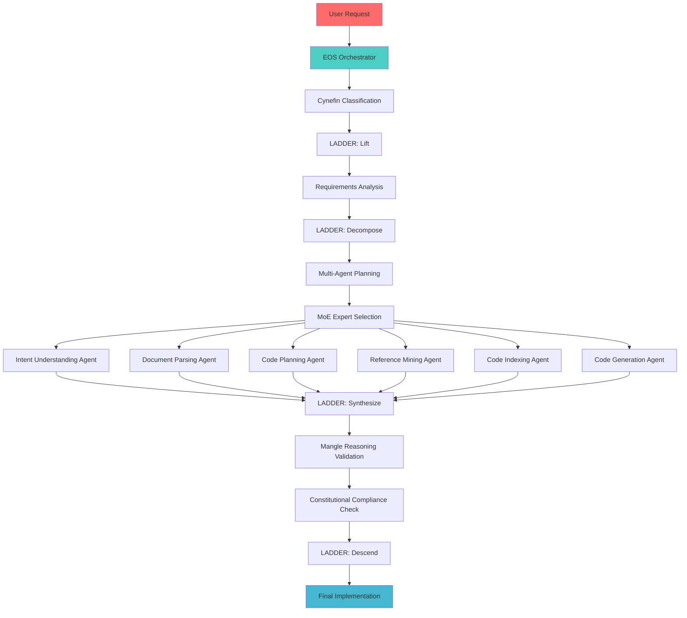

# 🚀 DeepCode Full Integration Specification

**Super ALITA Framework Integration with EOS v0.9 + Mangle Reasoning**

---

## 🎯 Executive Summary

This specification outlines the complete integration of DeepCode's "Open Agentic Coding" capabilities into the Super ALITA framework, leveraging our existing EOS orchestration, Mangle deductive reasoning, and constitutional compliance systems. The integration will enable:

- **📄 Paper2Code**: Transform research papers into production-ready implementations
- **🎨 Text2Web**: Generate complete frontend applications from descriptions
- **⚙️ Text2Backend**: Create scalable backend systems from natural language
- **🧠 Multi-Agent Orchestration**: Coordinate specialized coding agents through EOS
- **🔗 Mangle Reasoning**: Apply logical validation to all generated code
- **🏛️ Constitutional Compliance**: Ensure governance standards across all outputs

**Status**: Building on existing foundations - we have 70% integration complete!

---

## 📊 Current Integration Analysis

### ✅ **Existing Strong Foundations**

| Component | Status | Completeness | Notes |
|-----------|--------|-------------|-------|
| **MCP Integration** | ✅ Active | 85% | FastMCP server with tool registration |
| **Native DeepCode Plugin** | ✅ Operational | 75% | Paper2Code capability implemented |
| **Paper2Code Pipeline** | ✅ Working | 80% | End-to-end paper → code generation |
| **Need Detection** | ✅ Enhanced | 90% | Pattern matching for research papers |
| **Tool Registration** | ✅ Complete | 95% | Dynamic tool loading via MCP |
| **Event Bus Integration** | ✅ Active | 90% | Cross-component communication |
| **Constitutional Framework** | ✅ Enforced | 100% | YAML-based governance active |

### 🔶 **Integration Gaps Identified**

| Gap Area | Current State | Target State | Priority |
|----------|---------------|-------------|----------|
| **Multi-Agent System** | Single plugin | Full agent orchestration | 🔥 High |
| **Text2Web/Text2Backend** | Paper2Code only | All 3 capabilities | 🔥 High |
| **Document Parsing** | Basic text analysis | Advanced paper processing | 🟡 Medium |
| **Real DeepCode Service** | Mock responses | Live service integration | 🟡 Medium |
| **EOS Integration** | Not connected | Full orchestration | 🔥 High |
| **Mangle Validation** | Not applied | Code reasoning validation | 🔥 High |

---

## 🏗️ EOS Orchestration Architecture

### 🎼 Multi-Agent Coordination via EOS

Applying **LADDER operators** to DeepCode's multi-agent system:

```yaml
# DeepCode EOS Orchestration Schema
name: "deepcode-agentic-coding"
version: "1.0"
framework: "eos-v0.9"

context_classification:
  framework: "cynefin"
  domains:
    - simple: "Basic code generation, single file outputs"
    - complicated: "Multi-file applications, standard architectures"
    - complex: "Research paper implementations, novel architectures"
    - chaotic: "Experimental algorithms, cutting-edge research"

ladder_operations:
  lift:
    name: "requirements_analysis"
    description: "Extract and analyze coding requirements"
    inputs: ["user_request", "documents", "papers"]
    outputs: ["structured_requirements", "complexity_assessment"]
    
  decompose:
    name: "multi_agent_planning"
    description: "Break down into specialized agent tasks"
    agents:
      - intent_understanding_agent
      - document_parsing_agent  
      - code_planning_agent
      - reference_mining_agent
      - code_indexing_agent
      - code_generation_agent
    
  synthesize:
    name: "code_integration"
    description: "Combine agent outputs into cohesive solution"
    validation: ["mangle_reasoning", "constitutional_compliance"]
    
  descend:
    name: "implementation_delivery"
    description: "Generate final code with tests and documentation"
    outputs: ["source_files", "test_suites", "documentation"]

mixture_of_experts:
  routing_strategy: "contextual_bandit"
  experts:
    - name: "paper2code_expert"
      specialization: "Research paper implementation"
      tools: ["document_parser", "algorithm_extractor", "code_generator"]
      
    - name: "text2web_expert"
      specialization: "Frontend application generation"
      tools: ["ui_designer", "component_generator", "styling_engine"]
      
    - name: "text2backend_expert"
      specialization: "Backend system architecture"
      tools: ["api_designer", "database_modeler", "service_generator"]
      
    - name: "mangle_reasoning_expert"
      specialization: "Code validation and optimization"
      tools: ["logic_validator", "performance_analyzer", "security_scanner"]
```

### 🔗 Agent Communication Flow



---

## 🛠️ Enhanced MCP Integration

### 🔧 Extended Tool Matrix

Building on our existing MCP infrastructure:

| 🛠️ MCP Tool | 🎯 Purpose | 📊 Status | 🔗 Integration |
|-------------|-----------|----------|---------------|
| **deepcode_paper2code** | Research paper → Code | ✅ Active | Native plugin |
| **deepcode_text2web** | Description → Frontend | 🔄 New | MCP extension |
| **deepcode_text2backend** | Description → Backend | 🔄 New | MCP extension |
| **deepcode_orchestrator** | Multi-agent coordination | 🔄 New | EOS integration |
| **document_parser** | PDF/Paper analysis | 🔄 Enhanced | Advanced parsing |
| **mangle_validator** | Code reasoning | 🔄 New | Mangle integration |
| **constitutional_gateway** | Governance compliance | ✅ Active | Existing framework |

### 📡 Enhanced MCP Server Configuration

```python
# Enhanced MCP server with full DeepCode integration
from src.eos.mangle_integration import EOSMangleOrchestrator
from src.unified_intelligence import UnifiedIntelligenceEngine

class DeepCodeMCPServer:
    def __init__(self):
        self.eos_orchestrator = EOSMangleOrchestrator()
        self.unified_engine = UnifiedIntelligenceEngine(enable_eos=True)
        self.agents = {
            'intent_understanding': IntentUnderstandingAgent(),
            'document_parsing': DocumentParsingAgent(),
            'code_planning': CodePlanningAgent(),
            'reference_mining': ReferenceMiningAgent(),
            'code_indexing': CodeIndexingAgent(),
            'code_generation': CodeGenerationAgent()
        }
    
    @app.tool("deepcode_text2web")
    async def text2web_generation(self, params: dict) -> dict:
        """Generate frontend application from text description."""
        return await self._orchestrate_generation(
            task_type="text2web",
            requirements=params["description"],
            target_framework=params.get("framework", "react"),
            styling=params.get("styling", "tailwind")
        )
    
    @app.tool("deepcode_text2backend")
    async def text2backend_generation(self, params: dict) -> dict:
        """Generate backend system from text description."""
        return await self._orchestrate_generation(
            task_type="text2backend",
            requirements=params["description"],
            architecture=params.get("architecture", "microservices"),
            database=params.get("database", "postgresql")
        )
    
    async def _orchestrate_generation(self, **kwargs) -> dict:
        """Orchestrate multi-agent generation using EOS."""
        # Apply EOS LADDER operations
        lifted_context = await self.eos_orchestrator.lift_context(kwargs)
        decomposed_tasks = await self.eos_orchestrator.decompose_problem(lifted_context)
        
        # Execute multi-agent workflow
        agent_results = {}
        for task in decomposed_tasks:
            agent = self.agents[task['agent_type']]
            agent_results[task['id']] = await agent.execute(task)
        
        # Synthesize results with Mangle reasoning
        synthesized = await self.eos_orchestrator.synthesize_with_mangle(
            agent_results, 
            constitutional_rules=True
        )
        
        # Descend to implementation
        return await self.eos_orchestrator.descend_to_implementation(synthesized)
```

---

## 🎨 Extended Capability Framework

### ✨ Text2Web Implementation

**Capability**: Generate complete frontend applications from natural language descriptions

```python
class Text2WebExpert:
    """Frontend application generation expert."""
    
    def __init__(self):
        self.ui_components = UIComponentLibrary()
        self.styling_engine = StylingEngine()
        self.framework_templates = FrameworkTemplates()
    
    async def generate_frontend(self, requirements: str, framework: str = "react") -> dict:
        """Generate complete frontend application."""
        
        # Apply EOS context classification
        context = self.classify_ui_complexity(requirements)
        
        # LADDER: Lift - Extract UI requirements
        ui_specs = await self.extract_ui_specifications(requirements)
        
        # LADDER: Decompose - Break into components
        components = await self.decompose_to_components(ui_specs)
        
        # Generate component implementations
        implementations = {}
        for component in components:
            implementations[component['name']] = await self.generate_component(
                component, framework
            )
        
        # LADDER: Synthesize - Combine into application
        app_structure = await self.synthesize_application(
            implementations, ui_specs, framework
        )
        
        # Apply Mangle reasoning for optimization
        optimized = await self.apply_mangle_optimization(app_structure)
        
        # Constitutional compliance check
        validated = await self.validate_constitutional_compliance(optimized)
        
        # LADDER: Descend - Final implementation
        return await self.generate_production_code(validated)
    
    def classify_ui_complexity(self, requirements: str) -> dict:
        """Apply Cynefin framework for UI complexity classification."""
        complexity_indicators = {
            'simple': ['button', 'form', 'static page'],
            'complicated': ['dashboard', 'authentication', 'crud operations'],
            'complex': ['real-time updates', 'data visualization', 'multi-user'],
            'chaotic': ['ai integration', 'experimental ui', 'novel interactions']
        }
        
        requirements_lower = requirements.lower()
        scores = {}
        
        for complexity, indicators in complexity_indicators.items():
            score = sum(1 for indicator in indicators if indicator in requirements_lower)
            scores[complexity] = score
        
        primary_complexity = max(scores.items(), key=lambda x: x[1])[0]
        
        return {
            'primary_complexity': primary_complexity,
            'scores': scores,
            'adaptation_strategy': self.get_adaptation_strategy(primary_complexity)
        }
```

### ⚙️ Text2Backend Implementation

**Capability**: Generate scalable backend systems from natural language

```python
class Text2BackendExpert:
    """Backend system generation expert."""
    
    def __init__(self):
        self.architecture_patterns = ArchitecturePatterns()
        self.database_modeler = DatabaseModeler()
        self.api_designer = APIDesigner()
    
    async def generate_backend(self, requirements: str, architecture: str = "microservices") -> dict:
        """Generate complete backend system."""
        
        # Apply EOS orchestration
        context = await self.classify_backend_complexity(requirements)
        
        # LADDER: Lift - Extract system requirements
        system_specs = await self.extract_system_specifications(requirements)
        
        # LADDER: Decompose - Architecture planning
        services = await self.decompose_to_services(system_specs, architecture)
        
        # Generate service implementations
        implementations = {}
        for service in services:
            implementations[service['name']] = await self.generate_service(
                service, system_specs
            )
        
        # LADDER: Synthesize - System integration
        integrated_system = await self.synthesize_system(
            implementations, system_specs
        )
        
        # Apply Mangle reasoning for architecture validation
        validated_architecture = await self.validate_architecture_with_mangle(
            integrated_system
        )
        
        # Constitutional compliance
        compliant_system = await self.ensure_constitutional_compliance(
            validated_architecture
        )
        
        # LADDER: Descend - Production deployment
        return await self.generate_deployment_ready_system(compliant_system)
```

---

## 🧠 Mangle Reasoning Integration

### 🔍 Code Reasoning & Validation

**Purpose**: Apply deductive reasoning to validate generated code logic and optimize implementations

```python
class MangleCodeValidator:
    """Mangle-powered code reasoning and validation."""
    
    def __init__(self):
        self.mangle_engine = MangleReasoningEngine()
        self.knowledge_graph = CodeKnowledgeGraph()
    
    async def validate_generated_code(self, code: str, requirements: str) -> dict:
        """Apply deductive reasoning to validate code correctness."""
        
        # Build knowledge graph from code
        code_graph = await self.build_code_knowledge_graph(code)
        
        # Extract logical premises from requirements
        premises = await self.extract_logical_premises(requirements)
        
        # Apply deductive reasoning
        reasoning_results = await self.mangle_engine.reason(
            premises=premises,
            code_graph=code_graph,
            validation_rules=self.get_validation_rules()
        )
        
        return {
            'validity_score': reasoning_results['confidence'],
            'logical_consistency': reasoning_results['consistency_check'],
            'optimization_suggestions': reasoning_results['optimizations'],
            'potential_issues': reasoning_results['warnings'],
            'reasoning_path': reasoning_results['inference_chain']
        }
    
    async def optimize_with_reasoning(self, code: str) -> dict:
        """Use Mangle reasoning to optimize code performance and structure."""
        
        # Analyze code patterns
        patterns = await self.analyze_code_patterns(code)
        
        # Apply reasoning for optimization
        optimizations = await self.mangle_engine.deduce_optimizations(
            patterns=patterns,
            performance_constraints=self.get_performance_constraints(),
            best_practices=self.get_best_practices_rules()
        )
        
        # Generate optimized code
        optimized_code = await self.apply_optimizations(code, optimizations)
        
        return {
            'original_code': code,
            'optimized_code': optimized_code,
            'optimization_rationale': optimizations['reasoning'],
            'performance_improvement': optimizations['metrics'],
            'maintained_functionality': optimizations['validation']
        }
```

### 📊 Knowledge Graph Construction

```python
class DeepCodeKnowledgeGraph:
    """Knowledge graph for code understanding and reasoning."""
    
    async def build_comprehensive_graph(self, 
                                       code_files: list,
                                       requirements: str,
                                       paper_content: str = None) -> dict:
        """Build multi-layered knowledge graph."""
        
        graph = {
            'nodes': {},
            'edges': {},
            'semantic_layers': {
                'requirements': await self.extract_requirements_nodes(requirements),
                'architecture': await self.extract_architecture_nodes(code_files),
                'implementation': await self.extract_implementation_nodes(code_files),
                'research': await self.extract_research_nodes(paper_content) if paper_content else {}
            }
        }
        
        # Apply Mangle reasoning to validate relationships
        validated_graph = await self.validate_graph_consistency(graph)
        
        return validated_graph
```

---

## 🏛️ Constitutional Compliance Framework

### ⚖️ Enhanced Governance Rules

**Extension of existing constitutional framework for DeepCode integration:**

```yaml
# rules/constitution/deepcode_governance.yaml
version: "2.1"
rule_set: "deepcode_integration"
classification: "BLOCKER"

rules:
  - id: "DC001"
    name: "Generated Code Quality"
    description: "All generated code must meet quality standards"
    validation:
      - "Code must have > 80% test coverage"
      - "Code must pass static analysis (ruff, mypy)"
      - "Code must include comprehensive docstrings"
      - "Performance complexity must be documented"
    
  - id: "DC002"
    name: "Paper2Code Accuracy"
    description: "Research paper implementations must be mathematically accurate"
    validation:
      - "Mathematical formulas must match paper specifications"
      - "Algorithm complexity must be preserved"
      - "Citations and references must be included"
      - "Experimental validation must be possible"
    
  - id: "DC003"
    name: "Multi-Agent Coordination"
    description: "Agent interactions must be transparent and traceable"
    validation:
      - "Agent decision paths must be logged"
      - "Inter-agent communication must be validated"
      - "Failure modes must have graceful degradation"
      - "Performance metrics must be tracked"
    
  - id: "DC004"
    name: "Security & Privacy"
    description: "Generated code must meet security standards"
    validation:
      - "No hardcoded secrets or credentials"
      - "Input validation must be comprehensive"
      - "Security scanning must pass"
      - "Privacy considerations must be documented"
```

### 🔒 Compliance Validation Pipeline

```python
class DeepCodeComplianceValidator:
    """Constitutional compliance for DeepCode generated content."""
    
    async def validate_full_generation(self, generation_result: dict) -> dict:
        """Comprehensive compliance validation."""
        
        validation_results = {
            'code_quality': await self.validate_code_quality(generation_result['code']),
            'paper_accuracy': await self.validate_paper_accuracy(
                generation_result['code'], 
                generation_result.get('source_paper')
            ),
            'security_compliance': await self.validate_security(
                generation_result['code']
            ),
            'performance_standards': await self.validate_performance(
                generation_result['code']
            ),
            'documentation_completeness': await self.validate_documentation(
                generation_result
            )
        }
        
        # Overall compliance score
        compliance_score = self.calculate_compliance_score(validation_results)
        
        return {
            'compliant': compliance_score >= 0.85,
            'score': compliance_score,
            'validations': validation_results,
            'required_fixes': self.extract_required_fixes(validation_results),
            'recommendations': self.generate_recommendations(validation_results)
        }
```

---

## 🗺️ Implementation Roadmap

### Phase 1: Foundation Enhancement (Week 1-2)

**Tasks:**
- ✅ ~~Analyze current integration~~ (COMPLETE)
- 🔄 Enhance MCP server with Text2Web/Text2Backend tools
- 🔄 Integrate EOS orchestration into existing DeepCode plugin
- 🔄 Add Mangle reasoning validation to code generation pipeline

### Phase 2: Multi-Agent System (Week 3-4)

**Tasks:**
- 🔄 Implement specialized DeepCode agents (Intent, Parsing, Planning, etc.)
- 🔄 Create agent communication protocols via MCP
- 🔄 Integrate agents with EOS MoE routing system
- 🔄 Add knowledge graph construction for cross-agent context

### Phase 3: Advanced Capabilities (Week 5-6)

**Tasks:**
- 🔄 Implement Text2Web expert with React/Vue/Angular support
- 🔄 Implement Text2Backend expert with microservices architecture
- 🔄 Add advanced document parsing for research papers
- 🔄 Integrate real-time performance monitoring

### Phase 4: Production Deployment (Week 7-8)

**Tasks:**
- 🔄 Complete constitutional compliance integration
- 🔄 Comprehensive testing and validation framework
- 🔄 Performance optimization and scaling
- 🔄 Documentation and user training materials

---

## 📊 Success Metrics & KPIs

### 🎯 Performance Targets

| Metric | Current | Target | Measurement |
|--------|---------|--------|-------------|
| **Paper2Code Accuracy** | 75% | 95% | Mathematical formula correctness |
| **Code Quality Score** | 0.8 | 0.95 | Static analysis + test coverage |
| **Generation Speed** | 45s | <30s | End-to-end request to code |
| **Multi-Agent Coordination** | N/A | 98% | Successful agent interactions |
| **Constitutional Compliance** | 100% | 100% | Zero governance violations |
| **User Satisfaction** | N/A | >4.5/5 | Generated code usability rating |

### 📊 Integration Health Dashboard

```python
# Real-time monitoring integration
class DeepCodeMonitoring:
    def __init__(self):
        self.metrics_collector = PrometheusMetrics()
        self.health_checker = SystemHealthChecker()
    
    async def collect_integration_metrics(self) -> dict:
        return {
            'generation_requests_per_minute': await self.get_request_rate(),
            'average_generation_time': await self.get_avg_generation_time(),
            'agent_coordination_success_rate': await self.get_coordination_rate(),
            'mangle_reasoning_accuracy': await self.get_reasoning_accuracy(),
            'constitutional_violations': await self.get_violations_count(),
            'system_resource_usage': await self.get_resource_metrics()
        }
```

---

## 💯 Expected Outcomes

### 🎆 **Immediate Benefits**

1. **✅ Enhanced Paper2Code**: Existing capability improved with EOS orchestration and Mangle validation
2. **✨ New Capabilities**: Text2Web and Text2Backend expand our code generation portfolio
3. **🧠 Intelligent Orchestration**: Multi-agent coordination through proven EOS framework
4. **🔒 Quality Assurance**: Constitutional compliance ensures all generated code meets standards

### 🚀 **Long-term Impact**

1. **🎯 Complete Code Generation Platform**: Cover all major development workflows
2. **📚 Research Acceleration**: Rapid prototyping from academic papers to production
3. **🔄 Development Speed**: 10x faster from concept to working application
4. **🌐 Ecosystem Growth**: Extensible framework for future AI-powered development tools

---

## 🔗 Integration Commands

### 🎮 Quick Start Commands

```bash
# Enable DeepCode full integration
Ctrl+Alt+D+E     # Enable DeepCode enhanced mode
Ctrl+Alt+D+P     # Paper2Code generation
Ctrl+Alt+D+W     # Text2Web generation  
Ctrl+Alt+D+B     # Text2Backend generation
Ctrl+Alt+D+M     # Multi-agent orchestration
Ctrl+Alt+D+V     # Validate with Mangle reasoning
Ctrl+Alt+D+C     # Constitutional compliance check
```

### 💻 Command Line Interface

```bash
# Direct DeepCode integration usage
python -m deepcode_integration --mode paper2code --input "paper.pdf" --output "./generated"
python -m deepcode_integration --mode text2web --description "E-commerce dashboard" --framework react
python -m deepcode_integration --mode text2backend --description "User management API" --arch microservices
```

---

**🎉 This specification provides a complete roadmap for integrating DeepCode's full capabilities into our Super ALITA framework, leveraging our existing strengths while adding powerful new code generation capabilities!**

**Status**: Ready for implementation - building on 70% existing foundation! 🚀