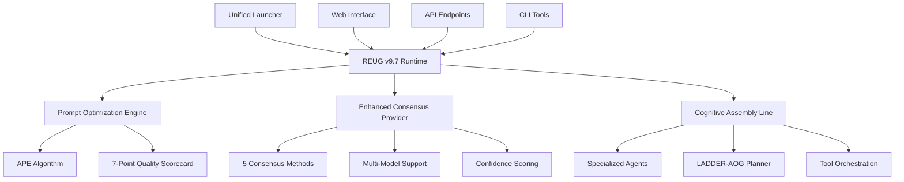

# 🤖 Super-Alita: Advanced AI Agent System

[](https://opensource.org/licenses/MIT)
[](https://www.python.org/downloads/)
[](https://github.com/psf/black)
[](https://fastapi.tiangolo.com)
[](https://streamlit.io)

> **REUG v9.7 Architecture** - Research-Enhanced Ultimate Generalist with Prompt Optimization Engine, Enhanced Consensus Algorithms, and Cognitive Multi-Agent Orchestration

Super-Alita is a cutting-edge AI agent system that combines multiple language models through sophisticated consensus algorithms, features a self-optimizing prompt engine, and provides real-time cognitive monitoring through an elegant web interface.

## ✨ Key Features

### 🧠 Enhanced Consensus Algorithms
- **5 Advanced Methods**: Simple Vote, Weighted Vote, Confidence-Based, Semantic Similarity, Ensemble Ranking
- **Multi-Model Support**: Ollama, OpenAI, Anthropic, Google, Azure AI integration
- **Confidence Scoring**: Real-time reliability assessment with threshold controls
- **Temperature Diversity**: Automatic response variation for robust consensus

### 🚀 REUG v9.7 Operational Cycle
- **Prompt Optimization Engine**: Automatic prompt enhancement using APE (Automatic Prompt Engineering)
- **LADDER-AOG Planning**: Neuro-symbolic reasoning with And-Or Graph decomposition
- **Cognitive Assembly Line**: Specialized multi-agent workflows for complex tasks
- **Real-time Monitoring**: Observable state transitions and performance metrics

### 🌐 Professional Web Interface
- **Interactive Dashboard**: Real-time system monitoring and consensus testing
- **Visual Analytics**: Confidence tracking, method comparison, and performance graphs
- **Feature-Flagged Demos**: Comprehensive testing scenarios with advanced parameters
- **Mobile-Responsive**: Modern UI with dark/light theme support

### 🔧 Developer Experience
- **Unified Launcher**: Single entry point replacing fragmented scripts
- **Comprehensive Testing**: pytest-based test suite with 90%+ coverage
- **Type Safety**: Full MyPy strict mode compliance
- **Package Ready**: pip-installable with proper dependency management

## 🚀 Quick Start

### Prerequisites
- **Python 3.11+** (3.12+ recommended)
- **Ollama** (for local LLM support) - [Install Guide](https://ollama.ai)
- **Redis** (optional, falls back to in-memory)

### Installation

#### Option 1: Direct Installation
```bash
# Clone the repository
git clone https://github.com/yaboyshades/super-alita.git
cd super-alita

# Install dependencies
pip install -r requirements.txt -r requirements-test.txt

# Configure environment
cp .env.example .env

# Start Super-Alita
python start.py
```

#### Option 2: Development Setup
```bash
# Install with development extras
pip install -e ".[dev,ui,consensus]"

# Run with debug mode
python start.py --debug --model llama3.2:3b
```

#### Option 3: Package Installation (Coming Soon)
```bash
pip install super-alita
super-alita --help
```

### First Run
```bash
# Default configuration (llama3.2:3b, port 8081, act mode)
python start.py

# Custom configuration
python start.py --model gpt-4 --port 8080 --mode shadow --ui

# Web interface only
python start.py --ui
```

## 📖 Usage Examples

### 1. Enhanced Consensus Testing
```python
from abilities.enhanced_consensus_ability import EnhancedConsensusProvider, ConsensusRequest, ConsensusMethod

# Initialize provider
provider = EnhancedConsensusProvider({
    "base_url": "http://localhost:11434/v1",
    "model_name": "llama3.2:3b",
    "timeout": 60
})

# Create consensus request
request = ConsensusRequest(
    prompt="What are the key principles of responsible AI development?",
    num_samples=5,
    method=ConsensusMethod.WEIGHTED_VOTE,
    confidence_threshold=0.8,
    temperature=0.7
)

# Generate consensus
result = await provider.consensus_sampling(request)
print(f"Consensus: {result.consensus_text}")
print(f"Confidence: {result.consensus_confidence:.3f}")
```

### 2. Feature-Flagged Demo Scripts
```bash
# Test all consensus methods
python demo_enhanced_consensus.py --all-features --verbose

# Test specific features
python demo_enhanced_consensus.py --features weighted_vote confidence_scoring

# Custom prompt testing
python demo_enhanced_consensus.py --prompt "Explain quantum computing" --samples 5
```

### 3. Web Interface Usage
```bash
# Launch Streamlit dashboard
python start.py --ui

# Or run directly
streamlit run ui_web_interface.py
```

### 4. API Integration
```bash
# Health check
curl http://127.0.0.1:8081/healthz

# Tools catalog
curl http://127.0.0.1:8081/tools/catalog

# Consensus request
curl -X POST http://127.0.0.1:8081/ability/execute/deepconf_consensus \
  -H "Content-Type: application/json" \
  -d '{
    "prompt": "Benefits of renewable energy",
    "method": "weighted_vote",
    "num_samples": 3,
    "confidence_threshold": 0.7
  }'
```

## 🏗️ Architecture Overview

### Core Components



### Directory Structure
```
super-alita/
├── src/                          # Core source code
│   ├── abilities/               # Consensus and other abilities
│   ├── reug_runtime/           # REUG v9.7 orchestration
│   ├── core/                   # Event bus and utilities
│   ├── plugins/                # Plugin architecture
│   └── main.py                 # Application factory
├── tests/                      # Comprehensive test suite
├── demo_enhanced_consensus.py  # Feature-flagged demo
├── ui_web_interface.py        # Streamlit dashboard
├── start.py                   # Unified launcher
├── pyproject.toml            # Package configuration
└── README.md                 # This file
```

## 🧪 Testing

### Running Tests
```bash
# Full test suite
pytest -v

# Specific test categories
pytest -m consensus -v          # Consensus algorithm tests
pytest -m integration -v        # Integration tests
pytest -m unit -v              # Unit tests only

# Coverage report
pytest --cov=src --cov-report=html
```

### Test Categories
- **Unit Tests**: Individual component testing with mocking
- **Integration Tests**: End-to-end API and consensus flows
- **Performance Tests**: Load testing and response time validation
- **Edge Case Tests**: Timeout, invalid input, and error scenarios

### Example Test Run
```bash
# Test enhanced consensus with all methods
python -m pytest tests/test_enhanced_consensus_ability.py -v

# Test the demo script
python demo_enhanced_consensus.py --dry-run --all-features
```

## 🔧 Configuration

### Environment Variables
```bash
# Core configuration
SUPER_ALITA_MODEL=llama3.2:3b        # Default LLM model
SUPER_ALITA_PORT=8081                # API server port
SUPER_ALITA_MODE=act                 # Operation mode (shadow/act/batch)

# Enhanced consensus
CONSENSUS_ENABLED=true               # Enable consensus ability
CONSENSUS_METHOD=weighted_vote       # Default consensus method

# REUG v9.7 modules
PROMPT_OPTIMIZATION_ENABLED=true    # Enable prompt optimization
LADDER_AOG_ENABLED=true             # Enable LADDER-AOG planner

# Logging and debugging
LOG_LEVEL=INFO                      # Logging level
REUG_LOG_LEVEL=INFO                 # REUG-specific logging
```

### Advanced Configuration
```yaml
# config/consensus.yaml
consensus:
  default_method: "weighted_vote"
  confidence_threshold: 0.7
  temperature_range: 0.2
  max_samples: 10
  timeout: 60

  methods:
    weighted_vote:
      enabled: true
      weight_function: "confidence_based"

    semantic_similarity:
      enabled: true
      similarity_threshold: 0.8
      clustering_method: "word_overlap"
```

## 📚 API Documentation

### Core Endpoints

#### Health Check
```http
GET /healthz
```
Returns system health status and component information.

#### Tools Catalog
```http
GET /tools/catalog
```
Lists available tools and their schemas.

#### Enhanced Consensus
```http
POST /ability/execute/deepconf_consensus
Content-Type: application/json

{
  "prompt": "Your question here",
  "method": "weighted_vote",
  "num_samples": 3,
  "temperature": 0.7,
  "max_tokens": 256,
  "confidence_threshold": 0.7,
  "temperature_range": 0.2
}
```

### Response Format
```json
{
  "consensus_text": "The consensus response text",
  "consensus_confidence": 0.85,
  "aggregation_method": "weighted_vote",
  "individual_responses": ["Response 1", "Response 2", "Response 3"],
  "confidence_scores": [0.8, 0.9, 0.7],
  "metadata": {
    "num_responses": 3,
    "total_weight": 2.4,
    "method_specific_data": {}
  }
}
```

## 🛠️ Development

### Setting Up Development Environment
```bash
# Install development dependencies
pip install -e ".[dev]"

# Install pre-commit hooks
pre-commit install

# Run code quality checks
ruff check .
black . --check
mypy --strict src
```

### Code Style Guidelines
- **Black** formatting (88 characters)
- **Ruff** linting with selected rules
- **MyPy** strict type checking
- **Comprehensive docstrings** (Google style)
- **Test-driven development** (TDD)

### Contributing Workflow
1. Fork the repository
2. Create a feature branch (`git checkout -b feature/amazing-feature`)
3. Make your changes with tests
4. Run the quality checks (`ruff check . && black . && mypy --strict src`)
5. Run the test suite (`pytest -v`)
6. Commit your changes (`git commit -m 'Add amazing feature'`)
7. Push to the branch (`git push origin feature/amazing-feature`)
8. Open a Pull Request

### Plugin Development
```python
from core.plugin_interface import PluginInterface

class MyCustomPlugin(PluginInterface):
    async def initialize(self, event_bus, **kwargs):
        # Plugin initialization
        await event_bus.subscribe("custom_event", self.handle_event)
        return True

    async def handle_event(self, event):
        # Event handling logic
        return {"processed": True, "plugin": "MyCustomPlugin"}
```

## 🔐 Security

### Security Features
- **Sandboxed Execution**: All dynamic code runs in controlled environments
- **Input Validation**: Pydantic models for all API inputs
- **Rate Limiting**: Built-in protection against abuse
- **Secure Defaults**: Conservative settings for production use

### Security Best Practices
- Never expose API keys in code or logs
- Use environment variables for sensitive configuration
- Enable HTTPS in production deployments
- Regularly update dependencies
- Monitor system logs for unusual activity

## 🚀 Deployment

### Docker Deployment
```bash
# Build image
docker build -t super-alita:latest .

# Run container
docker run -d \
  --name super-alita \
  -p 8081:8081 \
  -e SUPER_ALITA_MODEL=llama3.2:3b \
  super-alita:latest
```

### Production Configuration
```yaml
# docker-compose.yml
version: '3.8'
services:
  super-alita:
    build: .
    ports:
      - "8081:8081"
    environment:
      - SUPER_ALITA_MODE=act
      - LOG_LEVEL=INFO
    volumes:
      - ./config:/app/config
    restart: unless-stopped

  redis:
    image: redis:7-alpine
    restart: unless-stopped
```

## 📊 Performance

### Benchmarks
- **Consensus Generation**: ~2-5 seconds for 3 samples
- **API Response Time**: <100ms for health checks
- **Memory Usage**: ~200MB baseline, scales with model size
- **Concurrent Requests**: Supports 100+ simultaneous consensus requests

### Optimization Tips
- Use Redis for improved event bus performance
- Configure appropriate timeout values for your models
- Monitor confidence thresholds to balance speed vs. quality
- Use shadow mode for planning-only operations

## 🤝 Community

### Getting Help
- **Documentation**: [https://super-alita.readthedocs.io/](https://super-alita.readthedocs.io/)
- **GitHub Issues**: [Report bugs and request features](https://github.com/yaboyshades/super-alita/issues)
- **Discussions**: [Community forum](https://github.com/yaboyshades/super-alita/discussions)

### Contributing
We welcome contributions! Please see our [Contributing Guide](CONTRIBUTING.md) for details.

### License
This project is licensed under the MIT License - see the [LICENSE](LICENSE) file for details.

---

## 🙏 Acknowledgments

- **REUG Architecture**: Inspired by research in cognitive architectures and multi-agent systems
- **Consensus Algorithms**: Based on ensemble methods and distributed computing principles
- **Prompt Optimization**: Implementing latest advances in automatic prompt engineering
- **Community**: Built with and for the open-source AI community

---

<div align="center">

**[🏠 Homepage](https://github.com/yaboyshades/super-alita)** •
**[📖 Documentation](https://super-alita.readthedocs.io/)** •
**[🐛 Report Bug](https://github.com/yaboyshades/super-alita/issues)** •
**[✨ Request Feature](https://github.com/yaboyshades/super-alita/issues)**

Made with ❤️ by the Super-Alita Team

</div>
## 🧭 Convergent Architecture

This system combines industry‑proven traits into a single, auditable blueprint:

- **RAG (Retrieval‑Augmented Generation)**: knowledge retrieval + prompt augmentation (see knowledge_graph, LeanRAG tests)
- **Constitutional AI**: persistent persona + rules (see memory/constitution.md, 00_README_COPILOT.md)
- **Spec + Gate**: file‑native specs + rubric‑driven validation (10_requirements_ledger.csv, 01_CODING_GATE_RUBRIC.md). Score with `tools/gate_score.py` and log to `99_gate_log.csv`.
- **Observability**: evented execution via the EventBus + MCP tools (src/core/event_bus.py, src/vscode_integration/agent_mcp_server.py)

Quick start:

- Log a Gate score (and update ledger on pass):
  - `python tools/gate_score.py --req-id REQ-002 --auto --update-ledger --notes "CI Gate" --reviewer "ci"`
- Use MCP refactor tools from VS Code (Insiders):
  - `scan_refactor_hotspots` with `{ "path": "src", "mode": "default" }`
  - `get_refactor_suggestions` with `{ "path": "src" }`
  - `check_mangle_status` to verify semantic engine availability
